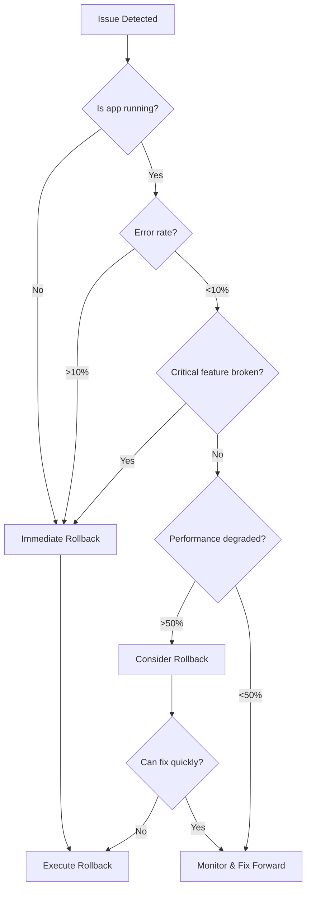

<Warning>
  **In case of production incident**: Stay calm, follow these procedures systematically, and communicate with the team throughout the process.
</Warning>

## Quick Rollback

If you need to rollback immediately:

```bash
# 1. Get the previous working commit
git log --oneline -10

# 2. Deploy the previous version
qumis deploy api \
  --deploy-branch "main" \
  --env "prod" \
  --reason "ROLLBACK: [Brief description of issue]" \
  --workflow-ref "main" \
  --confirm "prod"
```

## Rollback Decision Tree



## Step-by-Step Rollback Process

### Step 1: Assess the Situation

<Steps>
  <Step title="Identify the Issue">
    Gather information quickly:
    ```bash
    # Check application health
    curl -f https://api.qumis.ai/health

    # View recent errors
    aws logs filter-log-events \
      --log-group-name /aws/lambda/qumis-api-prod \
      --start-time $(date -u -d '10 minutes ago' '+%s')000 \
      --filter-pattern "ERROR" \
      --profile qumis_prod \
      --max-items 20

    # Check Lambda function status
    aws lambda get-function \
      --function-name qumis-api-prod \
      --profile qumis_prod \
      --query 'Configuration.State'
    ```
  </Step>

  <Step title="Determine Severity">
    Classify the issue:

    **Critical** (Rollback immediately):
    - Application not starting
    - Authentication broken
    - Data corruption
    - >10% error rate

    **High** (Rollback likely):
    - Core features broken
    - Significant performance degradation
    - Database connection issues

    **Medium** (Evaluate options):
    - Non-critical features affected
    - Minor performance impact
    - Workaround available
  </Step>

  <Step title="Communicate Status">
    Notify the team immediately:
    ```
    🚨 INCIDENT: Production Issue Detected
    Service: API
    Severity: Critical
    Issue: [Brief description]
    Action: Initiating rollback
    ```

    Post in:
    - #incidents channel
    - #engineering channel
    - Page on-call if critical
  </Step>
</Steps>

### Step 2: Execute Rollback

<Tabs>
  <Tab title="Code Rollback">
    Deploy the last known good version:
    ```bash
    # 1. Find the last working deployment
    git log --oneline --grep="Deploy" -10

    # 2. Identify the commit SHA
    LAST_GOOD_COMMIT="abc123def"  # Replace with actual SHA

    # 3. Create rollback branch (optional but recommended)
    git checkout -b rollback/incident-$(date +%Y%m%d-%H%M%S) $LAST_GOOD_COMMIT

    # 4. Deploy the rollback
    qumis deploy api \
      --deploy-branch "rollback/incident-$(date +%Y%m%d-%H%M%S)" \
      --env "prod" \
      --reason "ROLLBACK: Critical issue - reverting to $LAST_GOOD_COMMIT" \
      --workflow-ref "main" \
      --confirm "prod"
    ```
  </Tab>

  <Tab title="Database Rollback">
    For database migration issues:
    ```bash
    # 1. Check migration status
    qumis services exec api \
      --env prod \
      --reason "Check migration status for rollback" \
      --confirm "prod" \
      -- rails db:migrate:status

    # 2. Rollback the migration
    qumis services exec api \
      --env prod \
      --reason "ROLLBACK: Database migration causing issues" \
      --confirm "prod" \
      -- rails db:rollback STEP=1

    # 3. Verify rollback succeeded
    qumis services exec api \
      --env prod \
      --reason "Verify migration rollback" \
      --confirm "prod" \
      -- rails db:migrate:status
    ```

    <Warning>
      Database rollbacks can cause data loss. Only rollback migrations that are safe to reverse.
    </Warning>
  </Tab>

  <Tab title="Configuration Rollback">
    For environment variable or configuration issues:
    ```bash
    # 1. Revert environment variables in AWS Lambda console
    # or via AWS CLI:

    aws lambda update-function-configuration \
      --function-name qumis-api-prod \
      --environment Variables={KEY1=old_value,KEY2=old_value} \
      --profile qumis_prod

    # 2. Wait for update to complete
    aws lambda wait function-updated \
      --function-name qumis-api-prod \
      --profile qumis_prod

    # 3. Restart the function (triggers new container)
    aws lambda invoke \
      --function-name qumis-api-prod \
      --payload '{"warmup": true}' \
      --profile qumis_prod \
      /dev/null
    ```
  </Tab>
</Tabs>

### Step 3: Verify Rollback

<Steps>
  <Step title="Monitor Deployment">
    Watch the rollback deployment:

    **GitHub Actions:**
    - API Service: [github.com/qumisinc/qumis-api/actions](https://github.com/qumisinc/qumis-api/actions)
    - Web Service: [github.com/qumisinc/qumis-web/actions](https://github.com/qumisinc/qumis-web/actions)

    ```bash
    # Watch CloudWatch logs
    aws logs tail /aws/lambda/qumis-api-prod --profile qumis_prod --follow
    ```
  </Step>

  <Step title="Validate Functionality">
    Verify the system is working:
    ```bash
    # Health check
    curl -f https://api.qumis.ai/health

    # Test critical endpoints
    curl -f https://api.qumis.ai/api/v1/status

    # Check error rates
    aws logs filter-log-events \
      --log-group-name /aws/lambda/qumis-api-prod \
      --start-time $(date -u -d '5 minutes ago' '+%s')000 \
      --filter-pattern "ERROR" \
      --profile qumis_prod \
      --query 'events | length(@)'
    ```
  </Step>

  <Step title="Update Status">
    Communicate rollback completion:
    ```
    ✅ ROLLBACK COMPLETE
    Service: API
    Rolled back to: [commit SHA]
    Current status: Healthy
    Error rate: Normal
    Next steps: RCA to follow
    ```
  </Step>
</Steps>

## Rollback Scenarios

<AccordionGroup>
  <Accordion title="Scenario 1: Application Won't Start">
    **Symptoms**: Lambda function failing to initialize, timeout errors

    **Actions**:
    1. Immediate rollback to previous version
    2. Check CloudWatch logs for initialization errors
    3. Verify environment variables are correct
    4. Check for missing dependencies
  </Accordion>

  <Accordion title="Scenario 2: Database Connection Errors">
    **Symptoms**: Cannot connect to RDS, connection pool exhausted

    **Actions**:
    1. Check RDS status and connectivity
    2. Verify security groups and network configuration
    3. Check connection pool settings
    4. Consider increasing Lambda concurrent executions
  </Accordion>

  <Accordion title="Scenario 3: High Error Rate">
    **Symptoms**: >10% of requests failing, 500 errors

    **Actions**:
    1. Identify error patterns in logs
    2. Check for null pointer exceptions or missing data
    3. Verify external service dependencies
    4. Rollback if cannot identify quick fix
  </Accordion>

  <Accordion title="Scenario 4: Performance Degradation">
    **Symptoms**: Response times >3x normal, timeouts

    **Actions**:
    1. Check for N+1 queries or inefficient code
    2. Verify database indices are present
    3. Check for memory leaks
    4. Monitor Lambda cold starts
  </Accordion>
</AccordionGroup>

## Fix Forward vs Rollback

### When to Fix Forward

Consider fixing forward when:
- Issue is isolated to non-critical feature
- Fix is simple and well-understood
- Risk of fix is lower than rollback
- Rollback would cause data inconsistency

### When to Rollback

Always rollback when:
- Application is completely down
- Core functionality is broken
- Data corruption is occurring
- Security vulnerability is exposed
- Fix is complex or uncertain

## Post-Rollback Actions

<AccordionGroup>
  <Accordion title="Immediate (Within 1 hour)">
    1. **Stabilize the system**
       - Verify all services are healthy
       - Check for any lingering issues
       - Monitor error rates and performance

    2. **Document the incident**
       - Create incident report
       - Capture logs and metrics
       - Document timeline of events

    3. **Communicate with stakeholders**
       - Update customers if affected
       - Inform leadership of status
       - Schedule RCA meeting
  </Accordion>

  <Accordion title="Short-term (Within 24 hours)">
    1. **Root Cause Analysis**
       - Identify what went wrong
       - Determine why it wasn't caught earlier
       - Document lessons learned

    2. **Fix the issue**
       - Develop proper fix
       - Add tests to prevent recurrence
       - Test thoroughly in UAT

    3. **Update procedures**
       - Update deployment checklist
       - Add monitoring for issue
       - Update runbooks
  </Accordion>

  <Accordion title="Long-term (Within 1 week)">
    1. **Process improvements**
       - Review deployment process
       - Enhance testing coverage
       - Improve monitoring and alerting

    2. **Share learnings**
       - Present RCA to team
       - Update documentation
       - Share with broader organization
  </Accordion>
</AccordionGroup>

## Emergency Contacts

### Escalation Path

1. **On-call Engineer**: Check PagerDuty
2. **Team Lead**: Check #engineering channel topic
3. **Infrastructure Team**: #infrastructure channel
4. **Security Team**: #security channel (if security-related)

### External Dependencies

- **AWS Support**: Available through AWS Console
- **GitHub Support**: https://support.github.com
- **Database Admin**: Check runbook for contact

## Rollback Automation

### Automated Rollback Script

Save this script for emergency use:

```bash
#!/bin/bash
# emergency-rollback.sh

set -e

echo "🚨 EMERGENCY ROLLBACK INITIATED"

# Get the last successful deployment
LAST_GOOD_SHA=$(git log --oneline --grep="Deploy to prod" -2 | tail -1 | cut -d' ' -f1)

if [ -z "$LAST_GOOD_SHA" ]; then
    echo "❌ Could not find last good deployment"
    exit 1
fi

echo "Rolling back to: $LAST_GOOD_SHA"

# Create rollback branch
ROLLBACK_BRANCH="rollback/emergency-$(date +%Y%m%d-%H%M%S)"
git checkout -b $ROLLBACK_BRANCH $LAST_GOOD_SHA

# Deploy rollback
qumis deploy api \
  --deploy-branch "$ROLLBACK_BRANCH" \
  --env "prod" \
  --reason "EMERGENCY ROLLBACK to $LAST_GOOD_SHA" \
  --workflow-ref "main" \
  --confirm "prod"

echo "✅ Rollback deployment initiated"
echo "Monitor at: https://github.com/qumisinc/qumis-api/actions"
```

## Additional Resources

- [Production Deployment Guide](/internal/engineering/deployment/production-deployment)
- [Deployment Checklist](/internal/engineering/deployment/deployment-checklist)
- [CloudWatch Monitoring](/internal/engineering/infrastructure/cloudwatch-monitoring)
- [Debugging Production](/internal/engineering/troubleshooting/debugging-production)