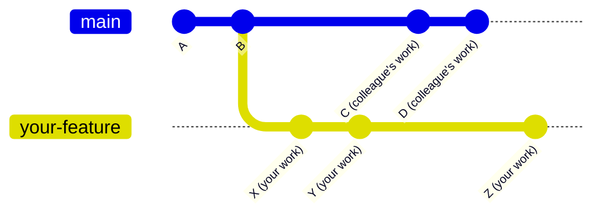
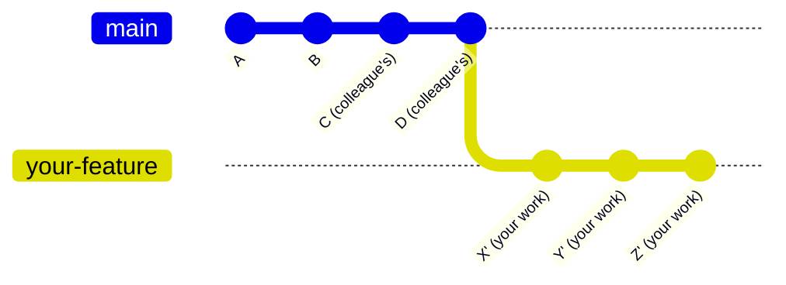

<Accordion title="Quick Reference - Update Your Branch">

### Choose your update strategy:

#### Option A: Rebase (Recommended - Clean History)
```bash
git checkout release
git pull origin release
git checkout your-feature-branch
git rebase release
git push --force-with-lease
```

#### Option B: Merge (Safer - No Force Push)
```bash
git checkout release
git pull origin release
git checkout your-feature-branch
git merge release
git push
```

<Warning>
If you see conflicts, you'll need to resolve them. See the [Troubleshooting](#troubleshooting) section.
</Warning>

</Accordion>

## The Core Problem

Since we are growing our engineering team and we will all merging PRs to the same branch asynchronously, we will regularly be out of sync.

**If another engineer merged their PR to `release` while you were working, your feature branch will be behind `origin/release`**

When your feature branch falls behind the remote release branch, creating a PR without updating causes:
- Other people's commits appearing in your PR
- Confused code reviewers
- Hidden feature scope
- Difficult merge conflicts
- Misleading git blame history


### What This Looks Like



###



## Our Branching Model

```
main (production)
└─ release (staging)
   ├─ erik/eng-983-feature-one
   ├─ sarah/eng-984-feature-two
   └─ alex/eng-985-feature-three
```

- **Branch naming**: `engineer-name/ticket-id-description`
- **Base branch**: Always branch from `release`
- **Target branch**: Always merge back to `release`

## The Two Solutions

### Quick Comparison

| | Rebase (Recommended) | Merge (Alternative) |
|---|---|---|
| **Result** | Clean, linear history | Preserves exact timeline |
| **Safety** | Requires `--force-with-lease` | Normal push |
| **Best For** | Most feature work | Long-running branches |
| **Complexity** | Moderate | Simple |

<Info>
**Our Recommendation**: Use **rebase** for feature branches. It keeps our Git history clean and makes code reviews easier. Only use merge if you're uncomfortable with rebase or working on a long-running feature.
</Info>

## Step-by-Step: Rebase (Recommended)

✅ **Use this for**: Regular feature branches, bug fixes, most daily work

<Steps>

### Update your local release branch

```bash
git checkout release
git pull origin release
```

### Switch to your feature branch

```bash
git checkout your-feature-branch  # e.g., erik/eng-984-add-auth
```

### Rebase onto the updated release

```bash
git rebase release
```

### Force push safely

```bash
git push --force-with-lease
```
<Warning>
Never use `--force` alone. Always use `--force-with-lease` for safety.
</Warning>

</Steps>

### If You Hit Conflicts

```bash
# 1. Fix the conflicted files (your editor will show <<<< markers)
# 2. Stage the fixed files
git add .
# 3. Continue rebasing
git rebase --continue
# 4. Repeat if more conflicts appear
```

<Tip>
**Escape hatch**: If things go wrong, run `git rebase --abort` to undo everything.
</Tip>

## Step-by-Step: Merge (Alternative)

⚠️ **Use this for**: Long-running features, when rebase is too complex, or if you're not comfortable with force pushing

<Steps>

### Update your local release branch

```bash
git checkout release
git pull origin release
```

### Switch to your feature branch

```bash
git checkout your-feature-branch
```

### Merge release into your branch

```bash
git merge release
```

### Push normally

```bash
git push origin your-feature-branch
```

</Steps>

## Troubleshooting

### Common Problems & Solutions

<AccordionGroup>

<Accordion title="🔴 I see merge conflicts">
```bash
# For rebase conflicts:
# 1. Fix conflicts in your editor (look for <<<< markers)
git add .
git rebase --continue

# Too many conflicts? Abort and try merge instead:
git rebase --abort
git merge release  # Try merge strategy instead
```
</Accordion>

<Accordion title="I accidentally pushed to the wrong branch">
```bash
# Undo the last commit (keep changes)
git reset --soft HEAD~1
# Switch to correct branch
git checkout -b correct-branch-name
# Commit and push to right place
git commit -m "your message"
git push origin correct-branch-name
```
</Accordion>

<Accordion title="My PR still shows other people's commits">
You forgot to update your branch. Follow the [Quick Fix](#emergency-need-to-fix-your-branch-right-now) at the top of this guide.
</Accordion>

<Accordion title="Git says 'cannot push' after rebase">
You need to force push after rebasing:
```bash
git push --force-with-lease
```
</Accordion>

<Accordion title="I want to start over completely">
```bash
# Save your work first!
git stash
# Reset to match remote release
git fetch origin
git reset --hard origin/release
# Apply your changes back
git stash pop
```
</Accordion>

</AccordionGroup>

## Best Practices

### ✅ DO

- Update your branch **before** creating a PR
- Use `--force-with-lease` (never just `--force`)
- Pull from `release` at least once daily
- Ask for help if confused (#engineering channel)
- Test your code after updating

### 🛑 DON'T

- Create PRs without updating first
- Force push to `main` or `release`
- Rebase commits others are using
- Mix rebase and merge randomly
- Panic - everything in Git can be undone

## Command Reference

### Essential Commands

```bash
# Update your branch (Rebase)
git checkout release && git pull
git checkout your-branch
git rebase release
git push --force-with-lease

# Update your branch (Merge)
git checkout release && git pull
git checkout your-branch
git merge release
git push

# Emergency exits
git rebase --abort      # Cancel a rebase
git merge --abort       # Cancel a merge
git reset --hard HEAD~1 # Undo last commit (destructive!)
```

### Getting Help

- **Slack**: `#engineering` channel
- **Pair Programming**: Ask a teammate to screen-share
- **Documentation**: This guide and [Git official docs](https://git-scm.com/docs)
