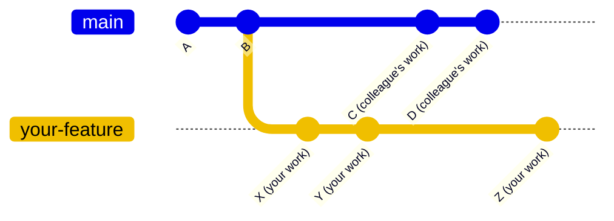
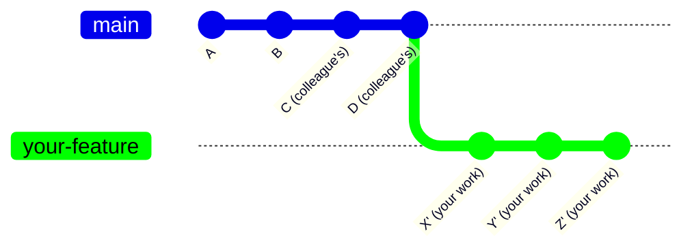

## Video Walkthrough

A walkthrough of how to keep your feature branches in sync with the release branch and resolve merge conflicts when they arise.

### Quick Reference - Update Your Branch

### Choose your update strategy:

```bash Rebase (Recommended)
git checkout release
git pull origin release
git checkout your-feature-branch
git rebase release
git push --force-with-lease
```

```bash Merge (Safer)
git checkout release
git pull origin release
git checkout your-feature-branch
git merge release
git push
```

> **Info:** **Rebase** creates a clean linear history. **Merge** preserves the exact timeline without requiring force push.

> **Warning:** If you see conflicts, you'll need to resolve them. See the [Troubleshooting](#troubleshooting) section.

## The Core Problem

Since we are growing our engineering team and we will all merging PRs to the same branch asynchronously, we will regularly be out of sync.

**If another engineer merged their PR to `release` while you were working, your feature branch will be behind `origin/release`**

When your feature branch falls behind the remote release branch, creating a PR without updating causes:

- Other people's commits appearing in your PR
- Confused code reviewers
- Hidden feature scope
- Difficult merge conflicts
- Misleading git blame history

If you are out of sync, you will not reliably be able to ensure merging your feature branch will not introduce issues.

### What This Looks Like

**Out of Sync:**



### What It Should Look Like

**In Sync:**



## Step-by-Step: Rebase (Recommended)

> **Tip:** Claude Code makes rebase or merge conflicts much easier! [See the Claude Code](#claude-code-can-help-with-conflicts) section.

✅ **Use this for**: Regular feature branches, bug fixes, most daily work

### Update your local release branch

```bash
git checkout release
git pull origin release
```

### Switch to your feature branch

```bash
git checkout your-feature-branch  # e.g., erik/eng-984-add-auth
```

### Rebase onto the updated release

```bash
git rebase release
```

### Force push safely

```bash
git push --force-with-lease
```

> **Warning:** Never use `--force` alone. Always use `--force-with-lease` for safety.

### If You Hit Conflicts

### Fix the conflicted files

Your editor will show `<<<<` markers indicating conflicts. Review and resolve each conflict.

### Stage the fixed files

```bash
git add .
```

### Continue rebasing

```bash
git rebase --continue
```

### Repeat if more conflicts appear

If additional conflicts occur, repeat steps 1-3 until the rebase completes.

> **Tip:** **Escape hatch**: If things go wrong, run `git rebase --abort` to undo everything.

## Step-by-Step: Merge (Alternative)

⚠️ **Use this for**: Long-running features, when rebase is too complex, or if you're not comfortable with force pushing

### Update your local release branch

```bash
git checkout release
git pull origin release
```

### Switch to your feature branch

```bash
git checkout your-feature-branch
```

### Merge release into your branch

```bash
git merge release
```

### Push normally

```bash
git push origin your-feature-branch
```

## Our Branching Model

```
main (production)
└─ release (staging)
   ├─ erik/eng-983-feature-one
   ├─ sarah/eng-984-feature-two
   └─ alex/eng-985-feature-three
```

- **Branch naming**: `engineer-name/ticket-id-description`
- **Base branch**: Always branch from `release`
- **Target branch**: Always merge back to `release`

## The Two Solutions

### Quick Comparison

| | Rebase (Recommended) | Merge (Alternative) |
|---|---|---|
| **Result** | Clean, linear history | Preserves exact timeline |
| **Safety** | Requires `--force-with-lease` | Normal push |
| **Best For** | Most feature work | Long-running branches |
| **Complexity** | Moderate | Simple |

> **Info:** **Our Recommendation**: Use **rebase** for feature branches. It keeps our Git history clean and makes code reviews easier. Only use merge if you're uncomfortable with rebase or working on a long-running feature.

### Claude Code Can Help With Conflicts

If you encounter merge conflicts during a rebase, Claude Code can help you resolve them:

```bash
# When you hit conflicts during rebase, ask Claude:
claude "I'm currently in the middle of a rebase that has merge conflicts. Can you help me resolve them and finish the rebase?"
```

Claude Code will analyze the conflicts, help you resolve them, and complete the rebase process.

### Making Rebasing Easier - Recommended Git Config

These git configurations will make rebasing smoother and more automated:

```bash
# Remember how you resolved conflicts and reuse those resolutions
git config --global rerere.enabled true
git config --global rerere.autoUpdate true

# Automatically stash and unstash changes during rebase
git config --global rebase.autoStash true
```

> **Tip:** **What these settings do:**
>
> - `rerere` (REuse REcorded REsolution) remembers how you resolved conflicts and applies them automatically next time
> - `autosquash` automatically reorders commits marked with `fixup!` or `squash!`
> - `autoStash` stashes any uncommitted changes before rebasing and applies them after

## Troubleshooting

### Common Problems & Solutions

### I see merge conflicts

```bash
# For rebase conflicts:
# 1. Fix conflicts in your editor (look for <<<< markers)
git add .
git rebase --continue

# Too many conflicts? Abort and try merge instead:
git rebase --abort
git merge release  # Try merge strategy instead
```

### I accidentally pushed to the wrong branch

```bash
# Undo the last commit (keep changes)
git reset --soft HEAD~1
# Switch to correct branch
git checkout -b correct-branch-name
# Commit and push to right place
git commit -m "your message"
git push origin correct-branch-name
```

### My PR still shows other people's commits

You forgot to update your branch. Follow the [Quick Fix](#emergency-need-to-fix-your-branch-right-now) at the top of this guide.

### Git says 'cannot push' after rebase

You need to force push after rebasing:

```bash
git push --force-with-lease
```

### I want to start over completely

```bash
# Save your work first!
git stash
# Reset to match remote release
git fetch origin
git reset --hard origin/release
# Apply your changes back
git stash pop
```

## Best Practices

### ✅ DO

- Update your branch **before** creating a PR
- Use `--force-with-lease` (never just `--force`)
- Pull from `release` at least once daily
- Ask for help if confused (#engineering channel)
- Test your code after updating

### 🛑 DON'T

- Create PRs without updating first
- Force push to `main` or `release`
- Rebase commits others are using
- Mix rebase and merge randomly
- Panic

## Command Reference

### Essential Commands

```bash
# Update your branch (Rebase)
git checkout release && git pull
git checkout your-branch
git rebase release
git push --force-with-lease

# Update your branch (Merge)
git checkout release && git pull
git checkout your-branch
git merge release
git push

# Emergency exits
git rebase --abort      # Cancel a rebase
git merge --abort       # Cancel a merge
git reset --hard HEAD~1 # Undo last commit (destructive!)
```

### Getting Help

- **Slack**: `#engineering` channel
- **Pair Programming**: Ask a teammate to screen-share
- **Documentation**: This guide and [Git official docs](https://git-scm.com/docs)
