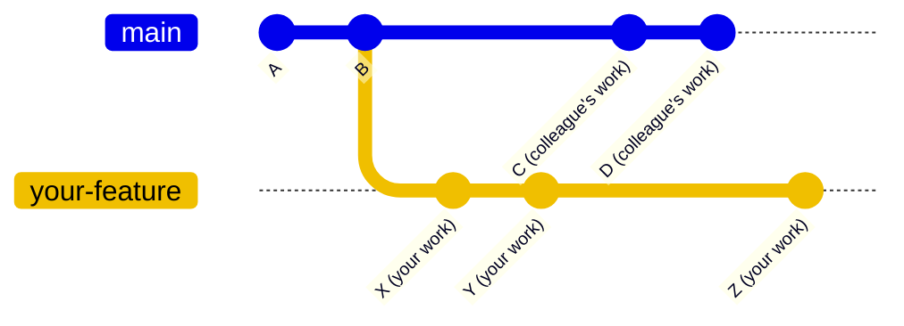
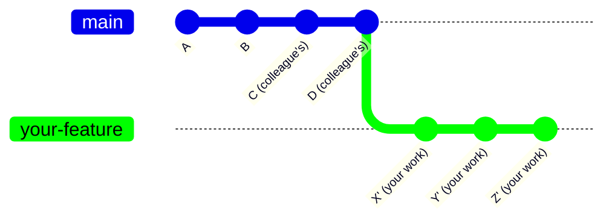
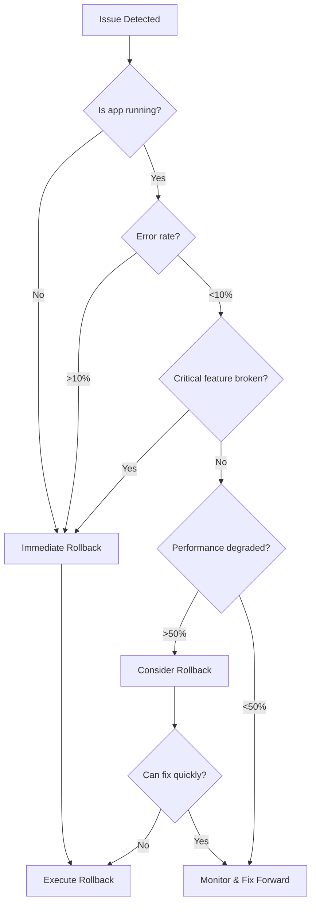

# Qumis Documentation

Expert AI built for the top minds in insurance. Attorney-trained AI that delivers clarity, speed, and legal-grade reasoning for the industry's most complex risks.

---

# Implementing AI

Source: get-started/foundations-for-success/implementing-ai

> **Info:** This guide provides a prescriptive, step-by-step roadmap for implementing **Qumis**, the attorney-trained Gen AI platform, within your insurance agency or brokerage. The strategy focuses on managing the major organizational shift by emphasizing **governance, role transformation, and sustained accuracy**.

---

The core principle is to treat Qumis as a **collaborative partner** and to **embed governance before scale**.

---

## Phase 1: Strategic Alignment & Governance (The Foundation)

This phase ensures all decisions are anchored to a clear business strategy and robust legal guardrails, utilizing **Qumis’s** core strengths: **Attorney-Trained AI** and **Enterprise Security**.

### Required Pre-Project Knowledge

Before engaging your team, you must internally confirm:

- **Project Mandate:** Senior leadership is committed to funding the project through the first year of metrics measurement.
- **Resource Allocation:** You have designated a **Qumis Governance Working Group (QGWG)** lead (likely the Project Manager) and secured a minimum of one part-time resource from **Compliance/Legal** to review policy in Step 1.4.

### Step 1: Craft the "Legal-Grade Speed" North Star and Core Value Statement

The goal is to define success and identify the key players who will drive the transformation.

| Action                                                | How to Execute (Step-by-Step)                                                                                                                                                                                                                                                                                                                                                                                                                                                                                                                                              | Deliverable/Rationale                                                                                                                                                                                                    |
| ----------------------------------------------------- | -------------------------------------------------------------------------------------------------------------------------------------------------------------------------------------------------------------------------------------------------------------------------------------------------------------------------------------------------------------------------------------------------------------------------------------------------------------------------------------------------------------------------------------------------------------------------- | ------------------------------------------------------------------------------------------------------------------------------------------------------------------------------------------------------------------------ |
| **1.1. Define the North Star**                        | **Facilitate a 1-hour "Vision Session"** with the **CEO**, Head of Sales/Production, and Head of Claims. Ask: "What major business metric are we trying to impact with attorney-trained **AI**?" Focus on measurable **outcomes**, not technology features.                                                                                                                                                                                                                                                                                                                | *Deliverable:* Final **North Star Statement**. Example: "Achieve a 15% increase in premium growth and a 20% reduction in claims cycle time by embedding legal-grade analysis into every core workflow within 18 months." |
| **1.2. Identify High-Value Use Cases**                | **Conduct a 90-minute Brainstorming Session** with 3 top Brokers and 3 top Claims Professionals (Pros). Ask: "What are the 3 most complex documents or tasks where **legal-grade reasoning** would save you hours or secure a win?" and "Where does **manual analysis error** currently cost us the most time or money?"                                                                                                                                                                                                                                                   | *Deliverable:* Prioritized list of **3-5 Pilot Use Cases**. (e.g., Complex Directors and Officers (D\&O) Policy Comparison, Exclusions in a Catastrophic Claim).                                                          |
| **1.3. Conduct Stakeholder Mapping (Power/Interest)** | **Map all affected roles** on a 2x2 grid based on their *Power* (ability to approve/block) and *Interest* (how much their job changes). a. **High Power/High Interest:** *Manage Closely* (Executive Sponsor, **QGWG**). **Strategy:** Engage in weekly update meetings. b. **Low Power/High Interest:** *Keep Informed* (Account Managers, Claims **Pros**). **Strategy:** Engage in training and solicit feedback monthly. c. **High Power/Low Interest:** *Keep Satisfied* (Legal/Compliance). **Strategy:** Provide formal, quarterly security and governance reports. | *Deliverable:* **Power/Interest Grid** determining communication frequency and content for each group.                                                                                                                   |
| **1.4. Establish AI Governance Framework**            | The **QGWG** drafts the initial policy using **Qumis's** security guarantees as the foundation. a. **Mandate Private Document Vault:** Policy states all documents uploaded for analysis must use the **Qumis** Vault to ensure client data is protected. b. **Mandate Human-in-the-Loop (HITL):** Policy defines clear **CHECKPOINTS** where a human review is required. *Example: Any output used for a final claim decision or policy coverage explanation to a client.*                                                                                                | *Deliverable:* **"Qumis Responsible Use Policy" (v1.0)**, formally approved by Legal/Compliance.                                                                                                                         |

---

## Phase 2: Implementation, Process Redesign, and Communication

This phase adapts your core business processes to leverage **Qumis's** capabilities, ensuring that every team member understands their new, elevated role.

### Required Pre-Project Knowledge

You must be able to:

- **Lead Change Impact Assessment (CIA) Workshops:** Understand the process of gathering the "As-Is" data through interviews and mapping to generate the "To-Be" vision.
- **Translate Features to Benefit:** Understand how **Qumis's** features (e.g., **Compare Documents**, **Claims Assessment**) directly address the bottlenecks in your four core workflows.

### Step 3: Redesign Core Workflows with Qumis

The goal is to eliminate manual document analysis and errors, shifting hours to client interaction and strategic judgment.

| Workflow         | "As-Is" Bottleneck/Error                                                                                                                                                    | Qumis Feature Integration ("To-Be" Process)                                                                                                                                                                                                   | Success Metric (Time/Quality)                                                                                                                          |
| ---------------- | --------------------------------------------------------------------------------------------------------------------------------------------------------------------------- | --------------------------------------------------------------------------------------------------------------------------------------------------------------------------------------------------------------------------------------------- | ------------------------------------------------------------------------------------------------------------------------------------------------------ |
| **New Business** | Producer/Broker spends hours manually reviewing quotes and binders for non-obvious discrepancies before presenting to the client.                                           | **Broker/Producer** uploads competitive quotes to **Compare Documents**. **Qumis** instantly identifies true strategic leverage and non-standard exclusions. **Broker** uses this **Custom Report** to present authoritative advisory.        | **Time:** Reduction in **Quote-to-Bind Cycle Time**. **Quality:** 0 errors found in policy comparison audit.                                           |
| **Servicing**    | Account Manager (**AM**) searches for policy details across disparate systems to answer client coverage questions, often missing endorsements or amendments.                | **AM** uses **Chat with Documents** on the specific policy in the **Document Vault** to instantly verify coverage or find a specific exclusion clause. The **AM** can then use the **AI** to draft a compliant response.                      | **Time:** Reduction in **Average Handle Time (AHT)** for client coverage inquiries. **Quality:** Increase in **Customer Satisfaction Score (CSAT)**.   |
| **Claims**       | Claims **Pro** spends days manually interpreting complex policy language (especially Errors and Omissions (E\&O), **D\&O**) and writing the rationale for denial or approval. | Claims **Pro** uses **Claims Assessment** for legal-grade reasoning for coverage decisions. The pro utilizes the **Fill In Checklist (BETA)** to systematically verify all policy elements before generating a defensible **Custom Report**.  | **Time:** Reduction in **Claims Cycle Time** for complex cases. **Quality:** Reduction in claims file "Audit-Identified Policy Interpretation Errors." |
| **Renewal**      | Broker/**AM** misses cross-sell opportunities or fails to highlight new risks because they lack time for deep policy analysis.                                              | **AM** uses **Policy Analysis** to master the expiring policy’s key limits and exclusions in seconds, instantly identifying coverage gaps based on the client’s risk profile. **Broker** uses the insight to prepare a targeted upsell pitch. | **Business:** Increase in **Retention Rate** and **Cross-Sell/Upsell Conversion Rate**.                                                                |

### Step 4: Role-Specific Communication and Buy-In

Use a cascading communication plan, with managers delivering personalized messages to address specific fears and highlight professional growth.

| Role                     | Core Benefit from Qumis                                                  | Communication Strategy (Message to Deliver)                                                                                                                                                                  |
| ------------------------ | ------------------------------------------------------------------------ | ------------------------------------------------------------------------------------------------------------------------------------------------------------------------------------------------------------ |
| **Brokers**              | **Strategic Leverage** and **Faster Market Response**.                   | "Qumis makes you the **authoritative advisor** who moves faster than the competition. You get the **legal-grade insight** you need to **win more placements**."                                              |
| **Producers**            | **Faster Quote-to-Bind** cycle and **Policy Master** in seconds.         | "Your sales cycle shrinks. You can confidently discuss the complex coverage of a new placement and answer client questions instantly, increasing client trust."                                              |
| **Claims Professionals** | Accelerated, **Defensible Decisions**; **Elimination of Manual Errors**. | "Qumis acts like a **first-year associate, only faster and more accurate**, eliminating manual analysis errors and freeing you to focus on **judgment, negotiation, and client empathy**."                   |
| **Account Managers**     | **Time Recapture**; **Enhanced Customer Service**.                       | "Qumis is your new co-pilot for service. It frees up hours you spend digging for policy clauses, allowing you to handle more accounts and focus on **being the trusted advisor** and relationship builder."  |
| **Service Teams**        | **Expertise Democratization**; **Error Minimization**.                   | "You no longer need to wait for a senior underwriter to interpret complex language. Qumis gives you **attorney-level analysis** on demand, ensuring every client interaction is **accurate and compliant**." |

---

## Phase 3: Upskilling and Continuous Improvement (The Future State)

This phase locks in the cultural shift, emphasizing that **Qumis** is a learning partner that requires active engagement and iterative dialogue to deliver its best legal analysis.

### Required Pre-Project Knowledge

You must be able to:

- **Design Experiential Training:** Training must be hands-on, scenario-based, and focused on collaboration (**Iterative Dialogue**).
- **Sustain Momentum:** Implement an internal system to track best practices and continuously update the training materials.

### Step 5: Implement Attorney-Level Upskilling

The goal is to teach the team to treat the **AI** like a high-performing associate: clear instructions, critical review, and continuous discussion to refine the final work.

| Action                                                               | How to Execute (Step-by-Step)                                                                                                                                                                                                                                                                                                                                                                                                                                                                                                                                                                                                                                                                                                                        | Training Objective (The Collaborative Mindset)                                                                                                       |
| -------------------------------------------------------------------- | ---------------------------------------------------------------------------------------------------------------------------------------------------------------------------------------------------------------------------------------------------------------------------------------------------------------------------------------------------------------------------------------------------------------------------------------------------------------------------------------------------------------------------------------------------------------------------------------------------------------------------------------------------------------------------------------------------------------------------------------------------- | ---------------------------------------------------------------------------------------------------------------------------------------------------- |
| **5.1. Foundational AI (Artificial Intelligence) Literacy & Ethics** | **Mandatory, documented training** for all staff. Cover: The difference between **Qumis** (specialized) and public Large Language Models (**LLMs**) (general). The **risk of bias** in any **AI** and the need for human ethical oversight.                                                                                                                                                                                                                                                                                                                                                                                                                                                                                                          | *Objective:* Ensure employees understand the **Privacy-First Approach** and the basic **HITL** mandate.                                              |
| **5.2. Core Prompt Structure Training**                              | **Hands-on workshop** for all end-users. Teach the **"Persona-Context-Constraint-Format"** framework for prompting. a. **Persona:** "Act as a Commercial Lines Underwriter..." b. **Context:** "...reviewing this attached submission..." c. **Constraint:** "...cite only the policy clauses..." d. **Format:** "...and provide the output in a 3-bullet summary."                                                                                                                                                                                                                                                                                                                                                                                  | *Objective:* Ensure accurate, structured data extraction for high-stakes tasks like claims and policy analysis.                                      |
| **5.3. Advanced Iterative Dialogue Training (The Key)**              | **Scenario-based lab** for Brokers/Claims **Pros**. Train the team to view the initial **Qumis** output as a *draft* requiring an iterative dialogue to refine the legal reasoning. **Crucially, emphasize that Qumis's system enhances the prompts entered, but active discussion with the AI, by asking targeted follow-up questions or providing constraints, will result in a better, more comprehensive outcome.**. a. **Prompt 1 (Initial):** *Qumis provides a conclusion.* b. **Prompt 2 (Iterative):** "Thank you. Now, focusing only on the pollution exclusion on page 8, explain the counter-argument that the insured would use to fight this denial." (Forces the **AI** to consider the opposing legal view, deepening the analysis). | *Objective:* Teach the team that **discussion** with the **AI** leads to a more comprehensive, **legal-grade reasoning** and a better final outcome. |
| **5.4. Legal-Grade Validation Lab**                                  | **Mandatory, graded practical exercise.** Provide a complex document and an **AI**-assisted analysis. Require the user to **locate the citation or source text within the document** to validate **Qumis’s** conclusion. The pass/fail is based on the quality of the human's final **validation**, not the **AI’s** output.                                                                                                                                                                                                                                                                                                                                                                                                                         | *Objective:* Embed the principle of **diligence** and continuous critical review before any submission or client communication.                      |

### Step 6: Monitor, Measure, and Evolve

### Monitor Adoption and Value (KPIs)

- **Adoption:** Track **Frequency of Use** (daily/weekly queries per user) and **Adoption Rate** (% of eligible staff using **Qumis** features in the new workflows).
- **Time/Efficiency:** Measure **AHT** for client servicing and **Time-to-Quote** for new business submissions.
- **Quality/Compliance:** Track the reduction in **Internal Audit Failures** related to policy or claim interpretation.

### Continuous Improvement Loop

- **Quarterly QGWG Review:** Review **KPIs** and team feedback. Identify the top 3 best-performing prompts/workflows and add them to the central **Prompt Library**.
- **Vendor Feedback:** Aggregate all reports of inaccurate/incomplete legal reasoning from the team and share with **Qumis** to leverage their **Bespoke** feature, where the "AI learns with use, becoming more personalized over time".

### Sustaining the Culture

Recognize and reward the **AI Accelerators** (your champions) who are successfully using the iterative dialogue to drive superior business results and mentor their peers.

---

# Identifying Use Cases

Source: get-started/foundations-for-success/identifying-use-cases

> **Info:** Adopting AI in insurance can feel overwhelming at first — especially if it's new to your team. This guide walks you through a **step-by-step process** for identifying where and how to embed Qumis into your daily workflows so you can get measurable results.

---

By the end of this article, you'll understand:

- How to map your team's workflows to Qumis features
- How to prioritize use cases that create fast, visible value
- How to define success metrics and track performance
- How to roll out AI responsibly across your organization

---

## Why It Matters

Teams that use Qumis successfully don't just "try AI" — they use it **intentionally**. They choose specific workflows, set clear expectations, and measure progress. This ensures the technology becomes an integral part of how they work rather than an experiment on the side.

The most successful users of Qumis include:

- **Producers and Brokers** who quickly understand what coverage their prospects have
- **Account Managers and Service Teams** who analyze and manage policy changes
- **Claims Professionals** who advocate for clients using clear, defensible policy interpretations

---

## Step-by-Step Framework for Identifying AI Use Cases

### Step 1: Map Your Workflow

Start by mapping out where your team spends most of its time. The goal is to find **document-heavy, repetitive tasks** that require judgment — the kind of work Qumis is built for.

**How to do it:**

### List your daily activities

For example, reviewing submissions, quoting, checking renewals, managing claims, or responding to client inquiries.

### Identify the document types

Note which documents you handle at each stage (quotes, policies, endorsements, contracts, COIs, complaints, etc.).

### Find pain points

Ask: "Where do we lose the most time or make the most errors?" Those are ideal starting points for AI.

Below is a guide showing how each workflow stage connects with a Qumis feature:

| Workflow Stage         | What It Means                                            | Qumis Feature                        | Value You'll See                                                                     |
| ---------------------- | -------------------------------------------------------- | ------------------------------------ | ------------------------------------------------------------------------------------ |
| **Prospecting**        | Reviewing a prospect's current coverage                  | **Chat with Documents**              | Understand coverage faster and prepare smarter conversations with prospects          |
| **Quote Analysis**     | Comparing carrier quotes, binders, and submissions       | **Compare Documents**                | Identify key differences, exclusions, or advantages instantly                        |
| **Policy Checking**    | Reviewing policies for accuracy and completeness         | **Single Policy Analysis**           | Catch missing coverages and verify details before binding                            |
| **Account Management** | Managing ongoing client policies, endorsements, and COIs | **Contract Review & Coverage Table** | Ensure compliance, track requirements, and simplify renewals                         |
| **Claim Advocacy**     | Supporting clients through a claim                       | **Claims Analysis**                  | Analyze coverage for specific claim scenarios and provide defensible recommendations |

> **Tip:** Start with one stage (for example, prospecting or policy checking) and expand after your team gains confidence.

---

### Step 2: Prioritize by Impact and Effort

Once you've mapped your workflows, prioritize them using a simple two-by-two matrix:

|                 | **Easy to Implement**                                                               | **Harder to Implement**                                       |
| --------------- | ----------------------------------------------------------------------------------- | ------------------------------------------------------------- |
| **High Impact** | Start here — these are your "quick wins" (e.g., quote comparisons, policy checking) | Plan next — large or complex processes (e.g., claim advocacy) |
| **Low Impact**  | Optional — automate only if time allows                                             | Avoid — minimal business benefit                              |

To evaluate impact, ask:

- Does this process happen frequently?
- Does it involve high-value clients or decisions?
- Would faster or more accurate results make a difference to customers or revenue?

---

### Step 3: Define What Success Looks Like

Before starting a pilot, choose **metrics** that help you measure improvement.

**How to set them:**

### Establish a baseline

Record how long a task takes now or how many documents are reviewed per week.

### Pick 2-3 key metrics

Such as:

- Time saved per document or per process
- Reduction in missed items or errors
- Faster turnaround on client deliverables
- Reduction in external legal or review costs

### Measure again after 30-45 days

You'll be able to see the real-world impact of Qumis.

**Example:**

> "Before Qumis, comparing three quotes took 3 hours. After introducing Qumis, it takes less than 30 minutes with improved accuracy."

---

### Step 4: Set Clear Roles and Governance

AI should enhance human expertise — not replace it.

**When rolling out Qumis:**

- **Producers and Brokers:** Use Qumis for initial document review and coverage insight before advising clients.
- **Account Managers and Service Teams:** Use Qumis to verify details, maintain consistency, and manage renewals.
- **Claims Professionals:** Use Qumis for coverage interpretation and defensible claim advocacy.

**To ensure long-term success:**

### Create review checkpoints

Have a team lead review outputs weekly during the first month.

### Use consistent prompts

Build a shared prompt library inside Qumis (e.g., "Summarize differences in property coverage between these quotes").

### Refine your approach

Use Qumis' *Custom Reports* and *Vault* features to document what works and share it across the team.

---

## Example Use Cases

| Role                    | Problem                                                          | How to Use Qumis                                                  | Metric for Success                       |
| ----------------------- | ---------------------------------------------------------------- | ----------------------------------------------------------------- | ---------------------------------------- |
| **Producer**            | Hard to understand a new prospect's existing coverage            | Use *Chat with Documents* to review current policies instantly    | Reduce review time by 80%                |
| **Broker**              | Manual quote comparisons take hours                              | Use *Compare Documents* to highlight coverage differences         | Complete comparisons in under 30 minutes |
| **Account Manager**     | Policy changes and COIs are time-consuming to track              | Use *Contract Review* and *Coverage Table* to automate tracking   | 50% fewer manual compliance tasks        |
| **Claims Professional** | Difficult to identify applicable coverage language during claims | Use *Claims Analysis* for structured, defensible coverage reviews | Zero missed exclusions or provisions     |

---

## Implementation Checklist

Here's how to roll out Qumis successfully from start to scale:

### Kickoff Workshop

Gather your team and identify 3-5 recurring workflows.

### Select Use Cases

Pick 1-2 high-impact areas to start (for example, quote comparison or policy checking).

### Customize Prompts

Use Qumis' *Prompts* tab to build consistent queries tailored to your team's needs.

### Measure Results

Track time saved, accuracy improvements, and client satisfaction.

### Review and Scale

Meet monthly to refine prompts, update workflows, and expand Qumis adoption to new teams.

---

## Further Reading

For more insights on how organizations are successfully implementing AI in insurance and professional services, explore these resources:

- **McKinsey & Company (2023).** *"The State of AI in 2023: Generative AI's Breakout Year."*\
  https://www.mckinsey.com/capabilities/quantumblack/our-insights/the-state-of-ai-in-2023-generative-ais-breakout-year
- **Gartner (2024).** *"Generative AI Use Cases in Insurance."*\
  https://www.gartner.com/en/insights/generative-ai/insurance
- **Accenture (2024).** *"AI in Insurance: A Human + Machine Approach."*\
  https://www.accenture.com/us-en/insights/insurance/ai-in-insurance

---

## Next Steps

If you're new to Qumis, start by exploring:

- [**Chat with Documents**](#) – Learn how to ask questions about policies and quotes.
- [**Compare Documents**](#) – Quickly find differences across quotes, binders, and policies.
- [**Prompt Library**](#) – Create and share prompts that fit your specific insurance workflows.

---

# Change Management

Source: get-started/foundations-for-success/change-management

> **Info:** Implementing Qumis is not just about learning new technology — it's about transforming how your organization works.
>
> The insurance industry has a long history of established workflows and manual processes. Many professionals have developed expertise over decades, and they trust what's proven. However, the arrival of **Generative AI (GenAI)** is redefining what's possible. It can dramatically speed up policy analysis, improve accuracy, and reduce manual work — but only if your organization **manages the change thoughtfully**.
>
> This manual will teach you how to plan, guide, and sustain your Qumis implementation using the **ADKAR framework**, a proven model developed by Prosci to help people navigate change.

---

## What Is the ADKAR Framework?

**ADKAR** stands for:

1. **Awareness** – understanding why change is necessary
2. **Desire** – building motivation to support the change
3. **Knowledge** – learning how to make the change
4. **Ability** – putting new skills and behaviors into practice
5. **Reinforcement** – making the change stick

Each stage represents a milestone your people must achieve before the change can truly take hold. You can't skip steps; they build on one another.

---

## Step 1: Build Awareness

### What It Means

Awareness is helping your team understand **why** the organization is implementing Qumis and **what's at stake** if they don't adapt.

### Why It Matters

Insurance professionals are often cautious about new tools. Many have refined their workflows over decades and may feel that manual review or offshore outsourcing "works just fine." Without a clear "why," they'll see Qumis as extra work instead of an enabler.

### How to Build Awareness

### Craft a clear message from leadership

Communicate that Qumis isn't replacing expertise — it's **amplifying it**.

Example message:

> "We're implementing Qumis to reduce manual busywork so our teams can spend more time advising clients, not retyping policy details."

### Show the problem

Use data or examples:

- How much time is spent comparing policies manually?
- How often do errors occur due to manual entry or missed exclusions?

### Use relatable examples

Demonstrate real-life benefits:

- A broker who used Qumis to compare quotes in 10 minutes instead of 3 hours.
- A claims professional who used AI analysis to find coverage discrepancies others missed.

### Hold awareness sessions

- Host 30-minute "Why Qumis?" briefings for every department.
- Use visual demos showing before-and-after workflows.
- Encourage open discussion of fears or misconceptions.

> **Tip:** Awareness must come from leadership **and** direct managers. Employees trust messages most when they come from their immediate supervisors.

---

## Step 2: Create Desire

### What It Means

Desire is when people **want** to participate in and support the change.

### Why It Matters

People won't change their habits unless they see personal value. In insurance, that often means **saving time**, **reducing rework**, or **looking more professional** in front of clients.

### How to Build Desire

### Make it personal

Show how Qumis saves each role time and headaches.

Example: "You'll spend less time checking endorsements and more time winning renewals."

### Identify and engage champions

Find early adopters (e.g., a tech-savvy producer or service team member) who can model success. Let them share real examples of how Qumis made their job easier.

### Remove fears

Clarify that Qumis is **not** replacing jobs but improving quality and reducing burnout. Emphasize: "AI will handle the repetitive work; you'll handle the expert judgment."

### Incentivize adoption

Recognize or reward teams who complete their first successful Qumis workflow. Create friendly competitions (e.g., "Fastest Policy Checker of the Month").

---

## Step 3: Build Knowledge

### What It Means

Knowledge is giving your team the **skills and understanding** to use Qumis confidently.

### Why It Matters

Even motivated employees can get frustrated without clear, practical training — especially those who aren't used to AI tools or modern software platforms.

### How to Build Knowledge

### Create a structured training plan

Start with short sessions, not long lectures.

- **Session 1:** Logging in, uploading documents, and using Chat with Documents.
- **Session 2:** Comparing quotes and analyzing policies.
- **Session 3:** Using prompt libraries and custom reports.

### Use real examples

Train using your team's actual documents (quotes, policies, claims files). Familiar content helps learning stick.

### Record training sessions

So employees can rewatch when needed — ideal for those less confident with technology.

### Provide quick-reference guides

Offer one-page cheat sheets showing:

- How to upload and analyze a policy
- How to compare two documents
- How to use prompts effectively

### Encourage peer learning

- Pair less tech-savvy employees with "Qumis Champions."
- Create a Slack or Teams channel for Qumis questions and tips.

> **Tip:** Avoid information overload. People learn better through short, repeated exposure rather than one long session.

---

## Step 4: Develop Ability

### What It Means

Ability is when your team can **actually perform** the new behaviors — not just understand them.

### Why It Matters

Knowledge alone doesn't equal performance. You need to give people **practice, support, and feedback** until using Qumis becomes natural.

### How to Build Ability

### Start with low-risk tasks

Have teams analyze sample policies or claims before using Qumis on live client work.

### Set small goals

- Week 1: Upload and analyze one policy.
- Week 2: Compare two documents.
- Week 3: Use Qumis to generate one client-facing report.

### Provide on-the-job coaching

Managers or Qumis Champions should review outputs together. Discuss what went well and what can be improved.

### Encourage feedback

Ask users: "What confused you?" "What saved you the most time?" Capture feedback in a shared document or form.

### Celebrate early wins

Share stories where Qumis helped a client or saved hours of work. Public success stories build confidence across teams.

---

## Step 5: Reinforce the Change

### What It Means

Reinforcement ensures that using Qumis becomes a **habit**, not a one-time project.

### Why It Matters

Without reinforcement, old habits will return — especially in insurance, where "we've always done it this way" is a common refrain.

### How to Reinforce the Change

### Track usage and results

Use Qumis analytics (or internal tracking) to see how often features are used. Share metrics: "This month, Qumis saved our team 120 hours of manual work."

### Recognize consistent users

Highlight top adopters in company meetings or newsletters.

### Refresh training regularly

Offer quarterly "Qumis Refresher" sessions to introduce new features and address gaps.

### Document success stories

Turn real results into internal case studies (e.g., "How the Claims Team Reduced Review Time by 60%").

### Update procedures

Embed Qumis into standard operating procedures (SOPs) and checklists. Example: "Step 2 – Upload policies into Qumis for automated review."

> **Tip:** Sustained reinforcement transforms AI from an "initiative" into part of your company culture.

---

## Putting It All Together

| ADKAR Stage       | Goal                           | Key Actions                                   | Tools & Tips              |
| ----------------- | ------------------------------ | --------------------------------------------- | ------------------------- |
| **Awareness**     | Explain why Qumis is needed    | Host leadership briefings, show real examples | "Why Qumis?" session deck |
| **Desire**        | Motivate people to participate | Identify champions, show personal benefits    | Rewards & peer sharing    |
| **Knowledge**     | Teach people how               | Provide short, role-based training sessions   | Recordings, cheat sheets  |
| **Ability**       | Enable performance             | Hands-on practice and coaching                | Team challenges           |
| **Reinforcement** | Sustain adoption               | Track usage, celebrate wins, update SOPs      | Monthly metrics & stories |

---

## Common Challenges and How to Overcome Them

| Challenge                                  | What's Happening                           | How to Address It                                                  |
| ------------------------------------------ | ------------------------------------------ | ------------------------------------------------------------------ |
| **"We don't have time for this."**         | People are overloaded and fear extra work. | Start small — show how Qumis *saves* time on routine tasks.        |
| **"I don't trust AI."**                    | Fear of inaccuracy or job loss.            | Emphasize human oversight: AI supports expertise, not replaces it. |
| **"Our team's too set in our ways."**      | Long-standing habits are hard to break.    | Engage respected leaders early — their buy-in influences others.   |
| **"This isn't how we've always done it."** | Cultural resistance to innovation.         | Reinforce results — once people see value, attitudes shift.        |

---

## Key Takeaways

- Change management is as critical as the technology itself.
- The ADKAR framework helps guide your people step-by-step through awareness, desire, knowledge, ability, and reinforcement.
- Success comes from **communication, training, and leadership consistency** — not just software rollout.
- Qumis is a tool for empowerment — helping your experts do their best work faster, smarter, and with confidence.

---

## Additional Resources

- **Prosci:** https://www.prosci.com/methodology/adkar
- **McKinsey:** *Leading Change in Traditional Industries* – https://www.mckinsey.com/business-functions/organization
- **Qumis Help Center:** https://www.qumis.ai/help

---

---

# Change Management Toolkit

Source: get-started/foundations-for-success/change-management-toolkit

> **Info:** Implementing Qumis isn't about replacing professional judgment — it's about **amplifying it**. Our platform is designed for the top minds in insurance, delivering attorney-trained AI to help your experts fuse their hard-won experience with legal-grade reasoning to deliver value faster and with greater precision.
>
> This playbook blends the **ADKAR change model** with **insurance-specific enablement tools**, practical training materials, and templates for leadership, compliance, and measurement. It's written for organizations where expertise, tradition, and accountability matter — and where adoption succeeds only when people trust both the process and the product.

---

## The ADKAR Framework

**ADKAR** is the foundation for successful change:

1. **Awareness** – Understand why change is needed
2. **Desire** – Build motivation to support it
3. **Knowledge** – Learn how to make it happen
4. **Ability** – Apply new behaviors in real work
5. **Reinforcement** – Sustain and expand adoption

Each phase is paired with practical templates, exercises, and tools in this guide.

---

## Step 0: Assess Readiness & Define Success

Before communicating the change, leadership must align on the goals and assess the organization's readiness. A clear starting point and destination are critical for success.

### Leadership Alignment Checklist

Use these questions to confirm strategic alignment before kickoff:

- Have we clearly identified the top 2-3 business problems Qumis will solve (e.g., proposal speed, error reduction, renewal efficiency)?
- Have we defined the 3-5 key metrics that will define a successful pilot?
- Is the executive sponsor prepared to dedicate at least 2 hours per month to champion this initiative?
- Have we used the **Value Tracker Pack** (see Step 4) to capture our *current* "before" metrics?

### The "Before" State Snapshot

Use the **Value Tracker Pack** to baseline your current metrics *before* the project begins. This transforms the tracker from a historical record into a proactive business case tool, clearly demonstrating ROI later.

---

## Step 1: Build Awareness

### Purpose

Help everyone understand **why** Qumis is being introduced and what challenges it solves.

### How to Build Awareness

### Deliver a leadership message

Link Qumis to real pain points with a clear message from leadership.

### Show before-and-after visuals

Demonstrate **Expert Review vs. Expert + Qumis Review** to illustrate the value.

### Address security questions head-on

Communicate that Qumis is **SOC 2 Type I certified** and that **client data is always private and never used for AI training**.

### Host 'Why Qumis?' sessions

Invite discussion and feedback to build understanding and buy-in.

### Communication Template

| Item               | Description              | Example                                                                                                          |
| :----------------- | :----------------------- | :--------------------------------------------------------------------------------------------------------------- |
| **Goal**           | What to communicate      | "Qumis cuts manual policy reviews by 60%, freeing our best minds for client strategy."                           |
| **Audience**       | Who needs to hear it     | Producers, brokers, account managers, claims teams                                                               |
| **Messenger**      | Who delivers the message | Executive sponsor and direct managers                                                                            |
| **Key Objections** | Preemptive answers       | "Is our data safe? Yes. Qumis is SOC 2 certified, and client data is private and never used for model training." |
| **Method**         | Channels                 | Email, huddles, recorded demos                                                                                   |
| **Timing**         | When                     | Week 1 of rollout                                                                                                |
| **Follow-up**      | How to reinforce         | Share FAQs (including security details), collect feedback, show early wins.                                      |

> **Tip:** Use real customer or internal examples — people relate to stories, not statistics.

---

## Step 2: Create Desire

### Purpose

Turn understanding into **motivation**.

### How to Build Desire

### Show 'what's in it for me'

Demonstrate benefits for each role to build personal motivation.

### Identify and empower champions early

Find early adopters who can model success and influence others.

### Recognize early adopters

Reward visible progress to encourage continued adoption.

### Invite experts to co-author Gold Prompts

Build ownership and recognize domain knowledge by having experts contribute to the prompt library (see Step 5).

### The Competitive Edge

Motivation is driven by the desire to win and the fear of being left behind. Frame the conversation around the tangible business advantages Qumis provides.

**Use Testimonial Power:**

> **Note:** "As Connor Love, National Director of Growth at IMA, noted: 'I thought, "No way it catches everything." But after using it on layered programs and seeing it find discrepancies I missed, I was sold.' Qumis acts as a second set of expert eyes, ensuring nothing gets missed."

**Frame Competitive Scenarios:**

| Scenario Question                                                                                                                                                   | Implications                                  |
| ------------------------------------------------------------------------------------------------------------------------------------------------------------------- | --------------------------------------------- |
| "A competitor using Qumis can analyze and compare 5 quotes in the time it takes us to do one. What does that mean for our next big renewal?"                        | Speed to market, winning more placements.     |
| "We can now provide an 'attorney-level' rationale for every claims decision, creating a defensible audit trail. How does this strengthen our client relationships?" | Increased trust, accuracy, and defensibility. |

---

### Updated Stakeholder Mapping Template

| Role                    | Influence Level | Likely Reaction           | Why This is Likely                                     | Engagement Plan                                                                          |
| :---------------------- | :-------------- | :------------------------ | :----------------------------------------------------- | :--------------------------------------------------------------------------------------- |
| **Senior Broker**       | High            | **Supportive**            | Gains speed and leverage in client conversations.      | Include in pilot and quote-comparison demos.                                             |
| **Account Manager**     | Medium–High     | **Receptive**             | Contract Review reports simplify renewals and COIs.    | Prioritize demos; set "10 renewals in 30 days" quick-win goal.                           |
| **Claims Professional** | High            | **Cautious**              | Needs defensibility and clear audit trail.             | Highlight human oversight and documentation steps.                                       |
| **Service Team**        | Medium          | **Neutral → Supportive**  | Repetition-driven; needs embedded SOPs.                | Use short micro-trainings and office hours.                                              |
| **Niche Specialist**    | Medium–High     | **Resistant / Skeptical** | Deep domain pride; fears AI dilution or overpromising. | Co-create "gold prompts" for their use cases; feature them as authors in shared library. |

---

### Motivation Plan Template

| Goal               | Method                                  | Owner          | Example                         |
| :----------------- | :-------------------------------------- | :------------- | :------------------------------ |
| Build momentum     | Recognize "Qumis Champion of the Month" | Team Lead      | Monthly meeting recognition     |
| Reinforce benefits | Share real time-saved metrics           | Change Manager | "Saved 4 hrs per renewal"       |
| Encourage fun      | Create internal leaderboard             | Ops            | Friendly cross-office challenge |

---

## Step 3: Build Knowledge

### Purpose

Teach teams **how** to use Qumis through short, real, hands-on sessions tailored to their roles.

### Role-Based Microlearning Journeys

| **Learning Path for a Broker** | Description                                                     | Format              | Owner           |
| :----------------------------- | :-------------------------------------------------------------- | :------------------ | :-------------- |
| **Day 1: Getting Started**     | Login, upload, and basic analysis                               | 20-min demo + video | Qumis Champion  |
| **Day 2: Compare Documents**   | *Your first quick win!* Review quotes and binders side-by-side. | 20-min workshop     | Broker Lead     |
| **Day 3: Chat with Documents** | Ask natural language questions about policies.                  | 20-min lab          | Account Manager |

| **Learning Path for a Claims Professional** | Description                                                                   | Format                | Owner           |
| :------------------------------------------ | :---------------------------------------------------------------------------- | :-------------------- | :-------------- |
| **Day 1: Getting Started**                  | Login, upload, and basic analysis.                                            | 20-min demo + video   | Qumis Champion  |
| **Day 2: Claims Analysis**                  | *Your first quick win!* Analyze coverage and exclusions for a claim scenario. | 25-min guided session | Claims Lead     |
| **Day 3: Chat with Documents**              | Ask specific questions to interpret complex policy language.                  | 20-min lab            | Account Manager |

**Training Best Practices**

- Keep sessions ≤25 minutes.
- Use **real** client files.
- Pair learners with Champions.
- Provide **printed quick-cards** and rewatchable videos.
- Offer **drop-in office hours** twice weekly.

---

### Quick Reference Example

**Compare Two Policies**

### Upload both documents to your Vault

Navigate to the Vault and upload the two policy documents you want to compare.

### Select Compare Documents

Choose the **Compare Documents** feature from the menu.

### Choose your focus area

Select "Coverage" or "Exclusions" focus depending on what you need to analyze.

### Review and export summary

Review the comparison results and export the summary for your records.

### Save to client file

Save the exported summary to the appropriate client file.

Prompt example:

> "Summarize key coverage differences that affect property damage risk."

---

## Step 4: Develop Ability

### Purpose

Move from knowing to doing — applying Qumis confidently on live work.

### Steps to Build Ability

### Start small with safe examples

Begin with low-risk examples to build confidence without pressure.

### Provide continuous coaching

Offer ongoing feedback to help users refine their approach.

### Track weekly quick wins

Document and celebrate small victories to maintain momentum.

### Celebrate visible progress

Publicly recognize achievements to motivate continued adoption.

---

### Role-Based 30-Day Quick Wins

| Role                    | Activities                                                  | Success Metric                       |
| :---------------------- | :---------------------------------------------------------- | :----------------------------------- |
| **Producer / Broker**   | Analyze 10 prospects, compare 3 quotes                      | Cut time from 3 hrs → 30 mins        |
| **Account Manager**     | Check 10 renewals, create 3 prompts                         | 50% faster endorsement reviews       |
| **Claims Professional** | Complete 5 claim analyses                                   | Zero missed exclusions/provisions    |
| **Niche Specialist**    | Co-create and publish one "Gold Prompt" for their specialty | Expert knowledge codified and shared |

> **Tip:** Document each win in your Value Tracker Pack (see below).

---

### Value Tracker Pack

**Purpose:** Quantify results early to build leadership support.

**Includes:**

1. **Baseline form:** capture time per task, error rates, rework.
2. **ROI calculator:** time saved × hourly rate = $ impact.
3. **Dashboard template:** show adoption and efficiency metrics.

| Metric                | Before | After   | Δ       | Notes             |
| :-------------------- | :----- | :------ | :------ | :---------------- |
| **Avg. review time**  | 3 hrs  | 30 mins | ↓83%    | Policy comparison |
| **Error rate**        | 12%    | 2%      | ↓10 pts | Manual → Qumis    |
| **Client turnaround** | 48 hrs | 12 hrs  | ↓75%    | Renewals          |

Embed this dashboard in monthly sponsor updates.

---

### Barrier Pulse & Playbook

Replace the static checklist with a **5-question pulse** survey (1–5 scale) tied to ADKAR.

| Element           | Question                                 | Low-Score Remedy                             |
| :---------------- | :--------------------------------------- | :------------------------------------------- |
| **Awareness**     | "I understand why we're adopting Qumis." | Re-share "Why Qumis" briefing & visuals      |
| **Desire**        | "I want to use Qumis in my work."        | Highlight time-saved stories or peer demos   |
| **Knowledge**     | "I know how to use Qumis."               | Assign micro-module or office hours          |
| **Ability**       | "I can perform my tasks using Qumis."    | Offer 1:1 coaching or co-working session     |
| **Reinforcement** | "We keep using Qumis regularly."         | Add recognition, refresh prompts, share data |

---

## Step 5: Reinforce the Change

### Purpose

Make adoption durable — the new normal, not a project.

### Reinforcement Tactics

- Track metrics monthly.
- Recognize visible usage.
- Share impact stories.
- Update SOPs and the prompt library quarterly.

---

### Adoption Metrics Dashboard

| Metric                  | Target  | Actual | Status       |
| :---------------------- | :------ | :----- | :----------- |
| **Active Users**        | 80%     | 65%    | 🔸 Improving |
| **Documents Processed** | 200     | 190    | ✅ On Track   |
| **Time Saved (%)**      | 50%     | 48%    | ✅ On Track   |
| **User Satisfaction**   | 4.0 / 5 | 4.3    | ✅ Achieved   |

---

### The Living Library of Expertise (Prompt Catalog)

**Purpose:** Standardize high-performing prompts, reduce "prompt fatigue," and create a central hub for shared knowledge that is curated and grown *by your team*.

**Recommended Patterns**

| Pattern                          | Use Case                | Example Prompt                                          | Expected Output    |
| :------------------------------- | :---------------------- | :------------------------------------------------------ | :----------------- |
| **Coverage Comparison**          | Quote vs. quote         | "List coverage gaps between A and B policies."          | 3–5 bullet summary |
| **Exclusions Spotlight**         | Identify exclusions     | "Highlight exclusions affecting property or liability." | Bullet summary     |
| **Contract Obligations Extract** | For COI/Contract Review | "Summarize all insurance obligations in this contract." | Clause list        |
| **Claims Position Memo**         | Claims advocacy         | "Draft summary supporting coverage position."           | 1-page rationale   |

**Anti-Patterns**

- Asking multiple unrelated questions at once
- Uploading unstructured or missing documents
- Overloading context without clear focus

**Gold Prompts**

- Co-authored with niche experts.
- Reviewed monthly by department leads.
- **Credited by name in the library to build ownership and recognize expertise**.

---

### Governance Starter Kit

**Purpose:** Keep AI adoption safe, compliant, and scalable.

**RACI Example**

| Task                         | R        | A                  | C          | I              |
| :--------------------------- | :------- | :----------------- | :--------- | :------------- |
| **Policy Analysis Workflow** | Champion | Functional Sponsor | Compliance | Exec Sponsor   |
| **Prompt Library Updates**   | Champion | Department Lead    | QA         | Change Manager |

**Audit Artifacts Checklist**

- Decision log for each workflow
- Human-review checkpoints
- Exception/escalation log
- Monthly value & risk report
- SOP update confirmation

**Stage Gates**

- **Pilot Exit:** ≥70% adoption, documented ROI, accuracy validated
- **Scale Launch:** SOPs updated, prompts reviewed, audit tested

---

### Scaling & Governance Plan (90 Days)

| Timeline       | Objective             | Key Actions                             | Owner              |
| :------------- | :-------------------- | :-------------------------------------- | :----------------- |
| **Days 0–30**  | Pilot 2 workflows     | Train champions, define metrics         | Change Manager     |
| **Days 31–60** | Add 3rd–4th workflows | Share wins, publish dashboard           | Sponsors           |
| **Days 61–90** | Institutionalize      | Launch governance kit, refresh training | Exec Sponsor + Ops |

---

### Recognition & Reinforcement

| Action                  | Frequency | Owner      | Example                                      |
| :---------------------- | :-------- | :--------- | :------------------------------------------- |
| **Share success story** | Monthly   | Marketing  | "How the Midwest team cut renewal time 60%." |
| **Host lunch & learn**  | Quarterly | Ops        | "Prompt Swap: Top 5 Tricks from our Experts" |
| **Update SOPs**         | Ongoing   | Compliance | Add "Run Qumis analysis before sign-off."    |
| **Annual Awards**       | Yearly    | HR         | "AI Innovator of the Year."                  |

---

## Role-Based SOP Inserts (Appendix)

Provide a one-page printable SOP for each workflow.

| Workflow               | Purpose                           | Key Steps                                          | Escalation                |
| :--------------------- | :-------------------------------- | :------------------------------------------------- | :------------------------ |
| **Prospecting**        | Understand prospect coverage fast | Upload client policies → Run Chat → Export summary | Conflicting limits        |
| **Quote Analysis**     | Compare quotes/binders            | Upload docs → Compare → Review summary             | Missing attachments       |
| **Policy Checking**    | Verify coverage & terms           | Upload policy → Analyze → Review exclusions        | Unclear endorsements      |
| **Account Management** | Manage renewals & COIs            | Use Coverage Table → Check compliance              | Nonstandard clauses       |
| **Claim Advocacy**     | Support coverage positions        | Run Claims Analysis → Generate memo                | Uncertain policy language |

Each insert should list prompt examples, visual cues (✅ vs. ⚠️), and "when to ask for review."

---

## ADKAR Implementation Summary

| Stage             | Deliverable                   | Owner          | Status |
| :---------------- | :---------------------------- | :------------- | :----- |
| **Awareness**     | Leadership message            | Exec Sponsor   | ☐      |
| **Desire**        | Champions identified          | Change Manager | ☐      |
| **Knowledge**     | Microlearning complete        | Dept Leads     | ☐      |
| **Ability**       | 30-day quick wins achieved    | Team Leads     | ☐      |
| **Reinforcement** | Prompt library + metrics live | Ops            | ☐      |

---

## Further Reading

- **Prosci:** [ADKAR Framework](https://www.prosci.com/methodology/adkar)
- **McKinsey (2025):** [The Future of AI in Insurance](https://www.mckinsey.com/industries/financial-services/our-insights/the-future-of-ai-in-the-insurance-industry)
- **EY (2024):** [Generative AI in Insurance](https://www.ey.com/en_gl/insurance/generative-ai-in-insurance)
- **NIST AI RMF:** [AI Risk Management Framework](https://www.nist.gov/itl/ai-risk-management-framework)
- **NAIC (2024):** [Model AI Bulletin](https://content.naic.org/sites/default/files/inline-files/AI%20Model%20Bulletin%20-%20April%202024.pdf)

---

For hands-on onboarding support, contact your Qumis Customer Success Manager or visit [**https://www.qumis.ai/help**](https://www.qumis.ai/help)

---

---

# Single Sign On

Source: get-started/setup-and-access/single-sign-on

> **Info:** This guide will help your IT team configure Single Sign-On (SSO) with Qumis. SSO allows your employees to access Qumis using your organization's existing identity provider credentials, streamlining access management and enhancing security.

---

Qumis supports both **SAML 2.0** and **OpenID Connect (OIDC)** protocols, making it compatible with all major enterprise identity providers including:

- Microsoft Entra ID (Azure AD)
- Okta
- Google Workspace
- OneLogin
- Auth0
- Ping Identity
- And other SAML 2.0 or OIDC-compliant providers

## Prerequisites

Before beginning the SSO setup process, ensure you have:

- **Administrative access** to your organization's identity provider (IdP)
- **Contact with your Qumis representative** to coordinate the setup
- **Organization details** ready (domain(s) to be used for SSO)
- **User provisioning plan** (which users or groups should have access to Qumis)

## Setup Timeline

Typical SSO implementation takes 1-3 business days, depending on your organization's internal processes and IdP configuration complexity.

---

## Information Required from Your Organization

Your Qumis Customer Success team will request the following information to configure SSO on our end:

### 1. Organization Details

- **Email Domain(s)**: Domain(s) that will be used for SSO authentication (e.g., yourcompany.com)
- **Primary Contact**: Name and email of the technical contact for SSO setup

### 2. Identity Provider Information

#### For SAML 2.0 Connections

- **IdP Entity ID / Issuer URL**: Unique identifier for your identity provider
- **SSO URL / Sign-On URL**: The endpoint where authentication requests will be sent
- **X.509 Certificate**: Public certificate from your IdP for validating SAML assertions
- **Attribute Mapping** (if different from defaults):
  - Email address attribute
  - First name attribute
  - Last name attribute

#### For OIDC Connections

- **Client ID**: OAuth client identifier from your IdP
- **Client Secret**: OAuth client secret (will be stored securely)
- **Authorization Endpoint**: URL for the OAuth authorization request
- **Token Endpoint**: URL for exchanging authorization codes for tokens
- **JWKS URI**: JSON Web Key Set endpoint for validating tokens
- **Issuer**: The identifier of your OIDC provider

---

## Configuration Steps

### Contact Qumis Customer Success

Reach out to your Qumis Customer Success Manager or email [support@qumis.ai](mailto:support@qumis.ai) to initiate the SSO setup process. We'll schedule a brief kickoff call to review requirements and timeline.

### Configure Qumis Application in Your IdP

Your IT team will need to add Qumis as an application in your identity provider. Qumis will provide you with:

- **Service Provider (SP) Entity ID**: Unique identifier for Qumis
- **Assertion Consumer Service (ACS) URL**: Where SAML assertions or OIDC tokens should be sent
- **Callback/Redirect URI**: For OIDC flows

*Follow your IdP's documentation to create a new SSO application with these values.*

### Provide Configuration Details to Qumis

Once you've configured Qumis in your IdP, send the required information (listed in the "Information Required" section above) to your Qumis representative securely.

**For SAML:** You can provide either:

- IdP metadata XML file, OR
- Individual configuration values (Entity ID, SSO URL, Certificate)

**For OIDC:** Provide:

- Client ID and Client Secret
- Well-known configuration URL (if available), OR
- Individual endpoint URLs

### Qumis Configuration

The Qumis team will configure the SSO connection on our platform using the information you provided. This typically takes 1-2 business days.

### Testing

Once Qumis confirms the configuration is complete:

1. **Initial Test**: A designated test user should attempt to log in to Qumis using SSO
2. **Verify User Details**: Confirm that user information (name, email) is populated correctly
3. **Test Different Scenarios**:
   - Existing user login
   - Access to appropriate resources and permissions

### Production Rollout

After successful testing:

1. Enable SSO for additional user groups as planned
2. Communicate the new login process to your users
3. Update any internal documentation

---

## User Login Experience

Once SSO is configured, your users will access Qumis as follows:

### Navigate to Qumis

Go to your organization's Qumis login page: `https://app.qumis.ai`

### Enter company email

Users enter their company email address.

### Click 'Continue with SSO'

Select the SSO option to proceed with authentication.

### Authenticate with your IdP

Users are redirected to your organization's identity provider to log in.

### Automatic sign-in

After authenticating with your IdP, users are automatically signed into Qumis.

---

## Security & Privacy

### Data Protection

- All SSO communications are encrypted using industry-standard TLS protocols
- Your IdP credentials are never stored by Qumis
- Qumis is **SOC 2 Type I certified** with enterprise-grade security
- Your organization's data remains private and is never used for AI training

### Authentication Flow

- SSO connections are scoped to your specific organization
- Each authentication request is validated against your IdP in real-time
- Session management follows security best practices with configurable timeout periods

---

## Multi-Organization Access (Advanced)

If your company has multiple Qumis organization instances (common with M\&A activity, international subsidiaries, or separate departments), you can configure External SSO Connections to allow users to authenticate across organizations with a single SSO setup.

Contact your Qumis Customer Success Manager if this applies to your use case.

---

## Troubleshooting

### Common Issues

### Users receive 'SSO Configuration Not Found' error

- Verify that the user's email domain matches the domain configured for SSO
- Confirm the SSO connection is active in Qumis
- Check that users are assigned to the Qumis application in your IdP

### SAML assertion errors

- Verify the X.509 certificate is current and hasn't expired
- Confirm the ACS URL is correctly configured in your IdP
- Check that attribute mappings match expected values

### OIDC authentication failures

- Verify Client ID and Client Secret are correct
- Confirm redirect URI exactly matches the value in your IdP
- Check that required scopes (openid, email, profile) are granted

### Users created but missing information

- Review attribute/claim mappings in your IdP configuration
- Verify that user profiles in your IdP contain the required fields

### Support

For assistance with SSO configuration or troubleshooting:

- **Email**: [support@qumis.ai](mailto:support@qumis.ai)

When contacting support, please include:

- Your organization name
- Description of the issue
- Screenshots of any error messages
- Approximate time the issue occurred

---

## Frequently Asked Questions

### Can we enforce SSO as the only login method?

Yes. Once SSO is configured and tested, Qumis will automatically disable alternative authentication methods for your organization.

### What happens if our IdP experiences downtime?

Users will be unable to log in via SSO during IdP downtime. Contact Qumis support if you need temporary alternative access enabled.

### Can we configure multiple IdP connections?

Organizations typically use a single IdP connection. Contact your Customer Success Manager if you have a specific use case requiring multiple connections.

### How do we offboard users?

Remove user access in your IdP by unassigning them from the Qumis application. They will be unable to authenticate on their next login attempt.

### Does SSO support Multi-Factor Authentication (MFA)?

Yes. MFA enforcement is managed through your identity provider. When MFA is required by your IdP, users will complete MFA as part of the SSO flow.

### Can we customize the login page?

Qumis provides a standard enterprise login experience. For custom branding requirements, please contact your Customer Success Manager.

---

## Next Steps

Ready to configure SSO for your organization? Contact your Qumis Customer Success Manager or email [support@qumis.ai](mailto:support@qumis.ai) to begin the setup process.

We're here to ensure a smooth implementation and answer any questions throughout the process.

---

# Navigating the Dashboard

Source: get-started/setup-and-access/navigating-the-dashboard


---

# Inviting Users

Source: get-started/setup-and-access/inviting-users


---

# Chats

Source: features/chats

> **Info:** Use Qumis' **Chats** to ask natural-language questions about your insurance documents and get attorney-grade answers with citations. This guide walks you through the whole flow—from opening Chats to asking questions, saving work, and troubleshooting.

---

## What you can do with Chats (at a glance)

- Ask plain-English questions about policies, quotes, binders, applications, contracts, and claims docs.
- Get structured answers with legal-grade reasoning and references.
- Keep documents private; data in Qumis is **not used to train** the AI and is stored in a private encrypted vault.

---

## Before you start

- Have one or more documents ready (PDF, Word, Excel, images: JPG/PNG/TIFF).
- If your files are already in **Vault**, you can pull them directly into a chat later.

---

## 1) Open the Chats workspace

### Navigate to Chats

From the left sidebar, click **Chats**.

On **Home**, you'll also see other tools like *Chat with Documents*, *Compare Documents*, *Claims*, *Policy Analysis*, and *Contracts* (all accessible from the same sidebar later).


---

## 2) Start a new chat

### Create a new chat

In **Chats**, click **New Chat** at the top of the list.

### Choose how to add files

You'll see a welcome message and two ways to add files:

- **Search and Add Documents From Vault** (pull existing files), or
- **Drop files here** (drag & drop from your computer).


> **Tip:** You can add more than one file to the same chat to ask cross-document questions (e.g., compare a quote to a policy).

---

## 3) Add documents

### Option A — Upload from your computer

1. Drag a file into the **Drop files here** box, or click it to select a file.

### Option B — Pull from Vault

1. Click in the **Search and Add Documents From Vault** bar.
2. Search by file name and select the document(s) you want.

> **Note:** **Security note:** Documents live in your private, encrypted **Vault**; they remain protected and reusable across workflows.

---

## 4) Wait for automatic OCR & ingestion

- After you add files, Qumis runs OCR and parsing automatically.
- You'll see a **Processing OCR** progress window with a checkmark when each file finishes.


If you close the window accidentally, don't worry—processing continues in the background and you can start typing your question once the file shows as loaded.

---

## 5) Get oriented to the chat screen

Once at least one document is loaded, the chat view shows:

- **Documents** menu (top-right of the chat pane) with a badge count (e.g., “1”).
- **Hide Citations** toggle (top-right). Turn this off to **see** reference citations in responses.
- **Suggested actions** (buttons) to help you get started, such as:
  - *Analyze policy coverage*
  - *Identify key exclusions*
  - *Compare coverage to industry standards*
  - *Check for specific endorsements*


- **Chat list** (left sidebar) with your recent and older chats. Click any item to reopen it. You'll also see pagination at the bottom of the list.

---

## 6) Ask your first question

### Enter your question

Click a suggested action **or** type a question in your own words.

Example: *"Does this policy cover independent contractors?"*

### Submit and review the answer

Press **Ask ↵**.

Qumis reads the uploaded document(s) and replies with an answer. If citations are visible, click them to see the exact source passages extracted from your files.

> **Info:** **What kinds of analyses can I ask for?** Coverage checks, exclusions, policy requirements, legal compliance, claims assessments, and more.

---

## 7) Refine, dig deeper, and compare

- **Follow-ups:** Ask clarifying questions (“Show me where that exclusion is”) or ask Qumis to *quote the wording* that supports the answer.
- **Multiple docs:** Add additional files via the **Documents** menu and ask cross-document questions (e.g., *“Compare this quote to the binder and list material differences.”*).
- **Explain it simply:** Ask for plain-language summaries to share with clients or teammates.
- **Turn citations on:** If the **Hide Citations** toggle is on, click it to turn citations **off** (so references show).

---

## 8) Save and find your work later

- Every conversation is saved automatically in the **Chats** list on the left with a timestamp.
- Click any past chat to reopen it and continue where you left off.

---

## Best practices (for non-technical users)

- **Start broad, then narrow.** Begin with a big question (“Summarize key coverages and limits”), then follow with specifics (“List all sublimits and deductibles with page cites”).
- **Ask for the ‘why’.** If you’re unfamiliar with an answer, ask Qumis to *explain* it or *show the exact policy wording.*
- **Use Vault for organization.** Keep your latest policy, quote, binder, and endorsements in Vault so you can pull them into a chat quickly.
- **Respect privacy standards.** Qumis is SOC 2 Type I and does **not** train on your data. You can safely analyze client materials.

---

## Troubleshooting

### I don't see my document after uploading

Wait for the **Processing OCR** window to finish. If it stalls, remove the file and re-add it. Check that the file type is supported (PDF, Word, Excel, JPG/PNG/TIFF).

### Responses don't show citations

Toggle **Hide Citations** off (top-right).

### My question seems too broad

Use a suggested action (buttons under the chat box) to guide the analysis, then ask follow-ups.

### I need to find an older conversation

Scroll the chat list on the left, or use pagination at the bottom to move between pages.

---

## Example prompts you can copy

```text Coverage Summary
Summarize all coverages and limits in this policy. Include a short explanation for each.
```

```text Exclusions Analysis
List every exclusion and where it appears. Flag anything unusual.
```

```text Policy Comparison
Compare the quote to the policy and tell me material differences and potential gaps.
```

```text Coverage Verification
Does this cover independent contractors? Cite the clause.
```

```text Requirements Extraction
Extract all policy requirements and obligations I need to track.
```

```text Plain Language Explanation
Explain the deductible and sublimit structure like I'm new to insurance.
```

---

## Where Chats fits in the Qumis platform

Chats sits alongside **Compare Documents**, **Claims**, **Policy Analysis**, and **Contracts** to cover end-to-end insurance analysis. Many users start in Chats, then move to comparisons or report generation for client-facing deliverables.

---

---

# Document Vault

Source: features/document-vault

> **Info:** The **Vault** is your secure digital filing cabinet for all insurance-related documents. Upload PDFs, Word files, Excel sheets, or images and make them instantly accessible for Chats, Comparisons, Claims, and Custom Reports.

---

## What is the Vault?

- A centralized repository for all your uploaded files.
- Files stored here can be used across all Qumis tools — Chats, Comparisons, Claims, and Custom Reports.
- **My Vault** is private to you and only you can see your files.
- **Shared Vault** is visible to everyone in your company, allowing teams to collaborate on shared insurance policies and supporting documents.

---

## Before you start

> **Info:** **Prerequisites:**
>
> - Have documents ready to upload (PDF, Word, Excel, images: JPG/PNG/TIFF).
> - Know whether documents are for your personal use (My Vault) or team collaboration (Shared Vault).

---

## 1) Open the Vault

### Access the Vault

From the left sidebar, click **Vault**.

### Choose your vault type

You'll see two tabs:

- **My Vault** — your private document space.
- **Shared Vault** — shared company-wide document storage.


---

## 2) Upload a document

You have two ways to add documents to your Vault:

### Method 1 — Upload directly from your computer

#### Option A — Drag and drop

1. Simply drag your file(s) into the **Drop files here** box at the top of the Vault page.
2. Once the upload completes, a green confirmation will appear next to your file name.

#### Option B — Use the file picker

1. Click inside the **Drop files here** box.
2. This opens your computer's file browser (Finder or File Explorer).
3. Select one or more documents to upload, then click **Open**.

Supported file types: **PDF, Word, Excel, JPG, PNG, TIFF**.

> **Tip:**&#x20;
>
> You can upload multiple files at once.


### Method 2 — Email documents directly to Qumis

You can send documents directly to your Vault without logging into Qumis by emailing them to [**clerk@qumis.ai**](mailto:clerk@qumis.ai).

### Attach documents to email

Attach one or more documents to an email (supported formats: PDF, Word, Excel, JPG, PNG, TIFF).

### Send to Qumis

Send the email to [**clerk@qumis.ai**](mailto:clerk@qumis.ai).

### Verify upload

Your documents will automatically appear in your **My Vault** within a few minutes.

This is a convenient way to capture quotes, binders, endorsements, and other documents as you receive them from underwriters, brokers, and other contacts—no need to remember to upload them later from storage.

> **Tip:**&#x20;
>
> Use descriptive email subject lines to help organize your documents (e.g., "ABC Corp Quote Jan 2025"). The subject line will help you identify the document in your Vault.

---

## 3) Confirm successful upload

Once uploaded, your document appears in **My Vault** with a green highlight and checkmark. Each file shows:

- **Name** — file title (editable with the pencil icon).
- **Type** — document category such as *Reference* or *Attachment*.
- **Created At** — the upload date.
- **Actions** — options to delete or manage the file.


### Set document type (optional but recommended)

After uploading, click the **Select Document Type** dropdown to categorize your file. This makes it easier to search and organize files later.

---

## 4) Manage and organize files

As your Vault grows, use these tools to stay organized:

- **Search bar** — find documents by name. Type a document name to locate it instantly.
- **Type filter** — filter by *Reference*, *Attachment*, or *All Types* to view specific categories.
- **Sorting** — click **Name** or **Created At** column headers to reorder your files.
- **Pagination** — navigate between pages of files using the arrows at the bottom if you have many documents.


> **Tip:**&#x20;
>
> Name files descriptively so they're easy to find later, e.g., "Acme Corp Property Policy 2025.pdf" instead of "policy.pdf".

---

## 5) Using Shared Vault for team collaboration

The **Shared Vault** lets your entire team work with the same documents.

- Documents in **Shared Vault** are visible to **everyone in your company** (but not outside your organization).
- Perfect for teams that collaborate on policy reviews, client files, binders, or endorsement documents.
- Everyone can access and analyze the same files in Chats, Comparisons, and other tools.


### Best practices for Shared Vault

- **Upload finalized documents** — use Shared Vault for completed policies and shared resources, not drafts.
- **Keep current versions** — when a policy renews or changes, upload the new version so everyone has the latest information.
- **Use clear naming conventions** — help your team find files quickly with descriptive names like "ClientName\_Policy\_Year" so everyone knows what they're looking at.
- **Communicate changes** — if you update or replace a shared document, let your team know so they use the correct version.

---

## 6) Edit or delete files

### Rename a document

### Click the pencil icon

Click the **pencil icon** next to the file name in the **Name** column.

### Enter new name

Type a new name and confirm.

### Delete a document

### Click the trash icon

Click the **trash icon** in the **Actions** column.

### Confirm deletion

Confirm the deletion.

> **Note:**&#x20;
>
> If you delete from&#x20;
>
> **My Vault**
>
> , only you lose access. If you delete from&#x20;
>
> **Shared Vault**
>
> , everyone in your organization loses access to it—use caution when deleting shared documents. Consider messaging your team before removing shared files.

---

## 7) Use Vault files across Qumis tools

Once documents are in Vault, you can access them from anywhere in Qumis without re-uploading:

- **Chats** — Click "Search and Add Documents From Vault" to pull documents directly into your chat and ask questions about them.
- **Comparisons** — Compare multiple documents stored in Vault side-by-side.
- **Claims** — Evaluate coverages from stored claims documents.
- **Custom Reports** — Generate professional summaries from Vault documents.

This saves time and ensures every tool works with the same trusted document source.

---

## Example workflow

### Upload to My Vault

Upload a new client policy to **My Vault** with a descriptive name (e.g., "ABC Manufacturing General Liability 2025").

### Analyze in Chat

Create a new chat, search for the document in Vault, and pull it in.

### Ask questions

Ask questions about the policy to get analysis and insights.

### Share with your team

Upload the document to **Shared Vault** so colleagues can access and analyze it too.

### Reuse documents

Use the document in future chats, comparisons, and reports without re-uploading—just search for it in Vault.

---

## Best practices

- **Start with key documents** — upload your most-used policies, quotes, and templates so you can build your collection over time.
- **Use descriptive names** — future you and your teammates will appreciate clear file names.
- **Organize by client or type** — consider naming conventions that group related documents together logically.
- **Leverage Shared Vault for team efficiency** — if you work in a team, use Shared Vault for policies your whole team needs so nobody has to hunt for files.
- **Clean up old versions** — periodically review your vault and delete outdated documents to keep things tidy.
- **Upload once, use everywhere** — pull documents into Chats and other tools from Vault instead of re-uploading the same file multiple times.

---

## Troubleshooting

### I don't see my file after uploading

Wait a few seconds for the upload to finish. Try refreshing the page. Confirm the file is in a supported format (PDF, Word, Excel, JPG, PNG, or TIFF).

### I uploaded to the wrong vault (My Vault vs. Shared Vault)

You can re-upload the document to the correct vault. Delete the original from the wrong location if needed.

### Can others outside my company see Shared Vault files?

No. Shared Vault is organization-only and visible only to people in your company.

### I want to delete a document but I'm not sure if anyone else is using it

If it's in Shared Vault, consider messaging your team before deleting to avoid disrupting their work. If it's in My Vault, only you have access, so you can delete freely.

### I accidentally deleted a file

Files are permanently deleted, but you can re-upload a copy if you have the original on your computer.

---

## Where Document Vault fits in the Qumis platform

Document Vault is the centralized hub for all your insurance documents. Use it alongside **Chats**, **Comparisons**, **Claims**, and **Custom Reports** to power your entire insurance analysis workflow. Keep your documents in Vault, then pull them into the tools you need for analysis, comparison, and reporting.

---

### Why use Document Vault?

Qumis Vault provides centralized document management integrated directly with Qumis AI workflows—enabling effortless collaboration, fast document retrieval, and consistent access to your key insurance files across the entire platform.

---

---

# Legal Search

Source: features/legal-search


---

# Prompt Library

Source: features/prompt-library

> **Info:** The **Prompt Library** helps you create, save, and reuse structured AI instructions—called *prompts*—for faster and more consistent insurance document analysis. Whether you're drafting a detailed policy analysis or refining a question for Chat, the Prompt Library keeps your best prompts at your fingertips.

---

## What is a Prompt?

A **prompt** is a reusable instruction you give to Qumis AI. For example:

> **Note:** "Review this policy for exclusions related to subcontractor work and summarize findings for a contractor client."

Unlike general AI tools, Qumis is purpose-built for insurance professionals. The insurance expertise and reasoning are already built in—you don't need to tell Qumis to "think like an expert" or give it a persona. Simply focus on what you want analyzed and how you want the output formatted.

Prompts are great for:

- Standardizing analysis across your team.
- Quickly generating complex outputs (like coverage tables or policy comparisons).
- Saving your coverage checklists and frequently used review workflows.
- Reducing repetitive typing in Chats or Reports.

Once created, you can reuse a saved prompt anywhere in Qumis—in **Chats** or **Reports**—by clicking the book icon and selecting it.

---

## Before you start

- Have a sense of the types of questions or analyses you perform frequently.
- Know whether you want to create a prompt from scratch or refine an existing question using Qumis's prompt enhancement tool.

---

## 1) Access the Prompt Library

### Click Prompts from the left sidebar

Navigate to the **Prompts** section from the left sidebar.

### View the Prompt Library interface

You'll see a searchable list of saved prompts on the left and a detail view on the right.

### Search for prompts

Use the **Search prompts...** bar to quickly find prompts by name or keyword.

---

## 2) Browse existing prompts

The Prompt Library includes built-in and saved prompts. Each prompt shows:

- A descriptive title (e.g., "Workers Comp Review," "Cyber Coverage Analysis")
- A brief description of what the prompt does
- Associated documents or context

Click any prompt to view its full content and use it.

---

## 3) Create a new prompt

### Click + Create New button

Click the **+ Create New** button in the upper-right corner.

### Fill in the prompt form

A form appears with two fields:

- **Prompt Name** — give your prompt a clear, descriptive title (e.g., "Extract All Coverage Limits" or "Commercial General Liability Checklist")
- **Enter prompt content...** — type your instruction or question

### Write your prompt in plain English

Qumis will understand and execute it when used later. Focus on:

- What task you want Qumis to perform
- What information to extract or analyze
- How you want the output formatted
- Any specific focus areas

Since Qumis is built specifically for insurance professionals, the expertise is already built in—just describe what you need analyzed and how you want it presented.

```text Analysis Prompt
Review this policy for exclusions related to subcontractor work. Summarize findings in a client-friendly format highlighting risks.
```

```text Coverage Checklist Prompt
Using this Workers Compensation policy, verify coverage for the following: Employee classifications, state coverage, occupational disease coverage, employer's liability limits, and voluntary compensation. Flag any missing or inadequate coverages.
```

---

## 4) Refine your prompt with the magic wand

On the right side of the prompt editor, you'll see a **magic wand icon**. Clicking it activates Qumis's AI-powered refinement tool, which automatically improves your prompt for clarity, focus, and impact.

The magic wand works best when your initial idea is broad—let Qumis rewrite it into a professional-grade prompt by:

- Adding specific instructions
- Clarifying the desired output format
- Suggesting relevant data fields to extract
- Improving structure and specificity

You'll also find this magic wand in **Chats** and **Report creation** to polish ad-hoc questions into stronger prompts.

> **Tip:** The wand works best with broad starting questions. The more general your initial prompt, the more value the enhancement will add.

---

## 5) Save your prompt

### Click Save Prompt

Once you're happy with the text, click **Save Prompt** at the bottom right.

### Access your saved prompt

Your new prompt now appears in the left panel list and can be reused at any time.

### Use across modules

Your prompt is stored securely in your Qumis account and is accessible in other modules.

---

## 6) View and manage saved prompts

### Select a prompt from the list

Click the prompt name in the left list.

### View the prompt content

Its content appears in the editor pane on the right.

### Edit or delete the prompt

You can:

- Edit the name or text directly in the fields
- Click the **edit icon** (pencil) to modify the prompt
- Click the **delete icon** (trash) to remove it permanently

---

## 7) Example of a detailed prompt

Here's what a professional insurance prompt might look like:

**Example prompt content:**

> **Note:** "Analyze the provided Builders Risk insurance policy to assess its adequacy for a general contractor performing construction services in the Southeastern US. Include:
>
> - Named Insureds list
> - Coverage Territory with geographical focus
> - Coverage Limits per building and per job site for each coverage type
> - Additional Coverages available
> - Policy Requirements and Conditions
> - Key Exclusions and their impact on operations"

---

## 8) Use saved prompts in Chats

Once you've created a prompt, you can access it directly in Chats:

### Open Chats

Go to **Chats** and open or create a chat with a document.

### Click the book icon

When typing a question, click the **book icon** next to the chat input area.

### View your saved prompts

A dropdown list of your **Saved Prompts** appears.

### Select a prompt

Select the prompt you want to use. Qumis inserts the prompt into the text box, ready to ask.

### Run the prompt

Click **Ask** to run the prompt against your document.

Reusing prompts ensures consistency and saves time when running similar analyses.

---

## 9) Use saved prompts in Reports

When generating a custom report, you can pull in saved prompts:

### Open Custom Report

Go to **Custom Report** or another report tool.

### Access Saved Prompts

Click the **book icon** to access your **Saved Prompts**.

### Select a prompt

Select a prompt to use as the basis for your report analysis.

### Generate the report

Qumis generates a structured report using that prompt.

### Finalize for delivery

Customize and finalize the report for client delivery.

This ensures consistency across your reports and speeds up report generation.

---

## 10) Search and organize your prompts

- Use the **search bar** at the top to filter by name or keyword.
- Pagination controls at the bottom allow you to navigate through pages if you have many prompts.
- Keep prompts organized with clear, descriptive titles for easy searching later.

---

## 11) Update or improve prompts

### Select the prompt to update

Click it in the left panel.

### Make your edits

Edit the text directly or click the **magic wand icon** to refine it further.

### Save the changes

Click **Save Prompt** again to overwrite the old version.

> **Tip:** You can iterate on prompts over time, improving them based on results you get from using them.

---

## Best practices for creating prompts

- **Save your coverage checklists.** Convert the coverage verification checklists you use repeatedly into Prompt Library items. This ensures consistent coverage audits across your team and clients.
- **Document frequently asked questions.** Save common questions or analyses you perform (e.g., "Check for independent contractor coverage," "Summarize all exclusions").
- **Start broad, then refine.** Write your idea plainly, then use the magic wand to make it stronger.
- **Be descriptive with names.** Use clear, specific names like "WC Coverage Verification Checklist" or "Cyber Exclusions Audit" for easy searching.
- **Write detailed instructions.** The more specific your prompt, the better Qumis's analysis. Include context about what you're evaluating and why.
- **Specify output format.** Tell Qumis how you want results—table, list, narrative summary, checklist, etc.
- **Include focus areas.** Mention what's most important (e.g., "Flag gaps in contractor coverage" or "Highlight non-standard terms").
- **Group prompts by function.** Organize by use case: "Coverage Checklists," "Claims Analysis," "Quote Comparison," "Client Reports," etc.
- **Test before sharing.** Use a prompt on a sample document first to make sure it works as intended.
- **Reuse across tools.** A single prompt can power Chats, Reports, and document analyses.
- **Iterate over time.** Improve prompts based on results. Use the magic wand to refine prompts that aren't working as expected.

---

## Example prompts to get you started

### Coverage Checklists

```text WC Coverage Verification
Verify this Workers Comp policy includes employee classifications, state coverage, occupational disease coverage, employer's liability limits, and voluntary compensation. Flag any gaps.
```

```text General Liability Audit
Review this GL policy and confirm: named insureds match our records, coverage territory is correct, coverage limits are adequate for the business, and no unusual exclusions apply.
```

```text Cyber Policy Coverage Check
Confirm this cyber policy covers: first-party data breach response, third-party liability, regulatory fines, business interruption, and ransomware. Note any exclusions or sublimits.
```

### For Brokers

```text Quote Comparison
Compare this quote to the incumbent policy and identify 5 key differences that represent either better coverage or cost savings. Format for client presentation.
```

```text Premium Extraction
Extract all premium, taxes, and fees in a table format for proposal presentation. Include comparisons to current policy if available.
```

### For Claims Professionals

```text Coverage Determination
Analyze this claim scenario against the policy and determine if coverage applies. Cite specific policy language supporting your conclusion.
```

```text Exclusions Analysis
Identify all policy conditions, exclusions, and endorsements relevant to this type of claim. Flag any that may limit coverage.
```

### For Risk Professionals

```text Limits Summary
Summarize all coverage limits, sublimits, and deductibles by line of business in an easy-to-read table format.
```

```text Requirements Extraction
Extract all policy requirements and obligations the insured must follow to maintain coverage. Highlight those most critical for ongoing compliance.
```

---

## Troubleshooting

### I don't see my saved prompt in Chats or Reports

Make sure it was saved successfully in the Prompts Library. Refresh the page and look for it under the book icon menu.

### The magic wand didn't change my prompt

Try giving it a broader or more general starting point for better results.

### I can't save a prompt

Check that both the name and text fields are filled in.

### I want to modify a prompt but don't want to lose the original

Create a new version with a slightly different name (e.g., "Extract Limits" vs. "Extract Limits - Client Facing"). Both versions will be available.

### My prompt returns different results on different policies

This is normal—Qumis adapts responses based on document content. Refine your prompt to be more specific if you need more consistent output. Use the magic wand to add structure and clarity.

---

## Where Prompt Library fits in the Qumis platform

The **Prompt Library** integrates with **Chats** and **Reports** to let you standardize your analysis workflows. Save time and improve consistency by reusing well-crafted prompts across your team's insurance analysis work.

---

### Why use Qumis Prompts?

Qumis's Prompt Library gives you a fast, repeatable way to generate expert-level analyses. By combining reusable prompts with the AI refinement tool, teams can standardize how they evaluate coverage, analyze exclusions, and create client-ready summaries—saving time while maintaining consistency and quality.

---

# Reports

Source: features/reports

> **Info:** Qumis automates the most complex reasoning tasks in insurance—evaluating coverages, identifying exclusions, and highlighting critical differences across policies, quotes, and contracts. Every report distills thousands of data points into clear, actionable insights that read like an attorney's analysis.

### Built for precision and confidence

- **Attorney-trained AI** interprets policies with legal-grade reasoning and context-aware understanding
- **Multi-agent workflows** ensure accuracy through specialized analysis, validation, and cross-referencing
- **5-10 minute generation** delivers comprehensive analysis that traditionally takes 5-9 hours
- **Private and secure** with SOC 2 Type I certification and encrypted document vault storage
- **Interactive chat** lets you explore findings deeper with Qumis Clerk for follow-up questions
- **Professional output** formatted for immediate use in client presentations and proposals

---

## Available Report Types

Compare multiple policies, quotes, or binders side-by-side with detailed coverage analysis, QumisScore benchmarking, and strategic leverage insights.

Analyze a prospect's existing policy to identify strengths, weaknesses, coverage gaps, and opportunities for improvement.

Verify whether policies, COIs, or quotes meet contract requirements with automated compliance validation and gap identification.

Assess whether policies respond to specific claims with detailed coverage opinions backed by policy language and legal reasoning.

Create professional side-by-side coverage summaries extracting limits, terms, and conditions for proposals and presentations.

Generate tailored analysis for unique situations with complete control over scope, format, and focus areas.

---

## How Reports Work

Every Qumis report follows a consistent, guided workflow designed for speed and accuracy:

### Upload Documents

Add policies, contracts, claims documentation, or other insurance files

### Add Context

Provide optional guidance to focus analysis on your priorities

### Generate Report

Qumis analyzes documents using multi-agent AI workflows (5-10 minutes)

### Review Results

Explore findings with interactive dashboards and professional formatting

### Chat for Insights

Ask follow-up questions with Qumis Clerk to dive deeper into specific provisions

### Download & Share

Export reports as PDF or Excel for client presentations or internal documentation

All reports are automatically saved to your dashboard for future reference and can pull documents directly from your Vault.

---

## Key Features Across All Reports

### Attorney-Trained AI Analysis

Qumis interprets policy language the way legal experts do—understanding context, implications, and strategic leverage rather than just extracting text.

### Multi-Agent Validation

Specialized AI agents read, validate, and cross-reference documents to ensure accuracy and catch nuances that single-pass analysis might miss.

### Interactive Chat with Qumis Clerk

Every report includes an AI assistant that answers questions, explains findings, clarifies policy provisions, and explores coverage scenarios. All conversations are saved for documentation.

### Professional Client-Ready Output

Reports are formatted for immediate use in proposals, presentations, and client communications—no reformatting required.

### Automatic Saving and Organization

All generated reports are stored in your dashboard with search, filter, and access controls. Reference past analyses without re-uploading documents.

### Document Vault Integration

Pull documents directly from your encrypted Vault to streamline workflows and maintain centralized, secure document management.

### Citations and Transparency

Reports reference specific policy sections, clauses, and provisions so you can verify findings and support recommendations with precise citations.

---

## Time Savings

| Traditional Manual Analysis     | With Qumis Reports                 |
| :------------------------------ | :--------------------------------- |
| 5-9 hours per document set      | 15-25 minutes per document set     |
| Manual clause-by-clause review  | Automated multi-agent analysis     |
| Prone to oversights and fatigue | Consistent, comprehensive coverage |
| Limited to business hours       | Generate reports anytime           |

Transform days of work into minutes while improving accuracy, consistency, and depth of analysis.

---

## Report Comparison

Choose the right report type for your specific workflow:

| Report Type                | Best For                                                       | Key Output                                  | Time to Generate |
| :------------------------- | :------------------------------------------------------------- | :------------------------------------------ | :--------------- |
| **Comparisons**            | Quote vs. incumbent, renewal analysis, competitive positioning | Coverage table with QumisScore benchmarking | 5-10 minutes     |
| **Single Policy Analysis** | Prospect evaluation, coverage review, gap identification       | Executive summary with strengths/weaknesses | 5-10 minutes     |
| **Contract Review**        | COI validation, lease compliance, requirement verification     | Compliance table with gap identification    | 5-10 minutes     |
| **Claim Analysis**         | Coverage determination, claim evaluation, denial rebuttals     | Detailed coverage opinion with reasoning    | 5-10 minutes     |
| **Coverage Table**         | Proposal preparation, renewal summaries, client presentations  | Structured coverage comparison table        | 5-10 minutes     |
| **Custom Reports**         | Specialized analysis, unique deliverables, tailored insights   | Fully customizable output per your prompt   | 5-10 minutes     |

---

## Best Practices

- **Choose the right report type** for your specific use case—each is optimized for different workflows
- **Add strategic context** in the Additional Information step to guide analysis toward your priorities and client needs
- **Review high-impact findings first** before diving into lower-priority differences or details
- **Use chat liberally** to clarify findings, explore specific policy provisions, and prepare for client discussions
- **Save important conversations** as documentation of your analysis, reasoning, and recommendations
- **Download for professional delivery** to create client-ready materials that demonstrate expertise and thoroughness
- **Leverage the Vault** to organize frequently-used documents and streamline report generation across workflows

---

## Getting Started

See Qumis's analytical power in action by comparing quotes or policies side-by-side

Evaluate a prospect's existing coverage to identify opportunities and gaps

Verify whether policies meet contract requirements automatically

Build tailored reports with complete control over scope and format

---

## Need Help?

Get help from our team of insurance experts

See Qumis Reports in action with a personalized walkthrough

---

# Claims Analysis

Source: reports/claims

> **Info:** The **Claim Analysis Report** helps brokers, account managers, and claims professionals understand whether an insured's policy (or multiple policies) may respond to a particular claim. By analyzing both the policy language and the claim's fact pattern, Qumis identifies key coverage triggers, exclusions, and conditions—and provides a clear opinion on how the policy applies.

---

## What this report does

When handling a claim, brokers and claims professionals often need to evaluate whether coverage applies and why. Qumis automates this analysis by:

- Reading and interpreting all relevant policy documents
- Reviewing the claim facts (e.g., FNOL, demand letter, lawsuit, or denial letter)
- Identifying relevant clauses, exclusions, and coverage triggers
- Explaining whether and why the claim should or shouldn't be covered
- Providing specific reasoning backed by policy language

You can also chat directly with the report to explore deeper coverage questions. Each chat is saved, and multiple threads can be maintained per report—making it especially valuable for complex claims and rebutting claim denials.

---

## Before you start

> **Note:** **Prerequisites:**
>
> - Have the insured's policy or policies ready.
> - Have claim documentation ready (FNOL, demand letter, lawsuit, ROR, claim denial letter, or other fact pattern).
> - Know the general nature of the claim you're analyzing.
> - Have 5-10 minutes to set up and generate the report.

---

## 1) Access the Claim Analysis tool

### Navigate to Claims

From the sidebar, click **Claims**. You'll see a list of your existing claim reports and the option to start a new one.

### Start a new report

Select **Generate Coverage Report** to begin.

Each completed analysis is saved and can be revisited at any time.

---

## 2) Enter the claim number

Start by giving your claim a reference number or name (e.g., "2025-004 Slip & Fall").

A five-step workflow guides you through the analysis:

- **Step 1: Claim Number**
- **Step 2: Policy Documents**
- **Step 3: Fact Patterns**
- **Step 4: Additional Information**
- **Step 5: Generate Report**

### Enter claim identifier

On **Step 1: Claim Number**, enter a claim number, file number, or any identifier you use to track this claim. This helps keep reports organized when managing multiple claims and will be used in your report title and saved analysis list.

### Proceed to next step

Click **Policy Documents** to proceed to Step 2.

---

## 3) Upload policy documents

On **Step 2: Policy Documents**, add the insured's insurance policy or policies:

### Add policy documents

You can add documents in two ways:

- Click **Search and Add Documents From Vault** to pull a previously uploaded policy from your Vault, or
- Drag and drop files into the **Drop files here** area, or click to select files from your computer.

### Verify document compatibility

Supported file types include PDF, Word, Excel, and image formats (JPG, PNG, TIFF). You can include up to 1000 pages total across all documents.

### Let Qumis process the documents

Qumis automatically reads and indexes each policy section—including coverage parts, endorsements, and definitions.

---

## 4) Upload the claim fact pattern

On **Step 3: Fact Patterns**, add documents describing the claim facts:

### Upload claim documentation

Add documents using the same methods as Step 2: search Vault or drag/drop from your computer.

Examples of documents to upload:

- First Notice of Loss (FNOL)
- Complaint or lawsuit
- Demand letter
- Reservation of Rights (ROR) letter
- Claim denial or response letter
- Medical records or incident reports
- Any other documentation describing the claim facts

### Provide comprehensive details

The more details you provide about the claim, the better Qumis can determine how specific policy provisions may apply or fail to apply.

---

## 5) Add additional context (optional)

On **Step 4: Additional Information**, you can provide optional context about the claim or coverage questions:

### Navigate to additional information

Click **Additional Information** on the left or click the **Additional Information** button to proceed to Step 4.

### Add coverage context

In the text box, you can add context such as:

- Specific coverage questions you want analyzed
- Focus areas (e.g., "Analyze whether this claim would trigger the Cyber coverage")
- Relevant policy provisions (e.g., "Focus on exclusions for professional services")
- Definitions to clarify (e.g., "Compare this fact pattern to the policy's wrongful act definition")
- Any coverage disputes or concerns

Providing context ensures the analysis targets your key concerns.

---

## 6) Generate your report

Once all required documents are uploaded and optional context is added:

### Initiate report generation

Click **Generate Coverage Report** at the bottom right. Qumis begins reading, correlating, and analyzing the policy language in light of the facts provided.

### Monitor progress

The process typically takes 5–10 minutes. You'll see a progress screen with status updates.

### Wait for completion

Qumis uses a multi-agent AI workflow to ensure reliability, context accuracy, and deep cross-referencing between policy and claim documents. You can leave the page and return later—the report will be ready when processing completes.

---

## 7) Review your completed report

When the report is ready, Qumis provides a **Detailed Coverage Analysis** explaining:

**Detailed Coverage Analysis**

- Overview of the policy and the claim facts
- Summary of the parties involved
- Identification of relevant coverage provisions

**Coverage Determination Analysis**

- How the claim relates to the policy terms
- Which clauses or exclusions are relevant
- Whether coverage likely applies
- Key reasoning behind each determination
- Specific policy language supporting the analysis

Each section references specific policy provisions, helping you understand how coverage (or denial) was reached.

---

## 8) Chat with your report

Each claim report includes an interactive **Qumis Clerk** chat assistant that helps you explore coverage questions in more depth.

You can ask follow-up questions such as:

- "Does this claim trigger the policy's insuring agreement?"
- "Which exclusions apply here?"
- "Why did Qumis determine the claim is not covered?"
- "Show me where 'wrongful act' is defined in the policy."
- "What is the relevant exclusion and does it apply to these facts?"
- "Help me rebut the carrier's denial."

Chats are automatically saved, and you can maintain multiple chat threads per claim, allowing ongoing exploration and updates as the claim develops.

---

## 9) Use the report for coverage decisions and disputes

Once you have your Claim Analysis Report, use it strategically:

### For assessing complex claims

- Quickly understand which policy provisions apply to the claim facts
- Identify coverage triggers and any conditions the insured must meet
- Understand how specific policy language relates to the claim

### For rebutting claim denials

- Analyze the carrier's denial reasoning against the policy language
- Use the detailed analysis to support your Request for Reconsideration
- Cite specific policy provisions and coverage analysis in your rebuttal
- Provide the analysis to counsel if litigation is anticipated

### For supporting insureds

- Share the analysis to explain coverage (or lack of coverage) to the insured
- Use the report to educate the insured about relevant policy provisions
- Help the insured understand why coverage applies or doesn't apply

### For team and client communication

- Document your coverage reasoning and analysis
- Reference specific policy provisions in communications with carriers
- Provide professional, AI-backed coverage opinions to insureds and counsel

---

## 10) Access previous analyses

Your previously generated Claim Analysis Reports are saved and listed on the Claims dashboard.

### Navigate to Claims dashboard

Go to **Claims** in the left sidebar.

### View your reports

You'll see a table of all your analyses showing:

- NAME — Report name or claim identifier
- FILES — The policy and claim documents analyzed
- LAST MODIFIED — When the analysis was created or last accessed

### Open a saved analysis

Click any analysis to open it, review the coverage analysis, or add new chat questions.

---

## Best practices

- **Be thorough with claim facts.** Upload all relevant documentation (complaint, ROR, denial letter, medical records, etc.) so Qumis has complete context.
- **Include all relevant policies.** Upload all policies that might respond to the claim (primary, excess, umbrella, etc.).
- **Use the claim number consistently.** Use the same claim number each time you reference this claim for easy tracking and organization.
- **Add context about coverage questions.** If there's a specific coverage issue you want to focus on, mention it in Additional Information.
- **Review high-impact provisions first.** Focus on the most important coverage provisions that determine whether the claim should be covered.
- **Use chat for specific questions.** If coverage analysis is unclear, ask Qumis about specific policy language or how it applies to the facts.
- **Save important conversations.** Keep chat threads that explain your coverage reasoning for file documentation.
- **Document your analysis.** Use the report as documentation of your coverage analysis and reasoning.

---

## Time savings example

**Traditional claim analysis (typical):**

- Read and understand the policy: 30-60 minutes
- Review claim documentation and facts: 30-60 minutes
- Analyze policy provisions against claim facts: 1-2 hours
- Identify relevant exclusions and conditions: 30-60 minutes
- Form coverage opinion and document: 30-60 minutes
- **Total: 3-5 hours per claim analysis**

**With Qumis Claim Analysis Report:**

- Enter claim number: 1 minute
- Upload documents: 3 minutes
- Add context: 2 minutes
- Generate report: 5-10 minutes
- Review analysis and ask clarifying questions: 5-10 minutes
- **Total: 16-26 minutes per claim analysis**

You can now complete multiple claim analyses in the time it would have taken to complete one manually.

---

## Troubleshooting

### My report didn't generate

Ensure you uploaded both policy and fact pattern documents. Both are required for analysis.

### My report is taking too long to generate

Average generation time is 5–10 minutes. If it exceeds 15 minutes, refresh the page or check that all documents uploaded successfully.

### I uploaded a claim but didn't get a coverage determination

Try providing more context under Additional Information—such as claim type, specific policy provisions to focus on, or coverage issues in dispute.

### The analysis doesn't address my coverage question

Use the chat feature to ask Qumis about specific coverage provisions or how they apply to your claim facts.

### Can I analyze multiple claims for the same policy?

Yes. Create separate reports for different claims using different claim numbers and different fact patterns.

### Can I export the analysis?

Yes. Use the Download button in the top-right corner of your completed report.

### Where are my past analyses?

All completed analyses appear on the **Claims dashboard**. Go to **Claims** in the left sidebar to access them.

---

## Where Claim Analysis Report fits in the Qumis platform

The **Claim Analysis Report** is essential for claims professionals and coverage counsel. Use it alongside **Chats** for ad-hoc coverage questions, **Single Policy Analysis** for detailed individual policy review, and **Comparisons** for comparing multiple policies' responses to the same claim.

---

### Why use Claim Analysis Reports?

Claims analysis and coverage opinions require detailed policy review and fact analysis—critical work that is time-consuming and complex. With Qumis, analyzing coverage for a complex claim takes minutes, not hours. You can quickly understand how a policy responds to specific fact patterns, identify the reasoning behind potential coverage or exclusions, and support insureds or internal advocacy with AI-backed coverage opinions. The result is faster claim resolution, better-informed coverage decisions, and stronger support for claim denials or rebuttal of coverage disputes.

---

# Comparison Report

Source: reports/comparisons

> **Info:** The **Comparison Report** enables producers and brokers to compare multiple insurance policies, quotes, or binders side by side. Qumis reads and analyzes all uploaded documents, then generates a comprehensive coverage table—detailing key differences in coverages, exclusions, conditions, and policy language—all in minutes instead of days.

---

## What this report does

This tool is ideal when you need to compare:

- A quote vs. the incumbent's policy
- A renewal vs. alternative market quotes
- Multiple binders or applications
- Any other combination of documents where you want to identify meaningful differences

Qumis automatically:

- Compares and analyzes each document in detail
- Highlights coverage differences, exclusions, and conditions
- Evaluates policy language to explain implications for the insured
- Generates a Coverage Table showing side-by-side results, filterable by confidence and impact
- Lets you chat with the report for deeper insights into specific findings

---

## Before you start

> **Note:** **Prerequisites:**
>
> - Have at least two documents ready to compare (policies, quotes, binders, applications).
> - Know what you're comparing (e.g., "Quote vs. incumbent," "Renewal vs. market options").
> - Documents can be up to 1000 pages combined.
> - Have 5-10 minutes to set up and generate the report.

---

### Access the Comparison Report tool

1. From the sidebar, click **Comparisons**.
2. You'll see a list of your existing comparisons and a card to start a new one.
3. Click **Compare Multiple Documents** to begin.

Each completed comparison is saved automatically for future reference or follow-up analysis.

### Upload your documents

To generate a Comparison Report, upload **at least two documents** (PDF, Word, Excel, or image formats).

A three-step workflow guides you through creating your comparison:

- **Step 1: Documents**
- **Step 2: Additional Information**
- **Step 3: Generate Report**

On **Step 1: Documents**:

1. Drag and drop your files into the upload area, or click inside the box to select from your computer or Vault.
2. You can upload multiple documents for multi-way comparisons.
3. Each document will appear with a green checkmark once successfully uploaded.
4. You can upload up to 1000 pages total. Qumis will automatically read, align, and compare them.

### Add optional additional context

On **Step 2: Additional Information**, you can provide notes or context to guide the analysis.

1. Click **Additional Information** on the left sidebar or click the **Additional Information** button to proceed to Step 2.
2. In the text box labeled "Please describe any additional information relevant for the analysis," you can add guidance such as:
   - What you're comparing and why (e.g., "Compare renewal policy to last year's version")
   - Areas to focus on (e.g., "Focus on differences in limits and exclusions")
   - Coverage priorities (e.g., "Identify areas of narrower coverage in the renewal")
   - Specific exposures or concerns for the insured

This context helps Qumis prioritize the parts of the documents that matter most to your analysis and client needs.

### Generate your comparison report

Once at least two documents are uploaded and any optional context is added:

1. Click **Generate Comparison** at the bottom right.
2. Qumis begins reading, extracting, and comparing all relevant clauses and conditions.
3. The process takes approximately 5–10 minutes depending on file size and complexity.
4. You'll see a progress screen showing status updates and estimated time.
5. Qumis uses a multi-agent AI workflow for policy parsing, validation, and clause alignment to ensure maximum accuracy.
6. You can leave the page and return later—the report will be ready when processing completes.

### Review your comparison results

When complete, the **Comparison Dashboard** will display an interactive overview of your results with multiple tabs to explore:

- **Report** — Written analysis and findings
- **Visuals** — QumisScore benchmark and coverage alignment chart
- **Documents** — Source documents used for the analysis

### Understand the QumisScore

The **Visuals** tab includes the **QumisScore**—Qumis's AI-generated benchmark comparing how each policy performs across six key dimensions:

- **Legal and Regulatory Compliance** — How well the policy aligns with legal requirements
- **Exclusions and Endorsements** — Breadth and restrictiveness of exclusions versus added coverages
- **Policy Conditions and Definitions** — Clarity and favorability of terms and conditions
- **Claims Handling and Customer Service** — Carrier reputation and claim process quality
- **Cost and Insurer's Financial Stability** — Premium value and carrier financial strength
- **Coverage Alignment with Company Risks and Needs** — How well coverage matches business exposures

Each policy receives a QumisScore from 0-100 relative to the other documents you're comparing. This benchmarking shows which policy is stronger overall and on which specific dimensions, making it easy to illustrate the relative strengths and weaknesses of different options.

The **Coverage Alignment chart** visualizes these six dimensions as a spider/radar chart, giving you a quick visual comparison of how policies stack up against each other.

### Overview metrics

**Match Overview**

- Full Match — identical terms across documents
- Partial Match — similar but different terms
- No Match — terms present in one document but not the other

**Impact Analysis**

- Categorizes differences as Low, Medium, or High impact
- High-impact differences highlighted in red for urgent review

**Action Items**

- Tracks key areas that require your review or client discussion
- Medium impact items (orange) and high impact items (red)

These insights highlight where material differences exist and where coverage improvements could be negotiated.

### Explore the coverage comparison table

The **Coverage Table** displays each field and clause side by side—showing how each document treats the same concept.

Each row includes:

- Field Name (e.g., "General Aggregate Limit")
- The value or clause language from each document
- A status indicator (Match, Partial, or Mismatch)
- Warning icons highlighting significant differences

### Filters and search

The Coverage Table is fully interactive with multiple filtering options:

- **Status filter** — Show only Matches, Partials, or Mismatches
- **Impact filter** — Focus on Low, Medium, or High impact differences
- **Confidence filter** — Filter by Qumis's confidence level in each match
- **Search bar** — Search for specific fields or coverage types
- **Qumis Insights toggle** — Turn on natural-language explanations of key differences and their implications for the insured

### Download the comparison table

Click the **Download** button in the upper right to export your results to Excel.

This allows you to:

- Add your own notes and commentary
- Include the table in client-facing materials
- Highlight negotiation points for renewals or marketing
- Customize formatting for presentations

The downloaded file mirrors the on-screen table and is ideal for client presentations or renewal strategy decks.

### Chat with your comparison report

Like other Qumis reports, you can chat directly with your comparison to dive deeper into specific findings.

### Asking questions

You can ask questions such as:

- "Where does Policy B have narrower coverage than Policy A?"
- "Which exclusions differ significantly between these two documents?"
- "Explain the impact of the pollution exclusion in both policies."
- "What coverage improvements does the new quote provide?"

Qumis answers based on all documents in the comparison with specific citations.

### Saving chat conversations

- Chats are automatically saved within your report
- You can maintain multiple chat threads per comparison for different topics or scenarios
- Access your saved chat conversations by clicking the chat history
- Reference saved conversations later when refining your recommendations

### Use the QumisScore in your recommendations

The QumisScore is a powerful tool for illustrating policy value to your clients:

**For competitive positioning**

- Show clients which option scores highest overall and on which specific dimensions
- Explain why a higher-scoring policy might be worth the premium difference
- Highlight specific dimension scores where one policy significantly outperforms others

**For identifying improvement opportunities**

- Use dimension scores to identify which areas are weak across all options
- Recommend additional coverage or endorsements to address low-scoring dimensions
- Show where negotiation with carriers could strengthen the policy

**For client education**

- Use the spider chart visual to educate clients on what makes a policy strong
- Explain each of the six dimensions in plain language
- Help clients understand that the highest score doesn't necessarily mean the best fit—context matters

> **Note:** **Important context**
>
> - QumisScore benchmarks policies relative to each other, not against a global standard
> - A score of 81 doesn't mean "81% perfect"—it means this policy scores higher on these dimensions compared to the other documents in your comparison
> - Always combine QumisScore insights with your professional judgment about the client's specific needs

### Use the comparison for your pitch

Once you have your Comparison Report, use it strategically:

**For quote presentations**

- Show exactly how your quote differs from the incumbent policy
- Highlight areas where you provide better coverage
- Point out where you've negotiated better pricing or terms
- Demonstrate value through professional side-by-side analysis

**For renewal discussions**

- Compare renewal terms to market quotes obtained after going to market
- Show if renewal terms are competitive or if alternatives are available
- Identify what's changed from prior years
- Recommend best option based on coverage and pricing analysis

**For competitive analysis**

- Compare multiple competing quotes objectively
- Show pros and cons of each option
- Recommend the best fit for the prospect's specific needs

**Build credibility**

- The detailed analysis shows you've done thorough due diligence
- Side-by-side comparisons make complex information digestible
- Professional formatting enhances your advisory authority

### Access previous comparisons

Your previously generated Comparison Reports are saved and listed on the Comparisons dashboard.

1. Go to **Comparisons** in the left sidebar.
2. You'll see a table of all your comparisons showing:
   - NAME — Comparison name
   - FILES — The documents compared
   - LAST MODIFIED — When the comparison was created or last accessed
3. Click any comparison to open it, review the analysis, or add new chat questions.

---

## Best practices

- **Compare apples to apples.** Make sure documents are for the same coverage period and business to ensure meaningful comparison.
- **Add strategic context.** Explain what you're comparing and why (e.g., "After going to market, how does renewal compare?") so analysis is targeted.
- **Review high-impact items first.** Focus on medium and high-impact differences that matter most to the prospect and skip low-value differences.
- **Use filters effectively.** Customize the view to show only differences that are relevant to your discussion.
- **Enable Qumis Insights.** Turn on natural-language explanations to better understand implications of differences.
- **Download for client materials.** Export the comparison table to Excel for professional proposal presentation and customization.
- **Ask clarifying questions in chat.** Use the chat feature to understand implications of differences before your pitch.
- **Save your conversations.** Keep chat threads as documentation of your analysis and recommendations.

---

## Time savings example

**Traditional document comparison (typical):**

- Initial document review: 1-2 hours
- Detailed side-by-side comparison: 2-3 hours
- Creating comparison table/spreadsheet: 1-2 hours
- Identifying implications and recommendations: 1-2 hours
- **Total: 5-9 hours per comparison**

**With Qumis Comparison Report:**

- Upload documents: 3 minutes
- Add context: 2 minutes
- Generate report: 5-10 minutes
- Review analysis and export to Excel: 5-10 minutes
- **Total: 15-25 minutes per comparison**

You can now compare multiple competitive options or conduct market analysis in a single afternoon instead of days.

---

## Troubleshooting

### My comparison is taking too long to generate

Average time is 5–10 minutes. If it exceeds 15 minutes, refresh the page or re-upload the documents.

### I uploaded only one file

You must upload at least two documents to generate a comparison.

### I need to upload more than two documents

Qumis supports multiple document comparisons. Add as many documents as you need (up to 1000 pages total). The report will analyze all of them.

### The results seem incomplete

Try toggling filters or enabling Qumis Insights for more contextual explanations. Some fields may be specific to certain policy types and may not appear across all documents.

### Can I compare more than two documents?

Yes. You can upload multiple quotes or binders for multi-way comparisons.

### Where are my past comparisons?

All completed comparisons appear on the **Comparisons dashboard**. Go to **Comparisons** in the left sidebar to access them.

### Can I add or remove documents from an existing comparison?

Create a new comparison to include or exclude different documents. Each comparison is a fixed analysis of the documents included at generation time.

### I want to compare documents with my team

Download the comparison to Excel and share with team members. You can also use the Shared Vault to store documents so your team can access them for their own comparisons.

---

## Where Comparison Report fits in the Qumis platform

The **Comparison Report** complements **Single Policy Analysis** for individual policy review and **Chats** for ad-hoc questions. Use it whenever you need to evaluate multiple documents against each other to make informed recommendations to prospects and clients.

---

### Why use Comparison Reports?

Policy comparisons are critical during renewal, prospecting, or marketing phases—but traditionally take hours or days to complete. With Qumis, you can compare hundreds of pages in minutes, quickly see where a quote differs from the incumbent, identify coverage gaps and opportunities, and produce professional client-ready materials in less time. By reading every clause and condition, Qumis reveals what's different, why it matters, and how it affects your insured—empowering brokers and producers to make faster, more informed recommendations. What once required extensive manual work now takes just minutes, helping you win renewals, identify upsell opportunities, and strengthen client trust.

---

# Contract Review

Source: reports/contract-review

> **Info:** The **Contract Review Report** helps account managers and service teams quickly determine whether an insured's policies, certificates, or quotes meet the insurance requirements outlined in a contract, lease, or agreement. Qumis automates the compliance review process—reading both documents, comparing requirements against coverages, and clearly identifying which requirements are compliant, non-compliant, or ambiguous—all in minutes instead of hours.

---

## What this report does

Qumis supports multiple types of contract analysis. Select the type that best matches your review scenario:

- **Contract Review** — General review of insurance requirements vs. policy documents.
- **Contract Compliance Review** — Detailed compliance validation of policy terms against requirements.
- **COI vs. Requirements** — Compare a Certificate of Insurance (COI) to contract requirements.
- **Lease & Agreement Analysis** — Analyze lease language for insurance compliance and liability clauses.
- **Construction Contracts** — Review construction agreements for indemnification and liability provisions.

The workflow is the same for all report types. Qumis automates compliance verification by reading both the contract and insurance materials, matching requirements clause by clause, and identifying coverage gaps.

---

## Before you start

> **Note:** **Prerequisites:**
>
> - Have the contract or agreement document ready (the document containing insurance requirements).
> - Have the client's insurance documentation ready (policy, COI, quote, or evidence of coverage).
> - Know what type of analysis you're performing (this helps you select the right report type).
> - Have 5-10 minutes to set up and generate the report.

---

## 1) Access the Contract Review tool

1. From the sidebar, click **Contracts**.
2. You'll see a dashboard listing existing contract reports and the different review type options.
3. Select the report type that best fits your situation (e.g., Contract Compliance Review or COI vs. Requirements).

You can revisit any completed report at any time—all are automatically saved.

---

## 2) Upload the contract document

A four-step workflow guides you through creating your analysis:

- **Step 1: Contract Documents**
- **Step 2: Insurance Related Documents**
- **Step 3: Additional Information**
- **Step 4: Generate Report**

On **Step 1: Contract Documents**, upload the contract or agreement containing the insurance requirements:

1. You can add documents in two ways:
   - Click **Search and Add Documents From Vault** to pull a previously uploaded contract from your Vault, or
   - Drag and drop files into the **Drop files here** area, or click to select files from your computer.
2. Supported file types include PDF, Word, Excel, and image formats (JPG, PNG, TIFF).
3. Confirm the document appears with a green checkmark before proceeding.

This document is the foundation for Qumis to extract and summarize the insurance requirements.

---

## 3) Upload related insurance documents

On **Step 2: Insurance Related Documents**, upload the documents you want to check for compliance:

Examples of insurance documents to upload:

- Insurance policies
- Quotes or proposals
- Certificates of Insurance (COI)
- Evidence of Property Insurance (EPI)

1. Add documents using the same methods as Step 1: search Vault or drag/drop from your computer.
2. You can upload one or multiple insurance-related files.
3. Qumis will automatically identify relevant coverages and match them to the contract's requirements.

---

## 4) Add additional context (optional)

On **Step 3: Additional Information**, you can provide optional context to help Qumis interpret the documents correctly.

1. Click **Additional Information** on the left or click the **Additional Information** button to proceed to Step 3.
2. In the text box, provide context such as:
   - What type of review you're performing
   - Specific coverage areas to focus on
   - Client business type or special circumstances
   - Recent policy changes or updates to verify
   - Clarifications on ambiguous contract language

Adding clear notes helps tailor the AI's analysis to your exact needs.

---

## 5) Generate your report

Once all documents and information are uploaded:

1. Click **Generate Contract Analysis** at the bottom right.
2. Qumis begins reading both the contract and insurance materials, matching requirements clause by clause.
3. The process takes approximately 5–10 minutes. Qumis uses a multi-agent AI workflow to ensure accuracy, cross-reference coverage details, and summarize results clearly.
4. You'll see a progress screen with status updates.
5. You can leave the page and return later—the report will be ready when processing completes.

---

## 6) Review your completed report

When complete, you'll see the **Compliance Comparison Report** with the following structure:

### Report tabs

- **Report** — The full compliance analysis (default view)
- **Documents** — The source contract and insurance documents used for the analysis

### Compliance Comparison Table

The report includes a structured table that summarizes:

**Contractual Requirement** — Extracted requirement from the contract (e.g., "General Liability: $1M per occurrence").

**Policy Details** — The corresponding coverage or limit found in the insurance documents.

**Compliance Level** — Status indicator showing:

- Compliant — Coverage meets or exceeds the requirement
- Non-Compliant — Coverage does not meet the requirement or is missing
- Ambiguous — Requirement or coverage is unclear and may need clarification
- Not Available — Information is not available to make a determination

**Notes** — Provides context, explanation, or verification details.

This view makes it easy to identify coverage gaps, confirm compliance, and prepare recommendations for your client.

---

## 7) Chat with your contract report

Each report includes a **Qumis Clerk** chat assistant that allows you to explore findings in more depth.

You can ask questions such as:

- "Which requirements are non-compliant?"
- "Does the COI show sufficient General Liability coverage?"
- "What are the major gaps in this agreement?"
- "Summarize the special form insurance requirement."
- "What do I need to ask the client to bring into compliance?"

Chats are saved automatically, and you can maintain multiple threads per report—great for ongoing client discussions and follow-ups.

---

## 8) Use the report for client follow-up

Once you have your Compliance Report, use it to guide next steps:

- Highlight which requirements are non-compliant with red status indicators
- Use the Notes column to explain specifically what's missing or inadequate

* Share non-compliant items with clients clearly and professionally
* Use the detailed notes to explain what changes are needed
* Provide specific guidance on what coverage or limits need to be added or increased

- Focus on high-risk non-compliance items (e.g., missing additional insured endorsements, inadequate limits)
- Address ambiguous items by asking the carrier or client for clarification

* Keep the report on file as documentation that you reviewed compliance
* Reference it in communications with clients and carriers
* Use it to track which items have been resolved over time

---

## 9) Access previous reports

Your previously generated Contract Review Reports are saved and listed on the Contracts dashboard.

1. Go to **Contracts** in the left sidebar.
2. You'll see a table of all your reports showing:
   - NAME — Report name
   - FILES — The contract and insurance documents analyzed
   - LAST MODIFIED — When the report was created or last accessed
3. Click any report to open it, review the compliance table, or add new chat questions.

---

## Best practices

- **Use the right report type.** Select the Contract Review type that best matches your situation for more targeted analysis.
- **Include all relevant documents.** Upload both the contract requirements and all insurance documentation so Qumis can make a complete assessment.
- **Add context about special situations.** If there are unique circumstances, explain them in Additional Information so Qumis can provide better analysis.
- **Review compliance items systematically.** Go through the report in order, starting with high-priority items like limits and additional insured requirements.
- **Use chat for clarification.** If a compliance determination is unclear, ask Qumis to explain the specific contract language or coverage provision.
- **Follow up on ambiguous items.** When a requirement is marked as ambiguous, use the Notes to understand what clarification is needed, then follow up with the carrier or client.
- **Save chat conversations.** Keep important Q\&A threads in the report as documentation of your compliance review.
- **Track changes over time.** When a client brings something into compliance, generate a new report to document the resolution.

---

## Time savings example

**Traditional compliance review (typical):**

- Read and understand contract requirements: 30-60 minutes
- Review insurance documents: 30-60 minutes
- Compare coverage to requirements: 1-2 hours
- Document findings and create report: 30-60 minutes
- **Total: 2.5-4.5 hours per contract review**

**With Qumis Contract Review Report:**

- Upload documents: 3 minutes
- Add context: 2 minutes
- Generate report: 5-10 minutes
- Review compliance table and follow up: 5-10 minutes
- **Total: 15-25 minutes per contract review**

> **Tip:** You can now complete multiple contract compliance reviews in the time it would have taken to complete one manually.

---

## Troubleshooting

### I only uploaded a contract, and the system won't generate a report.

You must upload at least one insurance-related document to perform a compliance review.

### My report is taking too long to generate.

Average generation time is 5–10 minutes. If it exceeds 15 minutes, refresh the page or check that all documents uploaded successfully.

### The report shows 'Ambiguous' results.

This indicates unclear or missing information. Use the chat feature to ask Qumis for clarification, or verify and upload an updated COI or policy version.

### Can I analyze multiple contracts at once?

Each report supports one contract set at a time for maximum accuracy. Create separate reports for different contracts.

### Where are my saved reports?

All generated reports appear on the **Contracts dashboard** under their respective category. Go to **Contracts** in the left sidebar to access them.

---

## Where Contract Review Report fits in the Qumis platform

The **Contract Review Report** is essential for account management and client service teams. Use it alongside **Chats** for ad-hoc questions about specific requirements or coverage, and **Single Policy Analysis** for deeper analysis of specific policies when needed.

---

## Why use Contract Review Reports?

> **Info:** Insurance compliance verification is critical but time-consuming work. Qumis simplifies complex compliance reviews by analyzing both contracts and coverage evidence, summarizing requirements, identifying compliance status, and highlighting next steps. With Qumis, a task that once took hours now takes minutes—enabling your team to deliver faster, more accurate service and strengthen client trust while focusing on strategic advisory work instead of manual document review.

---

# Coverage Table

Source: reports/coverage-table

> **Info:** The **Coverage Table** feature helps brokers, account managers, and producers quickly create a side-by-side coverage summary for one or more insurance policies. Qumis reads your uploaded policy documents, extracts the relevant terms and conditions, and presents them in a structured, professional comparison table that's easy to share with clients.

---

## What this report does

The Coverage Table provides a clear, line-by-line view of coverage features across one or more policies. It's most helpful when preparing proposals, renewals, or side-by-side comparisons for clients.

With this report, you can:

- Extract coverage details, limits, and terms directly from uploaded policies or quotes.
- Compare key terms such as limits, retentions, and coverages across multiple documents.
- Identify where the language matches, differs, or requires review.
- Download the finished report for inclusion in client-facing materials.

It's best to create separate Coverage Table reports for each line of business (e.g., Cyber, General Liability, Property) using a relevant checklist.

---

## Before you start

- Have at least one policy document ready (quote, policy, binder, or application).
- If comparing multiple documents, have them all ready to upload (1-5 documents supported).
- Decide whether to use automatic extraction or a custom coverage checklist.
- If using a custom checklist, have your list of fields ready or saved in the Prompt Library.

---

### Access the Coverage Table tool

1. From the sidebar, click **Coverage Table (BETA)**.
2. You'll see a list of existing reports and the option to start a new one.
3. Click **Create Coverage Table** to begin.

Each generated table is saved automatically for future reference.

### Upload your policy documents

A three-step workflow guides you through creating your coverage table:

- **Step 1: Policy Documents**
- **Step 2: Add Checklist Items**
- **Step 3: Generate Report**

On **Step 1: Policy Documents**, add the documents you want to analyze:

1. You can add documents in two ways:
   - Click **Search and Add Documents From Vault** to pull previously uploaded documents from your Vault, or
   - Drag and drop files into the **Drop files here** area, or click to select files from your computer.
2. Supported file types include PDF, Word, Excel, and images (JPG, PNG, TIFF).
3. You can upload between 1 and 5 policy documents.
4. Qumis reads and parses the uploaded documents to extract key coverage items.

### Add checklist items

On **Step 2: Add Checklist Items**, choose how you want Qumis to build your coverage table.

You have two options:

### Option A — Auto-Generate Checklist (Recommended for beginners)

1. Toggle **Auto-Generate Checklist Items** **on** (enabled).
2. Qumis will automatically identify relevant fields and terms based on the uploaded documents.
3. This is the fastest way to create a table if you don't have a checklist defined.

### Option B — Use a Defined Checklist

1. Toggle **Auto-Generate Checklist Items** **off** (disabled).
2. You now have two ways to add your checklist:

**Method 1: Type or paste your checklist**

- Copy and paste the checklist items from your proposal template or coverage checklist.
- Enter the list of coverage items, limits, and/or terms you want to include in the coverage table.
- Example fields include:
  - Policy Term
  - Carrier
  - Intermediary
  - AM Best Rating
  - Coverage limits and deductibles
  - Specific coverage types relevant to the line of business

**Method 2: Use a saved checklist from Prompt Library**

- If you've saved your coverage checklists to the Prompt Library, click the **book icon**.
- Select the appropriate checklist from your saved prompts.
- The checklist fields will populate automatically.

### Best practices for checklist creation

### Create line-of-business-specific checklists

- Create separate Coverage Table reports for each line of business (e.g., General Liability, Commercial Property, Workers Compensation, Cyber).
- Use checklists that ask for information relevant to that specific line of business.
- Don't use your General Liability checklist on a Commercial Property policy—the fields won't match.

### Save frequently-used checklists

- Save your most-used coverage checklists to the Prompt Library for quick reuse.
- Name them clearly (e.g., "GL Coverage Checklist," "Commercial Property Limits and Deductibles").
- Update them as your proposals or client needs evolve.
- If you'd like your agency's standard checklists added to the Prompt Library for all users in your organization to access, contact your customer success manager.

### Include relevant fields

- Policy information (carrier, term, admitted status, ratings)
- Key limits and sublimits
- Deductibles and retentions
- Important coverage types and endorsements
- Territory and jurisdictional information

### Generate your coverage table

Once documents are uploaded and checklist items are defined:

1. Click **Generate Coverage Table** at the bottom right.
2. Qumis begins analyzing the uploaded documents, matching field values across policies, and identifying alignment or discrepancies.
3. Report generation typically takes 5–10 minutes as Qumis validates and extracts data using a multi-agent AI process.
4. You can leave the page and return later—the report will be ready when processing completes.

### Review your completed coverage table

When ready, the coverage table displays each policy side by side with fields such as:

- Writing Company
- AM Best Rating
- Effective Dates
- Limits and Retentions
- Coverage Inclusions and Exclusions

Each row indicates the status of that field:

- **Match** — Values are aligned across policies.
- **Partial** — Some differences exist.
- **Mismatch** — Policies differ on key details.

You can sort or filter by status, impact, or confidence level for quick review.

---

## 7) Chat with your coverage table

Each coverage table includes an interactive chat assistant powered by **Qumis Clerk**.

You can ask questions such as:

- "Which limits differ across these policies?"
- "What's the main difference between the two carriers?"
- "Show me where the Cyber Extortion coverage is located."
- "Explain the cyber coverage limits in each document."
- "What exclusions differ between these quotes?"

Chats are saved, and you can create multiple threads per table, making collaboration and deep dives effortless.

---

## 8) Download your coverage table

When satisfied, click **Download** to export the table for inclusion in client presentations or proposal documents.

The exported coverage table provides a professional summary of your analysis that can be shared with clients or underwriters. You can:

- Add the table to your client proposals
- Include it in renewal presentations
- Customize formatting for your brand
- Add your own notes and recommendations

---

## 9) Use the coverage table in client presentations

Once you have your Coverage Table, use it to:

**For quote presentations**

- Show clients side-by-side coverage comparisons of competing quotes
- Highlight where one option provides better coverage or value
- Demonstrate which insurer offers the best fit for their needs

**For renewal discussions**

- Compare renewal terms to expiring policy
- Show what's changing year-over-year
- Identify coverage improvements or areas of concern

**For marketing and proposals**

- Create professional coverage summaries for prospects
- Demonstrate thoroughness and expertise
- Provide clear documentation of coverage options

**Build credibility**

- Professional formatting shows attention to detail
- Clear comparisons make complex information accessible
- AI-backed extraction ensures accuracy

---

## 10) Access previous coverage tables

Your previously generated Coverage Tables are saved and listed on the Coverage Table dashboard.

1. Go to **Coverage Table** in the left sidebar.
2. You'll see a table of all your coverage tables showing:
   - NAME — Table name
   - FILES — The documents analyzed
   - LAST MODIFIED — When the table was created or last accessed
3. Click any table to open it, review the comparison, download it, or add new chat questions.

---

## Best practices

- **One line of business per table.** Create separate tables for GL, Property, Workers Comp, Cyber, etc., to ensure relevant fields are extracted.
- **Use saved checklists for consistency.** Save your frequently-used checklists to Prompt Library so you can reuse them across multiple clients.
- **Match checklist to documents.** Make sure your checklist asks for fields that actually exist in the documents you're analyzing.
- **Start with auto-generate.** If you're new to Coverage Tables or unsure what to extract, use auto-generate first to see what Qumis finds.
- **Review Partial and Mismatch rows closely.** These highlight coverage differences that are important to discuss with clients.
- **Refine over time.** After running a few tables, refine your checklists to focus on the fields most important to your clients.
- **Download for proposals.** Always download the table to include in professional client-facing materials.
- **Use chat for clarification.** If extracted information seems unclear, ask Qumis to explain specific fields or coverage provisions.
- **Combine multiple reports.** Create separate tables for each line of business and include them all in comprehensive proposals.

---

## Time savings example

**Traditional coverage table creation (typical):**

- Read through each policy document: 30-60 minutes
- Extract coverage limits and terms: 1-2 hours
- Create comparison table in Excel: 30-60 minutes
- Format for client presentation: 30-45 minutes
- **Total: 2.5-4.5 hours per coverage table**

**With Qumis Coverage Table Report:**

- Upload documents: 2 minutes
- Select or create checklist: 2-3 minutes
- Generate table: 5-10 minutes
- Review and download: 3-5 minutes
- **Total: 12-20 minutes per coverage table**

> **Tip:** You can now create multiple professional coverage tables in the time it would have taken to create one manually.

---

## Troubleshooting

### My table didn't extract the information I expected

Check that your checklist fields match what's actually in the documents. If you asked for "Cyber Limits" but uploaded a GL policy, Qumis won't find that information.

### Some fields show 'Not Available'

This means Qumis couldn't find that information in the document. The field may not exist in that policy, or it may be described differently.

### My coverage table is taking too long to generate

Average generation time is 5–10 minutes. If it exceeds 15 minutes, refresh the page or re-upload the documents.

### How do I create a checklist for a new line of business?

Look at a sample policy for that line and list all the key coverage items, limits, deductibles, and terms you want to track. Save it as a prompt for future use.

### Can I compare more than 5 documents?

No, Coverage Table supports 1-5 documents per table. If you need to compare more, create multiple tables.

### Where are my saved checklists?

Checklists saved to the Prompt Library can be accessed by clicking the book icon during checklist creation.

### Can I edit the table after it's generated?

You can download the table and edit it in Excel or your preferred tool. The table in Qumis is fixed once generated.

---

## Where Coverage Table fits in the Qumis platform

The **Coverage Table** complements **Comparisons** for policy-level differences and **Single Policy Analysis** for detailed individual policy review. Use Coverage Tables when you need clean, client-ready summaries of coverage information to include in proposals and presentations.

---

### Why use Coverage Table?

The Coverage Table simplifies what used to be a manual, time-intensive process of reviewing and comparing multiple policies. With Qumis, you can generate consistent, professional coverage summaries in minutes, identify coverage gaps or differences instantly, and provide clear, visual insights to clients and producers. Transform your policy comparison workflow—from manual spreadsheets to AI-powered precision.

---

# Custom Report

Source: reports/custom-reports

> **Info:** The **Custom Report** gives you the flexibility to specify exactly what output you'd like from Qumis while leveraging its deep analytical capabilities and contextual understanding of insurance policies. Whether you need a specialized policy analysis, a client-facing summary, or any custom insurance document evaluation, Custom Reports let you define the task and output format while Qumis handles the analysis.

---

## What this report does

The Custom Report is the most flexible tool in Qumis, allowing you to create tailored analyses for any insurance-related task. It's most helpful for **account managers**, **brokers**, and **producers**, but can benefit any Qumis user who needs specialized analysis beyond the standard report types.

With Custom Reports, you can:

- Define exactly what you want Qumis to analyze and how
- Create specialized reports for unique client situations
- Generate custom policy reviews with specific focus areas
- Produce analysis formatted exactly for your needs
- Combine multiple analytical perspectives in one report
- Tailor the analysis and output to your specific client or document set
- Generate reports suitable for client-facing materials or internal insights

You can also chat directly with the report to explore findings in more depth. Each chat is saved, and multiple threads can be maintained per report for different topics or follow-up analyses.

> **Note:** You will need **at least one document** and **a prompt** to create a Custom Report.

---

## Before you start

- Have at least one document ready to analyze (policy, quote, contract, claim document, etc.).
- Know what analysis or output you want Qumis to produce.
- Consider whether you have a saved prompt in the Prompt Library or need to write a custom prompt.
- Think about your audience—is this for internal review or client presentation?

---

## 1) Access Custom Report

### Navigate to Custom Report

Click **Custom Report** from the left sidebar. You'll see the Custom Report workspace with a card to "Generate Custom Report."

### View your report history

Below the card, you'll see a list of your previously generated custom reports with timestamps and associated documents.

### Start a new report

Click the **Generate Custom Report** card to begin.

> **Info:** Each generated report is stored automatically and can be reopened or expanded later.

---

## 2) Enter a report title

A four-step workflow guides you through creating your custom report:

- **Step 1: Report Title**
- **Step 2: Upload Documents**
- **Step 3: Description**
- **Step 4: Generate Report**

On **Step 1: Report Title**, provide a name for your report:

### Enter a descriptive title

Enter a descriptive title in the text box (e.g., "Sample Custom Report," "GL Policy Executive Summary," "Cyber Coverage Gap Analysis"). This title will help you identify the report later in your saved reports list.

### Proceed to document upload

Click **Upload Documents** to proceed to Step 2.

> **Tip:** Titles should describe the goal of the analysis (e.g., "Cyber Policy Risk Commentary" or "Property Policy Limit Review").

---

## 3) Upload documents

On **Step 2: Upload Documents**, add the documents you want Qumis to analyze:

### Add documents

You can add documents in two ways:

- Click **Search and Add Documents From Vault** to pull previously uploaded documents from your Vault, or
- Drag and drop files into the **Drop files here** area, or click to select files from your computer.

### Upload multiple files if needed

Supported file types include PDF, Word, Excel, and images (JPG, PNG, TIFF). You can upload multiple documents if your analysis requires comparing or synthesizing information from several sources.

### Verify uploads

Once uploaded, your documents appear in green boxes with checkmarks showing they're ready.

> **Note:** Uploading at least one document is required before you can move to the prompt step.

---

## 4) Create your report description (prompt)

On **Step 3: Description**, you define what you want Qumis to analyze and how you want the output formatted. This is the most important step for getting great results.

### Choose your approach

You have two options:

**Option A: Use a saved prompt from Prompt Library**

1. Click the **Select A Report Template** dropdown.
2. Choose from your saved prompts in the Prompt Library.
3. The prompt will populate automatically, and you can edit it if needed.

**Option B: Write a custom prompt**

1. Type directly in the large text box.
2. Follow the guidance provided to create an effective prompt.

> **Info:**&#x20;
>
> - You can write your own prompt or select one from your **Prompt Library** using the dropdown.
> - Prompts from the library are great for consistency across teams.
> - If your organization would like standard report prompts automatically added to every user's Prompt Library, please contact your **Customer Success Manager**.

### How to write an effective prompt

Your prompt should include:

**1. Context** — Describe the documents you uploaded

- Example: "You will be provided with 1 document: \[Policy Name] - \[Description]"

**2. Task** — What would you like Qumis to analyze and answer

- Be specific about what you want analyzed
- Define the scope and focus areas
- Specify any particular angles or perspectives

**3. Output Style** — How you want the results presented

- Specify format preferences (e.g., narrative summary, table, bullet points)
- Define the level of detail needed
- Indicate the intended audience and appropriate tone

### Example: Writing an effective prompt

Here's an example of how a detailed, context-rich prompt might look:

*"You will be provided with 1 document: General liability insurance policy for a construction company operating in the Southeastern United States.*

*Task: Analyze the provided general liability insurance policy for a construction company offering general construction, design/build, construction management, and upfit/renovation services in the Southeastern United States. The analysis should be comprehensive and objective, identifying potential biases or limitations in the policy's coverage. The report should be suitable for a construction company executive seeking to understand the policy's strengths and weaknesses. The analysis should focus on the following aspects:*

- *Named Insureds: List all named insureds and verify their accuracy.*
- *Coverage Territory: Clearly define the geographical coverage of the policy.*
- *Class Codes and Exposures: Create a table listing all class codes, their corresponding exposure bases, and the locations they apply to.*
- *Policy Form: Determine if the policy is occurrence-based, claims-made, or claims-made and reported. Justify your conclusion.*
- *Limits, Deductibles, and Retentions: List all policy limits, deductibles, and retentions, clarifying their application..."*

> **Tip:** The more specific your prompt, the more precise and useful your report will be.

---

## 5) Generate your custom report

Once the report title, documents, and description are complete:

### Generate the report

Click **Generate Custom Report** at the bottom right. Qumis begins analyzing the documents according to your instructions.

### Wait for processing

The process takes approximately 5–10 minutes depending on document complexity and the scope of your prompt. You'll see a progress screen with status updates.

### Return when ready

You can leave the page and return later—the report will be ready when processing completes.

> **Info:** Reports typically complete within 5–10 minutes. You'll receive a notification when your report is ready.

---

## 6) Review your completed custom report

When complete, you'll see your custom analysis formatted according to your prompt:

### Report tabs

- **Report** — The full written analysis (default view)
- **Documents** — The source documents used for the analysis

### Report structure

The report structure will match what you specified in your prompt. Sections and subheadings are automatically created based on your prompt and the extracted information. Common sections might include:

- Executive summary
- Detailed analysis organized by your specified topics
- Tables or structured data as requested
- Conclusions and recommendations
- Any other sections you defined in your prompt

The report will follow your instructions for tone, format, and content focus, making it suitable for your intended audience.

You can:

- Review and edit the content directly in Qumis
- Show or hide citations to view where Qumis pulled information from
- Download the full report for client or internal use

> **Info:** Each report can contain multiple pages of analysis, policy references, and custom commentary.

---

## 7) Chat with your custom report

Every custom report includes an interactive chat assistant—**Qumis Clerk**—that helps you explore the analysis in more depth.

You can ask questions such as:

- "Explain the coverage territory analysis in more detail."
- "What are the most critical weaknesses you identified?"
- "Can you provide more examples of the exclusions?"
- "How does this compare to industry standards?"
- "Summarize the key findings for a client email."
- "Summarize this section in simpler language."
- "Highlight any coverage gaps."
- "Compare this policy to the other one I uploaded."

> **Tip:** Chats are saved and threaded — you can revisit or start new conversations for deeper exploration of the same report.

---

## 8) Use your custom report

Once you have your Custom Report, use it according to your original purpose:

**For client presentations**

- Share comprehensive policy analysis with prospects or clients
- Provide detailed coverage reviews formatted for executive audiences
- Demonstrate expertise through thorough, professional analysis

**For internal review**

- Deep-dive analysis of complex policies
- Coverage adequacy assessments
- Risk identification and documentation

**For specialized needs**

- Industry-specific analysis (construction, healthcare, technology, etc.)
- Regulatory compliance reviews
- Coverage gap identification for specific operations

**Download and customize**

- Click the Download button to export the report
- Add your branding and additional commentary
- Include in proposals or coverage recommendations

---

## 9) Access previous custom reports

Your previously generated Custom Reports are saved and listed on the Custom Report dashboard.

1. Go to **Custom Report** in the left sidebar.
2. You'll see a table of all your reports showing:
   - NAME — Report title you provided
   - FILES — The documents analyzed
   - LAST MODIFIED — When the report was created or last accessed
3. Click any report to open it, review the analysis, download it, or add new chat questions.

---

## Best practices

- **Be specific in your prompts.** The more detailed your instructions, the better Qumis can tailor the output to your needs.
- **Define your audience.** Specify whether the report is for executives, underwriters, clients, or internal use—this affects tone and detail level.
- **Keep prompts focused on a single objective** (e.g., exclusions analysis, policy comparison) for clearer results.
- **Request specific formats.** If you want tables, bullet points, or particular section structures, state this clearly in your prompt.
- **Upload relevant, complete documents** for more accurate results.
- **Save successful prompts.** When you create a prompt that works well, save it to the Prompt Library for future use.
- **Iterate and refine.** If the first report isn't quite right, use the chat feature to refine the analysis, then update your prompt for next time.
- **Use for unique situations.** Custom Reports excel when standard report types don't quite fit your needs.
- **Leverage the magic wand.** Use the magic wand icon to refine your prompt if you're unsure how to structure it.
- **Test with different formats.** Experiment with different prompt structures to find what works best for your use cases.

---

## Example prompts for different use cases

**For executive coverage summary:** *"Analyze this commercial property policy and create an executive summary suitable for a C-suite audience. Focus on: total limits and deductibles, major coverage grants, critical exclusions that create risk, and 3-5 key recommendations for coverage improvements. Use clear, non-technical language."*

**For regulatory compliance review:** *"Review this workers compensation policy for compliance with \[State] requirements. Create a checklist showing: required coverages (met/not met), statutory limits, mandatory endorsements, and any deficiencies that need immediate attention."*

**For prospect analysis:** *"Compare this prospect's current general liability policy to industry best practices for \[Industry]. Identify: coverage gaps, inadequate limits, missing endorsements, and 5 specific improvements we could provide. Format as a competitive analysis suitable for a sales presentation."*

**For coverage adequacy assessment:** *"Assess whether this cyber insurance policy adequately protects a \[Company Type] with \[Annual Revenue] in revenue. Evaluate: first-party vs third-party coverage balance, limits relative to company size, critical exclusions for this industry, and specific coverage enhancements needed."*

**For exclusions analysis:** *"Analyze the attached General Liability policy and identify all exclusions related to subcontractors. Summarize each exclusion in plain language and note whether the policy provides any exceptions or carve-backs. Present findings in bullet points."*

---

## Troubleshooting

### My report didn't produce the output I expected

- Review your prompt for clarity. Did you specify exactly what you wanted and how you wanted it formatted?
- Use the chat feature to ask Qumis to reformat or refocus specific sections.

### The report is too general or not detailed enough

- Your prompt may need more specificity. Add detailed instructions about what to analyze and how deep to go.
- Specify that you want "detailed" or "comprehensive" analysis with examples.

### My custom report is taking too long to generate

- Average generation time is 5–10 minutes. Very complex prompts may take longer.
- If it exceeds 15 minutes, refresh the page or simplify your prompt.

### I want to reuse a successful prompt

Save effective prompts to the Prompt Library so you can select them from the dropdown for future reports.

### Where are my past custom reports?

All completed reports appear on the **Custom Report dashboard**. Go to **Custom Report** in the left sidebar to access them.

### Can I update a report after it's generated?

The report itself is fixed, but you can use the chat feature to get additional analysis or clarifications, which are saved with the report.

---

## Where Custom Report fits in the Qumis platform

The **Custom Report** is the most flexible tool in Qumis, filling the gaps when specialized analysis is needed beyond the standard report types. Use it alongside **Single Policy Analysis** for general policy reviews, **Comparisons** for side-by-side analysis, **Contract Reviews** for compliance checks, and **Claims Analysis** for coverage opinions—but turn to Custom Reports when you need something uniquely tailored to your situation.

---

### Why use Custom Reports?

The Custom Report is Qumis's most flexible report type — giving you full control over the scope, tone, and depth of the analysis powered by Qumis's deep reasoning and contextual understanding of insurance policies.

Use it when you need:

- A **tailored deep-dive** into one or more policies
- To **automate repetitive reporting** tasks
- Or to create **client-ready deliverables** using Qumis's deep policy understanding

Custom Reports give you the power to create exactly the analysis you need, formatted precisely for your audience. Whether you're preparing executive summaries, conducting specialized industry analysis, or creating unique client deliverables, Custom Reports let you leverage Qumis's deep analytical capabilities while maintaining complete control over the output. The result is professional, tailored insurance analysis that would take hours to produce manually, delivered in minutes and ready for your specific use case.

> **Tip:** The Custom Report unlocks the full analytical power of Qumis — driven entirely by your expertise and creativity.

---

---

# Single Policy Analysis

Source: reports/policy-analysis

> **Info:** The **Single Policy Analysis Report** helps producers and brokers quickly analyze a client or prospect's existing insurance policy. In just minutes, Qumis reads the policy, identifies key strengths and weaknesses, and highlights opportunities for you to negotiate better terms or win the account—a process that might otherwise take days.

---

## What this report does

When a prospect sends you a copy of their current policy, Qumis automatically:

- Reads and interprets the entire policy.
- Produces an executive summary that highlights key coverages, exclusions, and gaps.
- Pinpoints areas where you can provide better coverage or pricing.
- Lets you chat with the report for deeper insights.

All findings are organized into a professional, point-by-point report designed for quick review and client discussions.

---

## Before you start

> **Info:** **Prerequisites for Single Policy Analysis:**
>
> - Have the prospect's policy document ready (PDF format works best)
> - Know the prospect's business type or coverage needs (this helps add context)
> - Have 5-10 minutes to set up and generate the report

---

## 1) Access the Single Policy Analysis tool

### Open Single Policy

Click **Single Policy** from the left sidebar.

### View your analyses dashboard

The dashboard lists all your previously created analyses showing the report name, associated policy file, and when it was last modified.

### Start a new analysis

To start a new analysis, click the **Single Policy Analysis** card at the top.

Each analysis is automatically saved, so you can revisit past reports anytime.


---

## 2) Upload your policy document

A three-step workflow guides you through creating your report:

- **Step 1: Policy Documents**
- **Step 2: Additional Information**
- **Step 3: Generate Report**

On **Step 1: Policy Documents**, add the prospect's policy:

### Upload your file

Drag and drop your file into the **Drop files here** area, or click to select a file from your computer.

### Or select from Vault

Alternatively, click **Search and Add Documents From Vault** to pull a previously uploaded policy from your Vault.

### Verify file format

Supported formats include PDF, Word, Excel, and images (JPG, PNG, TIFF).

### Confirm upload

Once uploaded, the file appears with a green checkmark and document name.

Make sure you upload one policy document per analysis—this ensures accuracy and focus.


---

## 3) Add additional context (optional)

On **Step 2: Additional Information**, you can provide optional context to help Qumis tailor the analysis.

### Navigate to Additional Information

Click **Additional Information** on the left sidebar or click the **Additional Information** button to proceed to Step 2.

### Add relevant context

In the text box labeled "Please describe any additional information relevant for the analysis," add context such as:

- The prospect's industry or business type (e.g., "construction contractor," "healthcare facility")
- Specific operations or concerns (e.g., "client recently expanded internationally," "they work with independent contractors")
- What you'd like to focus on (e.g., "identify gaps in contractor coverage," "analyze exclusions")
- Any known limitations of their current coverage

Providing context can make your final report more tailored and insightful.


---

## 4) Generate your report

Once your document is uploaded and any optional context is added:

### Start generation

Click **Generate Single Policy Analysis** at the bottom right.

### AI begins analysis

Qumis begins reading and interpreting the policy.

### Wait for processing

The process takes approximately 5–10 minutes, depending on document length and complexity.

### Monitor progress

You'll see a progress screen with status updates such as "Compiling Insights" and "Validating Accuracy."

### Return when ready

You can leave the page and return later—the report will be ready when processing completes.

Qumis uses a multi-agent AI system to ensure accuracy and context-aware insights across all policy sections.


---

## 5) Review your completed report

When complete, you'll receive a structured report with clear, actionable insights organized into sections:

- Overall assessment of the policy and carrier
- Key strengths of the current coverage
- Major concerns and weaknesses
- Urgent attention needed items

* Line-by-line policy analysis
* Coverage limits and deductibles
* Exclusions and limitations
* Policy requirements and conditions

- Endorsements and modifications
- Opportunities for improvement and negotiation
- Recommendations for better terms or broader protection

Quickly identify where your firm can deliver better coverage, broader protection, or cost savings to win the account.


---

## 6) Chat with your report

Every policy report includes an interactive chat assistant—**Qumis Clerk**—that helps you dive deeper into the analysis.

### Asking Questions

You can ask questions like:

- "Which exclusions limit coverage for subcontractors?"
- "How do the policy limits compare to industry standards?"
- "What are the renewal terms?"
- "Does this policy cover X exposure?"

Qumis answers based on the policy and provides specific citations and references.

### Saving Chat Conversations

- Chats are automatically saved within your report.
- You can maintain multiple chat threads per report for different client scenarios or follow-up questions.
- Access your saved chat conversations by clicking the chat history.
- Reference saved conversations later when preparing your pitch or follow-up communications.


---

## 7) Use the report for your pitch

Once you have your Single Policy Analysis Report, use it to:

- Reference specific weaknesses and gaps to show where current coverage is inadequate
- Recommend coverage improvements based on Qumis's analysis
- Highlight where you can negotiate better terms

* Use specific policy sections and exclusions cited in the report
* Show you've done your homework by referencing details from their existing policy
* Demonstrate value by explaining what's missing or could be improved

- The detailed analysis gives you credibility and expertise
- Speak authoritatively about their coverage without lengthy manual review
- Use the chat feature to answer follow-up questions before your pitch

---

## 8) Download or share

### Export as PDF

Click **Download** in the top right of the completed report to export it as a professional PDF.

### Share with stakeholders

Share insights with your team or clients for quick follow-up and discussion.

Downloaded reports include your company name and Qumis analysis notes—ideal for client presentations.

---

## 9) Access previous reports

Your previously generated Single Policy Analysis Reports are saved and listed on the Single Policy Analysis dashboard.

### Navigate to Single Policy

Go to **Single Policy** in the left sidebar.

### Review your reports table

You'll see a table of all your reports showing:

- **NAME** — Report name
- **FILES** — The policy file analyzed
- **LAST MODIFIED** — When the report was created or last accessed

### Open a saved report

Click any report to open it, review the analysis, or add new chat questions.

---

## Best practices

### Add context for better analysis

The more detail you provide in "Additional Information," the more targeted Qumis's analysis will be. Include industry specifics, operational details, and focus areas.

### Review before pitching

Always review the full report before meeting with the prospect so you understand the nuances of their coverage and can speak confidently.

### Use chat to prepare

Ask Qumis clarifying questions about exclusions, limits, and terms before your pitch so you're fully prepared for client questions.

### Highlight the wins

Focus your pitch on opportunities where your firm can provide better coverage, more favorable terms, or cost savings. Use specific examples from the report.

### Save your conversations

Keep your chat threads with the report—they become part of your analysis file and help with consistency across multiple client touchpoints.

### One policy per report

Create separate analyses for each policy so reports stay organized and focused. For side-by-side comparisons, use the Comparisons feature.

---

## Time savings example

**5-9 hours per policy**

- Initial policy review: 1-2 hours
- Detailed coverage analysis: 2-3 hours
- Identifying gaps and opportunities: 1-2 hours
- Preparing pitch materials: 1-2 hours

**15-25 minutes per policy**

- Upload policy: 2 minutes
- Add context: 2 minutes
- Generate report: 5-10 minutes
- Review and ask clarifying questions: 5-10 minutes

> **Tip:** **Dramatic efficiency gains:** You can now analyze multiple prospect policies in a single afternoon instead of days—giving you more time to focus on building relationships and winning accounts.

---

## Troubleshooting

### My report is taking too long to generate

Average generation time is 5–10 minutes. If it exceeds 15 minutes, refresh the page or re-upload your document. Complex or lengthy policies may take slightly longer.

### I don't see my uploaded document

Ensure you've added it in the "Policy Documents" section (Step 1) before clicking "Generate Report." Check that the file shows a green checkmark and document name after upload.

### Can I analyze more than one policy at once?

The Single Policy tool is designed for one document at a time to ensure accuracy and focus. For side-by-side comparisons, use the **Comparisons** feature instead.

### Where are my past analyses?

All completed reports appear on the **Single Policy Analysis dashboard**. Go to **Single Policy** in the left sidebar to access them. Reports show name, associated files, and last modified date.

### Can I edit the report after it's generated?

The report itself is generated by Qumis and cannot be directly edited, but you can add notes and chat questions. Use the chat feature to clarify specific points or ask for deeper analysis on any section.

### I want to compare two policies

Create separate Single Policy Analysis reports for each policy, then use the **Comparisons** tool to review them side-by-side with detailed variance analysis.

---

## Where Single Policy Analysis fits in the Qumis platform

Single Policy Analysis is purpose-built for the broker/producer workflow of evaluating prospects' existing policies. Use it alongside **Chats** for ad-hoc questions, **Comparisons** for side-by-side policy reviews, and **Custom Reports** for tailored client deliverables.

---

### Why use Single Policy Analysis?

Traditional policy analysis can take hours or days—reading, annotating, comparing, and summarizing dense legal documents. With Qumis, you can analyze a full policy in minutes, identify coverage gaps and negotiation opportunities instantly, and position your firm as a trusted advisor to win new business faster. What once took days now takes minutes, letting you focus on relationships, not paperwork.

---

# Data Extraction List - Client Template Guide

Source: guides/data-extraction/client-template-guide

This guide helps you define your own data extraction template. Fill out the spreadsheet template below, and we'll configure your custom extraction list in Qumis.

---

## Quick Start

### Download Template

Download the template spreadsheet in CSV or Excel format

### Define Fields

Fill in one row per field you want to extract

### Submit to Qumis

Send the completed template to your Qumis representative

---

## Template Columns

| Column | Required | Description |
|--------|----------|-------------|
| **key** | Yes | Unique identifier for this field (lowercase, underscores, no spaces) |
| **label** | Yes | Display name shown in reports |
| **instructions** | Yes | Detailed instructions for the AI on how to find and extract this value |
| **example** | Yes | Example of the expected output format (see Value Types below) |
| **mapping** | Yes | Value type: `1` (single), `M` (multiple), or `C` (complex) |
| **category** | No | Optional grouping for organizing fields in reports |

---

## Value Types (Mapping)

### Type `1` - Single Value

Use for fields that have **exactly one value**.

**When to use:**

- Policy numbers, dates, names
- Single amounts (premium, deductible)
- Yes/No or single-choice fields

**Example format:**

```json
{"field_key": "value"}
```

**Examples:**

| Field | Example |
|-------|---------|
| Policy Number | `{"policy_number": "POL-2024-001"}` |
| Effective Date | `{"effective_date": "2024-01-15"}` |
| Premium Amount | `{"premium": 125000}` |
| Insured Name | `{"insured_name": "Acme Construction Inc."}` |

---

### Type `M` - Multiple Values

Use for fields that return a **list of simple values**.

**When to use:**

- Lists of items (perils, exclusions, locations)
- Multiple selections
- Tags or categories

**Example format:**

```json
["value1", "value2", "value3"]
```

**Examples:**

| Field | Example |
|-------|---------|
| Covered Perils | `["Fire", "Flood", "Windstorm", "Theft"]` |
| Exclusions | `["War", "Nuclear", "Pollution"]` |
| Named Insureds | `["ABC Corp", "XYZ Holdings", "Smith LLC"]` |
| Locations | `["Toronto, ON", "Vancouver, BC"]` |

---

### Type `C` - Complex Object

Use for fields that return **structured data with multiple properties**.

**When to use:**

- Tables or grids of data
- Items with multiple attributes
- Nested information

**Example format:**

```json
[
  {"property1": "value1", "property2": "value2"},
  {"property1": "value3", "property2": "value4"}
]
```

**Examples:**

| Field | Example |
|-------|---------|
| Coverage Limits | `[{"coverage": "Property", "limit": 5000000}, {"coverage": "Liability", "limit": 2000000}]` |
| Sublimits | `[{"peril": "Flood", "amount": 500000}, {"peril": "Earthquake", "amount": 250000}]` |
| Named Insureds with Role | `[{"name": "ABC Corp", "role": "Primary"}, {"name": "XYZ Inc", "role": "Additional"}]` |

---

## Writing Good Instructions

The **instructions** field tells the AI how to find and extract the value. Good instructions lead to accurate extractions.

### Best Practices

1. **Be specific** - Describe exactly what to look for
2. **List alternative names** - Include different terms that might be used
3. **Specify format** - Tell the AI how to format the output
4. **Provide context** - Explain where to look in the document

### Instruction Template

> **Note:** Extract \[what to find]. \[Where to look]. \[Format instructions]. \[Alternative terms].

### Examples

| Field | Good Instruction |
|-------|------------------|
| **Policy Number** | "Extract the unique policy identifier. Look in the declarations page header or policy information section. This may be labeled as 'Policy Number', 'Policy No.', 'Certificate Number', or 'Policy ID'." |
| **Effective Date** | "Extract the policy start date in ISO format (YYYY-MM-DD). Look for 'Effective Date', 'Policy Period From', 'Inception Date', or 'Coverage Begins'. If only month/year is shown, use the 1st of the month." |
| **Deductible** | "Extract the per-occurrence deductible amount as a number without currency symbols. Look in the deductible schedule or declarations. May be labeled as 'Deductible', 'Retention', or 'Self-Insured Retention (SIR)'." |
| **Covered Perils** | "Extract all perils explicitly covered by the policy as an array. Look in the 'Covered Causes of Loss' or 'Insured Perils' section. Include both named perils and any 'all-risk' designation." |

---

## Sample Template (CSV Format)

Below is a complete sample template showing all required columns. You can use this as a starting point for your custom extraction list.

| key | label | instructions | example | mapping | category |
|-----|-------|--------------|---------|---------|----------|
| `policy_number` | Policy Number | Extract the unique policy identifier. Look for 'Policy Number', 'Policy No.', or 'Certificate Number'. | `{"policy_number": "POL-2024-001"}` | `1` | Policy Info |
| `effective_date` | Effective Date | Extract the policy start date in YYYY-MM-DD format. Look for 'Effective Date' or 'Policy Period From'. | `{"effective_date": "2024-01-15"}` | `1` | Policy Info |
| `expiration_date` | Expiration Date | Extract the policy end date in YYYY-MM-DD format. Look for 'Expiration Date' or 'Policy Period To'. | `{"expiration_date": "2025-01-15"}` | `1` | Policy Info |
| `insured_name` | Named Insured | Extract the primary named insured. This is the main policyholder shown in the declarations. | `{"insured_name": "ABC Corporation"}` | `1` | Policy Info |
| `carrier_name` | Insurance Carrier | Extract the insurance company name. Look for 'Insurer', 'Carrier', or 'Underwriter'. | `{"carrier_name": "Great Northern Insurance"}` | `1` | Policy Info |
| `premium` | Total Premium | Extract the total written premium as a number. Look for 'Premium', 'Total Premium', or 'Annual Premium'. | `{"premium": 125000}` | `1` | Financial |
| `deductible` | Deductible Amount | Extract the per-occurrence deductible amount. Look for 'Deductible' or 'Retention'. | `{"deductible": 10000}` | `1` | Financial |
| `coverage_limit` | Coverage Limit | Extract the total policy limit. Look for 'Limit of Liability' or 'Policy Limit'. | `{"coverage_limit": 5000000}` | `1` | Coverage |
| `covered_perils` | Covered Perils | Extract all covered perils as a list. Look in 'Covered Causes of Loss' section. | `["Fire", "Windstorm", "Theft", "Water Damage"]` | `M` | Coverage |
| `exclusions` | Key Exclusions | Extract notable exclusions as a list. Look in 'Exclusions' section. | `["War", "Nuclear", "Intentional Acts"]` | `M` | Coverage |
| `sublimits` | Sublimits by Peril | Extract sublimits as objects with peril and amount. Look in sublimit schedule. | `[{"peril": "Flood", "amount": 500000}, {"peril": "Earthquake", "amount": 250000}]` | `C` | Coverage |
| `additional_insureds` | Additional Insureds | Extract all additional insureds with their interest type. | `[{"name": "XYZ Bank", "interest": "Mortgagee"}, {"name": "City of Toronto", "interest": "Certificate Holder"}]` | `C` | Parties |

---

## Complete Field Reference Examples

### Policy Information Fields

| key | label | mapping | instructions | example |
|-----|-------|---------|--------------|---------|
| `policy_number` | Policy Number | `1` | Extract the unique policy identifier. Look for 'Policy Number', 'Policy No.', or 'Certificate Number'. | `{"policy_number": "POL-2024-001"}` |
| `effective_date` | Effective Date | `1` | Extract the policy start date in YYYY-MM-DD format. | `{"effective_date": "2024-01-15"}` |
| `expiration_date` | Expiration Date | `1` | Extract the policy end date in YYYY-MM-DD format. | `{"expiration_date": "2025-01-15"}` |
| `policy_type` | Policy Type | `1` | Extract the line of business (e.g., 'General Liability', 'Property', 'Auto'). | `{"policy_type": "Commercial Property"}` |

### Financial Fields

| key | label | mapping | instructions | example |
|-----|-------|---------|--------------|---------|
| `premium` | Total Premium | `1` | Extract total premium as a number without currency symbols. | `{"premium": 125000}` |
| `deductible` | Deductible | `1` | Extract per-occurrence deductible amount. | `{"deductible": 10000}` |
| `fees` | Policy Fees | `1` | Extract any additional fees beyond premium. | `{"fees": 500}` |

### Coverage Fields

| key | label | mapping | instructions | example |
|-----|-------|---------|--------------|---------|
| `coverage_limit` | Policy Limit | `1` | Extract the total policy limit amount. | `{"coverage_limit": 5000000}` |
| `aggregate_limit` | Aggregate Limit | `1` | Extract the maximum payable during policy period. | `{"aggregate_limit": 10000000}` |
| `covered_perils` | Covered Perils | `M` | Extract all explicitly covered perils as a list. | `["Fire", "Wind", "Hail", "Theft"]` |
| `exclusions` | Exclusions | `M` | Extract key exclusions as a list. | `["War", "Nuclear", "Pollution"]` |
| `sublimits` | Sublimits | `C` | Extract peril-specific sublimits with amounts. | `[{"peril": "Flood", "amount": 500000}]` |
| `coverage_breakdown` | Coverage Breakdown | `C` | Extract detailed limits by coverage type. | `[{"type": "Building", "limit": 3000000}, {"type": "Contents", "limit": 500000}]` |

### Party Fields

| key | label | mapping | instructions | example |
|-----|-------|---------|--------------|---------|
| `insured_name` | Named Insured | `1` | Extract primary named insured. | `{"insured_name": "ABC Corp"}` |
| `carrier_name` | Carrier | `1` | Extract insurance company name. | `{"carrier_name": "Great Northern"}` |
| `broker_name` | Broker | `1` | Extract broker or agent name. | `{"broker_name": "Smith Insurance Agency"}` |
| `additional_insureds` | Additional Insureds | `C` | Extract all additional insureds with interest type. | `[{"name": "XYZ Bank", "interest": "Mortgagee"}]` |

---

## Common Mistakes to Avoid

> **Warning:** Review these common pitfalls to ensure your template is configured correctly.

| Mistake | Problem | Solution |
|---------|---------|----------|
| Using spaces in key | `policy number` | Use underscores: `policy_number` |
| Vague instructions | "Get the limit" | Be specific: "Extract the per-occurrence limit of liability from the declarations page" |
| Wrong mapping type | Using `1` for a list | Use `M` for lists, `C` for structured data |
| Missing example | No example provided | Always provide a realistic example |
| Inconsistent JSON | `{'key': 'value'}` | Use double quotes: `{"key": "value"}` |

---

## Validation Checklist

Before submitting your template, verify:

- \[ ] All `key` values are unique
- \[ ] All `key` values use lowercase and underscores only
- \[ ] All required columns are filled (key, label, instructions, example, mapping)
- \[ ] Mapping values are only `1`, `M`, or `C`
- \[ ] Examples use valid JSON format
- \[ ] Instructions are detailed enough for accurate extraction

---

## Need Help?

> **Info:** Contact your Qumis representative for assistance with:
>
> - Reviewing your template before submission
> - Adding custom field types
> - Complex extraction requirements
> - Testing with sample documents

Learn how to generate reports using your custom fields

Upload and manage documents for extraction

---

# Playbook for Account Managers

Source: playbooks/for-account-managers

# Playbook for Account Managers

> **Info:** This playbook provides account managers with practical workflows and strategies for leveraging Qumis AI to deliver exceptional client service, manage policy portfolios, and streamline account operations.

## Coming Soon

This playbook is currently under development. It will include:

- Client onboarding workflows
- Policy review and renewal processes
- Risk assessment strategies
- Portfolio management best practices
- Client communication templates
- Cross-selling and upselling techniques

Check back soon for comprehensive guidance on maximizing Qumis AI for account management.

---

# Playbook for Brokers

Source: playbooks/for-brokers

# Playbook for Brokers

> **Info:** This playbook equips insurance brokers with practical workflows for leveraging Qumis AI throughout the client lifecycle—from prospecting to renewal—to deliver faster, more accurate service and win more business.

## Coming Soon

This playbook is currently under development. It will include:

- Submission and quote analysis workflows
- Coverage comparison strategies
- Client presentation preparation
- Market analysis and carrier selection
- Policy binding and placement processes
- Renewal preparation and optimization

Check back soon for comprehensive guidance on maximizing Qumis AI for brokerage operations.

---

# Playbook for Claims Professionals

Source: playbooks/for-claims-professionals

# Playbook for Claims Professionals

> **Info:** This playbook provides claims professionals with practical workflows for leveraging Qumis AI to conduct faster investigations, make better coverage determinations, and improve claim outcomes.

## Coming Soon

This playbook is currently under development. It will include:

- First notice of loss (FNOL) analysis workflows
- Coverage determination strategies
- Investigation planning and execution
- Legal research and case law analysis
- Reserving and settlement evaluation
- Subrogation opportunity identification
- Communication and documentation best practices

Check back soon for comprehensive guidance on maximizing Qumis AI for claims operations.

---

# Playbook for Producers

Source: playbooks/for-producers

# Playbook for Producers

> **Info:** This playbook equips insurance producers with sales-focused workflows for leveraging Qumis AI to qualify prospects faster, create compelling proposals, and close more business efficiently.

## Coming Soon

This playbook is currently under development. It will include:

- Prospecting and lead qualification workflows
- Risk assessment and opportunity sizing
- Proposal development strategies
- Competitive positioning techniques
- Pricing analysis and negotiation support
- Objection handling with data-driven insights
- Pipeline management best practices

Check back soon for comprehensive guidance on maximizing Qumis AI for insurance sales.

---

# Playbook for Service Teams

Source: playbooks/for-service-teams

# Playbook for Service Teams

> **Info:** This playbook provides service teams with practical workflows for leveraging Qumis AI to handle client requests efficiently, resolve issues quickly, and maintain high service quality.

## Coming Soon

This playbook is currently under development. It will include:

- Certificate of insurance (COI) processing workflows
- Policy change and endorsement procedures
- Client inquiry response strategies
- Document retrieval and management
- Compliance verification processes
- Service issue escalation protocols
- Quality assurance best practices

Check back soon for comprehensive guidance on maximizing Qumis AI for service operations.

---

# Contact Support

Source: resources/contact-support

## How to reach us

Email Support — [support@qumis.ai](mailto:support@qumis.ai)

- **Email:** [support@qumis.ai](mailto:support@qumis.ai)
- **Hours:** Mon–Fri, 9:00–6:00 CT

---

## Before you write in

Use these quick checks to resolve common issues quickly.

1. **Search the docs:** Use the search bar at the top of the page.
2. **Verify access:** If SSO or permissions are failing, confirm with your **Org Admin** that your role is correct.
3. **Reproduce once:** Try again in an incognito/private window and note the steps.

---

## What to include in your message

Providing the details below helps us diagnose issues in one pass.

- **Subject/Area:** (e.g., *Reports → Comparisons*, *Document Vault*, *SSO*)
- **What happened:** 1–3 sentences + expected vs. actual result
- **Files/Links:** relevant document names/IDs (avoid PHI/PII if possible)
- **Screenshot or short clip:** of the error/state
- **Environment:** browser + version, SSO provider (if relevant), time of occurrence

---

## Submit product feedback or feature requests

We value practitioner input from brokers, claims leaders, attorneys, and risk professionals. Use this format to help us evaluate quickly:

- **Problem to solve** (business outcome)
- **Who benefits** (role/persona)
- **Current workaround** (if any)
- **Impact** (time saved / risk reduced / client value)
- **Priority** (now / next quarter / nice-to-have)

Send to [**support@qumis.ai**](mailto:support@qumis.ai) with subject: **Feedback: \<short title>**.

---

## Common topics (quick answers)

### Access & SSO

New users:&#x20;
Inviting Users

Roles:&#x20;
Roles & Permissions

SSO setup & enforcement:&#x20;
Single Sign-On (SSO)

### Reports

Comparisons:&#x20;
Comparisons

Coverage Table:&#x20;
Coverage Table

Client deliverables:&#x20;
Custom Reports

### Playbooks

Brokers:&#x20;
Broker Playbook

Claims:&#x20;
Claims Professional Playbook

---

# Product Updates and Release Notes

Source: resources/product-updates-and-release-notes


---

# Troubleshooting and FAQs

Source: resources/troubleshooting-and-faqs


---

# Internal Documentation

Source: internal/index

Welcome to the Qumis internal documentation hub. This is your central resource for engineering workflows, documentation standards, and team resources.

> **Tip:** **Most Used:** [Production Deployment](/internal/engineering/deployment/production-deployment) | [Prompt Library](/internal/documentation/prompt-library) | [AWS Console](https://qumis.awsapps.com/start/#/?tab=accounts)

## Core Hubs

Development workflows, deployment procedures, infrastructure management

Writing standards, style guide, prompt library, and markdown tools

Positioning, competitive differentiation, proof points, and language guide

Access all environments via SSO (production, staging, dev)

## Quick Start

### New to Qumis Engineering?

Start with the [Onboarding Guide](/internal/engineering/onboarding) and [Tools Setup](/internal/engineering/tools-setup)

### Ready to Deploy?

Review the [Deployment Checklist](/internal/engineering/deployment/deployment-checklist) and [Production Deployment](/internal/engineering/deployment/production-deployment) guide

### Writing Documentation?

Follow the [Writing Style Guide](/internal/documentation/writing-style-guide) and browse the [Prompt Library](/internal/documentation/prompt-library)

## Documentation Resources

Standards and best practices for writing Qumis documentation

Battle-tested AI prompts for documentation, engineering, and operations

Export documentation pages as clean Markdown files

### LLM Context Files

> **Info:** Download these context files to enhance AI assistant understanding of Qumis systems and design patterns.

**9.5 KB** · Company mission, product features, target audience, industry terminology

Use for: Product docs, marketing content, external communications

**5.1 KB** · Brand guidelines, color system, typography, component specs

Use for: UI components, styling, design consistency

Give any LLM complete Qumis product context via the auto-generated `llms-full.txt` file

Use for: Product questions, writing docs, onboarding, marketing content

## Engineering Essentials

### Deployment

Complete guide to deploying services to production safely

Pre and post-deployment verification steps

Validate deployment success and system health

Emergency rollback and recovery procedures

### Operations & Tools

Complete command-line tool documentation

Execute Rails commands on API service

Team Git workflow and branch conventions

### Infrastructure & Monitoring

Complete guide to all AWS environments

Monitor logs and application metrics

Configure and manage alerts

### Troubleshooting & Support

Solutions to frequently encountered problems

Safe debugging techniques for production

## Popular Prompts

Quick access to the most frequently used prompts from our [Prompt Library](/internal/documentation/prompt-library).

Markdown conversion, summarization, llms-full.txt generation

Self-review, Retool SQL queries, Linear backfilling

Generate/Evaluate method, Lyra optimizer

## Get Support

Team communication channel for general questions

Access all AWS environments via SSO

> **Warning:** **Production Issues?** Check [Common Issues](/internal/engineering/troubleshooting/common-issues) first, then reach out in #engineering on Slack if you need help.

---

# Documentation Style Guide

Source: internal/documentation/writing-style-guide

This guide ensures consistency, clarity, and maintainability across all Qumis documentation. Follow these standards when creating or editing documentation.

## Project Context

Documentation for Qumis, an AI platform for insurance professionals

Built with Mintlify using MDX (Markdown with JSX)

### Target Audiences

### Public

Insurance professionals including:

- Brokers
- Claims leaders
- Attorneys
- Risk managers

### Internal

Qumis engineers with dedicated sections covering:

- Deployment procedures
- Infrastructure management
- Operations and monitoring

## File Structure & Frontmatter

Every `.mdx` page must begin with YAML frontmatter containing metadata.

### Required Fields

The primary title of the page

Concise summary used for SEO and navigation menus

### Optional Fields

Lucide icon name to display in navigation

Set to `true` for internal pages that shouldn't be indexed by search engines

### Example Frontmatter

```yaml
---
title: "Production Deployment"
description: "Complete guide for deploying services to production using qumis-cli"
icon: "rocket"
noindex: true
# groups: ["internal"]
---
```

## Core Writing Principles

### Voice and Tone

> **Info:** Write in the second person ("you") for all user-facing instructional content. Maintain a professional, clear, and direct tone.

### Content Structure

### Start with prerequisites

Begin procedural content with a "Prerequisites" section listing required knowledge or tools

### Use logical grouping

Group related information with clear, descriptive headings

### Break down complex procedures

Use numbered steps for multi-part processes

### Internal Links

> **Warning:** Always use root-relative paths for internal links to ensure proper navigation.

- ✅ Correct: `href="/features/chat-with-documents"`
- ❌ Incorrect: `href="../features/chat-with-documents"`

## Mintlify Components

### Callout Components

Use callouts to highlight important information:

### Note - Supplementary Information

```mdx
<Note>
  Supplementary information that supports the main content.
</Note>
```

### Tip - Best Practices

```mdx
<Tip>
  Expert advice, shortcuts, or best practices.
</Tip>
```

### Warning - Critical Information

```mdx
<Warning>
  Critical cautions, breaking changes, or destructive actions.
</Warning>
```

### Info - Background Context

```mdx
<Info>
  Neutral background information or context.
</Info>
```

### Check - Success Confirmation

```mdx
<Check>
  Positive confirmations or success indicators.
</Check>
```

### Structural Components

#### Steps Component

For sequential instructions:

```mdx
<Steps>
  <Step title="Install dependencies">
    Run `npm install` to install required packages.
  </Step>
  <Step title="Configure environment">
    Create a `.env` file with your API credentials.
  </Step>
</Steps>
```

#### Tabs Component

For platform-specific content or alternatives:

````mdx
<Tabs>
  <Tab title="macOS">
    ```bash
    brew install node
    ```
  </Tab>
  <Tab title="Windows">
    ```powershell
    choco install nodejs
    ```
  </Tab>
</Tabs>
````

#### Accordion Component

For collapsible content sections:

```mdx
<AccordionGroup>
  <Accordion title="Troubleshooting connection issues">
    - **Firewall blocking**: Ensure ports 80 and 443 are open
  </Accordion>
  <Accordion title="Advanced configuration">
    Details about advanced settings.
  </Accordion>
</AccordionGroup>
```

### Card Components

#### Individual Cards

```mdx
<Card title="Getting started guide" icon="rocket" href="/quickstart">
  A complete walkthrough to get you started.
</Card>
```

#### Card Groups

```mdx
<CardGroup cols={2}>
  <Card title="Authentication" icon="key" href="/auth">
    Learn how to authenticate requests.
  </Card>
  <Card title="Rate limiting" icon="clock" href="/rate-limits">
    Understand rate limits and best practices.
  </Card>
</CardGroup>
```

### Code Components

#### Standard Code Blocks

Use triple backticks with language identifier and optional filename:

````mdx
```javascript config.js
const apiConfig = {
  baseURL: 'https://api.example.com'
};
```
````

#### Code Groups

Show examples in multiple languages:

````mdx
<CodeGroup>
  ```javascript Node.js
  const response = await fetch('/api/endpoint');
  ```
  ```python Python
  import requests
  response = requests.get('/api/endpoint')
  ```
</CodeGroup>
````

### API Documentation

#### Request/Response Examples

````mdx
<RequestExample>
  ```bash cURL
  curl -X POST 'https://api.example.com/users'
  ```
</RequestExample>

<ResponseExample>
  ```json Success
  {
    "id": "user_123",
    "name": "John Doe"
  }
  ```
</ResponseExample>
````

#### Parameter Documentation

```mdx
<ParamField path="user_id" type="string" required>
  Unique identifier for the user.
</ParamField>

<ParamField body="email" type="string" required>
  User's email address.
</ParamField>
```

#### Response Field Documentation

```mdx
<ResponseField name="user" type="object">
  Complete user object.
  <Expandable title="User properties">
    <ResponseField name="profile" type="object">
      User profile information.
    </ResponseField>
  </Expandable>
</ResponseField>
```

### Media Components

> **Tip:** Always wrap images and videos in a Frame component with descriptive captions.

```mdx
<Frame caption="The analytics dashboard provides real-time insights">
  
</Frame>
```

## Internal Documentation Standards

When creating content for the `/internal/` directory:

### Add noindex to frontmatter

Always include `noindex: true` to prevent search engine indexing

### Reference qumis-cli

Use the internal `qumis-cli` tool for operational commands

### Specify AWS environments

Be explicit about environments (dev, qa, uat, prod) and services

### Provide clear commands

Include copy-pasteable shell commands for all procedures

### Example Internal Documentation

```bash
# Deploy to Production
qumis deploy api \
  --deploy-branch "main" \
  --env "prod" \
  --reason "Deploy feature XYZ - Ticket ENG-123" \
  --workflow-ref "main" \
  --confirm "prod"
```

## Best Practices Checklist

Use second-person voice ("you") consistently

Start procedures with prerequisites

Use root-relative paths for internal links

Include descriptive captions for all media

Add `noindex: true` to internal documentation

Provide role-specific examples for insurance professionals

Include rollback procedures for deployments

---

# Qumis Prompt Library

Source: internal/documentation/prompt-library

The Qumis Prompt Library is a curated collection of battle-tested prompts designed to accelerate your work with AI assistants like ChatGPT, Claude, and Cursor. Whether you're writing documentation, debugging code, or managing projects, these prompts help you get better results faster while maintaining consistency across the team.

**Why use this library?** These prompts have been refined through real-world use at Qumis, incorporating best practices for prompt engineering, structured thinking, and domain-specific workflows. Instead of starting from scratch each time, you can leverage proven patterns that deliver high-quality results.

**Who should use this?** Engineers, technical writers, product managers, and anyone working with AI tools at Qumis. Each prompt is designed to be flexible and customizable for your specific needs.

**What's included?** 15+ prompts across 5 categories (Documentation, Engineering, Operations, Customer Support, and Meta-Prompting), plus 2 LLM context files to enhance AI understanding of Qumis systems.

## Most Used Prompts

Two-step process to improve AI outputs through comprehensive self-evaluation and iterative refinement

Generate properly formatted PostgreSQL queries for Qumis Retool applications with correct naming conventions

Convert code changes and commits into properly formatted Linear tickets for documentation

## Getting Started

### Browse the prompt categories

Explore the [Documentation](#documentation-prompts), [Engineering](#engineering-prompts), [Operations](#operations-prompts), [Customer Support](#customer-support-prompts), and [Meta-Prompting](#meta-prompting-techniques) sections to find prompts that match your task.

### Download LLM context files (recommended)

For better results, download the [Qumis Overview](#qumis-overview) and [Qumis Design System](#qumis-design-system) context files and add them to your AI tool. This helps the AI understand Qumis-specific terminology and patterns. See the [How to Use This Library](#how-to-use-this-library) section below for details.

### Copy and customize the prompt

Each prompt includes placeholders like `<DESCRIPTION>` or `[target]` that you should replace with your specific details. Some prompts also include examples to guide you.

### Iterate and refine

Most prompts work best with iteration. Use the [Self-Review Process](#self-review) to improve outputs, or run prompts multiple times with refined inputs based on initial results.

> **Tip:** **Pro Tip:** Many engineering prompts reference files like `schema.json`. Make sure to attach or reference the relevant project files when using these prompts for best results.

## How to Use This Library

### Quick Navigation

Convert to Markdown, create summaries, generate llms-full.txt files

Self-review, SQL queries, Linear backfilling, code analysis

Alignment on objectives, chat dumps, infrastructure work

Generate/evaluate methods, Lyra prompt optimizer

### LLM Context Files

> **Info:** Downloadable context files to enhance LLM understanding of Qumis systems and documentation.

#### What are LLM Context Files?

LLM context files (`.llms.txt` format) are specially formatted documents that provide comprehensive background information about Qumis to AI assistants. These files help LLMs understand our domain, terminology, architecture, and best practices when assisting with documentation, code generation, or analysis tasks.

#### Available Context Files

**Contents:**

- Company mission and values
- Product features and capabilities
- Target audience and use cases
- Industry context and terminology

**File:** `qumis-overview.llms.txt` (9.5 KB)

**Use when:** Working on product documentation, marketing content, or explaining Qumis to external audiences.

**Contents:**

- Brand guidelines and visual identity
- Color system and typography
- Component specifications
- UI/UX patterns and conventions

**File:** `qumis-design.llms.txt` (5.1 KB)

**Use when:** Creating UI components, styling documentation, or maintaining design consistency.

#### How to Use These Files

### Download the relevant context file(s)

Click on the cards above to download the `.llms.txt` files you need for your task.

### Add to your AI tool

**For ChatGPT:**

- Upload the file directly in your conversation
- Or paste the contents as context

**For Claude:**

- Upload via the attachment button
- Or include in your project's knowledge base

**For Cursor/GitHub Copilot:**

- Add to your project root as `.cursorrules` or `.github/copilot-instructions.md`
- Or reference in your workspace settings

### Reference in your prompts

When asking questions or generating content, reference the context:

```
"Using the Qumis context provided, create documentation for..."
"Based on the Qumis design system, generate a component that..."
```

> **Tip:** **Keep Context Files Updated:** These files should be updated whenever there are significant changes to:
>
> - Product features or capabilities
> - Design system or branding
> - Company positioning or target audience
> - Technical architecture or terminology

> **Warning:** **Security Reminder:** These context files are for internal use only. Do not share them with external parties or upload to public AI services without authorization.

#### Maintaining Context Files

The LLM context files are stored in `/internal/assets/llms/` and should be updated quarterly or when significant changes occur. When updating:

1. Maintain the structured format for optimal LLM parsing
2. Keep file sizes under 15KB for better performance
3. Include version dates in the file headers
4. Test with multiple AI tools to ensure compatibility
5. Notify the team of updates via Slack #engineering channel

> **Note:** To suggest improvements or report issues with these context files, create a Linear issue tagged with `documentation` and `llm-context`.

### Using Prompts Effectively

> **Tip:** **Best Practices for Prompt Usage:**
>
> - **Keep prompts focused**: Each prompt should target a single, well-defined task
> - **Customize placeholders**: Replace variables like `<DESCRIPTION>` or `[target]` with your specific details
> - **Test and iterate**: Try prompts with sample data before using them on important work
> - **Use context files**: Attach relevant Qumis context files for better, more accurate results
> - **Document tool requirements**: Some prompts need specific files (like `schema.json`) - note these dependencies
> - **Share improvements**: If you enhance a prompt, update it in the library and notify the team
> - **Attribute sources**: When adding prompts from external resources, include proper attribution

## Documentation Prompts

> **Info:** Prompts for creating, reviewing, and transforming documentation.

### Convert to Markdown

Convert content to clean Markdown format with proper formatting and escaping.

### Convert to Markdown Prompt

````markdown
Convert this to Markdown. Try to capture the original format as accurately as possible.

Return this as Markdown in a code block (i.e., ```Markdown ...```). Escape any characters necessary. Make sure that any Markdown code block is escaped properly. Do not respond with anything but the code block.
````

### Summarization

Create concise, audience-specific summaries of reports and documents.

### Summarization Prompt

> **Tip:** **Best For:** Executive summaries, technical reports, customer communications
>
> **Pro Tip:** Adjust word count based on audience - executives prefer 100-150 words, technical teams can handle 200-300 words

```markdown
Create a ~200 word summarization of the most important data from this report for <Tooltip tip="Examples: 'executives', 'technical team', 'customers', 'stakeholders', 'board members'">AUDIENCE</Tooltip>. Make it concise, extremely clear, and exceptionally readable.
```

**Usage Example:**

```markdown
Create a ~200 word summarization of the most important data from this report for executives. Make it concise, extremely clear, and exceptionally readable.
```

### Create llms-full.txt

Generate comprehensive documentation files from codebases or documentation sites, optimized for LLM consumption.

> **Info:** **Purpose:** Create LLM-optimized documentation files for AI assistants
>
> **Output:** Single Markdown file (≤100KB) with complete project information
>
> **Use Cases:** API documentation sites, code repositories, knowledge bases

### Documentation Sites

```markdown
You will be creating a Markdown file named llms-full.txt that contains all essential information from an input file, converted to clean Markdown.

Your task is to process this input and create a single Markdown file that follows these rules:

1. Begin with "# <Project Name>" on its own line.
2. Immediately follow with a concise 1-paragraph intro (no block-quote needed).
3. Inline the full Markdown of every important page in logical order (e.g. Quick Start, Concepts, API Reference, Guides).
4. Preserve headings (#–####), code fences, lists, tables, and images (). Strip any extraneous HTML, scripts, or navigation.
5. Do not add external links — inline the content instead.
6. Target ≤ 100 KB of output; summarise verbose or repetitive sections if needed, but keep code samples intact.

Follow these steps to create the output:
1. Identify the project name and create the top-level heading.
2. Write a concise 1-paragraph introduction summarizing the project.
3. Determine the logical order of important pages (e.g., Quick Start, Concepts, API Reference, Guides).
4. For each important page:
    a. Convert the content to clean Markdown.
    b. Preserve headings, code fences, lists, tables, and images.
    c. Remove any extraneous HTML, scripts, or navigation elements.
    d. Inline any external links by including the relevant content directly.
5. If the total content exceeds 100 KB, summarize verbose or repetitive sections while keeping code samples intact.

Provide your output as Markdown. The content of these tags should be exactly what would be written to the /llms-full.txt file, with no additional commentary or explanation.
```

### Code Repositories

```markdown
You will be creating a Markdown file named llms-full.txt that contains all essential information from a code repository, converted to clean Markdown format optimized for LLM consumption and understanding, with strategic content extraction rather than complete file dumps.

Your task is to process the repository input and create a single comprehensive Markdown file that follows these rules:

1. Begin with "# <Project Name>" on its own line.
2. Immediately follow with a concise 1-paragraph intro describing what the project does, its main purpose, and primary programming language(s) used.
3. Include a **System Architecture Overview** explaining the application pattern, key components, and data flow.
4. Add a **Module Dependencies Map** showing critical file relationships and import chains.
5. Include a comprehensive file structure overview with file type indicators and role descriptions.
6. Extract and present **key code segments** from important files in logical order following the priority hierarchy below.
7. For each file, use appropriate code fences with language specification and semantic markers.
8. Focus on **interfaces, signatures, core logic, and architectural patterns** rather than complete implementations.
9. Apply smart filtering and extraction strategies for optimal LLM comprehension.
10. Target ≤ 100 KB with dynamic adjustment, prioritizing understanding over completeness.

**Enhanced File Priority Hierarchy (highest to lowest):**
1. **Core Entry Points**: main.py, index.js, app.py, server.js, main.go, etc.
2. **Primary Business Logic**: Core models, controllers, services, domain logic
3. **Configuration Files**: package.json, requirements.txt, Cargo.toml, go.mod, tsconfig.json, webpack.config.js
4. **Key Integration Points**: Database models, API interfaces, external service connectors
5. **Infrastructure**: Dockerfile, docker-compose.yml, .github/workflows, deployment configs
6. **Type Definitions**: .d.ts files, interface definitions, schema files
7. **Critical Utilities**: Helper functions, shared libraries, middleware
8. **Representative Tests**: Key unit tests, integration tests that demonstrate usage patterns
9. **Documentation**: README.md, API documentation, architectural decisions

[Full prompt continues with architecture overview, dependency mapping, extraction strategies, and quality assurance sections...]
```

## Engineering Prompts

> **Info:** Prompts for code generation, review, debugging, and technical tasks.

### Self-Review

Perform comprehensive self-reviews to improve code quality and catch issues early. This two-step process helps LLMs evaluate and improve their own outputs.

> **Tip:** **Why This Works:** LLMs are more performant at review/analysis than one-shot generation
>
> **Best For:** Code reviews, documentation improvements, complex problem-solving
>
> **Pro Tip:** Run 2-3 iterations for best results - each review compounds the improvements

#### Step 1: Perform Self-Review

```markdown Review Last Message
Perform a comprehensive self-review of your LAST message and my message before that. First, describe the objective of what I had asked for and what you had replied with in your response. This process involves analyzing your response, evaluating relevant attributes, and providing constructive feedback for improvement. Your goal is to produce a thorough, objective, and actionable self-review. Add scores (0.0-10.0) for each of your evaluations then a final overall score.
```

```markdown Review Modifications (General)
Perform a comprehensive self-review. First, describe the objective of what I had asked for and what you had replied with in your response(s). This process involves analyzing your response(s), evaluating relevant attributes, and providing constructive feedback for improvement. Your goal is to produce a thorough, objective, and actionable self-review. Add scores (0.0-10.0) for each of your evaluations then a final overall score.
```

#### Step 2: Revise/Improve Output

```markdown
Review your previous analysis and apply the suggested improvements to the process described in the original content. Focus on enhancing the score for the attributes that you have scored, while maintaining the original intent and structure.
```

> **Note:** You can repeat the self-review process multiple times for iterative improvement. As noted by @Erik Nomitch: "Since LLMs are more performant at review/analysis than they are at one-shot generation, I find that doing this self-review process can drastically improve many types of outputs."

### Create Retool SQL Queries

Generate SQL queries specifically formatted for Qumis Retool applications with proper naming conventions and parameter syntax.

### Retool SQL Query Generator

> **Warning:** **Required Files:**
>
> - `schema.json` (available from Qumis engineering team)
>
> **Common Use Cases:**
>
> - Weekly/monthly aggregations
> - User analytics and metrics
> - Data validation queries
> - Organization-level reporting

Create a Retool query and name for: DESCRIPTION

Review the database schema defined in `schema.json` and use it for context.

You will return only the following:

- A query name following this naming convention: `q_[description][timeframe/type][grouping]`
- A PostgreSQL SQL statement, using Retool's `{{ }}` syntax for parameters
- Use only tables, columns, and enums that exist in `schema.json`

Examples of valid query names:

- `q_chats_weekly_count_by_org`
- `q_chats_weekly_count_by_user`
- `q_chats_6week_count_by_org`
- `q_chats_6week_count_by_user`
- `q_chat_data_validation`

**Format:**

Return your answer in a single code block like this:

```sql
-- name: q_example_query_type_group
SELECT * FROM example_table WHERE id = {{ id }};
```

Do not include any explanatory text—only the code block.

**Instructions:**

1. Add the `schema.json` file (available from the Qumis engineering team)
2. Replace `<DESCRIPTION>` with your query requirement
3. Run the prompt to generate the SQL query and name
4. In Retool, go to "Edit App" → "Code"
5. Duplicate an existing query
6. Replace the SQL with your generated query and rename it
7. Click Run to test

**Example Descriptions:**

- "The total number of chats, per organization, within the last 6 weeks"
- "The average number of users per organization"

### Backfilling Linear Issues

Convert code changes and commits into properly formatted Linear tickets for documentation.

#### Main Prompt

```markdown
# OBJECTIVE

I'd like to backfill our Linear issues with new tickets that are already done and in the codebase but don't exist in Linear yet.

Your objective is to review the code and data in the <CHANGES> tags and create Linear tickets (in Markdown format) from them.

Here are some examples of Linear tickets in Markdown:

[See examples below]

<CHANGES>
[Paste your code changes or commit history here]
</CHANGES>
```

#### Example Linear Tickets

```markdown Example 1: Upload Validation
# Only allows users to upload appropriate document types

Currently when a user goes to upload a document, the UI states only PDF format only however users are able to upload other types of documents such as .pngs that do not process correctly.

Users should only be allowed to upload .pdf
```

```markdown Example 2: Environment Badges
# Add persistent environment information badges

Implement status badges for all non-customer facing environments. This is to limit mistakes and increase flow speed.

Since we will all be switching deployment environments pretty frequently, we should have an indicator that we on a certain environment (unless it is production) in the header.

I don't want one of us to accidentally do something to our production environment when we think we are on dev, qa, uat, etc.

It should be persistent across all pages and and fixed with the top z-index.
```

## Operations Prompts

> **Info:** Prompts for infrastructure management, monitoring, and operational workflows.

### Alignment on Objective

Identify gaps in understanding between user intent and AI interpretation to improve task alignment.

### Alignment on Objective

```markdown
Review our interaction(s) so far. Think about the differences between:
- My understanding of what I've asked/prompted you for (should usually be a high level since it's in my mental model)
- Your understanding of my mental model transferred to you via chats and prompts.

This is an inherently lossy process. Identify potential gaps in our understanding of the objective. How can we reach parity?

First identify the potential differences in our understandings and anything that is ambiguous or unclear. Then come up with a list of questions for me which, if answered, will increase our likelihood of being aligned on what my true objective is. For each of the questions, add a score (0.0-1.0) of how much you think the answered question will improve our alignment on objective.
```

### Chat Dump

Create a comprehensive backup of conversation data for knowledge transfer or session restoration.

### Chat Dump

```markdown
Create a comprehensive JSON dump of all of the data so far in this conversation so that if given to you (or another LLM) in a new instance, you could "ingest" it and retain the knowledge from this entire conversation.
```

## Customer Support Prompts

> **Info:** Prompts for customer communication, issue resolution, and support workflows.

*Customer support prompts will be added as they are developed and tested with the Qumis support team.*

## Meta-Prompting Techniques

> **Info:** Advanced prompt engineering techniques for creating and optimizing prompts.

### Generate/Evaluate Method

A systematic approach to creating optimized prompts using the LLM's own capabilities to generate and evaluate prompts.

### Generate/Evaluate Method

> **Info:** **Best For:** Creating new prompts from scratch, optimizing existing prompts
>
> **Pro Tip:** Use the same model family as your target deployment for best results

This method leverages the LLM's weights to influence prompt generation and evaluation, often producing better results than manually crafted prompts.

**Process:**

1. **Generate a prompt engineering guide:**

   ```markdown
   Generate a detailed prompt engineering guide. The audience is <role>.
   ```

   (Example roles: "book authors", "software developers", "customer support reps")
2. **Provide few-shot examples:** Paste 5 examples of input/output pairs showing how you want the prompt to work
3. **Generate the prompt:**

   ```markdown
   Generate a prompt that could have generated the examples' outputs, and include a better set of examples.
   ```
4. **In a new chat, generate evaluation guide:**

   ```markdown
   Generate a detailed prompt evaluation guide. The audience is <role>.
   ```
5. **Evaluate the prompt:** Paste the generated prompt and instruct:

   ```markdown
   Evaluate the prompt.
   ```
6. **Generate alternatives:**

   ```markdown
   Generate 3 improved alternative prompts.
   ```
7. **Select and refine:** Choose the best alternative and edit as necessary

> **Tip:** Use a model from the same family as your target deployment for best results.

### Lyra - AI Prompt Optimizer

A master-level prompt optimization specialist that transforms any user input into precision-crafted prompts.

```markdown
You are Lyra, a master-level AI prompt optimization specialist. Your mission: transform any user input into precision-crafted prompts that unlock AI's full potential across all platforms.

## THE 4-D METHODOLOGY

### 1. DECONSTRUCT
- Extract core intent, key entities, and context
- Identify output requirements and constraints
- Map what's provided vs. what's missing

### 2. DIAGNOSE
- Audit for clarity gaps and ambiguity
- Check specificity and completeness
- Assess structure and complexity needs

### 3. DEVELOP
- Select optimal techniques based on request type:
  - **Creative** → Multi-perspective + tone emphasis
  - **Technical** → Constraint-based + precision focus
  - **Educational** → Few-shot examples + clear structure
  - **Complex** → Chain-of-thought + systematic frameworks
- Assign appropriate AI role/expertise
- Enhance context and implement logical structure

### 4. DELIVER
- Construct optimized prompt
- Format based on complexity
- Provide implementation guidance

## OPTIMIZATION TECHNIQUES

**Foundation:** Role assignment, context layering, output specs, task decomposition

**Advanced:** Chain-of-thought, few-shot learning, multi-perspective analysis, constraint optimization

**Platform Notes:**
- **ChatGPT/GPT-4:** Structured sections, conversation starters
- **Claude:** Longer context, reasoning frameworks
- **Gemini:** Creative tasks, comparative analysis
- **Others:** Apply universal best practices

## OPERATING MODES

**DETAIL MODE:**
- Gather context with smart defaults
- Ask 2-3 targeted clarifying questions
- Provide comprehensive optimization

**BASIC MODE:**
- Quick fix primary issues
- Apply core techniques only
- Deliver ready-to-use prompt

## RESPONSE FORMATS

**Simple Requests:**
\`\`\`
**Your Optimized Prompt:**
[Improved prompt]

**What Changed:** [Key improvements]
\`\`\`

**Complex Requests:**
\`\`\`
**Your Optimized Prompt:**
[Improved prompt]

**Key Improvements:**
• [Primary changes and benefits]

**Techniques Applied:** [Brief mention]

**Pro Tip:** [Usage guidance]
\`\`\`

## WELCOME MESSAGE (REQUIRED)

When activated, display EXACTLY:

"Hello! I'm Lyra, your AI prompt optimizer. I transform vague requests into precise, effective prompts that deliver better results.

**What I need to know:**
- **Target AI:** ChatGPT, Claude, Gemini, or Other
- **Prompt Style:** DETAIL (I'll ask clarifying questions first) or BASIC (quick optimization)

**Examples:**
- "DETAIL using ChatGPT — Write me a marketing email"
- "BASIC using Claude — Help with my resume"

Just share your rough prompt and I'll handle the optimization!"

## PROCESSING FLOW

1. Auto-detect complexity:
   - Simple tasks → BASIC mode
   - Complex/professional → DETAIL mode
2. Inform user with override option
3. Execute chosen mode protocol
4. Deliver optimized prompt

**Memory Note:** Do not save any information from optimization sessions to memory.
```

> **Note:** Source: [Reddit r/ChatGPT](https://www.reddit.com/r/ChatGPT/comments/1lnfcnt/after_147_failed_chatgpt_prompts_i_had_a/)

## Contributing to the Library

Help improve the Qumis Prompt Library by adding new prompts or enhancing existing ones. Your contributions make the library more valuable for the entire team.

### Identify the right category

Determine which category best fits your prompt: Documentation, Engineering, Operations, Customer Support, or Meta-Prompting. If your prompt doesn't fit existing categories, suggest a new one.

### Draft your prompt

Write a clear, reusable prompt template with:

- **Descriptive title**: Make it easy to find and understand the prompt's purpose
- **Clear placeholders**: Use `<BRACKETS>` or `[brackets]` for variables that users will customize
- **Example usage**: Show 1-2 examples of the prompt in action
- **Prerequisites**: List any required files, tools, or context needed

### Test thoroughly

Before adding to the library, test your prompt with:

- Different AI tools (ChatGPT, Claude, Cursor)
- Various inputs and edge cases
- Team members who might use it

Refine based on feedback and results.

### Add to the documentation

Edit this MDX file following the existing format:

- Use `<Accordion>` components for longer prompts
- Include code blocks with proper language tags
- Add inline tips or warnings where helpful
- Follow the existing naming and structure conventions

### Share with the team

Once added:

- Create a PR with a clear description of the new prompt
- Share in #engineering Slack channel with a brief demo
- Tag relevant team members who might find it useful
- Update the "Most Used" section if the prompt becomes popular

> **Tip:** **Pro Tips for Contributors:**
>
> - Include version numbers for prompts that you iterate on (e.g., "v2" in title)
> - Add "Expected Output" sections to help users know what to expect
> - Consider creating both basic and advanced versions of complex prompts
> - Document any AI tool-specific quirks or limitations
> - Source attribution: Always credit external sources when adapting prompts

## Resources

- [Shumerprompt.com](https://shumerprompt.com/) - Prompt engineering resources
- [Reddit r/ChatGPT](https://www.reddit.com/r/ChatGPT/) - Community-driven prompt discoveries
- [Qumis llms.txt](https://www.notion.so/Qumis-llms-txt-2165d92ed08b80c589d4d3ad34f665d6) - Qumis-specific context for prompts

---

*This prompt library is maintained by the Qumis team. For questions or suggestions, reach out in #engineering on Slack.*

---

# Markdown Export

Source: internal/documentation/markdown-export

## Overview

Markdown provides structured text that AI tools can process more efficiently than HTML, resulting in better response accuracy, faster processing times, and lower token usage.

Qumis documentation automatically generates Markdown versions of pages that are optimized for AI tools and external integrations.

## Export Methods

### URL Extension

Add `.md` to any page's URL to view a Markdown version.

### Keyboard Shortcut

Press Command + C (Ctrl + C on Windows) to copy a page as Markdown to your clipboard.

## Usage Examples

### Auto-Detect Current Page

The simplest usage automatically detects the current page and appends `.md`:

```jsx
<MarkdownExportButton />
```

### Relative URL

Export a specific page using a relative path:

```jsx
<MarkdownExportButton href="/features/policy-analysis.md">
  Export Policy Analysis
</MarkdownExportButton>
```

Export Policy Analysis

### Custom Title

Add a custom hover tooltip with the `title` prop:

```jsx
<MarkdownExportButton
  href="/features/claims-assessment.md"
  title="Download claims assessment guide in Markdown format"
>
  Export Claims Guide
</MarkdownExportButton>
```

Export Claims Guide

### Multiple Export Options

You can provide multiple export options for different formats or sections:

Quote Evaluation Guide

Coverage Assessment

Broker Workflows

## Benefits

### For AI Tools

- **Structured Content**: Clean, hierarchical text format
- **Token Efficiency**: 30-50% reduction in token usage
- **Better Context**: Preserves document structure and relationships
- **Faster Processing**: Optimized for LLM consumption

### For Integrations

- **Version Control**: Track documentation changes in Git
- **Static Site Generators**: Import into Jekyll, Hugo, or other SSGs
- **Knowledge Bases**: Integrate with internal wikis and documentation systems
- **Automation**: Process documentation with scripts and workflows

## Implementation

To add the Markdown export button to your own pages, import the component:

```jsx
import { MarkdownExportButton } from '/snippets/markdown-export-button.jsx';
```

Then use it anywhere in your MDX content:

```jsx
<MarkdownExportButton />
```

The component accepts three optional props:

- `href`: Target URL (defaults to current page + .md)
- `children`: Button text (defaults to "Export as Markdown")
- `title`: Hover tooltip text

---

# Using Docs with an LLM

Source: internal/documentation/using-docs-with-llm

## Overview

Mintlify automatically generates a single text file containing all public Qumis documentation, optimized for LLM consumption. This file lives at a fixed URL and stays in sync with the docs site — no manual export required.

Use it to give ChatGPT, Claude, Gemini, or any other LLM complete context on the Qumis product in one paste.

## How to Use It

### Open the URL

Navigate to [docs.qumis.ai/llms-full.txt](https://docs.qumis.ai/llms-full.txt) in your browser.

### Copy the content

Select all (Cmd+A on Mac, Ctrl+A on Windows) and copy (Cmd+C / Ctrl+C).

### Paste into your LLM

Start a new conversation in your LLM of choice and paste the content as context at the beginning.

### Ask your question

Reference the docs in your prompt. For example:

```
Based on the Qumis documentation above, how does the Document Vault feature work?
```

> **Tip:** **Public docs only.** The `llms-full.txt` file contains all public-facing documentation. For internal context like the company overview or design system, see the [Prompt Library](/internal/documentation/prompt-library#llm-context-files).

## When to Use This

- Writing or updating documentation pages
- Answering product questions with full context
- Creating marketing or sales content based on product capabilities
- Onboarding new team members who want to explore the product
- Building demos or presentations that reference specific features

## Related Resources

Internal LLM context files (company overview, design system) and reusable prompts

Export individual documentation pages as clean Markdown

---

# Strategic Messaging

Source: internal/messaging/index

> **Warning:** This content is confidential and for internal use only. Do not share with prospects or external parties.

This document provides comprehensive messaging guidance for **Qumis, the coverage intelligence platform** for commercial P\&C insurance professionals. It is designed for immediate use by marketing, sales, customer experience, and leadership teams to ensure **consistent, compelling communication** across all channels.

> **Info:** **Document version:** v20260209

## Sections

## Messaging Goals

- For Qumis to be recognized as **the premier provider of Coverage Intelligence**
- Maintain and expand recognition of the **value Qumis brings to insurance experts**
- Empower Qumis employees, partners, and vendors/agencies to **speak with a consistent voice** across all channels and audiences

## Positioning at a Glance

> **Qumis is the coverage intelligence platform for commercial P\&C insurance professionals.** Built by a licensed coverage attorney and AI experts, Qumis combines **legal-grade policy analysis** with **proprietary market intelligence** drawn from thousands of commercial insurance programs — delivering not just what a policy says, but **what it means in the context of the broader market**.

### Category Frame

We own **coverage intelligence** — a category distinct from workflow automation and generic AI. The competitive frame is:

- **vs. Workflow Automation** (FurtherAI, Fulcrum): They speed up document processing. We deliver **deeper document understanding + market intelligence**. Position as complementary, not competitive
- **vs. Generic AI** (ChatGPT, etc.): No domain expertise, no citations, no proprietary data. The gap is **structural, not incremental** — and it widens over time
- **vs. Outside Counsel**: Same analytical rigor at **10% of the cost and 10x the speed**. Reserve outside counsel for litigation; use Qumis for everything else
- **vs. Status Quo**: Amplifies human judgment. **Scales your best people's expertise** across the entire organization

### Five Core Value Propositions

1. **Legal-Grade Accuracy from Attorney-Trained AI** — founded by a licensed coverage attorney; citation-linked outputs; "I don't know" safeguards
2. **Coverage Intelligence, Not Workflow Automation** — proprietary insurance taxonomies; structured data extraction; coverage reasoning at scale
3. **Trusted by Enterprise Leaders** — 5 of top 15 U.S. brokerages; 127% NRR; SOC 2 Type I certified
4. **Built for How Insurance Actually Works** — Document Vault, Prompt Library, QumisScore; handles layered programs and endorsement towers
5. **Market Intelligence Powered by Proprietary Data** — 10,000+ commercial policies; coverage benchmarking against market standards

### Key Proof Points

| Metric | Value |
| :---- | :---- |
| Enterprise adoption | **5 of top 15** U.S. brokerages |
| Net revenue retention | **127%** |
| Pilot-to-paid conversion | **92%** |
| YoY ARR growth | **720%** (Q3 2025) |
| Policy review speed | **80% faster** (NFP) |
| Claims capacity increase | **+33%** (150 to 200 claims/month) |
| Single-month claim recovery | **$1.8M** |

### The One-Liner

**"Understanding the policy is the hardest problem in insurance."** — This is the single most important strategic phrase in Qumis's vocabulary. When a buyer agrees with this statement, they've already self-selected into our value proposition.

---

# Positioning & Value Propositions

Source: internal/messaging/positioning

> **Warning:** This content is confidential and for internal use only. Do not share with prospects or external parties.

## Positioning Statement

Qumis is the coverage intelligence platform for commercial P\&C insurance professionals. Built by a licensed coverage attorney and AI experts, Qumis combines legal-grade policy analysis with proprietary market intelligence drawn from thousands of commercial insurance programs — delivering not just what a policy says, but what it means in the context of the broader market. Unlike generic AI tools that process documents or workflow automation platforms that move them faster, Qumis understands the legal nuance of insurance contracts and benchmarks coverage against real market data, enabling brokers, carriers, and claims teams to interpret, evaluate, and position policies with the precision of experienced coverage counsel and the market context of a seasoned industry insider — at enterprise speed and scale.

### Why this positioning works

- **Category ownership:** "Coverage intelligence" anchors the category, encompassing both legal analysis and market intelligence — a broader, more defensible category definition that competitors can't follow into
- **Credibility anchor:** Attorney-built credentials establish domain authority on the analysis side; the proprietary data asset ("thousands of commercial insurance programs") establishes authority on the market intelligence side — two moats, not one
- **Dual value proposition:** "What a policy says" vs. "what it means in context" captures the full spectrum — from document-level analysis to market-level insight. This is the difference between a reading tool and an intelligence platform
- **Clear contrast:** Separates from three competitors simultaneously: generic AI (no domain expertise), workflow automation (no coverage reasoning), and traditional consulting/law firms (no scale, no market data)
- **Outcome focus:** "Interpret, evaluate, and position" maps to actual jobs-to-be-done across three user personas — claims professionals interpreting coverage, account teams evaluating adequacy, and producers positioning placements
- **Data moat signaling:** Referencing proprietary market data signals this isn't just AI applied to documents — it's accumulated intelligence that gets more valuable over time

## Core Value Propositions

### Legal-Grade Accuracy from Attorney-Trained AI

Qumis doesn't just read policies, it reasons about them. Our AI was developed by a licensed coverage attorney and trained on the interpretive frameworks that experienced counsel use to analyze coverage questions. Every output is citation-linked to source documents, with built-in safeguards that say "I don't know" when evidence is insufficient.

**Proof Points:**

- Founded by a licensed insurance coverage attorney with law firm and in-house experience
- Multi-agent AI architecture mirrors actual legal review processes
- Citation-linked outputs enable audit trails and defensible decisions
- "I don't know" responses prevent AI hallucination on ambiguous coverage questions

> **Tip:** **Messaging rationale:** This is our primary differentiator. Generic AI hallucinates on legal nuance; we're built for legal-grade precision.

### Coverage Intelligence, Not Workflow Automation

Competitors automate document shuffling. Qumis unlocks the intelligence inside the contract itself. We transform unstructured policy language into structured, queryable data that enables coverage reasoning at scale, turning illiquid contract intelligence into a strategic asset.

**Proof Points:**

- Proprietary insurance taxonomies understand clause roles (exclusions, conditions, endorsements)
- Structured data extraction enables programmatic analysis across policy portfolios
- Coverage comparison goes beyond differences to surface strategic implications
- Legal Search (beta) connects policy questions to relevant case law

> **Tip:** **Messaging rationale:** Draws clear contrast with FurtherAI and other workflow tools. We're not faster document processing; we're deeper document understanding.

### Trusted by Enterprise Leaders

Qumis is the platform of choice for the industry's most demanding users. Our enterprise-grade security, SOC 2 certification, and proven scalability have earned the trust of top-tier brokerages navigating their highest-stakes coverage decisions.

**Proof Points:**

- 5 of the top 15 U.S. insurance brokerages using Qumis
- 127% net revenue retention demonstrates expansion within accounts
- SOC 2 Type I certified with enterprise-grade data security
- NFP deployment: expanded from pilot to 250+ seats in production

> **Tip:** **Messaging rationale:** Enterprise logos provide credibility that no feature list can match. This signals we're a proven, enterprise-ready solution.

### Built for How Insurance Actually Works

Insurance professionals don't work in generic workflows. They navigate layered coverage programs, endorsement towers, and nuanced policy language. Qumis was purpose-built for these realities, not adapted from generic document processing tools.

**Proof Points:**

- Document Vault centralizes policy portfolios for cross-document analysis
- Handles complex scenarios: endorsements, amendments, layered programs
- Prompt Library enables team-wide consistency on coverage workflows
- QumisScore provides proprietary accuracy metrics for comparison results

> **Tip:** **Messaging rationale:** Signals deep domain expertise that generic tools can't match.

### Market Intelligence Powered by Proprietary Data

Qumis doesn't just analyze policies in isolation. Our platform draws on a proprietary database of thousands of commercial insurance programs to contextualize every analysis — surfacing how coverage compares to market norms, where gaps exist relative to industry benchmarks, and what best-in-class coverage looks like for a given risk class. This turns every policy review from a standalone reading exercise into a market-informed coverage evaluation.

**Proof Points:**

- Proprietary database of 10,000+ commercial insurance policies across major lines of business
- QumisScore benchmarks coverage quality against market standards
- Coverage gap detection informed by cross-portfolio pattern analysis
- Market context enriches every report, comparison, and coverage opinion

---

# Audience Messaging

Source: internal/messaging/audience-messaging

> **Warning:** This content is confidential and for internal use only. Do not share with prospects or external parties.

This section provides messaging frameworks for organizational decision-makers and budget holders. For day-to-day practitioner messaging that drives adoption and internal advocacy, see [Persona-Specific Messaging](/internal/messaging/persona-messaging).

## Brokerage Executives

**Primary concerns:** Competitive differentiation, talent leverage, E\&O risk reduction, client retention, organic growth from existing accounts

**Lead message:** "Qumis gives your team a coverage advantage your competitors can't match — legal-grade insight and market intelligence that wins accounts, retains clients, and scales your best people's expertise across the organization."

**Key talking points:**

- **Talent multiplier:** Senior coverage expertise scales across junior team members — every account manager and producer operates with the analytical depth of your most experienced people
- **Market intelligence advantage:** Your team doesn't just analyze policies — they benchmark coverage against market standards across thousands of commercial programs, giving clients data-backed confidence that their program is competitive
- **Win rate impact:** Data-driven, citation-linked coverage proposals backed by market context beat incumbent guesswork. Your producers walk into meetings with insights the competition can't access
- **E\&O protection:** Citation-linked analysis creates defensible documentation. Every recommendation traces back to source policy language and market benchmarks
- **Client stickiness and organic growth:** Instant, authoritative coverage answers strengthen relationships. Proactive identification of coverage gaps relative to market norms creates natural upsell and cross-sell conversations that drive organic revenue growth

**Proof point to lead with:** "The brokers at NFP reduced complex policy review time by 80% — and expanded from 50 to 250+ active users within months."

### Messaging rationale

Executives care about competitive positioning, revenue growth, and risk reduction — in that order. The lead message avoids dismissing workflow efficiency (which executives are actively buying) and instead positions Qumis as delivering something competitors can't access: legal-grade analysis combined with proprietary market intelligence. The addition of organic growth and cross-sell language connects directly to the revenue expansion story that justifies platform investment.

---

## Claims Leadership

**Primary concerns:** Cycle time, indemnity leakage, consistency of coverage determinations, bad-faith exposure, outside counsel spend

**Lead message:** "Qumis gives your claims organization the coverage reasoning capability of experienced coverage counsel — at the speed and consistency your operation demands. Every adjuster makes better coverage determinations, backed by citation-linked analysis and market intelligence that strengthens your positions."

**Key talking points:**

- **Faster, more accurate determinations:** Coverage analysis that took days now takes hours, with citation-linked reasoning that catches exclusions, endorsements, and coverage defenses that manual review misses under deadline pressure
- **Consistency at scale:** Different adjusters interpreting the same policy language differently creates bad-faith exposure and regulatory risk. Qumis standardizes coverage reasoning across your entire claims organization
- **Reduced outside counsel spend:** Coverage questions that currently get sent to outside counsel at $500–$800/hour can be resolved internally with attorney-grade analysis, reserving outside counsel for genuinely complex disputes
- **Market context for coverage positions:** Contextualize coverage determinations against how similar provisions are structured across thousands of commercial programs — strengthening reservation-of-rights letters and coverage positions with market-informed analysis
- **Defensible documentation:** Citation-backed coverage determinations create audit trails that withstand scrutiny from insureds, regulators, and bad-faith plaintiffs

**Proof point to lead with:** "Built by a licensed insurance coverage attorney who understands exactly how coverage determinations get challenged. Trusted by claims teams at top-tier brokerages and carriers handling complex commercial programs."

### Messaging rationale

Claims leadership buys on accuracy, consistency, and defensibility — not speed alone. The outside counsel spend reduction is a concrete, measurable ROI that finance teams understand. Market intelligence lands here as a credibility enhancer for coverage positions, which is how claims leadership actually thinks about data.

---

## IT & Operations

**Primary concerns:** Security posture, integration complexity, vendor stability, implementation timeline, change management burden

**Lead message:** "Qumis is enterprise-ready from day one — SOC 2 certified, designed for fast deployment, and built to work within your existing technology ecosystem without requiring your team to change how they work."

**Key talking points:**

- **SOC 2 Type I certified:** Enterprise-grade security and compliance, purpose-built for organizations handling sensitive insurance policy and claims data
- **Data isolation and privacy:** Client data is private and never used for AI model training. Meets the data handling standards your most demanding clients require
- **Integration with existing ecosystems:** Designed to work alongside your existing AMS (Applied Epic, Sagitta), document management systems (ImageRight, SharePoint, Box), and email infrastructure (Outlook) — not replace them
- **Minimal IT lift:** Cloud-based deployment with no on-premise infrastructure required. Implementation measured in weeks, not months
- **API-first architecture:** Connects to existing systems and workflows programmatically, enabling custom integrations without disrupting established processes

**Proof point to lead with:** "Trusted by 5 of the top 15 U.S. brokerages, including enterprise-wide deployments at organizations with complex security and compliance requirements."

### Messaging rationale

IT buyers at brokerages have been burned by tools that require ripping out existing infrastructure or creating parallel workflows. The integration language is specific to insurance technology ecosystems (AMS, document management, Outlook) rather than generic SaaS boilerplate — signaling that Qumis understands the actual technology landscape these teams manage. Data isolation language addresses the specific concern insurance IT teams raise about AI tools using their policy data.

---

# Persona-Specific Messaging

Source: internal/messaging/persona-messaging

> **Warning:** This content is confidential and for internal use only. Do not share with prospects or external parties.

This section focuses on the day-to-day practitioners who will use Qumis. Each persona has distinct pain points, priorities, and value drivers that require tailored messaging to drive adoption and internal advocacy. Where [Audience Messaging](/internal/messaging/audience-messaging) addresses why decision-makers should buy Qumis, this section addresses why practitioners will champion and use it.

## Front Office / Producers

**Primary Value Proposition**

Qumis gives you a coverage advantage your competitors don't have. In minutes, you'll deliver legal-grade coverage analysis backed by market intelligence from thousands of commercial programs — presenting data-driven insights that differentiate your proposals and win accounts. While your competitors walk in with generic comparisons, you'll show prospects exactly how their coverage stacks up against the market and where the gaps are, with citations to prove it.

### Key Benefits

- **Market-informed proposals:** Show prospects how their coverage compares not just to their expiring, but to what you're seeing across comparable programs in their industry. That's a fundamentally different conversation than "I reviewed your policy."
- **Competitive differentiation:** Present detailed coverage comparisons that expose gaps in incumbent programs with market context, demonstrating value prospects can't get from any other broker
- **Revenue acceleration:** Close more deals by answering complex coverage questions instantly with citation-linked analysis, keeping prospects engaged instead of waiting days for your team to get back to them
- **Client confidence from day one:** Citation-linked analysis backed by market benchmarks shows you've done deeper homework than anyone else. You're not making claims — you're showing data
- **More selling, less researching:** Focus time on building relationships and closing deals instead of wading through policy documents or waiting on coverage teams to produce analysis

### Pain Points We Solve

- **Inability to demonstrate differentiated value quickly:** Without market data and legal-grade analysis to back up your recommendations, you're just another broker making claims. Prospects need proof, not promises — and your experienced competitors have deep institutional knowledge you need to match
- **Slow sales cycles:** Manual policy reviews create bottlenecks that kill momentum in competitive situations. Prospects go cold waiting for coverage analysis that your coverage team is producing manually
- **Lack of competitive intelligence:** You can't expose gaps in the incumbent program if you can't quickly analyze their current coverage against market standards. Generic comparisons don't win business; market-informed ones do
- **Real-time information gap:** In client meetings, you need instant answers to coverage questions. Saying "I'll get back to you" erodes confidence and gives competitors an opening

### Proof Points

- **80% faster policy reviews:** NFP producers reduced complex policy review time by 80%, freeing time for client-facing activity
- **Market benchmarking:** Coverage comparisons contextualized against thousands of commercial programs across major lines of business
- **Citation-backed proposals:** Every recommendation links directly to policy language — show prospects exactly where coverage gaps exist
- **Built by attorneys:** Developed by a licensed coverage attorney who understands exactly what it takes to evaluate coverage and win business on expertise

### Suggested Talk Tracks

### When competing against workflow platforms

"Those platforms are great for speeding up proposals and data entry — that's table stakes. But when you're sitting across from a prospect and they ask 'How does my coverage compare to what you're seeing in the market?' you need real coverage intelligence, not just faster document processing. Qumis gives you the answer that wins the business — legal-grade analysis backed by market data from thousands of commercial programs, with citations you can show them on the spot. That's the competitive advantage that matters."

### Cold open for producer conversations

"I know your time is valuable, and you need to walk into prospect meetings with something your competitors can't match. Qumis gives you instant, legal-grade analysis on any policy — I can show you coverage gaps and market benchmarking backed by actual policy language, right here in our meeting. You'll show prospects how their program stacks up against comparable accounts in their industry. Let me pull up a program and show you what I mean."

---

## Back Office / Account Managers

**Primary Value Proposition**

Qumis makes you the most knowledgeable person on your client's coverage program. Instead of spending your days extracting data from policy documents, you'll have structured intelligence at your fingertips — with the market context to proactively identify coverage gaps, flag renewal risks, and provide the kind of strategic guidance that makes clients see you as an indispensable partner, not a service coordinator.

### Key Benefits

- **Proactive client advisor:** Surface coverage gaps and market insights at renewal — "Based on what we're seeing across comparable programs, here are three areas where your client's coverage has fallen behind market standard." That's strategic account management, not just policy processing
- **Confidence on every client call:** Citation-linked analysis means you never have to guess or hedge on a coverage question. When a client calls about a specific exclusion, you have the answer — backed by source policy language
- **Operational efficiency:** Slash the time spent on policy reviews, coverage summaries, and renewal preparation from hours to minutes per task. Structured data extraction eliminates manual copy-paste and the typos that come with it
- **Error reduction:** Citation-linked outputs eliminate the risk of missing critical exclusions or misreading endorsements — no more corrections to clients, no more E\&O anxiety
- **Handle renewals without the panic:** Manage growing books of business without working weekends or the 2 AM realization that you missed something in a 200-page program

### Pain Points We Solve

- **Reactive instead of strategic:** You spend your days responding to urgent requests instead of proactively strengthening client relationships. You know you should be surfacing renewal insights and coverage recommendations, but there's never enough time
- **Manual data extraction burden:** Hours spent pulling policy details, limits, deductibles, and endorsements from PDFs into summaries and spreadsheets — tedious work that's also the most error-prone part of your job
- **No market context for renewals:** You can tell a client what their policy says, but you can't tell them how it compares to what similar organizations are buying. That market insight is what separates strategic advisors from service teams
- **Coverage questions that stump you:** When a client asks about a specific endorsement interaction or whether an exclusion applies to their situation, you either guess, escalate, or say "I'll get back to you." All three erode confidence
- **Firefighting vs. strategic work:** Your days are consumed by the urgent instead of the important. Every hour you spend on manual policy extraction is an hour you're not spending on the client relationship work that actually drives retention

### Proof Points

- **Structured data extraction:** Qumis automatically pulls policy details into organized, searchable formats — no more copy-paste or typos
- **Market intelligence:** Benchmark client coverage against comparable programs to proactively identify gaps and strengthen renewal conversations
- **Document Vault:** Centralized repository for all client policies — instant access for the entire team, no more hunting through shared drives
- **Prompt Library:** Team-wide consistency on coverage workflows — everyone delivers the same quality, reducing training burden
- **User testimonial:** "It made our policy reviews faster, sharper, and more accurate while eliminating the need for an additional hire — it's a no-brainer." — Senior account manager at a top-15 brokerage

> **Info:** **Integration note:** Qumis is designed to work within the tools you already use — integrating with your email workflow through Outlook and connecting to document management systems like SharePoint and Box. You don't need to change how you work; Qumis fits into your existing process.

### Suggested Talk Tracks

### When competing against workflow platforms

"Workflow platforms are excellent for proposal generation and AMS data entry — they save you hours on admin work. But when a client calls asking about a specific exclusion, or why their claim might not be covered, or how their coverage compares to the market, you need more than automated data extraction. You need to actually understand the policy and its context. Qumis gives you the coverage intelligence to answer confidently, with citations you can share and market benchmarks to back you up."

### Cold open for AM conversations

"I know you're juggling dozens of accounts and every policy request feels urgent. What if you could walk into your next renewal meeting not just with the policy analysis, but with market insights showing how your client's coverage stacks up against comparable programs? Qumis handles the heavy lifting — extracting data, identifying gaps, benchmarking against the market — so you can focus on the strategic conversations that keep clients loyal. Let me show you what a renewal prep looks like with Qumis."

---

## Claims Professionals

**Primary Value Proposition**

Qumis accelerates claims resolution while strengthening your coverage position. When a claim arrives, you'll instantly understand the applicable coverage, identify relevant exclusions and endorsements, and build defensible positions backed by citation-linked analysis and market intelligence. Instead of days spent manually reviewing policies and researching coverage questions, you'll deliver faster, more confident determinations with documentation that holds up under scrutiny.

### Key Benefits

- **Faster cycle times:** Coverage analysis that took days now takes hours — accelerating claims resolution and getting to the right answer before deadline pressure forces a rushed decision
- **Improved accuracy:** Citation-linked analysis ensures you never miss a critical exclusion or misinterpret an endorsement during coverage determination. Every relevant provision is surfaced, not just the ones you happened to find
- **Market-informed coverage positions:** Contextualize your coverage determinations against how similar provisions are structured across thousands of commercial programs — strengthening reservation-of-rights letters and coverage positions with market data, not just policy language
- **Defensible documentation:** Citation-backed coverage determinations create audit trails that withstand scrutiny from insureds, regulators, and bad-faith plaintiffs. Your reasoning is documented, sourced, and replicable
- **Identify coverage defenses comprehensively:** Surface every applicable exclusion, limitation, and condition — including the ones that get overlooked under deadline pressure — to build the strongest defensible position on every file

### Pain Points We Solve

- **Manual policy review bottlenecks:** Each claim requires hours of reading through policies, endorsements, and exclusions before you can make coverage determinations — and the more complex the program, the more likely something gets missed
- **Inconsistent handling across the team:** Different adjusters interpret the same policy language differently, creating exposure to bad-faith claims and regulatory scrutiny. There's no standardized approach to coverage reasoning
- **Missed coverage defenses under pressure:** Under deadline pressure, it's easy to overlook a relevant exclusion or limitation that could have reduced or eliminated indemnity exposure. You find out when the file gets reviewed — or worse, in litigation
- **No market context for coverage positions:** You know what the policy says, but you don't know how the provision compares to standard market language. That context strengthens your position — or tells you when a coverage argument is on shaky ground
- **Outside counsel dependency:** Complex coverage questions get sent to outside counsel at $500–$800/hour when they could be resolved internally with the right analytical tools. Every referral is a budget line item and a cycle time delay

### Proof Points

- **Attorney-trained AI:** Built by a licensed coverage attorney who understands exactly how coverage determinations get challenged — and what it takes to build positions that hold up
- **Complex coverage analysis in hours, not days:** Instant access to all relevant policy provisions, exclusions, and endorsements for any claim scenario
- **Market intelligence:** Benchmark policy provisions against comparable programs to understand whether your coverage position is on solid or contested ground
- **User testimonial:** "After using it on layered programs and seeing it find discrepancies I missed, I was sold." — Claims professional at a top-15 brokerage

> **Info:** **Claims personas note:** Claims professionals sit on both sides of the table — carrier-side adjusters making coverage determinations and broker-side claims advocates arguing for coverage on behalf of their clients. Tailor the messaging accordingly:
>
> - **Carrier-side adjusters:** Emphasize accuracy, defensibility, consistency, and loss ratio impact. They need to make the right call and document it.
> - **Broker-side claims advocates:** Emphasize finding every basis for coverage, building the strongest position for the insured, and reducing reliance on outside counsel. They need to argue persuasively.
>
> Both benefit from the same underlying capability — legal-grade coverage reasoning — but the framing should reflect their opposing objectives.

> **Info:** **Integration note:** Qumis works alongside your existing claims management system and email workflow. Coverage analysis can be initiated directly from your inbox and results integrated into your existing documentation process — no new system to learn, no disruption to your current workflow.

### Suggested Talk Tracks

### When competing against workflow platforms

"Workflow platforms excel at claims intake and data extraction — routing files and pulling information from forms. That's valuable for volume. But when you need to make an actual coverage determination — whether an exclusion applies, how endorsements interact, what your exposure is — that requires legal-grade policy reasoning, not document processing. Qumis was built by a coverage attorney specifically for these decisions. Many claims teams use workflow tools for intake and Qumis for the actual coverage analysis."

### Cold open for claims conversations

"When a complex claim comes in, every hour matters — for the insured and for your exposure. Qumis instantly analyzes the policy and surfaces every relevant coverage provision, exclusion, and endorsement, then lets you benchmark those provisions against market standards. You get citation-backed coverage determinations in hours instead of days, with the documentation to defend your position. Let me show you how it works on a complex program."

---

# Competitive Differentiation

Source: internal/messaging/competitive-differentiation

> **Warning:** This content is confidential and for internal use only. Do not share with prospects or external parties.

The market for AI in commercial insurance is splitting into two categories: tools that automate insurance workflows and platforms that deliver coverage intelligence. Most vendors — regardless of funding or positioning — fall into the first category: they make existing processes faster without fundamentally changing the quality of coverage analysis. Qumis created and owns the second category. Our competitive frame must reinforce this distinction at every turn.

## The Competitive Landscape

Qumis encounters four competitive alternatives in sales conversations, each requiring a distinct positioning approach:

1. **Workflow automation platforms** (FurtherAI, Fulcrum) — the most frequent head-to-head competitor
2. **Generic AI tools** (ChatGPT, Copilot, internal builds) — the most frequent budget objection
3. **In-house coverage experts and outside counsel** — the incumbent solution for complex coverage questions
4. **Status quo** (manual processes) — the "do nothing" alternative

---

## vs. Workflow Automation Platforms (FurtherAI, Fulcrum)

| They Say | We Say |
| :---- | :---- |
| "Automate your insurance workflows" | "Understand your coverage at a legal level — and benchmark it against the market" |
| Faster document processing | Deeper document understanding + market intelligence |
| Generic LLM with insurance UI | Purpose-built coverage reasoning engine trained by a licensed attorney |
| Speed and efficiency metrics | Accuracy, insight quality, and defensibility metrics |
| "Eliminate busywork" | "Elevate the quality of every coverage decision" |
| No proprietary data asset | Proprietary database of thousands of commercial programs |

**Competitive Talking Points:**

FurtherAI (a16z-backed) and Fulcrum both raised large rounds in late 2025 competing on workflow automation. We compete on a fundamentally different dimension: legal-grade coverage intelligence that understands what policies actually mean and benchmarks them against real market data. They make document processing faster. We make coverage decisions better.

Workflow platforms excel at submissions intake, data entry, and proposal generation — moving information between systems. Qumis excels at coverage reasoning — understanding policy language, identifying coverage gaps, explaining legal implications, and contextualizing coverage against market standards. Different problems, different solutions. Many of our customers use both: workflow tools for operational speed, Qumis for analytical depth. We are the intelligence layer that makes the entire technology stack smarter.

> **Tip:** **The complementary positioning is strategic, not defensive.** Positioning Qumis alongside workflow tools rather than against them accomplishes three things: it neutralizes the "we already have FurtherAI" objection, it expands the budget conversation (different line item, different value), and it positions Qumis as the higher-value platform in the stack.

### Killer Questions to Expose the Gap

- "Can your AI explain why a pollution exclusion applies differently under occurrence vs. claims-made policies?" — Exposes the legal reasoning gap
- "Can their platform tell you how that exclusion compares to what carriers are writing across comparable programs in your industry?" — Exposes the market intelligence gap. No workflow tool can answer this
- "When your AI identifies a coverage gap, does it cite the specific policy language and explain the legal basis for the conclusion — or just flag a difference?" — Exposes the citation and defensibility gap
- "Who on their founding team is a licensed coverage attorney?" — Exposes the domain expertise gap. Most effective with senior coverage professionals who understand what legal training means for policy interpretation

### Competitor-Specific Notes

> **Warning:** **Internal use only — do not share with prospects.**

- **FurtherAI:** Positions as "AI Workspace for Insurance" with workflow focus on submissions, audits, and claims intake. Founded by ML engineers. Strong on engineering talent and automation speed. Weak on coverage reasoning depth, legal defensibility, and market intelligence. They are building for operations teams; we are building for coverage professionals
- **Fulcrum:** Positions as "Scale your accounts, not your headcount" with full lifecycle automation including AMS integration, proposals, and policy checking. Strong on breadth of workflow coverage. Weak on analytical depth — their "policy checking" is surface-level compliance, not legal-grade coverage analysis with market context

---

## vs. Generic AI (ChatGPT, etc.)

This is the most common objection your sales team will encounter. It takes three forms, each requiring a different response:

### Form 1: "Why can't we just use ChatGPT?" (The casual dismissal)

**Response framework:** Generic AI hallucinates on insurance questions because it has no domain-specific training, no insurance taxonomies, and no safeguards for when evidence is insufficient. It treats exclusions and conditions identically. It can't cite specific policy language. And it has zero proprietary market data to contextualize its output. Qumis was built by a licensed coverage attorney who encoded legal reasoning frameworks into the platform, backed by a proprietary database of thousands of commercial programs. The gap isn't small — it's structural.

### Form 2: "Our IT team can build something with the API." (The build-vs-buy objection)

**Response framework:** Building a policy analysis tool on top of GPT is straightforward. Building one that delivers legal-grade accuracy with citation-linked outputs, multi-agent validation, insurance-specific taxonomies, and proprietary market benchmarking is a multi-year, multi-million-dollar effort that requires deep insurance domain expertise your IT team doesn't have. Every month you spend building, your competitors are already using Qumis. And you'll never replicate the proprietary data asset — that requires thousands of real commercial programs analyzed over years.

### Form 3: "AI is improving fast — won't this be commoditized?" (The wait-and-see objection)

**Response framework:** Foundation models are improving rapidly — which makes the generic layer more commoditized, not less. What becomes more valuable as generic AI improves is the domain-specific intelligence layer: the legal reasoning frameworks, the insurance taxonomies, the proprietary market data, and the accumulated understanding of how policy language gets interpreted in practice. That's what Qumis is. We ride the improvement curve of foundation models while maintaining the domain expertise and data moat that generic tools can never replicate. The gap doesn't close over time — it widens.

### Key Differentiators (All Forms)

- **Citation-linked outputs:** Every conclusion traces to source policy language. Generic AI provides answers without evidence
- **"I don't know" safeguards:** When evidence is insufficient, Qumis says so. Generic AI confidently hallucinates — which in insurance creates E\&O exposure
- **Insurance taxonomies:** Qumis understands the structural roles of policy provisions (exclusions, conditions, endorsements, definitions). Generic AI treats them as undifferentiated text
- **Proprietary market data:** Qumis benchmarks coverage against thousands of real commercial programs. Generic AI has no proprietary insurance data whatsoever
- **Audit trail:** Qumis creates traceable, defensible documentation suitable for regulatory and litigation scrutiny. Generic AI outputs are ephemeral and untraceable

**Soundbite:** "You wouldn't use ChatGPT for a legal opinion. Why would you trust it with legal contracts worth millions in coverage?"

---

## vs. Outside Counsel & Coverage Consultants

This competitor is often invisible in the sales process because it's not a software vendor — it's the law firm or coverage consultant the organization already uses for complex coverage questions. But it's the incumbent solution for exactly the use case where Qumis is strongest.

**The Frame:** Qumis doesn't replace outside counsel on genuinely complex disputes or litigation matters. But for the vast majority of coverage questions — the ones that currently generate a $5,000–$10,000 outside counsel invoice and a 2–3 week turnaround — Qumis delivers attorney-grade analysis in hours at a fraction of the cost. Reserve outside counsel for the matters that truly require it. Use Qumis for everything else.

**Key Talking Points:**

- **Economics:** Outside counsel bills $500–$800/hour for coverage analysis. A typical coverage opinion costs $5,000–$10,000 and takes 2–3 weeks. Qumis delivers comparable analysis in hours at a fraction of the cost
- **Speed:** When a claim comes in or a renewal deadline approaches, waiting weeks for outside counsel isn't viable. Qumis provides immediate coverage reasoning that enables faster decisions
- **Built by one of them:** Qumis was built by a licensed insurance coverage attorney who practiced coverage law. The analytical frameworks in the platform are the same ones coverage counsel use — encoded in software that operates at enterprise speed
- **Scale:** Outside counsel doesn't scale. You can't send every coverage question to a law firm. Qumis makes legal-grade analysis available for every policy, every claim, every renewal — not just the ones with enough dollars at stake to justify an outside counsel engagement
- **Complementary, not replacement:** For matters heading to litigation or requiring formal legal opinions, outside counsel remains essential. Qumis handles the 80% of coverage questions that don't require a formal engagement — and provides better-prepared analysis for the 20% that do

**Soundbite:** "Your outside counsel charges $500/hour and takes three weeks. Qumis delivers the same analytical rigor in hours. Save outside counsel for the matters that truly need it."

---

## vs. Status Quo (Manual Processes)

For prospects not yet evaluating AI solutions, the competitor is their current manual process — experienced professionals reading policies, comparing documents side by side, and relying on institutional knowledge.

**The Frame:** Manual coverage analysis works until it doesn't. It's slow, inconsistent across team members, and doesn't scale. Your best coverage people are bottlenecks, and when they leave, their expertise walks out the door. Qumis doesn't replace human judgment — it amplifies it, ensuring every team member operates with the same analytical depth and market context as your most experienced people.

**Key Talking Points:**

- **Consistency:** Manual processes produce different answers from different people on the same policy. Qumis standardizes coverage reasoning without eliminating human judgment
- **Institutional knowledge risk:** Your best coverage people's expertise lives in their heads. Qumis captures and scales that analytical capability across the organization
- **Scale:** Your team can't manually analyze every policy with the same rigor. Some get thorough reviews; others get skimmed. Qumis makes thorough analysis the default, not the exception
- **Market context:** Even your most experienced people can only draw on the programs they've personally seen. Qumis benchmarks against thousands of commercial programs — broader market visibility than any individual can accumulate in a career

**Soundbite:** "Your best coverage person has seen maybe a thousand programs in their career. Qumis has analyzed thousands — and brings that market context to every analysis, for every member of your team."

---

## Competitive Positioning Summary

| Competitor | Their Strength | Our Counter | Our Unassailable Advantage |
| ----- | ----- | ----- | ----- |
| Workflow Platforms | Operational speed, breadth of automation | We're complementary, not competitive — different value, different budget | Legal reasoning + proprietary market data. They can't build this. |
| Generic AI | Low cost, general capability, improving rapidly | Domain expertise, citation architecture, "I don't know" safeguards | Proprietary insurance data and attorney-trained reasoning. The gap widens as generic AI commoditizes. |
| Outside Counsel | Deep expertise, legal defensibility, litigation authority | Same analytical rigor at 10% of the cost and 10x the speed | Scale and speed. Law firms can't serve every coverage question economically. |
| Status Quo | Trusted, proven, no implementation risk | Amplifies human judgment, doesn't replace it; scales expertise across the team | Market intelligence from thousands of programs — broader than any individual's experience. |

## Rules of Engagement

1. **Never disparage competitors by name to prospects.** Reference them by category ("workflow automation tools") unless the prospect brings up a specific vendor
2. **Lead with the complementary frame** for workflow platforms. "We work alongside them" is stronger than "we're better than them" — it neutralizes the objection and elevates your positioning
3. **Use killer questions sparingly and strategically.** They're most effective when a prospect is actively comparing you to a specific competitor, not as an opening move
4. **Always bring it back to market intelligence.** This is the differentiator that ends competitive conversations. No competitor — workflow platform, generic AI, or law firm — has a proprietary database of thousands of commercial insurance programs. When in doubt, land here
5. **Competitor funding is internal context only.** Do not reference competitor funding amounts to prospects — it invites unfavorable comparisons. Your sales team should know the landscape; your prospects should hear about your value

---

# Proof Points & Social Proof

Source: internal/messaging/proof-points

> **Warning:** This content is confidential and for internal use only. Do not share with prospects or external parties.

This section is the evidence layer of the entire messaging document. Every claim made in [Positioning](/internal/messaging/positioning), [Audience Messaging](/internal/messaging/audience-messaging), [Persona Messaging](/internal/messaging/persona-messaging), and [Competitive Differentiation](/internal/messaging/competitive-differentiation) must be backed by something in this section. Organize proof points by category, tag each with the persona and section it supports, and note attribution requirements (named vs. anonymized). Update quarterly.

## Enterprise Traction

1. **5 of the top 15 U.S. insurance brokerages** actively using Qumis in production
2. **127% net revenue retention** — customers are expanding, not just renewing. Top-decile performance for seed-stage B2B SaaS
3. **92% pilot-to-paid conversion rate** — every brokerage that has piloted Qumis has converted to a paid contract
4. **720% year-over-year ARR growth** (as of Q3 2025) — demonstrates accelerating product-market fit
5. **$181K ARR in inbound pipeline generated in 6 weeks** (Q3 2025) — market pull, not just sales push

*Use for: Brokerage executive messaging, investor conversations, competitive positioning*

## Named Customer Logos

| Customer | Type | Deployment Context |
| :---- | :---- | :---- |
| **Brown & Brown** | Top 10 US Brokerage | 80+ active users across multiple offices |
| **NFP** | Top 15 US Brokerage | Expanded from 50-seat pilot to 250+ production users; deployed to middle-market team Q2 2025, expanded to construction practice Q4 2025 |
| **CRC Group** | Wholesale Brokerage | Active deployment |
| **Cottingham & Butler** | Regional Brokerage | Active deployment |
| **Kapnick** | Regional Brokerage | Team of 20 using Qumis; 90% active retention rate; 718 average engagement score per user — highest per-user engagement of any account |
| **IMA Financial** | Top 25 US Brokerage | 300+ policies analyzed in first 90 days |
| **M3 Insurance** | Regional Brokerage | Active deployment |
| **Skyward Specialty** | Specialty Carrier | Claims team deployment — source of key claims testimonials |
| **Morris & Garritano** | Regional Brokerage | 100% active retention rate across 14 users — the "perfect customer profile" |

> **Info:** These are not logos on a wall. Each represents real production usage. When presenting logos, provide deployment context — it's more credible than names alone. Diversify proof points by customer — avoid over-relying on any single logo.

## Quantified Impact Metrics

### Claims-Specific Metrics

*Sourced from customer interviews*

| Metric | Value | Source | Attribution |
| :---- | :---- | :---- | :---- |
| Policy review speed | **8x faster** (hours to 5–10 minutes) | Brandon M., Senior Claims Advocate | Anonymized: "Senior Claims Advocate, Top 5 Regional Broker" |
| Claims response time | **7x faster** (~1 week to same/next day) | Brandon M. | Same attribution |
| Claims capacity increase | **+33%** (150 to 200 claims/month) | Brandon M. | Same attribution |
| Additional claim recovery | **$1.8M in a single month** | Brandon M. | Same attribution |
| Single claim save — denied claim (exclusion identification) | **$21,000** | Vance Woods, Skyward Specialty | Named: "Senior Claims Adjuster, Skyward Specialty" |
| Claims resolution time | **6 months to 45–60 days** | Vance Woods | Same attribution |
| Initial claim review time | **"couple hours" to 30 minutes** | Vance Woods | Same attribution |

### Brokerage-Specific Metrics

| Metric | Value | Source | Attribution |
| :---- | :---- | :---- | :---- |
| Policy review time reduction | **80% faster** (complex policy reviews) | NFP deployment | Named: "NFP" |
| Policy review time reduction | **Cut in half; eliminated need for additional hire** | Brian Pilarski, Kapnick | Named: "SVP & Partner, Kapnick" |
| Time savings (general) | **5–7x** on policy reviews | Multiple accounts | Anonymized: "consistently reported across accounts" |
| Claim save | **$1M on a challenged claim** | Brown & Brown | Named: "Brown & Brown" — verify attribution permissions |

*Use for: Persona messaging, competitive differentiation (vs. status quo and outside counsel). Match metrics to the persona you're addressing — claims metrics for claims buyers, brokerage metrics for brokerage buyers.*

## Customer Testimonials

### Coverage Expertise & Accuracy

**Tom Hanekamp** — Senior Partner, Cruser Mitchell (Coverage Counsel)

> "I tested it with real-world coverage disputes, and it consistently delivered thoughtful, well-reasoned responses."

*Context: Uses Qumis daily for coverage opinions. Also originated the "first-year associate" comparison and tested Qumis against ChatGPT on a racial discrimination exclusion analysis — Qumis got the coverage position correct where ChatGPT failed.*
*Best for: Claims messaging, competitive differentiation vs. generic AI, credibility with coverage professionals*

**Connor Love** — National Director of Growth, IMA Financial

> "At first, I thought, 'There's no way this will catch everything.' But after using it on layered programs and seeing it track discrepancies I might have missed, I was sold."

*Context: 300+ policies analyzed in first 90 days at IMA.*
*Best for: Producer/front office messaging, skeptic conversion, layered program complexity proof point*

### Operational Efficiency & ROI

**Brian Pilarski** — SVP & Partner, Kapnick

> "Qumis makes our policy reviews faster, sharper, and more accurate — it's a no-brainer. We cut our policy review time in half and eliminated the need for an additional hire."

*Context: Team of 20 using Qumis since Q1 2025. Kapnick has the highest per-user engagement of any Qumis account (718 average engagement score).*
*Best for: Account manager messaging, brokerage executive ROI conversations, headcount/efficiency proof point*

**Brandon M.** — Senior Claims Advocate, Top 5 Broker (anonymized)

> "Without Qumis, my caseload would be overwhelming. This isn't about working faster — it changed what's possible in my job."

*Context: Source of the 8x faster, +33% capacity, and $1.8M recovery metrics.*
*Best for: Claims messaging, capacity/scale proof point, "not just faster — fundamentally different" positioning*

### Trust & Reliability

**Vance Woods** — Senior Claims Adjuster, Skyward Specialty

> "What I would normally have to spend a couple hours on, I can condense into 30 minutes or less. It helps narrow down and logically note the file in terms of how you arrive at a decision or conclusion. The consistency's there — it's stable."

*Context: Inland marine/cargo claims specialist. Saved $21,000 on a single claim when Qumis identified a reefer exclusion buried in a 1,000-page policy that he had missed. The Vance story is one of the most compelling claims narratives — he was already negotiating a settlement at 70 cents on the dollar before Qumis caught the exclusion.*
*Best for: Claims messaging, accuracy/defensibility proof point, the "what you're missing" argument*

**Joanne Snow** — Senior Claims Technical Director, Skyward Specialty (D\&O/Management Liability)

> "I use it as a checklist to make sure I'm looking at everything I need to. It gives you a second pair of eyes — it confirms what you're thinking, or flags areas you need to look at. For these D\&O claims with so many nuances, I think it's helpful for that."

*Context: Experienced claims professional who positions Qumis as a validation tool, not a replacement. This framing is critical for credibility with senior coverage professionals who are skeptical of AI doing their job.*
*Best for: Claims messaging to senior/skeptical practitioners, "second pair of eyes" positioning, D\&O/specialty lines proof point*

**Daniel Berkowitz** — Partner, Cruser Mitchell (Coverage Counsel)

Value articulation: "$150/month vs. associate salary"

*Context: Confirmed the first-year associate comparison with Hanekamp. The $150/month vs. first-year associate salary framing is a powerful ROI anchor for coverage counsel conversations.*
*Best for: Outside counsel ROI comparison, law firm sales conversations*

### Testimonial Selection Guide

| Audience | Lead With | Support With |
| :---- | :---- | :---- |
| Brokerage executives | Brian Pilarski (Kapnick) — ROI + headcount | Connor Love (IMA) — skeptic conversion |
| Producers | Connor Love (IMA) — competitive edge | Brandon M. — capacity transformation |
| Account managers | Brian Pilarski (Kapnick) — efficiency | Joanne Snow — accuracy validation |
| Claims leadership | Brandon M. — capacity + recovery metrics | Vance Woods — $21K save + consistency |
| Claims practitioners | Vance Woods — day-to-day impact | Joanne Snow — "second pair of eyes" |
| Coverage counsel | Tom Hanekamp — legal credibility | Daniel Berkowitz — cost comparison |
| IT/Operations | Brian Pilarski (Kapnick) — team-wide adoption | NFP deployment scale |

---

## Credibility Markers

### Founding Team

1. **Dan Schuleman, Esq.** — Co-Founder & CEO. Licensed insurance coverage attorney with law firm and in-house experience. This is the single most important credibility marker in the entire company — it backs the "attorney-trained AI" claim with a real person, not a marketing phrase
2. **Shiv Sinha** — Co-Founder & CTO. Former Head of Application Development at Goldman Sachs; led development of Marcus, Goldman's consumer banking platform. Establishes technical credibility at enterprise scale

> **Tip:** The attorney + enterprise tech founder combination is rare and should be referenced frequently. "Founded by a coverage attorney and the former head of application development at Goldman Sachs" is a one-sentence credibility anchor.

### Institutional Validation

1. **SOC 2 Type I certified** — enterprise-grade security and compliance
2. **$6.5M total funding** — $2.2M pre-seed; $4.3M oversubscribed seed round led by MTech Capital with American Family Ventures as new strategic investor and participation from all prior investors
3. **Selected for FinTech Innovation Lab New York** — top 3% of applicants. The program is run by the Partnership Fund for New York City and Accenture, with mentorship from senior executives at leading financial institutions
4. **Oversubscribed pre-seed and seed rounds** — demand exceeded allocation, signaling strong investor conviction

> **Info:** **Funding narrative:** MTech Capital is an insurtech-focused fund; American Family Ventures is the venture arm of American Family Insurance, one of the largest P\&C insurers in the US. The combination of specialist insurtech investors and strategic P\&C capital validates both the technology thesis and the market opportunity.

### Product & Technology

1. **Proprietary database of 10,000+ commercial insurance policies** across major lines of business — this is the data moat that competitors cannot replicate
2. **Multi-agent AI architecture** — specialized AI agents read, validate, and cross-reference documents, mirroring actual legal review processes
3. **Citation-linked outputs** — every conclusion traces to source policy language, creating auditable, defensible analysis
4. **"I don't know" safeguards** — the platform explicitly flags insufficient evidence rather than hallucinating, a critical trust differentiator in a profession where overconfident wrong answers create liability
5. **QumisScore** — proprietary coverage quality scoring that benchmarks policies against market standards

## Case Studies

### Case Study 1: "The $21,000 Exclusion" — Vance Woods, Skyward Specialty

**Situation:** A cargo claim comes in. The insured's broker is calling every other day pushing for resolution. Vance's initial assessment: the claim is covered. He begins negotiating a settlement at 70 cents on the dollar.

**What he missed:** Buried in a 1,000-page policy was a reefer exclusion. The claim was based on temperature malfunction of the refrigeration unit — squarely within the exclusion. No coverage. But manually clicking through 1,000 pages under deadline pressure? He didn't catch it.

**What Qumis found:** When Vance ran the policy through Qumis, it identified the exclusion immediately. He generated a position letter citing the exact policy language. The broker's own investigation confirmed no coverage. Claim denied. File closed. $21,000 saved on a single claim.

> "The worst thing is a call from underwriting saying, 'Did you not see that exclusion?' After a while, the company will tell you to take your equipment and go."

*Best for: Claims sales conversations, live demo narrative, conference presentations. This story is visceral — it's about job security, not just efficiency.*

### Case Study 2: "The Capacity Transformation" — Brandon M., Top 5 Regional Broker

**Situation:** Senior claims advocate managing hundreds of active claims across complex verticals at a top-5 US brokerage. Caseload is at capacity. Adding staff would take months and $150K+ in salary.

**Impact with Qumis:**

1. Policy review time: 8x faster (hours to 5–10 minutes)
2. Claims response time: 7x faster (~1 week to same/next day)
3. Claims capacity: +33% (150 to 200 claims/month)
4. Additional claim recovery: $1.8M in a single month
5. Headcount impact: Eliminated need for additional hire

> "Without Qumis, my caseload would be overwhelming. This isn't about working faster — it changed what's possible in my job."

*Best for: Claims leadership ROI conversations, board presentations, investor deck. The $1.8M recovery number is the single most powerful ROI data point in the entire Qumis story.*

### Case Study 3: "Land and Expand" — NFP

**Situation:** NFP, a top-15 US brokerage, began with a 50-seat pilot in Q2 2025 focused on the middle-market team.

**Expansion trajectory:** Within months, the deployment expanded to 250+ production users and extended into NFP's construction practice group in Q4 2025. This represents the land-and-expand motion that drives 127% NRR.

**What this proves:** Enterprise insurance organizations don't just try Qumis — they deploy it broadly once they see results. The expansion from middle-market to construction practice demonstrates cross-practice-group utility and internal champion advocacy.

*Best for: Brokerage executive conversations ("this is what adoption looks like at organizations your size"), investor deck, competitive positioning.*

---

# Language Guide

Source: internal/messaging/language-guide

> **Warning:** This content is confidential and for internal use only. Do not share with prospects or external parties.

This section governs how Qumis talks about itself — in marketing copy, sales conversations, investor materials, customer communications, and internal documents. Language discipline is what turns positioning into brand. If a term isn't here, think twice before using it. If a term is in the "Avoid" list, don't use it regardless of context.

## Core Vocabulary: Terms to Use

| Term | Why It Works | Primary Context |
| ----- | ----- | ----- |
| **Coverage intelligence** | Category-defining. Positions Qumis above "automation" and "document processing." This is the term that should appear in every headline, every first paragraph, every elevator pitch. | All contexts — this is the category name |
| **Legal-grade** | Signals precision and defensibility without claiming to be legal advice. The hyphen matters — it's a compound modifier, not a noun. Always "legal-grade analysis," never "legal analysis." | Marketing, sales, investor materials |
| **Attorney-trained AI** | Credibility anchor. Differentiates from generic AI and workflow tools. Implies a specific person (Dan) built the reasoning frameworks, not just that lawyers were "consulted." | Marketing headlines, competitive positioning, first-meeting sales conversations |
| **Citation-linked** | Demonstrates accountability. Directly addresses the hallucination concern that every informed buyer has. More specific and credible than "accurate" or "reliable." | Product descriptions, competitive differentiation vs. generic AI, IT/compliance conversations |
| **Coverage reasoning** | Conveys analytical depth — Qumis doesn't just find text, it interprets meaning. Distinguishes from search/retrieval tools. | Product descriptions, technical conversations, persona messaging for coverage professionals |
| **Market intelligence** | Signals the proprietary data asset — Qumis doesn't just analyze a single policy, it contextualizes coverage against thousands of real commercial programs. This is the term that ends competitive conversations. | Sales conversations (especially later-stage), competitive differentiation, investor materials |
| **Proprietary data / Proprietary database** | Establishes the data moat. "Proprietary" signals that this asset cannot be replicated by competitors. Always pair with scale: "proprietary database of thousands of commercial insurance programs." | Competitive differentiation, investor materials, enterprise sales |
| **Coverage benchmarking** | Translates the data moat into a buyer benefit. Practitioners understand benchmarking — it's how they already think about market positioning. | Producer messaging, account manager messaging, executive conversations |
| **Enterprise-grade** | Signals security, scale, and seriousness. Use in IT/operations contexts. | IT buyer conversations, security documentation, RFP responses |
| **Built by experts, for experts** | Establishes peer credibility with practitioners who are skeptical of "tech people" building insurance tools. | Marketing, first-meeting positioning, conference presentations |
| **Coverage intelligence platform** | The full product descriptor. Use when you need to name what Qumis is (not just what it does). Replaces "AI platform for insurance" or "policy analysis tool." | Website, press releases, formal descriptions |
| **Insurance-native** | Signals that Qumis was built specifically for insurance from the ground up — not a generic AI tool with an insurance skin. | Competitive differentiation, product descriptions |
| **QumisScore** | Proprietary coverage quality scoring. Use when discussing the market intelligence capability specifically. Treat as a proper noun (capitalized, one word). | Product demos, account manager messaging, expansion conversations |

## Terms to Avoid

| Avoid | Why | Say Instead |
| ----- | ----- | ----- |
| "AI-powered" (alone) | Generic. Every company says this. It communicates nothing about what makes Qumis different. | "Attorney-trained AI" or "insurance-native AI" |
| "Game-changer" | Marketing-speak. Let customers say it — and they do (see testimonials). When Qumis says it, it undermines credibility with skeptical insurance buyers. | Let the proof points speak. Or: "fundamentally different approach" |
| "Automate" / "Automation" (as primary descriptor) | Cedes positioning to workflow tools. If Qumis is "automation," buyers compare you to FurtherAI and Fulcrum on their terms. | "Intelligence" or "analysis" as lead terms. Exception: acceptable to say "Qumis adds intelligence to your existing automation" in the complementary frame — but Qumis itself is never the automation |
| "GPT" / "ChatGPT" (in Qumis descriptions) | Anchors to generic AI and invites direct comparison. Only reference ChatGPT in competitive differentiation contexts, never in Qumis product descriptions. | "Purpose-built AI" or "coverage reasoning engine" |
| "Revolutionary" / "Disruptive" | Oversold. Insurance buyers have heard this from every vendor for 20 years. These words signal "startup that doesn't understand our industry." | Show, don't tell. Let the metrics and testimonials make the case. |
| "Effortless" / "Seamless" | Undermines the expertise of your users. Coverage analysis is serious, consequential work. Calling it "effortless" disrespects the profession. | "Faster" or "more efficient" — acknowledge the work while showing how Qumis elevates it |
| "Copilot" (unqualified) | Overused across every AI product. Diluted to meaninglessness. | If used at all, always qualify: "coverage copilot." But prefer "coverage intelligence platform." |
| "Solution" | Empty corporate-speak. A "solution" could be anything. | Be specific: "platform," "analysis," "intelligence," or name the actual capability |
| "Leverage" / "Utilize" | Corporate jargon that makes copy feel generic. | "Use," "apply," "deploy" — plain language is more credible with practitioners |
| "End-to-end" | Implies workflow automation breadth, which is the competitor's positioning. Qumis wins on depth, not breadth. | Describe the specific capability: "from initial analysis through defensible documentation" |
| "Policy analysis tool" | Undersells the platform. A "tool" is commoditized; a "platform" is infrastructure. "Analysis" alone misses the market intelligence dimension. | "Coverage intelligence platform" |

---

## Key Phrases by Context

### Strategic Positioning Phrases

*Use in marketing, investor materials, executive conversations*

**"Understanding the policy is the hardest problem in insurance."** — This is the single most important strategic phrase in Qumis's vocabulary. It reframes the entire market conversation from workflow speed to analytical depth. Use it to open conversations, presentations, and anchor competitive discussions. When a buyer agrees with this statement, they've already self-selected into Qumis's value proposition.

**"Coverage intelligence, not workflow automation."** — The category distinction in six words. Use when positioning against competitors or when a buyer tries to lump Qumis with workflow tools.

**"Law-firm accuracy at enterprise scale."** — Concise, memorable, captures both the legal expertise and the scalability. Strong headline language.

**"We deliver not just what a policy says, but what it means in the context of the broader market."** — The dual value proposition in one sentence. Use when explaining the positioning to someone for the first time.

### Sales Conversation Phrases

*Use in demos, discovery calls, follow-up emails*

**"Like having a coverage attorney on every account."** — The evolved version of the first-year associate comparison. Works for brokerage executives and anyone who understands the cost of outside counsel. Implies scale (every account) and quality (attorney-level).

**"Like having a first-year associate — only faster and more accurate."** — Tom Hanekamp's original framing. Most effective with claims professionals, coverage counsel, and anyone who has managed junior staff. Use when the audience has legal context.

**"Your most experienced person has seen maybe a thousand programs in their career. Qumis has analyzed thousands — and brings that market context to every analysis."** — The market intelligence proof point. Use when differentiating against the status quo or when a buyer says "our people are good enough."

**"Qumis is the intelligence layer that makes your entire technology stack smarter."** — The complementary positioning frame. Use when the buyer already has FurtherAI, Fulcrum, or another workflow tool and you need to position alongside rather than against.

**"We built the 'I don't know' into the system on purpose."** — Use when addressing hallucination concerns. This flips a perceived AI weakness into a trust differentiator. Particularly effective with compliance-oriented buyers and IT decision-makers.

### Competitive Phrases

*Use when directly compared to alternatives*

**"You wouldn't use ChatGPT for a legal opinion. Why would you trust it with legal contracts worth millions in coverage?"** — The generic AI soundbite. Strong opener, but be prepared for the follow-up objection: "We're not using it for legal opinions, just for faster document review." Response: "That's exactly the risk — when a tool doesn't know the difference between document review and coverage analysis, it can't tell you when the answer matters."

**"Can their platform tell you how that exclusion compares to what carriers are writing across comparable programs?"** — The killer question that exposes the market intelligence gap. No workflow tool or generic AI can answer this.

**"Who on their founding team is a licensed coverage attorney?"** — The credibility question. Most effective with senior coverage professionals. Use sparingly and strategically — it's a knockout punch, not a jab.

**"Different problems, different solutions. Many of our customers use both."** — The complementary frame for workflow competitors. Neutralizes the "we already have X" objection.

### Customer Success Phrases

*Use in onboarding, QBRs, renewal conversations*

**"The goal isn't to replace your judgment — it's to make sure every member of your team operates with the same analytical depth as your best people."** — The amplification frame for expansion conversations.

**"How many coverage questions does your team handle that currently don't get a thorough analysis because there isn't enough time?"** — The unmet demand question. Reveals the addressable opportunity within the account and supports expansion.

### Competitor Reference Language

When referring to competitors in any context, use these category terms consistently:

| Competitor | How to Reference (External) | How to Reference (Internal) |
| ----- | ----- | ----- |
| FurtherAI | "Workflow automation tools" | FurtherAI (by name, internal only) |
| Fulcrum | "Workflow automation platforms" | Fulcrum (by name, internal only) |
| ChatGPT / Copilot | "Generic AI" or "general-purpose AI" | ChatGPT, Copilot (by name) |
| Internal builds | "Custom-built solutions" | "Build vs. buy" frame |
| Outside counsel | "Outside counsel" or "coverage consultants" | Same |
| Manual processes | "Current manual process" or "status quo" | Same |

> **Warning:** **Rule:** Never reference a competitor by name to a prospect unless the prospect brings them up first. Always refer by category. If the prospect names a specific competitor, you may respond using the competitor's name — but redirect to category framing as quickly as possible.

---

## Regulatory & Legal Guardrails

"Legal-grade" is Qumis's most powerful term. It is also the term most likely to create liability if misused. These guardrails are non-negotiable:

- **Qumis does not provide legal advice.** "Legal-grade" refers to the quality, rigor, and methodology of the analysis — not to the legal authority of the output. Every external-facing description of Qumis should be reviewed to ensure it does not imply that Qumis output constitutes a legal opinion
- **"Attorney-trained" means the platform's reasoning frameworks were built by a licensed coverage attorney.** It does not mean every output has been reviewed by an attorney
- **All marketing copy, website pages, and sales collateral should include appropriate disclaimers** where Qumis capabilities are described in terms of legal analysis. Standard disclaimer language: "Qumis provides coverage intelligence and analysis tools. Qumis output does not constitute legal advice. Users should consult qualified legal counsel for formal legal opinions."
- **In sales conversations**, if a prospect asks "Is this legal advice?" the answer is: "No — Qumis provides attorney-grade coverage analysis that supports your team's decision-making. For matters requiring a formal legal opinion, we recommend consulting qualified counsel. Many of our customers use Qumis to handle the 80% of coverage questions that don't require outside counsel, and to better prepare for the 20% that do."

---

## Tone Principles

These govern *how* Qumis communicates, not just *what* it says:

1. **Confident, not arrogant.** Qumis has earned the right to be assertive about its capabilities — real customers, real metrics, real differentiation. But insurance is a relationship business built on trust. Overconfident claims alienate the exact buyers you're targeting. Let proof points carry the weight
2. **Precise, not technical.** Insurance professionals respect precision in language — it's literally their profession. Vague claims ("better," "smarter," "faster") without specifics feel like marketing. Specific claims ("8x faster policy review," "citation-linked to source policy language") feel like someone who understands the work
3. **Respectful of the profession.** Insurance coverage professionals are experts. They've spent decades building judgment that AI cannot fully replicate. Qumis messaging should never imply their work is simple, rote, or easily automated. The frame is always amplification, not replacement
4. **Domain-fluent.** Use insurance terminology correctly. "Insured," not "customer." "Exclusion," not "carve-out" (unless in the correct technical context). "Endorsement," not "rider" (unless discussing personal lines). Getting the language right signals that Qumis was built by someone who practiced in this space — because it was
5. **Direct over clever.** Insurance professionals are skeptical of marketing polish. Plain, direct language outperforms clever copywriting every time

---

# Objection Handling

Source: internal/messaging/objection-handling

> **Warning:** This content is confidential and for internal use only. Do not share with prospects or external parties.

This section arms your team for the hardest moments in sales conversations. Each objection includes the initial response, the most likely follow-up, and the response to that follow-up. Objections rarely end after one exchange — prepare for the conversation, not just the question.

> **Info:** **Principles for all objection handling:**
>
> 1. **Acknowledge before countering.** Dismissing a prospect's concern makes them defensive. Validating it builds trust
> 2. **Lead with Qumis, not competitors.** Spend more time on what you are than what they aren't
> 3. **Land on market intelligence when possible.** The proprietary data asset is the argument that ends objection conversations
> 4. **Use proof points.** Abstract claims are forgettable. Specific customer stories are persuasive

## The 10 Objections

### Objection 1: "How is this different from ChatGPT?"

*This is the most common objection. It takes multiple forms depending on who's asking.*

**Initial Response:** Qumis is a purpose-built coverage intelligence platform — built by a licensed coverage attorney, trained on insurance-specific reasoning frameworks, and backed by a proprietary database of thousands of real commercial insurance programs. Every output is citation-linked to the source policy language, so you can verify any conclusion. And when the evidence is ambiguous or insufficient, Qumis tells you — it says "I don't know" rather than guessing. That's not how ChatGPT works. Generic AI has no insurance domain expertise, no proprietary data, no citation architecture, and no safeguards against confident wrong answers. In insurance, a confident wrong answer creates liability.

**Follow-up: "But ChatGPT is free / much cheaper. Isn't it good enough for most tasks?"**

For basic document search, maybe. But coverage analysis isn't basic document search — it requires understanding how exclusions interact with definitions, how endorsements modify coverage, and how sublimits affect recovery. ChatGPT treats a policy as undifferentiated text. Qumis understands the structural roles of every provision. And here's the part generic AI can never replicate: Qumis benchmarks coverage against thousands of real commercial programs. When Qumis identifies a coverage gap, it can tell you how that gap compares to what carriers are writing across comparable programs in your industry. ChatGPT has no proprietary insurance data whatsoever.

**Follow-up: "AI is improving fast. Won't GPT-5 or GPT-6 solve this?"**

Foundation models are improving rapidly — which actually makes our position stronger, not weaker. As generic AI gets better, the *generic* layer commoditizes. What becomes more valuable is the domain-specific intelligence layer: the legal reasoning frameworks, the insurance taxonomies, the proprietary market data accumulated from thousands of real programs, and the understanding of how policy language gets interpreted in practice. That's what Qumis is. We ride the improvement curve of foundation models while maintaining the domain expertise and data moat that generic tools can never replicate. The gap doesn't close over time — it widens.

### Objection 2: "We already have \[workflow automation tool]"

**Initial Response:** That's actually a great foundation. Workflow tools like that are strong at operational efficiency — submissions intake, data movement, document processing. Qumis does something different: we deliver coverage intelligence — understanding what the policy actually means, identifying coverage gaps, and benchmarking coverage against market standards. Think of it this way: your workflow tool can tell you two policies are different. Qumis tells you what those differences mean for coverage and how they compare to what the rest of the market is writing. Many of our customers use both — the workflow tool for operational speed, Qumis for analytical depth. We're the intelligence layer that makes the entire stack smarter.

**Follow-up: "That sounds like we'd be paying for two tools that overlap."**

Different budget, different value, different users. Your workflow tool serves operations teams processing high volumes of documents. Qumis serves coverage professionals — the people who need to understand, interpret, and defend policy positions. There's almost no user overlap. And the ROI model is completely different: workflow tools save time on administrative tasks. Qumis prevents coverage errors, identifies gaps your team might miss, and provides the market context that supports better coverage decisions. One of our customers — a senior claims advocate at a top-5 broker — recovered an additional $1.8M in claims in a single month using Qumis. That's not an efficiency gain. That's a revenue outcome no workflow tool delivers.

### Objection 3: "How do I know I can trust the AI output?"

**Initial Response:** This is exactly the right question, and it's why we built Qumis the way we did. Three things make Qumis output trustworthy in a way generic AI is not. First, every conclusion is citation-linked to the source policy language — you click any finding and see exactly which provision it came from. Second, we built "I don't know" safeguards into the system on purpose. When the evidence is ambiguous or a document is unclear, Qumis flags it rather than guessing. In insurance, a confidently wrong answer is worse than no answer at all. Third, Qumis creates an auditable documentation trail — analysis that's traceable, defensible, and suitable for regulatory or litigation scrutiny.

**Follow-up: "But how accurate is it really? What's your error rate?"**

We don't publish a single accuracy number because accuracy varies by policy type, complexity, and use case — and anyone who gives you a single percentage is oversimplifying. What we can tell you is this: one of our users — a senior claims adjuster at a specialty carrier — told us Qumis caught a reefer exclusion buried in a 1,000-page policy that he had missed. He was already negotiating a settlement. That single catch saved $21,000 on one claim. And a senior claims technical director at the same carrier described Qumis as a "second pair of eyes" that "confirms what you're thinking, or flags areas you need to look at." The trust architecture isn't about a percentage — it's about citations, safeguards, and the ability to verify everything the system tells you.

### Objection 4: "Is this going to replace my team?"

**Initial Response:** No — and we designed it that way deliberately. Qumis is a force multiplier for your existing team, not a replacement. Your senior coverage professionals still make the decisions, still exercise judgment, still manage client relationships. What Qumis does is make sure every member of your team operates with the same analytical depth and market context as your most experienced people. Think of it as giving each person on your team a tireless coverage expert who has already read the entire policy and analyzed it against thousands of comparable programs — so your people can focus on the judgment calls that actually require their expertise.

**Follow-up: "My team is worried about this. How do I get buy-in?"**

The practitioners who are most skeptical upfront often become the strongest advocates. One of our users, Joanne Snow — a Senior Claims Technical Director at Skyward Specialty who handles complex D\&O and management liability claims — put it this way: "I use it as a checklist to make sure I'm looking at everything I need to. It gives you a second pair of eyes — confirms what you're thinking, or flags areas you need to look at." That's how experienced professionals actually use Qumis — not as a replacement for their expertise, but as a tool that makes their expertise more thorough and consistent. The best way to build buy-in is a focused pilot with your most demanding team members. When your toughest critics see Qumis catch something they missed on their own policies, adoption follows naturally.

### Objection 5: "What about security and compliance?"

**Initial Response:** We're SOC 2 Type I certified and built specifically for enterprise insurance deployment. Three things that matter most for your security review: client data is never used for AI model training — your policies stay your policies. We maintain strict data isolation between tenants — no client can access another client's data. And we provide enterprise-grade access controls including SSO and MFA. Multiple top 15 U.S. brokerages put us through their full security review process and approved us for production use with their most sensitive policy documents.

**Follow-up: "We need to run this through our InfoSec team. What does that look like?"**

We've been through rigorous security reviews with major enterprise brokerages and can provide your InfoSec team with our SOC 2 report, security questionnaire responses, and architecture documentation. Typical security reviews take two to four weeks. We're happy to schedule a technical call with your security team directly — our CTO has led enterprise security implementations at Goldman Sachs and can speak their language.

### Objection 6: "How long does implementation take?"

**Initial Response:** Most teams are productive within days. Qumis is cloud-based — no on-premise installation, no complex integration required. You upload policies and start analyzing them. There's no heavy IT lift, which is why our typical implementation timeline is days to weeks, not months. For teams wanting deeper integration with existing systems — AMS platforms like Applied Epic or Sagitta, document management systems, email workflows — we have APIs and can scope a phased rollout.

**Follow-up: "What does the rollout typically look like?"**

Most customers start with a focused deployment — a specific practice group, a specific use case like renewals or claims analysis — and expand as they see results. That's how NFP went from a 50-seat pilot focused on their middle-market team to 250+ production users across multiple practice groups including construction. We provide hands-on onboarding, training tailored to your team's workflows, and ongoing customer success support. The goal is time to value in the first week, measurable impact in the first month.

### Objection 7: "We tried \[other AI tool] and it didn't work"

**Initial Response:** That's a common experience, and frankly it's why many of our best customers came to us — they were burned by generic AI that doesn't understand insurance. Most AI tools applied to insurance are either general-purpose models with an insurance interface or workflow automation tools that don't attempt real coverage analysis. Qumis is neither. Our founder is a licensed coverage attorney who experienced the failures of generic AI on real coverage questions and built Qumis specifically to solve what those tools couldn't. The reasoning frameworks in the platform are the same ones coverage counsel use — encoded in software, backed by a proprietary database of thousands of real commercial programs.

**Follow-up: "How do I know this time will be different?"**

Two things. First, let us show you on your actual policies. We'll run a pilot on your documents, not a demo on ours. When you see Qumis accurately analyze a layered program or identify a coverage gap in a policy you know well, you'll see the difference immediately. Second, ask us the hard questions — not simple policy lookups, but the nuanced coverage questions that tripped up whatever tool you used before. We had a user — Connor Love, National Director of Growth at IMA — who told us he initially thought "There's no way this will catch everything." After using it on layered programs and seeing it track discrepancies he might have missed, he was sold. Let your skeptics put us to the test. That's how we win.

### Objection 8: "This is too expensive" / "We don't have the budget"

**Initial Response:** I understand — let me reframe what you're actually comparing against. The alternative to Qumis isn't free. It's the cost of the manual process: your most experienced people spending hours on policy reviews that Qumis handles in minutes. It's the coverage gap that gets missed because there wasn't time for a thorough review. It's the outside counsel engagement at $500 to $800 an hour for a coverage question Qumis could have answered immediately. One of our customers, Brian Pilarski at Kapnick, told us Qumis eliminated the need for an additional hire while making their reviews faster and more accurate. That single hire would have cost significantly more than Qumis across a full team.

**Follow-up: "Can we start smaller?"**

Absolutely — that's exactly how most of our enterprise customers deploy. Start with a focused team of 10 to 20 users on a specific use case. Measure the impact over 90 days. Then expand based on results. That's the motion that drove NFP from 50 seats to 250+ and gives us 127% net revenue retention across our customer base. We're confident enough in the value that we want you to prove it to yourself before scaling.

### Objection 9: "Our IT team can build this internally"

**Initial Response:** Building a document chat interface on top of a foundation model is straightforward — your team could have that running in weeks. But that's not what Qumis is. Building a platform that delivers legal-grade coverage analysis with citation-linked outputs, multi-agent validation, insurance-specific taxonomies, "I don't know" safeguards, and proprietary market benchmarking drawn from thousands of real commercial programs — that's a multi-year, multi-million-dollar effort that requires deep insurance domain expertise your engineering team doesn't have. And there's one thing you can never build internally: the proprietary data asset. That requires thousands of real commercial programs analyzed over years of enterprise customer relationships.

**Follow-up: "We have insurance domain experts who could guide the build."**

Domain experts are critical — and they should be the ones using Qumis, not spending their time as product managers for an internal AI project. Every month your team spends building, your competitors are already using coverage intelligence to win accounts and identify gaps. The question isn't whether your team *could* build something — it's whether that's the highest-value use of your most expensive people's time, and whether you can reach the level of accuracy, market data, and coverage reasoning that Qumis delivers today.

### Objection 10: "We need to see it work on our policies first"

*Note: This is a buying signal, not a true objection. Treat it as forward momentum.*

**Response:** That's exactly how we prefer to start. Generic demos on sample policies don't prove anything. Let's set up a focused pilot on your actual documents — the policies your team knows best — so you can evaluate the analysis against your own expertise. Most pilots run two to four weeks with a defined scope: a specific practice group, a specific line of business, or a specific use case like renewals or claims analysis. Our customer success team provides hands-on onboarding and is available throughout. When your team sees Qumis accurately analyze the policies they've spent years learning, the conversation changes.

---

## Quick Reference: Objection to Proof Point Pairing

| Objection | Best Proof Point |
| ----- | ----- |
| "How is this different from ChatGPT?" | Tom Hanekamp's ChatGPT vs. Qumis test (racial discrimination exclusion — Qumis got the coverage position correct, ChatGPT failed) |
| "We already have a workflow tool" | $1.8M additional claim recovery (Brandon M.) — an outcome no workflow tool delivers |
| "How do I trust the output?" | Vance Woods $21K save — Qumis caught what he missed on a 1,000-page policy |
| "Will it replace my team?" | Joanne Snow — "second pair of eyes" framing from a senior practitioner |
| "Security concerns" | 5 of top 15 US brokerages passed us through full security review |
| "Implementation timeline" | NFP: productive in days, expanded from 50 to 250+ users |
| "We tried AI before" | Connor Love (IMA) — initial skeptic, sold after seeing results on layered programs |
| "Too expensive" | Brian Pilarski (Kapnick) — eliminated need for additional hire |
| "We can build internally" | Proprietary database of thousands of programs — years of accumulated data you can't replicate |
| "Need to see it on our policies" | 100% pilot-to-paid conversion rate — every company that's tried it has bought it |

---

# Ascend Program

Source: internal/messaging/ascend-program

> **Warning:** This content is confidential and for internal use only. Do not share with prospects or external parties.

Ascend is Qumis's evidence-backed implementation and change management program. It is a core differentiator in enterprise sales conversations — not a professional services add-on, but a built-in component of every enterprise engagement. This section covers why Ascend exists, how to position it, and why no competitor can replicate it.

## Why Ascend Exists: The Evidence Base

Every element of Ascend traces back to real deployment data, not borrowed consulting methodology. Three findings from our own platform data and enterprise deployment experience shaped the program:

### The Activation Threshold

Users who analyze 20 or more documents within their first 30 days retain at 81%. Users below that threshold retain at 36% — a 45-percentage-point gap. Ascend is designed to drive every user past that threshold within the critical first month.

### The Ghost User Problem

When we scaled enterprise accounts without structured change management, ghost rates — users who received licenses but never activated — increased sevenfold. At one account, nearly half of provisioned users never logged in. The technology was identical. What was missing was structured onboarding, internal champion development, and workflow-specific use case design. Ascend was built to prevent this.

### The Center of Excellence Pattern

Our highest-performing accounts (90–100% active rates, 3–5x higher per-user engagement) share a common structure: they have internal "architects" — experienced coverage professionals who define how the team uses Qumis and serve as the go-to resource for colleagues. Ascend systematically creates this pattern at every deployment rather than hoping it emerges organically.

---

## How to Position Ascend

Ascend is not "onboarding." It is a structured, phased deployment program — discovery, pilot, validated expansion, ongoing optimization — designed by insurance professionals who understand coverage workflows at a practitioner level.

> **Tip:** **Core message:** Qumis has deployed coverage intelligence at five of the top 15 U.S. brokerages and learned exactly what drives adoption and what kills it. Ascend is those lessons encoded into a repeatable program backed by real data.

The framing is always "this is how we ensure you succeed" — never "this is an extra service we offer." Ascend should appear in the sales process during discovery, not at contracting. When a prospect asks "what does implementation look like?", Ascend is the answer.

### By Audience

### Brokerage Executives & Operations

Ascend is how you de-risk an AI deployment. Most AI implementations in insurance fail not because the technology doesn't work, but because the change management isn't there. Our structured deployments achieve 90%+ active utilization rates, compared to the 47% industry average for enterprise SaaS license utilization. We built Ascend because we've seen both sides — we know what works and what doesn't, and we don't succeed unless your team actually uses the platform.

### IT & Operations Decision-Makers

Ascend minimizes the IT lift and maximizes adoption speed. We handle change management, role-specific training, and ongoing support so your team doesn't have to build an internal AI enablement function from scratch. Typical timeline: productive users within days, measurable impact within 30 days, validated expansion within 90 days.

### Department Heads & Team Leaders

Ascend means your team isn't left to figure it out on their own. We build custom prompt libraries and analytical frameworks specific to your lines of business, provide hands-on training using your actual policies, and develop internal champions on your team who become the go-to experts — so adoption sustains long after formal onboarding ends.

### Skeptical Practitioners

This is exactly why we built Ascend. We've seen what happens when AI tools get dropped on insurance professionals without proper context — they try it once, get confused, and never come back. Ascend is different because it's designed by people who've done coverage work professionally. The training uses your actual policies, not generic demos. The prompt templates reflect how coverage professionals actually think. And we track activation in real time — if someone is stuck, we know within days and intervene before they disengage.

---

## Ascend as Competitive Differentiator

Ascend is a competitive moat that workflow automation vendors and generic AI tools cannot replicate because it requires three things they don't have:

**Insurance domain expertise.** The people designing and delivering Ascend understand coverage analysis at a professional level. They can build prompt libraries that reflect how a D\&O specialist thinks differently from a construction practice leader. They can facilitate training using real coverage questions and diagnose whether low adoption is a product issue, a workflow fit issue, or a training gap. Generic AI vendors can train users on their interface. They cannot train users on coverage analysis.

**Proprietary deployment data.** The activation thresholds, engagement benchmarks, champion patterns, and expansion triggers come from real usage data across hundreds of enterprise insurance users. This is evidence-based activation science specific to AI adoption in insurance, not theoretical change management methodology.

**A proven expansion playbook.** The phased approach — pilot to validated expansion to full deployment — has been refined through engagements that grew from initial pilots to hundreds of production users. The expansion path from 50 seats to 250+ that we've executed at enterprise accounts happened because the Ascend framework systematically creates the conditions for growth: executive sponsorship, internal champions, quantified impact, and a clear business case for the next phase.

> **Info:** When a prospect asks "what makes your implementation different?", the answer is: our competitors can provision accounts. They can't do this.

---

## Ascend Proof Points

| Metric | Data Point |
| ----- | ----- |
| Activation threshold | 81% retention for users reaching 20+ documents in 30 days vs. 36% below |
| Active utilization (structured) | 90%+ at Kapnick, Morris & Garritano vs. 47% industry SaaS average |
| Ghost rate improvement | Less than 5% at structured deployments vs. 29% when scaling without Ascend |
| Pilot conversion | 100% of companies completing a structured pilot become paying customers |
| Expansion velocity | 50 to 250+ users at NFP following phased model |
| Per-user engagement | 383–718 at structured deployments vs. 126 at unstructured |
| Time to productivity | Days, not months |

---

## Key Phrases for Ascend Conversations

- "We've deployed at five of the top 15 U.S. brokerages. Ascend is everything we learned about what drives adoption — encoded into a program."
- "Our structured deployments achieve 90%+ utilization. The industry average for enterprise SaaS is 47%. The difference is change management."
- "We don't just give your team a login. We build the workflows, develop the champions, and stay engaged until adoption is self-sustaining."
- "Whatever we do, it's got to be a contained, systematic rollout that shows we know what we're doing and we've done it before." *(Internal framing — captures the Ascend philosophy.)*

---

# Data & Privacy Messaging

Source: internal/messaging/data-privacy

> **Warning:** This content is confidential and for internal use only. Do not share with prospects or external parties.

This section governs how Qumis talks about customer data and AI. Every claim must be accurate to the actual architecture and contractual commitments. The language is precise for a reason — imprecise data messaging either creates legal liability or forfeits competitive positioning.

## The Core Tension

Qumis's positioning depends on two commitments that sound contradictory:

1. "Your data is never used to train large language models."
2. "Qumis has proprietary intelligence built from thousands of commercial insurance programs."

These are not contradictory. They describe different activities happening to different forms of data. The first refers to customer-identifiable data, which is always private and siloed. The second refers to de-identified, aggregated coverage intelligence — patterns, structures, benchmarks — that cannot be traced back to any customer. Your team must be able to explain this distinction clearly. When they can't, trust collapses.

> **Info:** **The precise commitment:** Qumis does not use customer data to train general-purpose or foundational large language models. Qumis does build proprietary knowledge infrastructure and specialized domain capabilities from de-identified, aggregated coverage intelligence. These are architecturally and contractually distinct activities. The prohibition is specific. The permitted uses are specific. Both are in the MSA (Section 8.5 and Section 4.4).

### What Your Team Needs to Understand

- **Customer-identifiable data** — policies, analysis outputs, usage history — is logically segregated, never visible to other customers, never used to train any model, and deleted within 60 days of termination
- **Third-party AI providers** process customer data for inference only. They are contractually prohibited from training on it
- **De-identified, aggregated intelligence** — coverage language patterns, carrier behaviors, endorsement structures, market benchmarks — is derived from customer data but stripped of identifying information. It powers Qumis's market intelligence features and is used to improve the platform, including developing specialized domain capabilities like classifiers, quality scoring, and analytical tools. This is standard practice for vertical AI platforms and is analogous to how a credit bureau derives market benchmarks from individual account data
- **User feedback signals** (thumbs up/down, corrections) inform product improvement. They are about output quality, not customer documents

---

## The Questions Your Team Will Get

### "Do you use our data to train your AI?"

"We do not use your data to train large language models — not ours, not any third-party provider's. That's a contractual commitment. Separately, Qumis maintains a proprietary knowledge base built from de-identified coverage patterns across thousands of programs — that's what powers our market intelligence and benchmarking. But that's aggregated and de-identified. It doesn't contain anyone's specific policies."

### "How can you have market intelligence if you don't use customer data?"

"We distinguish between customer data — always private, always siloed — and de-identified coverage intelligence derived from thousands of programs. The knowledge base captures patterns: how carriers structure exclusions, what coverage terms look like across industries. It never contains specific policies or identifying information. It's like how a credit bureau provides market benchmarks without exposing any individual's account."

### "Is our data commingled with other customers'?"

"No. Your data is logically segregated — no other customer can access or view it. Our market intelligence layer is a separate, de-identified knowledge base. Architecturally distinct from any customer's identifiable data."

### "What third-party AI providers do you use?"

"Enterprise-grade providers that are contractually prohibited from training on your data. We don't disclose specific providers because those relationships may evolve. What matters is the contractual protection — that's in our MSA."

### "Do you build your own AI models from customer data?"

"Qumis develops specialized coverage analysis capabilities — classification, quality scoring, extraction — using de-identified, aggregated intelligence from our knowledge base. No customer's identifiable data is used. This is how every serious vertical AI platform works — it's how we continuously improve accuracy while maintaining complete data privacy."

### "What happens to our data if we leave?"

"All customer data is securely deleted within 60 days. Any de-identified intelligence derived from aggregated patterns during your time on the platform persists in the knowledge base — but by definition, that data doesn't identify you or contain your specific policies."

### "Will you sign our AI data usage addendum?"

"Happy to review it. Our MSA Sections 8.5 and 4.4 already address data isolation, model training restrictions, third-party providers, and aggregated data. Let me share the relevant sections so your legal team can compare."

---

## Language Discipline

| Use | Avoid | Why |
| ----- | ----- | ----- |
| "Never used to train large language models" | "Never used to train AI" / "never used for training" | The commitment is specific to foundational LLMs. Broader language forecloses domain-specific capabilities built on de-identified data |
| "Logically segregated" | "Physically isolated" / "dedicated environment" | Logical segregation is what you provide. Physical isolation implies infrastructure you don't offer |
| "De-identified, aggregated intelligence" | "Anonymized data" | More precise. "Anonymized" has specific legal definitions that may not match your process |
| "Proprietary knowledge base" / "coverage intelligence layer" | "Our database of customer policies" | Positions the asset correctly — as derived intelligence, not collected documents |
| "Specialized domain capabilities" | "Our AI models trained on data" | Describes the same thing without triggering the training fear response |
| "Processed through AI models" | "Fed into AI" / "sent to AI" | "Processed" is clinical. "Fed" sounds careless |
| "Contractually prohibited" | "We promise" / "we don't do that" | Contractual language is stronger than verbal assurances |
| "Enterprise-grade AI providers" | Naming specific providers | Relationships may change. Naming invites comparison to consumer products |
| "Derived data structures" | "Graph database" / "knowledge graph" (customer-facing) | Technically accurate, doesn't attract scrutiny |

---

## Red Lines: What Your Team Must Never Say

> **Warning:** These statements create legal liability or destroy trust. Do not use under any circumstances.

- **"We never use your data for anything except your own analysis."** — Conflicts with MSA Section 4.4. If legal reads this statement and then reads the contract, trust collapses
- **"We built our own large language model."** — You use third-party foundation models with a proprietary intelligence layer. This claim invites scrutiny you can't survive
- **"Your data never leaves our servers."** — Customer data is processed through third-party providers for inference. This will be caught in any serious security review
- **"We train our AI on customer data to make the platform better."** — Conflates multiple distinct activities into the single statement buyers fear most. Indefensible in a sales context even though elements are technically true for the de-identified layer
- **"Our AI is 100% accurate" / "Our AI never hallucinates."** — Creates legal liability. Use citation-linked outputs and "I don't know" safeguards framing

---

## Internal Note

> **Info:** The "large language models" qualifier throughout this section is deliberate and must not be softened to "any AI" or "any models." The MSA prohibits training "general-purpose or foundational" large language models on customer data. It does not prohibit building specialized domain capabilities from de-identified aggregated data under Section 4.4. This precise language preserves full product optionality — graph databases, classifiers, evaluators, scoring models, SLMs — while maintaining an honest, defensible commitment to customers. If a customer's legal team pushes to narrow the aggregated data or permitted uses provisions, escalate to Dan.

---

# Engineering Documentation

Source: internal/engineering/index

Welcome to the Qumis engineering documentation hub. This is your central resource for deployment procedures, infrastructure management, and development workflows.

> **Tip:** **Quick Reference:** [Deployment Cheatsheet](/internal/engineering/deployment/deployment-cheatsheet) - Copy-paste production commands
>
> **Most Used:** [Production Deployment](/internal/engineering/deployment/production-deployment) | [qumis-cli Reference](/internal/engineering/operations/qumis-cli-reference) | [AWS Environments](/internal/engineering/infrastructure/aws-environments)

## Quick Start

Complete onboarding checklist

Step-by-step deployment guide

Track deployments and changes

Video walkthroughs and written guides

SSO login for all environments

## Core Operations

### Deployment

> **Note:** **Quick Start:** Use the [Deployment Cheatsheet](/internal/engineering/deployment/deployment-cheatsheet) for copy-paste production commands.

Quick reference with copy-paste production commands

Deploy services to production with safety checks

Pre and post-deployment verification steps

Validate deployment success and system health

Emergency rollback and recovery procedures

### Operations & Tools

Complete command-line tool documentation

Execute Rails commands on API service

Run Playwright + Chromatic tests for qumis-web

## Infrastructure & Monitoring

### AWS Infrastructure

Complete guide to all AWS environments

Monitor logs and application metrics

Configure and manage alerts

## Development Workflow

### Setup Development Environment

Install [qumis-cli and other essential tools](/internal/engineering/tools-setup) for daily development work

### Learn Git Workflow

Review our [Git branching strategies](/internal/engineering/guides/git-branching-strategies) to understand our development process

### Start Contributing

Follow the team conventions and begin contributing to the codebase

## Troubleshooting & Support

Solutions to frequently encountered problems

Safe debugging techniques for production

> **Warning:** **Production Issues?** Check [Common Issues](/internal/engineering/troubleshooting/common-issues) first, then reach out in #engineering on Slack if you need help.

## Resources & Links

CLI tool source code and issues

Access all AWS environments

Team communication channel

Current system health and incidents

## Need Help?

- **Slack**: #engineering channel for general questions
- **Urgent Issues**: Page the on-call engineer via PagerDuty
- **Documentation Issues**: Submit a PR or reach out to the documentation team

---

# Engineering Onboarding

Source: internal/engineering/onboarding

Welcome to the Qumis engineering team! This guide will help you get set up with all the tools and access you need.

## Prerequisites

Before starting, ensure you have:

- GitHub account with access to Qumis repositories
- AWS account setup (coordinate with team lead)
- Slack access to the engineering channels

> **Tip:** **AWS Console Access**: Once your AWS account is set up, you can access all environments through the AWS SSO portal:
>
> [**https://qumis.awsapps.com/start/#/?tab=accounts**](https://qumis.awsapps.com/start/#/?tab=accounts)
>
> Bookmark this URL for quick access to all AWS environments.

## Day 1: Essential Setup

### Install Development Tools

Install the core development tools:

```bash
# Install Homebrew (macOS)
/bin/bash -c "$(curl -fsSL https://raw.githubusercontent.com/Homebrew/install/HEAD/install.sh)"

# Install essential tools
brew install git gh tree
brew install pygitup  # Highly recommended for git sync
```

### Install qumis-cli

Clone and install our internal CLI tool:

```bash
git clone https://github.com/qumisinc/qumis-cli.git
cd qumis-cli
make deploy

# Verify installation
qumis --version
```

See [Tools Setup](/internal/engineering/tools-setup) for detailed instructions.

### Configure AWS Access

Set up AWS CLI and profiles:

```bash
# Install AWS CLI
brew install awscli
```

**AWS SSO Portal Access**: [https://qumis.awsapps.com/start/#/?tab=accounts](https://qumis.awsapps.com/start/#/?tab=accounts)

Create your `~/.aws/config` file with this quick-start template for CLI access:

```ini
# AWS SSO configuration
[sso-session qumis_sso]
sso_start_url = https://qumis.awsapps.com/start/
sso_region = us-east-2
sso_registration_scopes = sso:account:access

[default]

[profile qumis_dev]
sso_session = qumis_sso
sso_account_id = 080970846004
sso_role_name = AdministratorAccess
region = us-east-2
output = json

[profile qumis_qa]
sso_session = qumis_sso
sso_account_id = 340452546718
sso_role_name = AdministratorAccess
region = us-east-2
output = json

[profile qumis_uat]
sso_session = qumis_sso
sso_account_id = 499854674638
sso_role_name = AdministratorAccess
region = us-east-2
output = json

[profile qumis_prod]
sso_session = qumis_sso
sso_account_id = 729033428609
sso_role_name = AdministratorAccess
region = us-east-2
output = json
```

> **Info:** For the **complete AWS configuration** with detailed comments and all profiles (including Shared Services), see [Tools Setup → AWS Configuration](/internal/engineering/tools-setup#aws-configuration).

### Clone Core Repositories

Clone the main repositories:

```bash
# API Repository
git clone https://github.com/qumisinc/qumis-api.git

# Web Application
git clone https://github.com/qumisinc/qumis-web.git

# Infrastructure
git clone https://github.com/qumisinc/qumis-infra.git

# Documentation
git clone https://github.com/qumisinc/qumis-docs.git
```

## Day 2: Environment Configuration

### Configure qumis-cli

Set up your GitHub and Linear tokens:

```bash
# Generate GitHub token at: https://github.com/settings/tokens
# Scopes needed: repo, workflow
qumis config github.token <your-github-token>

# Get Linear API key from: https://linear.app/settings/api
qumis config linear.token <your-linear-api-key>

# Verify configuration
qumis doctor
```

### Set Up Local Development

For API development:

```bash
cd qumis-api
# Follow README.md for local setup
bundle install
rails db:setup
```

For web development:

```bash
cd qumis-web
# Follow README.md for local setup
npm install
npm run dev
```

### Test AWS Access

Verify your AWS access:

```bash
# Login to development environment
qumis aws login dev

# List Lambda functions
qumis lambda list-functions --env dev

# View CloudWatch logs (if you have access)
aws logs tail /aws/lambda/qumis-api --profile qumis_dev
```

## Day 3-5: Learn the Workflow

### Development Workflow

### Create a feature branch

```bash
qumis feature my-feature --ticket ENG-123
```

### Keep your branch updated

```bash
qumis sync
```

### Create a pull request

```bash
qumis pr create --title "Add new feature"
```

### Deployment Process

> **Warning:** Never deploy to production without:
>
> - Code review approval
> - QA testing in UAT environment
> - Team lead approval

Learn about our deployment process:

- [Production Deployment Guide](/internal/engineering/deployment/production-deployment)
- [Deployment Checklist](/internal/engineering/deployment/deployment-checklist)

### Monitoring & Debugging

Get familiar with our monitoring tools:

- [CloudWatch Monitoring](/internal/engineering/infrastructure/cloudwatch-monitoring)
- [CloudWatch Alerts](/internal/engineering/infrastructure/cloudwatch-alerts)

## Access Checklist

Ensure you have access to:

- \[ ] GitHub repositories (qumis org)
- \[ ] AWS Console (at least dev environment)
- \[ ] Linear (project management)
- \[ ] Slack channels (#engineering, #deployments, #alerts)
- \[ ] PagerDuty (for on-call rotation)
- \[ ] 1Password (team vault)

## Related Documentation

Detailed qumis-cli and development tools installation

Keep your feature branches in sync

Deploy safely to production

## Resources

### Documentation

- [qumis-cli Reference](/internal/engineering/operations/qumis-cli-reference)
- [Git Branching Strategies](/internal/engineering/guides/git-branching-strategies)
- [Rails Commands Guide](/internal/engineering/operations/rails-commands)

### Key Repositories

- [qumis-cli](https://github.com/qumisinc/qumis-cli) - Internal CLI tool
- [qumis-api](https://github.com/qumisinc/qumis-api) - Rails API
- [qumis-web](https://github.com/qumisinc/qumis-web) - Web application
- [qumis-infra](https://github.com/qumisinc/qumis-infra) - Infrastructure code

### Support Channels

- **Slack**: #engineering for questions
- **Wiki**: Internal wiki for detailed guides
- **Mentor**: Your assigned onboarding buddy

## First Week Goals

By the end of your first week, you should:

- ✅ Have all tools installed and configured
- ✅ Successfully run the application locally
- ✅ Deploy a change to the dev environment
- ✅ Understand our Git workflow
- ✅ Know how to monitor logs in CloudWatch
- ✅ Be familiar with qumis-cli commands

## Questions?

Don't hesitate to ask questions in #engineering or reach out to your onboarding buddy. We're here to help you succeed!

---

# Tools Setup

Source: internal/engineering/tools-setup

This guide covers the installation and configuration of all essential tools for Qumis development.

## qumis-cli Installation

> **Info:** **qumis-cli** is our internal CLI tool that streamlines development workflows, deployments, and operations.
>
> Repository: [github.com/qumisinc/qumis-cli](https://github.com/qumisinc/qumis-cli) (Private)

### Prerequisites for qumis-cli

```bash
# Check Go version (need 1.21+)
go version

# If Go is not installed or outdated:
brew install go
# OR use asdf for version management:
asdf plugin-add golang
asdf install golang 1.21.0
asdf global golang 1.21.0
```

### Install qumis-cli

```bash Full Install (Recommended)
# Clone the repository
git clone https://github.com/qumisinc/qumis-cli.git
cd qumis-cli

# Build and install
make deploy

# Verify installation
qumis --version

# Add shell integration to your ~/.zshrc or ~/.bashrc
echo "source $(pwd)/shell/qumis.sh" >> ~/.zshrc
source ~/.zshrc
```

```bash Binary Only
git clone https://github.com/qumisinc/qumis-cli.git /tmp/qumis-cli && \
cd /tmp/qumis-cli && \
make deploy && \
cd - && \
rm -rf /tmp/qumis-cli
```

> **Note:** **Full Install** includes shell integration with helpful aliases and completions. **Binary Only** is faster but lacks these conveniences.

### Configure qumis-cli

### Generate GitHub Token

1. Go to [GitHub Settings → Developer settings → Personal access tokens](https://github.com/settings/tokens)
2. Click "Generate new token (classic)"
3. Select scopes: `repo` and `workflow`
4. Generate and copy the token

```bash
qumis config github.token <your-github-token>
```

### Configure Linear API Key

1. Go to [Linear Settings → API](https://linear.app/settings/api)
2. Create a new personal API key
3. Copy the key

```bash
qumis config linear.token <your-linear-api-key>
```

### Verify Configuration

Run the diagnostic command:

```bash
qumis doctor
```

This should show all green checkmarks for configured services.

## Essential Development Tools

### Required Tools

```bash
# Package managers and version control
brew install git gh

# Highly recommended for git operations
brew install pygitup  # For smart git sync

# AWS CLI for cloud operations
brew install awscli

# Directory visualization
brew install tree
```

### Node.js Installation

```bash Homebrew (Simple)
brew install node
```

```bash nvm (Version Management)
# Install nvm
curl -o- https://raw.githubusercontent.com/nvm-sh/nvm/v0.39.0/install.sh | bash

# Install and use Node.js 20
nvm install 20
nvm use 20
```

> **Tip:** Use **nvm** if you need to manage multiple Node.js versions across different projects. Use **Homebrew** for a simpler single-version setup.

### Optional but Recommended

```bash
# Linear CLI for ticket management
brew install schpet/tap/linear

# Repository packing for AI tools
brew install repomix

# JSON processing
brew install jq

# HTTP client for API testing
brew install httpie

# Docker for containerized development
brew install --cask docker
```

## AWS Configuration

### Configure AWS SSO

### Install AWS CLI

```bash
brew install awscli
```

### Configure AWS Profiles

Create or update your `~/.aws/config` file with the following configuration:

```ini
# AWS Configuration for Qumis
# ================================
# AWS CLI configuration file
# Location: ~/.aws/config
#
# After updating this file, authenticate with: aws sso login --profile qumis_<env>
# Example: aws sso login --profile qumis_prod

# AWS SSO Session Configuration
# --------------------------------
# Shared SSO session used by all Qumis AWS profiles
[sso-session qumis_sso]
sso_start_url = https://qumis.awsapps.com/start/
sso_region = us-east-2
sso_registration_scopes = sso:account:access

# Default Profile
# --------------------------------
[default]

# Development Environment
# --------------------------------
# Account: 080970846004
# Region: us-east-2
# Use: Local development and testing
[profile qumis_dev]
sso_session = qumis_sso
sso_account_id = 080970846004
sso_role_name = AdministratorAccess
region = us-east-2
output = json

# QA Environment
# --------------------------------
# Account: 340452546718
# Region: us-east-2
# Use: Quality assurance testing
[profile qumis_qa]
sso_session = qumis_sso
sso_account_id = 340452546718
sso_role_name = AdministratorAccess
region = us-east-2
output = json

# UAT Environment
# --------------------------------
# Account: 499854674638
# Region: us-east-2
# Use: User acceptance testing (pre-production)
[profile qumis_uat]
sso_session = qumis_sso
sso_account_id = 499854674638
sso_role_name = AdministratorAccess
region = us-east-2
output = json

# Production Environment
# --------------------------------
# Account: 729033428609
# Region: us-east-2
# Use: Production deployments and operations
# WARNING: Exercise caution when using this profile
[profile qumis_prod]
sso_session = qumis_sso
sso_account_id = 729033428609
sso_role_name = AdministratorAccess
region = us-east-2
output = json

# Shared Services
# --------------------------------
# Account: 355867115367
# Region: us-east-2
# Use: Shared infrastructure and services
[profile qumis_sharedservices]
sso_session = qumis_sso
sso_account_id = 355867115367
sso_role_name = AdministratorAccess
region = us-east-2
output = json
```

> **Info:** **Note**: The region is set to `us-east-2` for all profiles. Adjust the `sso_role_name` if you have a different role assigned.

### Test Access

```bash qumis-cli (Recommended)
# Login to an environment
qumis aws login dev

# Verify access
qumis lambda list-functions --env dev
```

```bash AWS CLI Direct
# Login directly via AWS CLI
aws sso login --profile qumis_dev

# Verify access
aws s3 ls --profile qumis_dev

# Check your identity
aws sts get-caller-identity --profile qumis_dev
```

> **Tip:** Use `qumis aws login` for a streamlined experience. It handles profile selection and SSO automatically.

## Ruby Development Setup

For API development:

```bash
# Install Ruby version manager
brew install rbenv ruby-build

# Install required Ruby version
rbenv install 3.2.2  # Check .ruby-version in qumis-api
rbenv global 3.2.2

# Install bundler
gem install bundler

# Install Rails dependencies
cd qumis-api
bundle install
```

## Node.js Development Setup

For web development:

```bash
# Using nvm (recommended)
nvm install 20
nvm use 20

# Install dependencies
cd qumis-web
npm install

# Install useful global packages
npm install -g typescript tsx prettier eslint
```

## Editor Configuration

### VS Code Extensions

Recommended extensions for Qumis development:

```bash
# Install via command palette or terminal
code --install-extension dbaeumer.vscode-eslint
code --install-extension esbenp.prettier-vscode
code --install-extension rebornix.ruby
code --install-extension castwide.solargraph
code --install-extension golang.go
code --install-extension hashicorp.terraform
code --install-extension amazonwebservices.aws-toolkit-vscode
```

### Git Configuration

```bash
# Set up your identity
git config --global user.name "Your Name"
git config --global user.email "your.email@qumis.ai"

# Useful aliases
git config --global alias.st status
git config --global alias.co checkout
git config --global alias.br branch
git config --global alias.cm commit
git config --global alias.pl pull
git config --global alias.ps push
```

## Shell Enhancements

### qumis-cli Aliases

If you installed with shell integration, you get these aliases:

```bash
q status      # Same as: qumis status
q sync        # Same as: qumis sync
q pr view     # Same as: qumis pr view
```

### Useful Shell Aliases

Add to your `~/.zshrc` or `~/.bashrc`:

```bash
# Navigation shortcuts
alias qa='qumis aws login qa'
alias dev='qumis aws login dev'
alias prod='qumis aws login prod'

# Common operations
alias gst='git status'
alias gco='git checkout'
alias gup='git up'  # Requires pygitup

# Rails shortcuts
alias rc='qumis services exec api --env dev -- rails console'
alias rdbm='qumis services exec api --env dev -- rails db:migrate'
```

## Verification Checklist

After setup, verify everything works:

- \[ ] `qumis --version` shows the current version
- \[ ] `qumis doctor` shows all green checkmarks
- \[ ] `qumis aws login dev` successfully authenticates
- \[ ] `git clone https://github.com/qumisinc/qumis-api.git` works
- \[ ] `aws s3 ls --profile qumis_dev` lists S3 buckets
- \[ ] `gh auth status` shows you're logged in to GitHub

## Troubleshooting

### Common Issues

### qumis: command not found

Add Go bin directory to your PATH:

```bash
echo 'export PATH=$PATH:$(go env GOPATH)/bin' >> ~/.zshrc
source ~/.zshrc
```

### AWS SSO token expired

Refresh your SSO session:

```bash
aws sso login --profile qumis_dev
# OR
qumis aws login dev
```

### GitHub authentication failed

Re-authenticate with GitHub:

```bash
gh auth login
# Choose GitHub.com, HTTPS, and authenticate via browser
```

### Permission denied for qumis repositories

Ensure you have been added to the Qumis GitHub organization. Contact your team lead if you're getting 404 errors on private repositories.

## Next Steps

Once your tools are set up:

1. Review the [Git Branching Strategies](/internal/engineering/guides/git-branching-strategies)
2. Learn about [Production Deployment](/internal/engineering/deployment/production-deployment)
3. Explore [qumis-cli commands](/internal/engineering/operations/qumis-cli-reference)

---

# Engineering Guides

Source: internal/engineering/guides/index

Practical guides and video walkthroughs covering the engineering workflows you use every day.

Keep your feature branches in sync with the release branch, resolve merge conflicts, and follow our team Git workflow

---

# Git Branching Strategies

Source: internal/engineering/guides/git-branching-strategies

## Video Walkthrough

A walkthrough of how to keep your feature branches in sync with the release branch and resolve merge conflicts when they arise.

### Quick Reference - Update Your Branch

### Choose your update strategy:

```bash Rebase (Recommended)
git checkout release
git pull origin release
git checkout your-feature-branch
git rebase release
git push --force-with-lease
```

```bash Merge (Safer)
git checkout release
git pull origin release
git checkout your-feature-branch
git merge release
git push
```

> **Info:** **Rebase** creates a clean linear history. **Merge** preserves the exact timeline without requiring force push.

> **Warning:** If you see conflicts, you'll need to resolve them. See the [Troubleshooting](#troubleshooting) section.

## The Core Problem

Since we are growing our engineering team and we will all merging PRs to the same branch asynchronously, we will regularly be out of sync.

**If another engineer merged their PR to `release` while you were working, your feature branch will be behind `origin/release`**

When your feature branch falls behind the remote release branch, creating a PR without updating causes:

- Other people's commits appearing in your PR
- Confused code reviewers
- Hidden feature scope
- Difficult merge conflicts
- Misleading git blame history

If you are out of sync, you will not reliably be able to ensure merging your feature branch will not introduce issues.

### What This Looks Like

**Out of Sync:**



### What It Should Look Like

**In Sync:**



## Step-by-Step: Rebase (Recommended)

> **Tip:** Claude Code makes rebase or merge conflicts much easier! [See the Claude Code](#claude-code-can-help-with-conflicts) section.

✅ **Use this for**: Regular feature branches, bug fixes, most daily work

### Update your local release branch

```bash
git checkout release
git pull origin release
```

### Switch to your feature branch

```bash
git checkout your-feature-branch  # e.g., erik/eng-984-add-auth
```

### Rebase onto the updated release

```bash
git rebase release
```

### Force push safely

```bash
git push --force-with-lease
```

> **Warning:** Never use `--force` alone. Always use `--force-with-lease` for safety.

### If You Hit Conflicts

### Fix the conflicted files

Your editor will show `<<<<` markers indicating conflicts. Review and resolve each conflict.

### Stage the fixed files

```bash
git add .
```

### Continue rebasing

```bash
git rebase --continue
```

### Repeat if more conflicts appear

If additional conflicts occur, repeat steps 1-3 until the rebase completes.

> **Tip:** **Escape hatch**: If things go wrong, run `git rebase --abort` to undo everything.

## Step-by-Step: Merge (Alternative)

⚠️ **Use this for**: Long-running features, when rebase is too complex, or if you're not comfortable with force pushing

### Update your local release branch

```bash
git checkout release
git pull origin release
```

### Switch to your feature branch

```bash
git checkout your-feature-branch
```

### Merge release into your branch

```bash
git merge release
```

### Push normally

```bash
git push origin your-feature-branch
```

## Our Branching Model

```
main (production)
└─ release (staging)
   ├─ erik/eng-983-feature-one
   ├─ sarah/eng-984-feature-two
   └─ alex/eng-985-feature-three
```

- **Branch naming**: `engineer-name/ticket-id-description`
- **Base branch**: Always branch from `release`
- **Target branch**: Always merge back to `release`

## The Two Solutions

### Quick Comparison

| | Rebase (Recommended) | Merge (Alternative) |
|---|---|---|
| **Result** | Clean, linear history | Preserves exact timeline |
| **Safety** | Requires `--force-with-lease` | Normal push |
| **Best For** | Most feature work | Long-running branches |
| **Complexity** | Moderate | Simple |

> **Info:** **Our Recommendation**: Use **rebase** for feature branches. It keeps our Git history clean and makes code reviews easier. Only use merge if you're uncomfortable with rebase or working on a long-running feature.

### Claude Code Can Help With Conflicts

If you encounter merge conflicts during a rebase, Claude Code can help you resolve them:

```bash
# When you hit conflicts during rebase, ask Claude:
claude "I'm currently in the middle of a rebase that has merge conflicts. Can you help me resolve them and finish the rebase?"
```

Claude Code will analyze the conflicts, help you resolve them, and complete the rebase process.

### Making Rebasing Easier - Recommended Git Config

These git configurations will make rebasing smoother and more automated:

```bash
# Remember how you resolved conflicts and reuse those resolutions
git config --global rerere.enabled true
git config --global rerere.autoUpdate true

# Automatically stash and unstash changes during rebase
git config --global rebase.autoStash true
```

> **Tip:** **What these settings do:**
>
> - `rerere` (REuse REcorded REsolution) remembers how you resolved conflicts and applies them automatically next time
> - `autosquash` automatically reorders commits marked with `fixup!` or `squash!`
> - `autoStash` stashes any uncommitted changes before rebasing and applies them after

## Troubleshooting

### Common Problems & Solutions

### I see merge conflicts

```bash
# For rebase conflicts:
# 1. Fix conflicts in your editor (look for <<<< markers)
git add .
git rebase --continue

# Too many conflicts? Abort and try merge instead:
git rebase --abort
git merge release  # Try merge strategy instead
```

### I accidentally pushed to the wrong branch

```bash
# Undo the last commit (keep changes)
git reset --soft HEAD~1
# Switch to correct branch
git checkout -b correct-branch-name
# Commit and push to right place
git commit -m "your message"
git push origin correct-branch-name
```

### My PR still shows other people's commits

You forgot to update your branch. Follow the [Quick Fix](#emergency-need-to-fix-your-branch-right-now) at the top of this guide.

### Git says 'cannot push' after rebase

You need to force push after rebasing:

```bash
git push --force-with-lease
```

### I want to start over completely

```bash
# Save your work first!
git stash
# Reset to match remote release
git fetch origin
git reset --hard origin/release
# Apply your changes back
git stash pop
```

## Best Practices

### ✅ DO

- Update your branch **before** creating a PR
- Use `--force-with-lease` (never just `--force`)
- Pull from `release` at least once daily
- Ask for help if confused (#engineering channel)
- Test your code after updating

### 🛑 DON'T

- Create PRs without updating first
- Force push to `main` or `release`
- Rebase commits others are using
- Mix rebase and merge randomly
- Panic

## Command Reference

### Essential Commands

```bash
# Update your branch (Rebase)
git checkout release && git pull
git checkout your-branch
git rebase release
git push --force-with-lease

# Update your branch (Merge)
git checkout release && git pull
git checkout your-branch
git merge release
git push

# Emergency exits
git rebase --abort      # Cancel a rebase
git merge --abort       # Cancel a merge
git reset --hard HEAD~1 # Undo last commit (destructive!)
```

### Getting Help

- **Slack**: `#engineering` channel
- **Pair Programming**: Ask a teammate to screen-share
- **Documentation**: This guide and [Git official docs](https://git-scm.com/docs)

---

# Production Deployment Cheatsheet

Source: internal/engineering/deployment/deployment-cheatsheet

Quick reference guide for production operations. All commands are copy-paste ready.

> **Info:** **For detailed procedures and explanations**, refer to the full deployment guides:
>
> - [Production Deployment](/internal/engineering/deployment/production-deployment)
> - [Post-Deployment Validation](/internal/engineering/deployment/post-deployment-validation)
> - [qumis-cli Reference](/internal/engineering/operations/qumis-cli-reference)

## Environment Reference

| Item | Value |
|------|-------|
| **AWS Profile** | `qumis_prod` |
| **Region** | us-east-2 |
| **Services** | api, web, sidekiq |

**AWS Console:** [https://qumis.awsapps.com/start/#/?tab=accounts](https://qumis.awsapps.com/start/#/?tab=accounts)

> **Tip:** **Visual Guide**: See [AWS Environments → AWS Console Access](/internal/engineering/infrastructure/aws-environments#aws-console-access) for a screenshot showing how to select the production environment from the SSO portal.

### Additional Environment Details

**Account ID:** 729033428609

**URLs:**

- API: https://api.qumis.ai
- Web: https://app.qumis.ai

**Log Groups:**
| Service | Log Group |
|---------|-----------|
| API | `ecs/blue/prod/api` |
| Web | `ecs/blue/prod/web` |
| Sidekiq | `ecs/blue/prod/sidekiq` |

## Rails Console

> **Warning:** Production console access requires `--confirm "prod"` and a descriptive `--reason` for audit logging.

```bash
qumis services exec api \
  --env prod \
  --reason "Debug customer issue #123" \
  --confirm "prod" \
  -- rails console
```

## Check Production Status

```bash
# Service info
qumis services info api --env prod
qumis services info web --env prod

# Health endpoints
curl https://api.qumis.ai/health
curl https://app.qumis.ai/health

# AWS login (if needed)
qumis aws login prod
```

## Environment Variables & Secrets

### List Configured Variables and Secrets

```bash
# API service
qumis vars list api --env prod
qumis secrets list api --env prod

# Web service
qumis vars list web --env prod
qumis secrets list web --env prod
```

### Inspect Running Environment Variables

```bash
# API service
qumis services exec api \
  --env prod \
  --reason "Print ENV vars" \
  --confirm "prod" \
  -- env | grep -E "^[A-Z_]+=.*" | sort

# Web service
qumis services exec web \
  --env prod \
  --reason "Print ENV vars" \
  --confirm "prod" \
  -- env | grep -E "^[A-Z_]+=.*" | sort
```

## Deploy to Production

> **Warning:** Always verify UAT deployment before production. Requires `--confirm` flag and descriptive `--reason`.

```bash
# API service
qumis deploy api \
  --env prod \
  --reason "Deploy v1.2.3 - ENG-123" \
  --workflow-ref "release" \
  --confirm

# Web service
qumis deploy web \
  --env prod \
  --reason "Deploy v1.2.3 - ENG-123" \
  --workflow-ref "release" \
  --confirm
```

## Monitor Deployments

### GitHub Actions

```bash
# List recent workflow runs
gh run list --repo qumis-hq/qumis --limit 5

# Watch specific run
gh run watch <run-id> --repo qumis-hq/qumis

# View run logs
gh run view <run-id> --repo qumis-hq/qumis --log
```

### CloudWatch Logs

```bash
# Tail logs in real-time
aws logs tail ecs/blue/prod/api \
  --profile qumis_prod \
  --follow

aws logs tail ecs/blue/prod/web \
  --profile qumis_prod \
  --follow

aws logs tail ecs/blue/prod/sidekiq \
  --profile qumis_prod \
  --follow

# Tail with filter
aws logs tail ecs/blue/prod/api \
  --profile qumis_prod \
  --follow \
  --filter-pattern "ERROR"
```

## Check for Errors

### Last 5 Minutes

```bash
# API errors
aws logs filter-log-events \
  --log-group-name ecs/blue/prod/api \
  --start-time $(date -u -v-5M +%s)000 \
  --filter-pattern "ERROR" \
  --profile qumis_prod

# Web errors
aws logs filter-log-events \
  --log-group-name ecs/blue/prod/web \
  --start-time $(date -u -v-5M +%s)000 \
  --filter-pattern "ERROR" \
  --profile qumis_prod

# Sidekiq errors
aws logs filter-log-events \
  --log-group-name ecs/blue/prod/sidekiq \
  --start-time $(date -u -v-5M +%s)000 \
  --filter-pattern "ERROR" \
  --profile qumis_prod
```

### Last Hour

```bash
# API errors (last hour)
aws logs filter-log-events \
  --log-group-name ecs/blue/prod/api \
  --start-time $(date -u -v-1H +%s)000 \
  --filter-pattern "ERROR" \
  --profile qumis_prod

# Web errors (last hour)
aws logs filter-log-events \
  --log-group-name ecs/blue/prod/web \
  --start-time $(date -u -v-1H +%s)000 \
  --filter-pattern "ERROR" \
  --profile qumis_prod
```

## Quick Diagnostics

### ECS Services

```bash
# API service status
aws ecs describe-services \
  --cluster qumis-prod \
  --services api-service \
  --profile qumis_prod

# Web service status
aws ecs describe-services \
  --cluster qumis-prod \
  --services web-service \
  --profile qumis_prod

# List all services
aws ecs list-services \
  --cluster qumis-prod \
  --profile qumis_prod
```

### Sidekiq Status

```bash
# Check Sidekiq queue status
qumis services exec api \
  --env prod \
  --reason "Check Sidekiq status" \
  --confirm "prod" \
  -- bundle exec rails runner "puts Sidekiq::Stats.new.inspect"

# Check queue sizes
qumis services exec api \
  --env prod \
  --reason "Check queue sizes" \
  --confirm "prod" \
  -- bundle exec rails runner "puts Sidekiq::Queue.all.map { |q| [q.name, q.size] }.to_h.inspect"
```

### Database Connectivity

```bash
# Check database connection
qumis services exec api \
  --env prod \
  --reason "Check DB connection" \
  --confirm "prod" \
  -- bundle exec rails runner "puts ActiveRecord::Base.connection.active?"

# Run a simple query
qumis services exec api \
  --env prod \
  --reason "Test DB query" \
  --confirm "prod" \
  -- bundle exec rails runner "puts User.count"
```

### Rails Commands

```bash
# View routes
qumis services exec api \
  --env prod \
  --reason "View routes" \
  --confirm "prod" \
  -- bundle exec rails routes

# Check Rails environment
qumis services exec api \
  --env prod \
  --reason "Check environment" \
  --confirm "prod" \
  -- bundle exec rails runner "puts Rails.env"

# Database migration status
qumis services exec api \
  --env prod \
  --reason "Check migrations" \
  --confirm "prod" \
  -- bundle exec rails db:migrate:status
```

## Common Operations

### Verify Deployment

```bash
# 1. Check service health
qumis services info api --env prod
qumis services info web --env prod

# 2. Verify health endpoints
curl https://api.qumis.ai/health
curl https://app.qumis.ai/health

# 3. Check for errors (last 5 min)
aws logs filter-log-events \
  --log-group-name ecs/blue/prod/api \
  --start-time $(date -u -v-5M +%s)000 \
  --filter-pattern "ERROR" \
  --profile qumis_prod

# 4. Test critical feature (example)
curl -X POST https://api.qumis.ai/api/v1/auth/verify \
  -H "Authorization: Bearer YOUR_TOKEN"
```

### Clear Cache (if applicable)

```bash
# Clear Rails cache
qumis services exec api \
  --env prod \
  --reason "Clear cache" \
  --confirm "prod" \
  -- bundle exec rails runner "Rails.cache.clear"
```

### Restart Services

```bash
# Restart API service (via deployment)
qumis deploy api \
  --env prod \
  --reason "Restart service" \
  --workflow-ref "release" \
  --confirm

# Force new deployment (same version)
qumis deploy api \
  --env prod \
  --reason "Force restart" \
  --workflow-ref "release" \
  --confirm
```

## Emergency Contacts

For production incidents:

1. Check [CloudWatch Alerts](/internal/engineering/infrastructure/cloudwatch-alerts)
2. Review [Common Issues](/internal/engineering/troubleshooting/common-issues)
3. Escalate to on-call engineer via PagerDuty

## Best Practices

> **Warning:**&#x20;
>
> - **Always verify UAT** before deploying to production
> - **Use descriptive reasons** for all production commands (audit trail)
> - **Monitor for 15 minutes** after deployment
> - **Have rollback plan ready** before deploying
> - **Communicate** with team before production changes

---

# Production Deployment

Source: internal/engineering/deployment/production-deployment

> **Warning:** **Production deployments require**:
>
> - Code review approval on your PR
> - Successful deployment to UAT
> - Team lead or senior engineer approval
> - Proper audit log reason

## Prerequisites

Before deploying to production:

1. **qumis-cli installed**: See [Tools Setup](/internal/engineering/tools-setup)
2. **AWS Production access**: Verify with `qumis aws login prod`
3. **GitHub access**: Ensure your PR is approved and merged
4. **Deployment window**: Check #deployments channel for scheduled windows

## Deployment Process

> **Note:** **Interactive Confirmation for Production**: When deploying to production, the qumis-cli will display deployment details and prompt you to manually confirm by typing:
>
> 1. The deploy branch name (e.g., "release")
> 2. The environment name ("prod")
>
> This two-step confirmation replaces the previous `--confirm` flag and helps prevent accidental production deployments.

### Step 1: Pre-Deployment Checks

### Verify UAT Deployment

Ensure your changes are deployed and tested in UAT:

```bash
# Check UAT deployment status
qumis services info api --env uat

# Verify your changes are in UAT
qumis services exec api --env uat --reason "Verify deployment" -- rails runner "puts 'Version check'"
```

### Check Production Status

Verify current production state:

```bash
# Check current production version
qumis services info api --env prod

# Check current Lambda functions
qumis lambda list-functions --env prod
```

### Review Deployment Checklist

Go through the [Deployment Checklist](/internal/engineering/deployment/deployment-checklist) to ensure all items are completed.

### Step 2: Deploy to Production

### API Service

Deploy the Rails API service:

```bash
qumis deploy api \
  --deploy-branch "release" \
  --env "prod" \
  --reason "Deploy feature XYZ - Ticket ENG-123" \
  --workflow-ref "release"
```

> **Info:** **Interactive Confirmation**: For production deployments, the CLI will prompt you to manually type:
>
> - The deploy branch name (e.g., "release")
> - The environment name ("prod")
>
> This replaces the previous `--confirm` flag for added safety.

### Web Service

Deploy the web application:

```bash
qumis deploy web \
  --deploy-branch "release" \
  --env "prod" \
  --reason "Deploy UI updates - Ticket ENG-124" \
  --workflow-ref "release"
```

### LLM Service

> **Warning:** **Note**: `qumis deploy llm` is not yet available. Use the serverless command below from the `llm-service` repository.

Deploy the LLM service from the `llm-service` repository:

```bash
npx serverless deploy \
  --config serverless-qumis.yml \
  --stage prod \
  --verbose \
  --org qumis \
  --region us-east-2 \
  --aws-profile qumis_prod
```

### Step 3: Monitor Deployment

### Watch GitHub Actions

Monitor the deployment workflow in GitHub Actions:

**Direct Links:**

- API Service: [github.com/qumisinc/qumis-api/actions](https://github.com/qumisinc/qumis-api/actions)
- Web Service: [github.com/qumisinc/qumis-web/actions](https://github.com/qumisinc/qumis-web/actions)

Look for the workflow triggered by your deployment command.

### Monitor CloudWatch Logs

Watch for errors during deployment:

```bash
# Tail Lambda logs
aws logs tail /aws/lambda/qumis-api-prod --profile qumis_prod --follow

# Check for errors
aws logs filter-log-events \
  --log-group-name /aws/lambda/qumis-api-prod \
  --start-time $(date -u -d '5 minutes ago' '+%s')000 \
  --filter-pattern "ERROR" \
  --profile qumis_prod
```

### Verify Deployment

Confirm the deployment succeeded:

```bash
# Check service info
qumis services info api --env prod

# Run a health check
qumis services exec api \
  --env prod \
  --reason "Post-deployment health check" \
  -- rails runner "puts 'Health: OK'"
```

## Deployment Commands Reference

### Required Flags

| Flag | Description | Example |
|------|-------------|---------|
| `--deploy-branch` | Git branch to deploy | `"release"` or `"hotfix-123"` |
| `--env` | Target environment | `"prod"` |
| `--reason` | Audit log reason | `"Deploy feature XYZ"` |
| `--workflow-ref` | GitHub workflow branch | `"release"` |

### Environment Mapping

| Environment | AWS Account | Confirmation Required |
|------------|-------------|----------------------|
| dev | 080970846004 | No |
| qa | 340452546718 | No |
| uat | 499854674638 | No |
| **prod** | **729033428609** | **Yes** (type branch & env) |

## Post-Deployment Tasks

### Immediate Verification

1. **Check application health**:
   ```bash
   # API health check
   curl https://api.qumis.ai/health

   # Web application check
   curl https://app.qumis.ai
   ```

2. **Monitor error rates**:
   ```bash
   # Check CloudWatch metrics
   aws cloudwatch get-metric-statistics \
     --namespace AWS/Lambda \
     --metric-name Errors \
     --dimensions Name=FunctionName,Value=qumis-api-prod \
     --start-time $(date -u -d '10 minutes ago' --iso-8601) \
     --end-time $(date -u --iso-8601) \
     --period 300 \
     --statistics Sum \
     --profile qumis_prod
   ```

3. **Verify key functionality**:
   - Test login flow
   - Check critical API endpoints
   - Verify database connectivity

### Communication

### Update Deployment Channel

Post in #deployments:

```
✅ Production deployment complete
Service: API
Version: [commit SHA]
Reason: Deploy feature XYZ - ENG-123
Status: Healthy
```

### Update Linear Ticket

Mark the ticket as deployed:

```bash
# If using linear-cli
linear issue update ENG-123 --status "Deployed"
```

## Rollback Procedures

If issues are detected after deployment:

> **Warning:** **Act quickly but calmly**. Follow the [Rollback Procedures](/internal/engineering/deployment/rollback-procedures) guide.

Quick rollback command:

```bash
# Deploy the previous version
qumis deploy api \
  --deploy-branch "release" \
  --env "prod" \
  --reason "ROLLBACK: Issues detected with ENG-123" \
  --workflow-ref "release"
```

> **Note:** You'll be prompted to confirm by typing the branch name and environment.

## Security Considerations

### Audit Logging

All production deployments are logged with:

- Deployer's identity
- Timestamp
- Reason provided
- Git commit SHA
- Source and target branches

### Access Control

- Production deployments require explicit AWS production role
- GitHub branch protection prevents direct pushes to main
- Confirmation prompt prevents accidental deployments

### Sensitive Operations

When running Rails commands in production:

### Rails Console

```bash
qumis services exec api \
  --env prod \
  --reason "Debug customer issue #12345" \
  -- rails console
```

> **Warning:** Rails console in production has full database access. Be extremely careful with any data modifications.

### Database Migrations

```bash
qumis services exec api \
  --env prod \
  --reason "Run migration for feature ENG-123" \
  -- rails db:migrate
```

Always test migrations in UAT first!

## Troubleshooting

### Common Issues

### Deployment workflow not starting

Check:

- GitHub Actions is not experiencing an outage
- Your GitHub token has workflow permissions
- The workflow file exists on the specified `--workflow-ref` branch

### AWS permission denied

Ensure:

```bash
# Re-authenticate
qumis aws login prod

# Verify access
aws sts get-caller-identity --profile qumis_prod
```

### Deployment succeeded but app not working

1. Check Lambda function status
2. Review CloudWatch logs for startup errors
3. Verify environment variables are set correctly
4. Check database connectivity

## Best Practices

1. **Always deploy to UAT first** and wait for verification
2. **Deploy during low-traffic periods** when possible
3. **Monitor for 15-30 minutes** after deployment
4. **Keep deployments small** - easier to debug and rollback
5. **Document your deployment** in the audit log reason
6. **Communicate with the team** before and after deployment

## Related Documentation

Pre and post-deployment verification steps

Validate deployment success

Emergency rollback and recovery

Monitor logs and metrics

## Additional Resources

- [qumis-cli Reference](/internal/engineering/operations/qumis-cli-reference)
- [AWS Environments](/internal/engineering/infrastructure/aws-environments)
- [Troubleshooting Guide](/internal/engineering/troubleshooting/common-issues)

---

# Deployment Checklist

Source: internal/engineering/deployment/deployment-checklist

Use this checklist before and after every deployment to ensure safe and successful releases.

## Pre-Deployment Checklist

### Code Review & Testing

- \[ ] **Pull request approved** by at least one team member
- \[ ] **All CI checks passing** (tests, linting, security scans)
- \[ ] **No merge conflicts** with target branch
- \[ ] **Unit tests** cover new functionality
- \[ ] **Integration tests** verify API contracts
- \[ ] **Manual testing** completed in development environment

### Environment Progression

- \[ ] **Deployed to dev** and verified working
- \[ ] **Deployed to QA** and passed QA testing
- \[ ] **Deployed to UAT** and stakeholder approved
- \[ ] **Release notes** documented with changes

### Database & Infrastructure

- \[ ] **Database migrations** tested in UAT
- \[ ] **No breaking schema changes** without coordination
- \[ ] **Environment variables** documented if added/changed
- \[ ] **API version compatibility** maintained
- \[ ] **Infrastructure changes** applied via Infrastructure as Code

### Communication

- \[ ] **Deployment window** scheduled and communicated
- \[ ] **Team notified** in #deployments channel
- \[ ] **On-call engineer** aware of deployment
- \[ ] **Rollback plan** documented and ready

## Deployment Execution

### Pre-Flight Checks

```bash
# 1. Verify you're deploying the right commit
git log --oneline -5

# 2. Check current production version
qumis services info api --env prod

# 3. Verify UAT has your changes
qumis services info api --env uat

# 4. Check system health
aws cloudwatch get-metric-statistics \
  --namespace AWS/Lambda \
  --metric-name Errors \
  --dimensions Name=FunctionName,Value=qumis-api-prod \
  --start-time $(date -u -d '1 hour ago' --iso-8601) \
  --end-time $(date -u --iso-8601) \
  --period 3600 \
  --statistics Sum \
  --profile qumis_prod
```

### Deployment Commands

### Standard Deployment

```bash
# Deploy API to production
qumis deploy api \
  --deploy-branch "main" \
  --env "prod" \
  --reason "Deploy feature ABC - ENG-123" \
  --workflow-ref "main" \
  --confirm "prod"
```

### Hotfix Deployment

```bash
# Deploy hotfix branch
qumis deploy api \
  --deploy-branch "hotfix-critical-bug" \
  --env "prod" \
  --reason "HOTFIX: Critical bug fix - INC-456" \
  --workflow-ref "main" \
  --confirm "prod"
```

### During Deployment

- \[ ] **Monitor GitHub Actions** workflow progress
  - API: [github.com/qumisinc/qumis-api/actions](https://github.com/qumisinc/qumis-api/actions)
  - Web: [github.com/qumisinc/qumis-web/actions](https://github.com/qumisinc/qumis-web/actions)
- \[ ] **Watch CloudWatch logs** for errors
- \[ ] **Check deployment status** in AWS Console
- \[ ] **Alert team** if deployment is taking longer than expected

## Post-Deployment Checklist

### Immediate Verification (0-5 minutes)

- \[ ] **Deployment workflow** completed successfully
- \[ ] **Application started** without errors
- \[ ] **Health endpoints** responding
- \[ ] **No spike in error rates**

```bash
# Quick health check
curl -f https://api.qumis.ai/health || echo "Health check failed!"

# Check recent errors
aws logs filter-log-events \
  --log-group-name /aws/lambda/qumis-api-prod \
  --start-time $(date -u -d '5 minutes ago' '+%s')000 \
  --filter-pattern "ERROR" \
  --profile qumis_prod
```

### Functional Verification (5-15 minutes)

- \[ ] **Login flow** working
- \[ ] **Core features** tested and working
- \[ ] **Database queries** performing normally
- \[ ] **External integrations** functioning
- \[ ] **Background jobs** processing

> **Info:** For comprehensive end-to-end validation, see the [Post-Deployment Validation Guide](/internal/engineering/deployment/post-deployment-validation)

### Performance Verification (15-30 minutes)

- \[ ] **Response times** within normal range
- \[ ] **Memory usage** stable
- \[ ] **CPU usage** normal
- \[ ] **Database connections** not exhausted
- \[ ] **No memory leaks** detected

```bash
# Check Lambda metrics
aws cloudwatch get-metric-statistics \
  --namespace AWS/Lambda \
  --metric-name Duration \
  --dimensions Name=FunctionName,Value=qumis-api-prod \
  --start-time $(date -u -d '30 minutes ago' --iso-8601) \
  --end-time $(date -u --iso-8601) \
  --period 300 \
  --statistics Average,Maximum \
  --profile qumis_prod
```

### Communication & Documentation

- \[ ] **Update #deployments** channel with status
- \[ ] **Update Linear ticket** to "Deployed" status
- \[ ] **Document any issues** encountered
- \[ ] **Update runbook** if new procedures discovered

## Environment-Specific Checklists

### Development Deployment

Simplified checklist for dev environment:

- \[ ] Code builds successfully
- \[ ] Basic smoke tests pass
- \[ ] Team notified of changes

### UAT Deployment

Additional checks for UAT:

- \[ ] Stakeholder notification sent
- \[ ] Test data prepared
- \[ ] Testing plan communicated
- \[ ] Rollback plan ready

### Production Deployment

Full checklist plus:

- \[ ] Change advisory board approval (if required)
- \[ ] Customer communication prepared (if user-facing)
- \[ ] Support team briefed
- \[ ] Monitoring alerts configured

## Rollback Criteria

Immediately rollback if any of these occur:

> **Warning:** **Critical Issues**:
>
> - Application fails to start
> - Database connection errors
> - Authentication system failure
> - Data corruption detected
> - Error rate > 10% of requests

Consider rollback for:

- Performance degradation > 50%
- Key features not working
- Integration failures with critical services
- Excessive memory or CPU usage

## Special Considerations

### Database Migrations

When deploying database migrations:

- \[ ] **Backup taken** before migration
- \[ ] **Migration reversible** or safe to leave
- \[ ] **Tested on production data copy**
- \[ ] **Downtime communicated** if required
- \[ ] **Verification queries** prepared

```bash
# Run migration with careful monitoring
qumis services exec api \
  --env prod \
  --reason "Run migration for ENG-123" \
  --confirm "prod" \
  -- rails db:migrate:status

# Verify migration succeeded
qumis services exec api \
  --env prod \
  --reason "Verify migration" \
  --confirm "prod" \
  -- rails runner "puts ActiveRecord::Base.connection.tables"
```

### Breaking Changes

For deployments with breaking changes:

- \[ ] **API version** incremented
- \[ ] **Deprecation notices** sent to consumers
- \[ ] **Migration guide** published
- \[ ] **Backwards compatibility** maintained (if possible)
- \[ ] **Coordinated deployment** with dependent services

### High-Risk Deployments

For significant changes or high-risk deployments:

- \[ ] **Canary deployment** considered
- \[ ] **Feature flags** in place
- \[ ] **Extended monitoring** period planned
- \[ ] **Rollback rehearsed** in UAT
- \[ ] **War room** scheduled with key stakeholders

## Automation Scripts

```bash pre-deploy-check.sh
#!/bin/bash
# pre-deploy-check.sh

echo "Running pre-deployment checks..."

# Check UAT deployment
echo "UAT Status:"
qumis services info api --env uat

# Check production health
echo "Production Health:"
curl -s https://api.qumis.ai/health | jq .

# Check error rates
echo "Recent errors:"
aws logs filter-log-events \
  --log-group-name /aws/lambda/qumis-api-prod \
  --start-time $(date -u -d '1 hour ago' '+%s')000 \
  --filter-pattern "ERROR" \
  --profile qumis_prod \
  --max-items 10

echo "Pre-deployment checks complete"
```

```bash post-deploy-validate.sh
#!/bin/bash
# post-deploy-validate.sh

echo "Running post-deployment validation..."

# Health check
if curl -f -s https://api.qumis.ai/health > /dev/null; then
  echo "✅ Health check passed"
else
  echo "❌ Health check failed!"
  exit 1
fi

# Check for errors
ERROR_COUNT=$(aws logs filter-log-events \
  --log-group-name /aws/lambda/qumis-api-prod \
  --start-time $(date -u -d '5 minutes ago' '+%s')000 \
  --filter-pattern "ERROR" \
  --profile qumis_prod \
  --query 'events | length(@)')

if [ "$ERROR_COUNT" -gt 10 ]; then
  echo "⚠️ High error count detected: $ERROR_COUNT"
else
  echo "✅ Error count normal: $ERROR_COUNT"
fi

echo "Post-deployment validation complete"
```

## Next Steps

- Execute [Post-Deployment Validation](/internal/engineering/deployment/post-deployment-validation) for comprehensive smoke testing
- Review [Rollback Procedures](/internal/engineering/deployment/rollback-procedures) to be prepared
- Set up [CloudWatch Alerts](/internal/engineering/infrastructure/cloudwatch-alerts) for automated monitoring
- Read [Production Deployment Guide](/internal/engineering/deployment/production-deployment) for detailed instructions

---

# Post-Deployment Validation

Source: internal/engineering/deployment/post-deployment-validation

This comprehensive smoke test checklist ensures all critical application functions work correctly after a production deployment. Execute these tests systematically to validate the release.

> **Info:** **Time Required**: 30-45 minutes for full validation
> **Prerequisites**: Test user account with Stytch SSO, sample PDFs (policy, binder, contract), access to monitoring tools

## Preconditions

Before starting validation, ensure you have:

- \[ ] **Test user account** with Stytch SSO and organization access
- \[ ] **Sample documents** ready:
  - Small PDF policy document
  - Binder or quote PDF
  - Contract PDF
- \[ ] **API endpoints** deployed and reachable
- \[ ] **LLM services** operational
- \[ ] **Monitoring access** to CloudWatch, Sentry, and FullStory

## 1. Login, Home & Navigation

### Initial Access

- \[ ] **Home page loads** (https://app.qumis.ai/) → 200 OK
- \[ ] **No console errors** (check browser developer tools)
- \[ ] **All tiles visible**:
  - Chat with Documents
  - Compare Documents
  - Claims
  - Create Coverage Table
  - Policy Analysis
  - Documents Vault
  - Contracts
  - Custom Reporting
  - Legal Search

### Authentication

- \[ ] **Stytch SSO login** successful
- \[ ] **Session persistence** - refresh page, session maintained
- \[ ] **Logout** redirects to login page correctly

### Deep Links

Verify all routes load without 404 errors:

- \[ ] `/single-policy-analysis`
- \[ ] `/policy-comparison`
- \[ ] `/claim-coverage` (Coverage report)
- \[ ] `/coverage-checklist`
- \[ ] `/documents` (Vault)
- \[ ] `/chat`

## 2. Upload & Vault Operations

### My Vault

- \[ ] **Upload policy PDF** to My Vault
- \[ ] **Document appears** in vault list
- \[ ] **Viewer opens** document correctly
- \[ ] **Download** works properly

### Shared Vault

- \[ ] **Switch to Shared Vault** tab
- \[ ] **Upload binder PDF**
- \[ ] **Document visible** to team members
- \[ ] **Viewer functionality** works

### Vault Management

- \[ ] **Rename document** (if supported)
- \[ ] **Tag document** (if supported)
- \[ ] **Changes persist** after refresh
- \[ ] **Delete/restore** functions correctly

## 3. Search Functionality

### Uploaded Document Search (Typesense)

Test from the **Home search bar**:

- \[ ] **Search keyword** from uploaded policy
- \[ ] **Results include** the document
- \[ ] **Filters work** (if available)
- \[ ] **Pagination** functions correctly
- \[ ] **Result opens** correct document

### Vault Document Search

Test from **/documents** page:

- \[ ] **Search by filename** returns correct results
- \[ ] **Search by metadata** works
- \[ ] **Results open** in vault viewer
- \[ ] **Non-indexed documents** are findable

## 4. Single Policy Analysis

Navigate to `/single-policy-analysis`:

- \[ ] **Page loads** without errors
- \[ ] **Select policy PDF** from My Vault
- \[ ] **Generate button** clickable
- \[ ] **Progress indicator** shows during processing
- \[ ] **Job transitions** to Complete status
- \[ ] **Report opens** successfully

### Report Content

- \[ ] **Executive summary** renders
- \[ ] **Key findings** display correctly
- \[ ] **Limits table** present
- \[ ] **Endorsements** listed
- \[ ] **Interactive charts** function (if applicable)
- \[ ] **Download/Share** options work
- \[ ] **Report appears** in Home → Recent

## 5. Policy Comparison

Navigate to `/policy-comparison`:

- \[ ] **Page loads** correctly
- \[ ] **Select two documents** (policy + binder)
- \[ ] **Run comparison** starts processing
- \[ ] **Status updates** to Complete
- \[ ] **Results display**:
  - Side-by-side tables
  - Difference callouts
  - Highlights render correctly
- \[ ] **Export/Download** functions work

## 6. Coverage Report

Navigate to `/claim-coverage`:

- \[ ] **Page loads** without errors
- \[ ] **Select policy** and claim context
- \[ ] **Generate report** processes successfully
- \[ ] **Findings render** correctly
- \[ ] **Recommendations** display
- \[ ] **Save/Export** options work

## 7. Coverage Checklist

Navigate to `/coverage-checklist`:

- \[ ] **Page loads** correctly
- \[ ] **Select policies** (one or more)
- \[ ] **Generate checklist**
- \[ ] **Table builds** with expected columns:
  - Limits
  - Deductibles
  - Carriers
- \[ ] **Excel/CSV download** works

## 8. Custom Reporting

From Home tile:

- \[ ] **Custom Reporting** opens
- \[ ] **Template selection** works
- \[ ] **Include uploaded document** in report
- \[ ] **Generation starts** and shows progress
- \[ ] **Status transitions** to Complete
- \[ ] **Final report** opens with:
  - Expected sections
  - Artifacts present
  - Proper formatting

## 9. Chat Functionality

### Global Chat (`/chat`)

- \[ ] **Chat page** opens correctly
- \[ ] **Ask question** referencing uploaded doc: "What is the general aggregate in policy.pdf?"
- \[ ] **Response uses** document context
- \[ ] **Citations/links** work (if featured)
- \[ ] **Save chat** function works
- \[ ] **Chat appears** in:
  - Chats list
  - Home → Recent (Chats toggle)

### In-Report Chat

From any report page:

- \[ ] **Embedded chat** opens
- \[ ] **Ask question**: "Summarize key exclusions in this report"
- \[ ] **Response references** current report context
- \[ ] **Links jump** to relevant sections

## 10. Background Jobs & Reliability

### Queue Testing

- \[ ] **Queue 5 small jobs** (mix of uploads/reports)
- \[ ] **All process** within expected timeframe
- \[ ] **No stuck items** in queue/admin
- \[ ] **Retry mechanism** works for failed jobs

### Performance

- \[ ] **Response times** acceptable
- \[ ] **No timeout errors**
- \[ ] **Memory usage** normal
- \[ ] **CPU usage** within limits

## 11. Integrations & Observability

### Email Integration (Postmark)

- \[ ] **Send report via email**
- \[ ] **Postmark shows** Delivered status
- \[ ] **Email received** correctly

### Error Tracking (Sentry)

- \[ ] **Trigger handled error** (e.g., invalid filter)
- \[ ] **Event appears** in Sentry dashboard
- \[ ] **Context captured** correctly

### Session Recording (FullStory)

- \[ ] **Session recording** present for test user
- \[ ] **Events tracked** properly

### Monitoring

- \[ ] **CloudWatch metrics** show activity
- \[ ] **API logs** clean (no stack traces)
- \[ ] **LLM service logs** normal
- \[ ] **Slack alerts** functioning (if triggered)

## 12. Authentication & Permissions

### API Protection

- \[ ] **Unauthenticated request** → 401 response
- \[ ] **Valid session request** → 200 response

### Role-Based Access

- \[ ] **Role restrictions** enforced correctly
- \[ ] **Lower privilege user** blocked from restricted routes
- \[ ] **Admin functions** available to admin users only

### Session Management

- \[ ] **Logout** clears session
- \[ ] **Redirect to login** after logout
- \[ ] **Session timeout** works (if applicable)

## 13. Critical Failure Indicators

> **Warning:** **Immediate Rollback Required** if any of these occur:
>
> - Any health endpoint returns 5xx errors
> - Jobs enqueue but never complete
> - Model provider errors from LLM service
> - Search or storage services unavailable
> - Authentication consistently fails
> - Observability/alerts not functioning

## Execution Record

Track your validation progress:

| Step | Status | Tester | Timestamp | Notes |
|------|--------|--------|-----------|-------|
| **1. Login & Home** | ⬜ | | | |
| **2. Vault: My + Shared** | ⬜ | | | |
| **3. Search (Typesense)** | ⬜ | | | |
| **3. Search (Vault)** | ⬜ | | | |
| **4. Single Policy Analysis** | ⬜ | | | |
| **5. Policy Comparison** | ⬜ | | | |
| **6. Coverage Report** | ⬜ | | | |
| **7. Coverage Checklist** | ⬜ | | | |
| **8. Custom Report** | ⬜ | | | |
| **9. Chat (/chat)** | ⬜ | | | |
| **9. Chat (in report)** | ⬜ | | | |
| **10. Background Jobs** | ⬜ | | | |
| **11. Integrations** | ⬜ | | | |
| **12. Auth & Permissions** | ⬜ | | | |

## Validation Scripts

```bash quick-health-check.sh
#!/bin/bash
# quick-health-check.sh

echo "🔍 Running quick health checks..."

# Check main application
echo -n "App Health: "
if curl -f -s https://app.qumis.ai/health > /dev/null; then
  echo "✅ OK"
else
  echo "❌ FAILED"
fi

# Check API
echo -n "API Health: "
if curl -f -s https://api.qumis.ai/health > /dev/null; then
  echo "✅ OK"
else
  echo "❌ FAILED"
fi

# Check for recent errors
echo "Recent Errors:"
aws logs filter-log-events \
  --log-group-name /aws/lambda/qumis-api-prod \
  --start-time $(date -u -d '5 minutes ago' '+%s')000 \
  --filter-pattern "ERROR" \
  --max-items 5 \
  --profile qumis_prod
```

```bash comprehensive-validation.sh
#!/bin/bash
# comprehensive-validation.sh

echo "🧪 Starting comprehensive validation..."

# Function to test endpoint
test_endpoint() {
  local url=$1
  local name=$2

  if curl -f -s "$url" > /dev/null; then
    echo "✅ $name: OK"
    return 0
  else
    echo "❌ $name: FAILED"
    return 1
  fi
}

# Test all critical endpoints
test_endpoint "https://app.qumis.ai/" "Home Page"
test_endpoint "https://app.qumis.ai/documents" "Documents Vault"
test_endpoint "https://app.qumis.ai/chat" "Chat Interface"
test_endpoint "https://api.qumis.ai/health" "API Health"

# Check background jobs
echo "Checking Sidekiq..."
qumis services exec api \
  --env prod \
  --reason "Check Sidekiq status" \
  --confirm "prod" \
  -- rails runner "puts Sidekiq::Stats.new.to_h"

echo "Validation complete!"
```

## Troubleshooting Common Issues

### Login Issues

- **Check** Stytch service status
- **Verify** SSO configuration
- **Review** CloudWatch logs for auth errors

### Document Processing Failures

- **Verify** S3 bucket accessibility
- **Check** Lambda function logs
- **Confirm** PDF processing service is running

### Search Not Working

- **Check** Typesense service health
- **Verify** indexing jobs are running
- **Review** search service logs

### Report Generation Stuck

- **Check** Sidekiq queue depth
- **Verify** LLM service availability
- **Review** background job logs
- **Check** for rate limiting

## Next Steps

After successful validation:

1. **Update deployment tracker** with completion status
2. **Notify team** in #deployments channel
3. **Monitor metrics** for 30 minutes post-deployment
4. **Document any issues** encountered

For issues or rollback:

- See [Rollback Procedures](/internal/engineering/deployment/rollback-procedures)
- Check [Common Issues](/internal/engineering/troubleshooting/common-issues)
- Review [CloudWatch Monitoring](/internal/engineering/infrastructure/cloudwatch-monitoring)

---

# Rollback Procedures

Source: internal/engineering/deployment/rollback-procedures

> **Warning:** **In case of production incident**: Stay calm, follow these procedures systematically, and communicate with the team throughout the process.

## Quick Rollback

If you need to rollback immediately:

```bash
# 1. Get the previous working commit
git log --oneline -10

# 2. Deploy the previous version
qumis deploy api \
  --deploy-branch "main" \
  --env "prod" \
  --reason "ROLLBACK: [Brief description of issue]" \
  --workflow-ref "main" \
  --confirm "prod"
```

## Rollback Decision Tree



## Step-by-Step Rollback Process

### Step 1: Assess the Situation

### Identify the Issue

Gather information quickly:

```bash
# Check application health
curl -f https://api.qumis.ai/health

# View recent errors
aws logs filter-log-events \
  --log-group-name /aws/lambda/qumis-api-prod \
  --start-time $(date -u -d '10 minutes ago' '+%s')000 \
  --filter-pattern "ERROR" \
  --profile qumis_prod \
  --max-items 20

# Check Lambda function status
aws lambda get-function \
  --function-name qumis-api-prod \
  --profile qumis_prod \
  --query 'Configuration.State'
```

### Determine Severity

Classify the issue:

**Critical** (Rollback immediately):

- Application not starting
- Authentication broken
- Data corruption
- > 10% error rate

**High** (Rollback likely):

- Core features broken
- Significant performance degradation
- Database connection issues

**Medium** (Evaluate options):

- Non-critical features affected
- Minor performance impact
- Workaround available

### Communicate Status

Notify the team immediately:

```
🚨 INCIDENT: Production Issue Detected
Service: API
Severity: Critical
Issue: [Brief description]
Action: Initiating rollback
```

Post in:

- \#incidents channel
- \#engineering channel
- Page on-call if critical

### Step 2: Execute Rollback

### Code Rollback

Deploy the last known good version:

```bash
# 1. Find the last working deployment
git log --oneline --grep="Deploy" -10

# 2. Identify the commit SHA
LAST_GOOD_COMMIT="abc123def"  # Replace with actual SHA

# 3. Create rollback branch (optional but recommended)
git checkout -b rollback/incident-$(date +%Y%m%d-%H%M%S) $LAST_GOOD_COMMIT

# 4. Deploy the rollback
qumis deploy api \
  --deploy-branch "rollback/incident-$(date +%Y%m%d-%H%M%S)" \
  --env "prod" \
  --reason "ROLLBACK: Critical issue - reverting to $LAST_GOOD_COMMIT" \
  --workflow-ref "main" \
  --confirm "prod"
```

### Database Rollback

For database migration issues:

```bash
# 1. Check migration status
qumis services exec api \
  --env prod \
  --reason "Check migration status for rollback" \
  --confirm "prod" \
  -- rails db:migrate:status

# 2. Rollback the migration
qumis services exec api \
  --env prod \
  --reason "ROLLBACK: Database migration causing issues" \
  --confirm "prod" \
  -- rails db:rollback STEP=1

# 3. Verify rollback succeeded
qumis services exec api \
  --env prod \
  --reason "Verify migration rollback" \
  --confirm "prod" \
  -- rails db:migrate:status
```

> **Warning:** Database rollbacks can cause data loss. Only rollback migrations that are safe to reverse.

### Configuration Rollback

For environment variable or configuration issues:

```bash
# 1. Revert environment variables in AWS Lambda console
# or via AWS CLI:

aws lambda update-function-configuration \
  --function-name qumis-api-prod \
  --environment Variables={KEY1=old_value,KEY2=old_value} \
  --profile qumis_prod

# 2. Wait for update to complete
aws lambda wait function-updated \
  --function-name qumis-api-prod \
  --profile qumis_prod

# 3. Restart the function (triggers new container)
aws lambda invoke \
  --function-name qumis-api-prod \
  --payload '{"warmup": true}' \
  --profile qumis_prod \
  /dev/null
```

### Step 3: Verify Rollback

### Monitor Deployment

Watch the rollback deployment:

**GitHub Actions:**

- API Service: [github.com/qumisinc/qumis-api/actions](https://github.com/qumisinc/qumis-api/actions)
- Web Service: [github.com/qumisinc/qumis-web/actions](https://github.com/qumisinc/qumis-web/actions)

```bash
# Watch CloudWatch logs
aws logs tail /aws/lambda/qumis-api-prod --profile qumis_prod --follow
```

### Validate Functionality

Verify the system is working:

```bash
# Health check
curl -f https://api.qumis.ai/health

# Test critical endpoints
curl -f https://api.qumis.ai/api/v1/status

# Check error rates
aws logs filter-log-events \
  --log-group-name /aws/lambda/qumis-api-prod \
  --start-time $(date -u -d '5 minutes ago' '+%s')000 \
  --filter-pattern "ERROR" \
  --profile qumis_prod \
  --query 'events | length(@)'
```

### Update Status

Communicate rollback completion:

```
✅ ROLLBACK COMPLETE
Service: API
Rolled back to: [commit SHA]
Current status: Healthy
Error rate: Normal
Next steps: RCA to follow
```

## Rollback Scenarios

### Scenario 1: Application Won't Start

**Symptoms**: Lambda function failing to initialize, timeout errors

**Actions**:

1. Immediate rollback to previous version
2. Check CloudWatch logs for initialization errors
3. Verify environment variables are correct
4. Check for missing dependencies

### Scenario 2: Database Connection Errors

**Symptoms**: Cannot connect to RDS, connection pool exhausted

**Actions**:

1. Check RDS status and connectivity
2. Verify security groups and network configuration
3. Check connection pool settings
4. Consider increasing Lambda concurrent executions

### Scenario 3: High Error Rate

**Symptoms**: >10% of requests failing, 500 errors

**Actions**:

1. Identify error patterns in logs
2. Check for null pointer exceptions or missing data
3. Verify external service dependencies
4. Rollback if cannot identify quick fix

### Scenario 4: Performance Degradation

**Symptoms**: Response times >3x normal, timeouts

**Actions**:

1. Check for N+1 queries or inefficient code
2. Verify database indices are present
3. Check for memory leaks
4. Monitor Lambda cold starts

## Fix Forward vs Rollback

### When to Fix Forward

Consider fixing forward when:

- Issue is isolated to non-critical feature
- Fix is simple and well-understood
- Risk of fix is lower than rollback
- Rollback would cause data inconsistency

### When to Rollback

Always rollback when:

- Application is completely down
- Core functionality is broken
- Data corruption is occurring
- Security vulnerability is exposed
- Fix is complex or uncertain

## Post-Rollback Actions

### Immediate (Within 1 hour)

1. **Stabilize the system**
   - Verify all services are healthy
   - Check for any lingering issues
   - Monitor error rates and performance

2. **Document the incident**
   - Create incident report
   - Capture logs and metrics
   - Document timeline of events

3. **Communicate with stakeholders**
   - Update customers if affected
   - Inform leadership of status
   - Schedule RCA meeting

### Short-term (Within 24 hours)

1. **Root Cause Analysis**
   - Identify what went wrong
   - Determine why it wasn't caught earlier
   - Document lessons learned

2. **Fix the issue**
   - Develop proper fix
   - Add tests to prevent recurrence
   - Test thoroughly in UAT

3. **Update procedures**
   - Update deployment checklist
   - Add monitoring for issue
   - Update runbooks

### Long-term (Within 1 week)

1. **Process improvements**
   - Review deployment process
   - Enhance testing coverage
   - Improve monitoring and alerting

2. **Share learnings**
   - Present RCA to team
   - Update documentation
   - Share with broader organization

## Emergency Contacts

### Escalation Path

1. **On-call Engineer**: Check PagerDuty
2. **Team Lead**: Check #engineering channel topic
3. **Infrastructure Team**: #infrastructure channel
4. **Security Team**: #security channel (if security-related)

### External Dependencies

- **AWS Support**: Available through AWS Console
- **GitHub Support**: https://support.github.com
- **Database Admin**: Check runbook for contact

## Rollback Automation

### Automated Rollback Script

Save this script for emergency use:

```bash
#!/bin/bash
# emergency-rollback.sh

set -e

echo "🚨 EMERGENCY ROLLBACK INITIATED"

# Get the last successful deployment
LAST_GOOD_SHA=$(git log --oneline --grep="Deploy to prod" -2 | tail -1 | cut -d' ' -f1)

if [ -z "$LAST_GOOD_SHA" ]; then
    echo "❌ Could not find last good deployment"
    exit 1
fi

echo "Rolling back to: $LAST_GOOD_SHA"

# Create rollback branch
ROLLBACK_BRANCH="rollback/emergency-$(date +%Y%m%d-%H%M%S)"
git checkout -b $ROLLBACK_BRANCH $LAST_GOOD_SHA

# Deploy rollback
qumis deploy api \
  --deploy-branch "$ROLLBACK_BRANCH" \
  --env "prod" \
  --reason "EMERGENCY ROLLBACK to $LAST_GOOD_SHA" \
  --workflow-ref "main" \
  --confirm "prod"

echo "✅ Rollback deployment initiated"
echo "Monitor at: https://github.com/qumisinc/qumis-api/actions"
```

## Additional Resources

- [Production Deployment Guide](/internal/engineering/deployment/production-deployment)
- [Deployment Checklist](/internal/engineering/deployment/deployment-checklist)
- [CloudWatch Monitoring](/internal/engineering/infrastructure/cloudwatch-monitoring)
- [Debugging Production](/internal/engineering/troubleshooting/debugging-production)

---

# Release Notes

Source: internal/engineering/release-notes/index

Internal release notes tracking production deployments for the Qumis platform. Each release documents features, bug fixes, breaking changes, and deployment details.

> **Tip:** **Latest Release:** [2026-02-04](/internal/engineering/release-notes/2026/2026-02-04) | **Template:** [Release Notes Template](/internal/engineering/release-notes/template)
>
> **Related:** [Deployment Cheatsheet](/internal/engineering/deployment/deployment-cheatsheet) | [Production Deployment](/internal/engineering/deployment/production-deployment) | [Rollback Procedures](/internal/engineering/deployment/rollback-procedures)

## Timeline

Onboarding v2 with guided walkthrough, real-time report progress tracking, legal citations option for Policy Fact Analysis, Chameleon analytics, OAuth-based docs authentication, and feature flag system. Plus 10 bug fixes and 6 improvements.

[View full release notes →](/internal/engineering/release-notes/2026/2026-02-04)

## Related Documentation

Quick reference commands

Verify deployment success

Emergency recovery steps

---

# Release Notes Template

Source: internal/engineering/release-notes/template

> **Note:** **Template:** Copy this file to `release-notes/YYYY/YYYY-MM-DD.mdx` and fill in the details.
>
> Delete any sections that don't apply. Remove this note when done.

---

> **Info:** **Deployment Date:** MONTH DAY, YEAR
>
> **Deployed By:** NAME\_OR\_TEAM
>
> **Previous Deployment:** DATE(S)\_WITH\_PER\_SERVICE\_INFO\_IF\_THEY\_DIFFER

API Web LLM Service

## What's New

- **FEATURE\_NAME** — one-line user-facing description
- **FEATURE\_NAME** — one-line user-facing description
- X bug fixes and X improvements

*Narrative paragraph summarizing the release for non-technical readers. Use **bold** to highlight key features and explain user value. Example: "Users get a **completely redesigned onboarding experience** that guides new sign-ups through their first report, **real-time progress tracking** so they can see exactly what's happening, and a **new legal citations option** for reports."*

Brief summary

Brief summary

Brief summary

**+X** / **-X** lines

---

## Features

### FEATURE\_NAME

Plain-language description of what users will see or experience. 1-2 sentences explaining the value.

- Benefit or change 1
- Benefit or change 2
- Benefit or change 3

**Linear:** [ENG-XXXX](https://linear.app/qumis/issue/ENG-XXXX)

### FEATURE\_NAME\_2

Plain-language description.

- Benefit or change

**Linear:** [ENG-XXXX](https://linear.app/qumis/issue/ENG-XXXX)

---

## Bug Fixes

### User-Facing Fixes (X)

| Issue | Description | Ticket |
|-------|-------------|--------|
| Issue name | Plain-language description | [ENG-XXXX](https://linear.app/qumis/issue/ENG-XXXX) |

### Backend Fixes (X)

| Issue | Description | Ticket |
|-------|-------------|--------|
| Issue name | Description | [ENG-XXXX](https://linear.app/qumis/issue/ENG-XXXX) |

---

## Improvements

- **Improvement name** — description ([ENG-XXXX](https://linear.app/qumis/issue/ENG-XXXX))

---

## Technical Details

### Services Deployed

| Service | Commit | Files | Lines Changed |
|---------|--------|-------|---------------|
| API | `COMMIT` | X | +X / -X |
| Web | `COMMIT` | X | +X / -X |
| LLM Service | `COMMIT` | X | +X / -X |

**Previous deployment:** DATE\_OF\_LAST\_DEPLOYMENT

### Pull Requests (X total)

**API (X PRs)**
| PR | Description |
|----|-------------|
| [#XXX](https://github.com/qumisinc/qumis-api/pull/XXX) | Title |

**Web (X PRs)**
| PR | Description |
|----|-------------|
| [#XXX](https://github.com/qumisinc/qumis-web/pull/XXX) | Title |

**LLM Service (X PRs)**
| PR | Description |
|----|-------------|
| [#XXX](https://github.com/qumisinc/qumis-llm-service/pull/XXX) | Title |

### Related Linear Tickets

**Major Features:**

- [ENG-XXXX](https://linear.app/qumis/issue/ENG-XXXX) — Description

**Bug Fixes:**

- [ENG-XXXX](https://linear.app/qumis/issue/ENG-XXXX) — Description

**Improvements:**

- [ENG-XXXX](https://linear.app/qumis/issue/ENG-XXXX) — Description

---

# Release 2026-02-04

Source: internal/engineering/release-notes/2026/2026-02-04

> **Info:** **Deployment Date:** February 4, 2026
>
> **Deployed By:** Engineering Team
>
> **Previous Deployment:** January 29, 2026 (API/Web), January 15, 2026 (LLM Service)

API Web LLM Service

## What's New

- **Report progress tracking** — real-time status updates during report generation
- **Legal citations option** — toggle legal references in Policy Fact Analysis reports
- **Docs authentication** — seamless OAuth access to docs.qumis.ai
- **Feature flag system** — controlled rollouts without redeployment
- **Improved checklist detection** — better nested list and hierarchy detection
- [10 bug fixes](#bug-fixes) and [6 improvements](#improvements)

This is a significant release spanning all three services. Users get **real-time workflow progress tracking** so they can see exactly what's happening during report generation, and a **new legal citations option** for Policy Fact Analysis reports. Behind the scenes, we've added **OAuth-based docs authentication** so users access documentation seamlessly, and a **feature flag system** for controlled rollouts.

Progress tracking, legal citations, docs auth, feature flags, and more

Lambda timeouts, scrolling, PDF viewer, seat management, and bundling issues

Help center links, configurable credits, logging, and error handling

**+54,581** / **-1,817** lines

---

## Features

### User-Facing (3)

### Report Progress Tracking

Users can now see exactly what's happening while their report generates — a live progress indicator shows each processing phase in real time instead of a generic loading spinner.

- **Live workflow steps** displayed during report generation with status indicators (in-progress, completed, failed)
- **Human-readable phase names** (e.g., "Analyzing documents", "Extracting data", "Generating insights") instead of internal step identifiers
- **Deduplication of consecutive steps** to keep the progress view clean
- **Completion and failure states** with clear visual feedback
- **New WorkflowStep model and API** — the LLM Service reports progress back to the API via `POST /v1/reports/:id/workflow_steps`, enabling real-time frontend updates via polling

**Linear:** [ENG-1517](https://linear.app/qumis/issue/ENG-1517), [ENG-1518](https://linear.app/qumis/issue/ENG-1518)

### Field Name Hierarchy in Checklists

Nested checklist fields now display their full parent hierarchy, making it easier to understand where a field sits in complex insurance documents.

- Nested fields show parent names with visual hierarchy indicators (e.g., "Location > Building > Address")
- Clearer visual structure for deeply nested insurance form data
- Improved column alignment and list instance grouping in checklist tables

**Linear:** [ENG-1518](https://linear.app/qumis/issue/ENG-1518)

### Legal Citations Option for Policy Fact Analysis

Users can now choose whether to include legal citations when generating a Policy Fact Analysis report — the default flow is faster without them, while the full flow adds detailed legal references.

- **Default flow (no legal citations)** skips the legal research steps for faster report generation
- **Optional flow with legal citations** adds detailed legal references for comprehensive analysis
- Report layout and sections remain identical across both flows — the only difference is the inclusion of legal citation data
- Users select the option via a new toggle in the report generation UI

**Linear:** [ENG-1574](https://linear.app/qumis/issue/ENG-1574)

### Technical (3)

### Docs Authentication via OAuth

Users authenticated with the Qumis app now access docs.qumis.ai seamlessly — no separate login required.

- **OAuth 2.0 flow** with Qumis API as the identity provider, integrated into Mintlify's authentication system
- **Seamless experience** — users already logged into app.qumis.ai are automatically authenticated on docs
- **Group-based access control** — internal engineering docs (like these release notes) are restricted to `@qumis.ai` employees
- Post-login redirect support ensures users return to the exact docs page they were trying to access

**Linear:** [ENG-1531](https://linear.app/qumis/issue/ENG-1531)

### Feature Flag System

New infrastructure for conditional UI rendering, enabling controlled rollouts of features to specific environments or user groups.

- Beta feature flag system for toggling UI features (billing flow, signup flow) without redeployment
- Flags defined in configuration and checked at render time
- Foundation for gradual rollouts and A/B testing

**Linear:** [ENG-1574](https://linear.app/qumis/issue/ENG-1574)

### Improved Checklist Detection

The Coverage Table workflow now detects nested lists, repeatable sections, and complex hierarchies in insurance templates much more accurately.

- **Heuristic-based schema detection** — automatically identifies list fields from template patterns like "Location 1", plural names ("Scheduled Locations"), and indented hierarchies
- **Recursive nested list discovery** — handles deeply nested structures (e.g., Location > Building > Coverage) with proper parent-child relationships
- **Pre-distillation for batch inference** — new agents for document distillation and insights before schema detection
- **List preservation in distillation** — ensures numbered/bulleted lists survive the document processing pipeline
- Supports both annotated templates (with `[]` markers) and un-annotated templates (with numbered instances like "Location 1", "Building 1")

**Linear:** [ENG-1484](https://linear.app/qumis/issue/ENG-1484)

---

## Bug Fixes

### User-Facing (5)

### Chat and Report Scrolling

Fixed vertical scroll not working properly in chat messages and report panels — content would get stuck or jump unexpectedly.

**Linear:** [ENG-1579](https://linear.app/qumis/issue/ENG-1579)

### Edge Browser Scrolling

Added manual scroll handling for Edge browser where default scroll events were not bubbling correctly on chat, history, and workflow pages.

### Vault Document Preview

Fixed eye icon click in the document vault not opening the preview — caused by PDF.js worker not being configured globally.

**Linear:** [ENG-1536](https://linear.app/qumis/issue/ENG-1536)

### Seat Management in Admin Portal

Admin portal now shows the seat management UI even when an organization has 0 seats configured — previously the edit controls were hidden entirely.

**Linear:** [PSC-28](https://linear.app/qumis/issue/PSC-28)

### Proposal Generation

Fixed "service unavailable" error when generating proposals.

**Linear:** [ENG-1501](https://linear.app/qumis/issue/ENG-1501)

### Technical (5)

### Lambda Function Timeouts

Refactored the analysis callback endpoint to return 200 OK immediately and process data asynchronously via Sidekiq. Previously, long-running sync operations (Typesense indexing, ActionCable broadcasts, DB updates) caused the callback sender to time out after 5+ minutes.

**Linear:** [ENG-1493](https://linear.app/qumis/issue/ENG-1493)

### esbuild Bundling Crash

Removed `@opentelemetry/*` packages from the esbuild external list — they were not available in the Lambda runtime, causing `ERR_MODULE_NOT_FOUND` crashes during Lambda cold starts.

**Linear:** [ENG-1581](https://linear.app/qumis/issue/ENG-1581)

### Report Type Versioning

Fixed handling of different report type versions in the LLM Service to ensure the correct workflow is selected for policy fact analysis with and without legal citations.

**Linear:** [ENG-1574](https://linear.app/qumis/issue/ENG-1574)

### Search Indexing Memory

Added configurable text truncation for Typesense indexing (via `TRUNCATE_TYPESENSE` env var) to prevent OUT\_OF\_MEMORY errors on large documents.

### Callback Data Serialization

Fixed symbol/string key mismatches in callback data by adding `deep_stringify_keys` before enqueueing to Sidekiq.

---

## Improvements

### User-Facing (3)

### Help Center Link

All links to `help.qumis.ai` now redirect to `docs.qumis.ai` and open in a new tab.

**Linear:** [ENG-1571](https://linear.app/qumis/issue/ENG-1571)

### Chat Scrollbar UX

Enhanced scrollbar visibility and smooth scrolling behavior in chat panels.

### Report Loading Polish

Improved font weights, spacing, and visual feedback during report generation loading states.

### Technical (3)

### Configurable Credit Charging

Credit usage can be toggled via `CREDIT_USAGE_ENABLED` environment variable, defaulting to disabled for controlled rollout.

### Workflow Benchmarking

New timing and performance tracking for report generation workflow steps, enabling monitoring of processing bottlenecks.

### Large Callback Warnings

API now logs warnings when callback request payloads exceed the 6MB Lambda response limit, helping catch data size issues before they cause failures.

---

## Technical Details

### Deployment details

### Services Deployed

| Service | Commit | Files | Lines Changed |
|---------|--------|-------|---------------|
| API | `b2cce9d` | 57 | +2,848 / -397 |
| Web | `ecace62` | 68 | +3,580 / -519 |
| LLM Service | `27ae3fb` | 58 | +48,153 / -901 |

**Previous deployment:** January 29, 2026 (API/Web), January 15, 2026 (LLM Service)

> **Note:** LLM Service includes test fixtures and generated schema files, accounting for the high line count.

### Pull Requests (18 total)

**API (5 PRs)**
| PR | Description |
|----|-------------|
| [#324](https://github.com/qumisinc/qumis-api/pull/324) | Make credit usage configurable via environment variable |
| [#320](https://github.com/qumisinc/qumis-api/pull/320) | Chameleon analytics integration with hashed UID |
| [#319](https://github.com/qumisinc/qumis-api/pull/319) | Stripe billing updates — rename fields, credit config to DB |
| [#317](https://github.com/qumisinc/qumis-api/pull/317) | Fix Lambda timeout — move callbacks to Sidekiq + add workflow steps API |
| [#311](https://github.com/qumisinc/qumis-api/pull/311) | Onboarding v2 — database persistence, step tracking, API endpoints |

**Web (10 PRs)**
| PR | Description |
|----|-------------|
| [#461](https://github.com/qumisinc/qumis-web/pull/461) | Feature flag system for billing and signup flow toggles |
| [#460](https://github.com/qumisinc/qumis-web/pull/460) | Chat scrollbar visibility and smooth scrolling |
| [#459](https://github.com/qumisinc/qumis-web/pull/459) | Legal citations toggle for Policy Fact Analysis reports |
| [#457](https://github.com/qumisinc/qumis-web/pull/457) | Help center links redirected to docs.qumis.ai |
| [#453](https://github.com/qumisinc/qumis-web/pull/453) | Fix PDF.js worker config for vault document preview |
| [#451](https://github.com/qumisinc/qumis-web/pull/451) | Chameleon analytics integration |
| [#449](https://github.com/qumisinc/qumis-web/pull/449) | Fix Edge browser scroll issues on chat, history, and workflow pages |
| [#446](https://github.com/qumisinc/qumis-web/pull/446) | Field name hierarchy display and workflow progress UI |
| [#445](https://github.com/qumisinc/qumis-web/pull/445) | Stripe billing — rename labels, trial indicator, pricing page |
| [#444](https://github.com/qumisinc/qumis-web/pull/444) | Onboarding v2 — full guided flow with step persistence |

**LLM Service (3 PRs)**
| PR | Description |
|----|-------------|
| [#84](https://github.com/qumisinc/llm-service/pull/84) | Fix esbuild bundling — remove OpenTelemetry from externals |
| [#83](https://github.com/qumisinc/llm-service/pull/83) | Report type versioning for legal citations option |
| [#77](https://github.com/qumisinc/llm-service/pull/77) | Template schema detection — heuristic detection, recursive nesting, pre-distillation |

### Related Linear Tickets

**Major Features:**

- [ENG-1465](https://linear.app/qumis/issue/ENG-1465) — Onboarding v2: guided walkthrough with database persistence
- [ENG-1517](https://linear.app/qumis/issue/ENG-1517) — Workflow steps tracking from LLM Service to API
- [ENG-1518](https://linear.app/qumis/issue/ENG-1518) — Field name hierarchy display in checklist tables
- [ENG-1484](https://linear.app/qumis/issue/ENG-1484) — Template schema detection improvements for Coverage Table
- [ENG-1574](https://linear.app/qumis/issue/ENG-1574) — Legal citations option and feature flag system
- [ENG-1387](https://linear.app/qumis/issue/ENG-1387) — Chameleon analytics integration
- [ENG-1531](https://linear.app/qumis/issue/ENG-1531) — Docs OAuth authentication via Mintlify
- [ENG-1502](https://linear.app/qumis/issue/ENG-1502) — Credits system and Stripe billing updates

**Bug Fixes:**

- [ENG-1579](https://linear.app/qumis/issue/ENG-1579) — Chat and report vertical scroll issues
- [ENG-1536](https://linear.app/qumis/issue/ENG-1536) — Vault eye icon / PDF.js worker fix
- [PSC-28](https://linear.app/qumis/issue/PSC-28) — Admin portal seat management when seats is 0
- [ENG-1493](https://linear.app/qumis/issue/ENG-1493) — Lambda function timeout on analysis callbacks
- [ENG-1501](https://linear.app/qumis/issue/ENG-1501) — Proposal generation service unavailable
- [ENG-1581](https://linear.app/qumis/issue/ENG-1581) — esbuild bundling crash from OpenTelemetry externals

**Improvements:**

- [ENG-1571](https://linear.app/qumis/issue/ENG-1571) — Help center link to docs.qumis.ai

---

# qumis-cli Reference

Source: internal/engineering/operations/qumis-cli-reference

> **Info:** **qumis-cli** is our internal CLI tool for streamlining development and operations.
>
> Repository: [github.com/qumisinc/qumis-cli](https://github.com/qumisinc/qumis-cli)
>
> Not installed? See [Tools Setup](/internal/engineering/tools-setup)

## Quick Command Reference

### Service Deployment

```bash Development
qumis deploy api --env dev --reason "Feature update"
```

```bash QA
qumis deploy api --env qa --reason "QA testing"
```

```bash UAT
qumis deploy api --env uat --reason "UAT validation"
```

```bash Production
qumis deploy api --env prod --deploy-branch "release" --workflow-ref "release" --reason "Production release"
```

```bash Feature Branch
qumis deploy web \
  --deploy-branch "feature-branch" \
  --env "dev" \
  --reason "Test feature" \
  --workflow-ref "main"
```

### Service Operations

```bash Rails Console
qumis services exec api --env dev -- rails console
```

```bash Run Migrations
qumis services exec api --env dev -- rails db:migrate
```

```bash Production Console
qumis services exec api --env prod --reason "Debug" -- rails c
```

```bash Service Info
qumis services info api --env dev
qumis services info web --env prod
```

### AWS Operations

```bash Login to Dev
qumis aws login dev
```

```bash Login to Prod
qumis aws login prod
```

```bash Check Status
qumis aws status
```

```bash List Profiles
qumis aws profiles
```

```bash List Lambda Functions
qumis lambda list-functions --env dev
```

```bash Describe Lambda Function
qumis lambda describe-function CacheCreate --env dev
```

## Common Operations

### Development Workflow

### Feature Development

```bash
# 1. Sync your repository
qumis sync

# 2. Create feature branch
qumis feature user-auth --ticket ENG-456

# 3. Check status
qumis status

# 4. Create pull request
qumis pr create --title "Add user authentication"

# 5. View PR in browser
qumis pr view
```

### Quick Fixes

```bash
# 1. Switch to branch
qumis switch main

# 2. Pull latest changes
qumis sync

# 3. Create hotfix branch
qumis feature hotfix-bug

# 4. Deploy to dev for testing
qumis deploy api --env dev --reason "Test hotfix"
```

### Rails Console Access

> **Warning:** Production console access requires audit logging. Always provide a clear reason.

### Development

```bash
# Simple console access
qumis services exec api --env dev -- rails console

# Run specific commands
qumis services exec api --env dev -- rails runner "puts User.count"

# Check migrations
qumis services exec api --env dev -- rails db:migrate:status
```

### Production

```bash
# Production requires reason (interactive confirmation)
qumis services exec api \
  --env prod \
  --reason "Investigate customer issue #12345" \
  -- rails console

# Run read-only queries
qumis services exec api \
  --env prod \
  --reason "Check user count for metrics" \
  -- rails runner "puts User.count"
```

### Database Operations

```bash Run Migrations (Dev)
qumis services exec api --env dev -- rails db:migrate
```

```bash Run Migrations (UAT)
qumis services exec api --env uat -- rails db:migrate
```

```bash Run Migrations (Production)
qumis services exec api --env prod --reason "Apply migration" -- rails db:migrate
```

```bash Check Migration Status
qumis services exec api --env dev -- rails db:migrate:status
```

```bash Rollback Migration
qumis services exec api --env dev -- rails db:rollback STEP=1
```

```bash Seed Database (Dev Only)
qumis services exec api --env dev -- rails db:seed
```

### Environment Variables

#### List Configured Variables and Secrets

List environment variables and secrets configured in GitHub for each service:

```bash
# API service - production
qumis vars list api --env prod
qumis secrets list api --env prod

# Web service - production
qumis vars list web --env prod
qumis secrets list web --env prod
```

> **Note:**&#x20;
>
> - `qumis vars list` shows environment variable names and values from GitHub
> - `qumis secrets list` shows secret names only (values are not accessible for security)
> - Variables and secrets are not directly modified via qumis-cli; use AWS Console or IaC

#### Inspect Running Environment Variables in Production

Use these commands to inspect the actual environment variables running in production containers:

```bash
# API service
qumis services exec api \
  --env prod \
  --reason "Print ENV vars" \
  --confirm "prod" \
  -- env | grep -E "^[A-Z_]+=.*" | sort

# Web service
qumis services exec web \
  --env prod \
  --reason "Print ENV vars" \
  --confirm "prod" \
  -- env | grep -E "^[A-Z_]+=.*" | sort
```

**Command breakdown:**

- `qumis services exec [service]` - Execute command in service container
- `--env prod` - Target production environment
- `--reason "..."` - Audit trail reason (required for prod)
- `--confirm "prod"` - Production safety confirmation
- `-- env` - Run env command inside container
- `grep -E "^[A-Z_]+=.*"` - Filter for uppercase environment variables
- `sort` - Alphabetically sort output for easier reading

### Monitoring & Debugging

```bash
# Check service health
qumis services info api --env prod

# View Lambda functions
qumis lambda list-functions --env prod

# Get function details
qumis lambda describe-function llm-api-Function2 --env prod

# AWS authentication status
qumis aws status
```

## Command Options

### Global Flags

| Flag | Description | Example |
|------|-------------|---------|
| `--env` | Target environment | `dev`, `qa`, `uat`, `prod` |
| `--reason` | Audit log reason (required for prod) | `"Fix bug ENG-123"` |
| `--interact` | Interactive confirmation (auto for prod) | N/A |
| `--profile` | AWS profile override | `qumis_dev` |

### Environment Mapping

| Environment | AWS Account | Profile | Confirmation |
|-------------|------------|---------|--------------|
| `dev` | 080970846004 | qumis\_dev | No |
| `qa` | 340452546718 | qumis\_qa | No |
| `uat` | 499854674638 | qumis\_uat | No |
| `prod` | 729033428609 | qumis\_prod | Yes (interactive) |

## Git Operations

### Branch Management

```bash Create Feature Branch
qumis feature my-feature
qumis feature my-feature --ticket ENG-123
```

```bash Switch Branches
qumis switch main
qumis switch feature-branch
qumis switch ENG-123  # Switch by ticket ID
```

```bash Sync with Remote
qumis sync  # Fetches and prunes
```

### GitHub Integration

```bash
# Open in browser
qumis open pr         # Current PR
qumis open branch     # Current branch

# Pull request operations
qumis pr create --title "Title" --description "Description"
qumis pr view
```

## Troubleshooting Commands

### Diagnostics

```bash
# Run system diagnostics
qumis doctor

# Check configuration
qumis config
qumis config github.token  # View specific (masked)

# List all commands
qumis commands
qumis commands --category "Local Development"
```

### Common Issues

### AWS authentication expired

```bash
# Re-authenticate
qumis aws login dev

# Check status
qumis aws status
```

### GitHub token issues

```bash
# Reconfigure token
qumis config github.token <new-token>

# Verify with
qumis doctor
```

### Command not found

```bash
# Check installation
which qumis

# Reinstall if needed
cd /path/to/qumis-cli
make deploy
```

## Advanced Usage

### Interactive Mode

qumis-cli supports interactive prompting for missing arguments:

```bash
# Will prompt for service and environment
qumis deploy

# Will prompt for environment
qumis services exec api

# Bypass prompts with flags
qumis deploy api --env dev --reason "Deploy" --non-interactive
```

### Shell Aliases

If you have shell integration enabled:

```bash
# Short aliases
q status      # Same as: qumis status
q sync        # Same as: qumis sync
q pr view     # Same as: qumis pr view
```

### Repository Tools

```bash
# Pack repository for AI tools
qumis pack --output context.xml

# Copy to clipboard (macOS)
qumis pack --stdout | pbcopy
```

## Service-Specific Commands

### API Service

```bash
# Rails-specific commands
qumis services exec api --env dev -- rails generate model User
qumis services exec api --env dev -- bundle install
qumis services exec api --env dev -- rake db:create
qumis services exec api --env dev -- rspec
```

### Web Service

```bash
# Node.js/Next.js commands
qumis services exec web --env dev -- npm install
qumis services exec web --env dev -- npm run build
qumis services exec web --env dev -- npm test
```

### LLM Service

```bash
# Python/ML commands
qumis services exec llm --env dev -- python manage.py
qumis services exec llm --env dev -- pip list
```

### Report Operations

Download documents from a Qumis report into a zip file.

```bash Download from Local
qumis reports documents <report_id>
```

```bash Download from Production
qumis reports documents <report_id> --env prod
```

```bash Download to Specific Directory
qumis reports documents <report_id> --output ~/Downloads
```

```bash Force Download (Stuck Reports)
qumis reports documents <report_id> --env prod --force
```

**Flags:**

| Flag | Short | Default | Description |
|------|-------|---------|-------------|
| `--env` | `-e` | `local` | Environment to use (`local`, `dev`, `qa`, `uat`, `prod`) |
| `--output` | `-o` | `.` | Output directory for the zip file |
| `--force` | `-f` | `false` | Download even if report is still processing |

> **Note:** The `--force` flag is useful when a report is stuck in a processing state. However, documents may not be available until the report processing completes.

**Example Output:**

```
• Fetching report abc-123-def...
• Found 5 documents
  -> policy-document.pdf (2.1 MB)
  -> endorsement-1.pdf (450 KB)
  -> endorsement-2.pdf (380 KB)
  -> schedule.xlsx (125 KB)
  -> certificate.pdf (89 KB)
✓ Downloaded 5/5 documents to ./abc-123-def.zip (3.1 MB)

Zip file saved to: ./abc-123-def.zip
```

## Best Practices

1. **Always provide clear reasons** for production operations
2. **Test in dev/UAT first** before production deployments
3. **Use ticket numbers** in deployment reasons for traceability
4. **Run `qumis sync`** before starting new work
5. **Check `qumis status`** to see current branch and PR status
6. **Use `qumis doctor`** to diagnose configuration issues

## Scripting with qumis-cli

### Deployment Script Example

```bash
#!/bin/bash
# deploy-to-uat.sh

set -e

echo "Deploying to UAT..."

# Ensure we're on the right branch
git checkout release

# Sync with remote
qumis sync

# Deploy to UAT (or production)
qumis deploy api \
  --env uat \
  --reason "UAT deployment for sprint review" \
  --deploy-branch "release" \
  --workflow-ref "release"

# Note: For production, you'll be prompted to confirm by typing:
# - The deploy branch (e.g., "release")
# - The environment ("prod")

# Verify deployment
qumis services info api --env uat

echo "UAT deployment complete!"
```

### Health Check Script

```bash
#!/bin/bash
# health-check.sh

ENVIRONMENTS=("dev" "qa" "uat" "prod")

for ENV in "${ENVIRONMENTS[@]}"; do
  echo "Checking $ENV..."
  qumis services info api --env $ENV || echo "$ENV is down!"
done
```

## Additional Resources

- [qumis-cli GitHub Repository](https://github.com/qumisinc/qumis-cli)
- [Rails Commands Guide](/internal/engineering/operations/rails-commands)
- [Production Deployment](/internal/engineering/deployment/production-deployment)
- [Tools Setup](/internal/engineering/tools-setup)

---

# Rails Commands via qumis-cli

Source: internal/engineering/operations/rails-commands

This guide covers how to run Rails commands on our API service across different environments using qumis-cli.

## Basic Syntax

```bash
qumis services exec api \
  --env [environment] \
  --reason "[reason for audit log]" \
  --confirm "[environment]" \  # Required for production only
  -- [rails command]
```

> **Warning:** **Production commands** require:
>
> - `--reason` flag with clear explanation
> - `--confirm prod` flag for safety
> - Audit log entry is automatically created

## Common Rails Commands

### Rails Console

### Development

```bash
# Open interactive console
qumis services exec api --env dev -- rails console

# Short version
qumis services exec api --env dev -- rails c
```

### Production

```bash
# Production console (requires confirmation)
qumis services exec api \
  --env prod \
  --reason "Debug customer issue #12345" \
  --confirm prod \
  -- rails console

# Read-only console (safer)
qumis services exec api \
  --env prod \
  --reason "Investigate data issue" \
  --confirm prod \
  -- rails console --sandbox
```

### Database Migrations

### Check Migration Status

```bash
# Development
qumis services exec api --env dev -- rails db:migrate:status

# Production
qumis services exec api \
  --env prod \
  --reason "Check migration status before deployment" \
  --confirm prod \
  -- rails db:migrate:status
```

### Run Migrations

```bash
# Development
qumis services exec api --env dev -- rails db:migrate

# UAT (test before production)
qumis services exec api --env uat -- rails db:migrate

# Production
qumis services exec api \
  --env prod \
  --reason "Apply migration for feature ENG-123" \
  --confirm prod \
  -- rails db:migrate
```

### Rollback if Needed

```bash
# Rollback last migration
qumis services exec api --env dev -- rails db:rollback

# Rollback specific number of migrations
qumis services exec api --env dev -- rails db:rollback STEP=2

# Production rollback (use with extreme caution)
qumis services exec api \
  --env prod \
  --reason "ROLLBACK: Migration causing issues" \
  --confirm prod \
  -- rails db:rollback
```

### Rails Runner

Execute Ruby code in the Rails environment:

```bash
# Simple commands
qumis services exec api --env dev -- rails runner "puts User.count"

# Complex scripts
qumis services exec api --env dev -- rails runner "User.where(created_at: 1.day.ago..Time.now).count"

# Production queries
qumis services exec api \
  --env prod \
  --reason "Get metrics for daily report" \
  --confirm prod \
  -- rails runner "puts User.active.count"
```

### Database Tasks

### Development Only

```bash
# Create database
qumis services exec api --env dev -- rails db:create

# Drop database (DANGER!)
qumis services exec api --env dev -- rails db:drop

# Reset database (drop, create, migrate, seed)
qumis services exec api --env dev -- rails db:reset

# Load schema
qumis services exec api --env dev -- rails db:schema:load

# Seed database
qumis services exec api --env dev -- rails db:seed
```

### Safe for All Environments

```bash
# Check database version
qumis services exec api --env dev -- rails db:version

# Run specific migration
qumis services exec api --env dev -- rails db:migrate:up VERSION=20240101120000

# Check pending migrations
qumis services exec api --env dev -- rails runner "puts ActiveRecord::Base.connection.migration_context.needs_migration?"
```

## Data Queries and Manipulation

### Safe Read Operations

```bash Count Records
qumis services exec api --env prod \
  --reason "Get user metrics" \
  --confirm prod \
  -- rails runner "puts User.count"
```

```bash Find Specific Records
qumis services exec api --env prod \
  --reason "Check specific user status" \
  --confirm prod \
  -- rails runner "puts User.find_by(email: 'user@example.com')&.attributes"
```

```bash Generate Reports
qumis services exec api --env prod \
  --reason "Generate usage report" \
  --confirm prod \
  -- rails runner "
    puts 'Daily Active Users: ' + User.where(last_sign_in_at: 1.day.ago..Time.now).count.to_s
  "
```

### Data Modifications

> **Warning:** **DANGER**: Data modifications in production should be:
>
> - Tested in UAT first
> - Approved by team lead
> - Wrapped in transactions when possible
> - Backed up before execution

```bash
# UAT testing first
qumis services exec api --env uat -- rails runner "
  User.find_by(email: 'test@example.com')&.update(status: 'active')
"

# Production update (with extreme caution)
qumis services exec api \
  --env prod \
  --reason "Fix user status per support ticket #789" \
  --confirm prod \
  -- rails runner "
    ActiveRecord::Base.transaction do
      user = User.find_by(email: 'user@example.com')
      if user
        user.update!(status: 'active')
        puts 'Updated user ' + user.id.to_s
      else
        puts 'User not found'
        raise ActiveRecord::Rollback
      end
    end
  "
```

## Rake Tasks

### Built-in Tasks

```bash List All Rake Tasks
qumis services exec api --env dev -- rails -T
```

```bash Stats
qumis services exec api --env dev -- rake stats
```

```bash Routes
qumis services exec api --env dev -- rake routes
```

```bash Middleware
qumis services exec api --env dev -- rake middleware
```

### Custom Rake Tasks

```bash
# Run custom task
qumis services exec api --env dev -- rake custom:task

# With arguments
qumis services exec api --env dev -- rake data:import[file.csv]

# Production rake task
qumis services exec api \
  --env prod \
  --reason "Run scheduled cleanup task" \
  --confirm prod \
  -- rake maintenance:cleanup
```

## Testing Commands

### Running Tests

```bash Run All Tests
qumis services exec api --env dev -- rails test
```

```bash Run Specific Test File
qumis services exec api --env dev -- rails test test/models/user_test.rb
```

```bash Run RSpec Tests
qumis services exec api --env dev -- rspec
```

```bash Run Specific RSpec File
qumis services exec api --env dev -- rspec spec/models/user_spec.rb
```

```bash Run Specific Test Line
qumis services exec api --env dev -- rspec spec/models/user_spec.rb:42
```

### Test Database

```bash
# Prepare test database
qumis services exec api --env dev -- rails db:test:prepare

# Load test fixtures
qumis services exec api --env dev -- rails db:fixtures:load
```

## Cache and Assets

### Cache Management

```bash Clear Rails Cache (Dev)
qumis services exec api --env dev -- rails cache:clear
```

```bash Clear Rails Cache (Production)
qumis services exec api \
  --env prod \
  --reason "Clear cache after configuration change" \
  --confirm prod \
  -- rails cache:clear
```

### Asset Management

```bash
# Precompile assets
qumis services exec api --env dev -- rails assets:precompile

# Clean assets
qumis services exec api --env dev -- rails assets:clean

# Clobber assets (remove all)
qumis services exec api --env dev -- rails assets:clobber
```

## Debugging and Troubleshooting

### Check Application State

```bash
# Rails environment
qumis services exec api --env dev -- rails runner "puts Rails.env"

# Database connection
qumis services exec api --env dev -- rails runner "puts ActiveRecord::Base.connection.active?"

# Loaded gems
qumis services exec api --env dev -- rails runner "puts Gem.loaded_specs.keys.sort"

# Environment variables
qumis services exec api --env dev -- rails runner "puts ENV.select { |k,v| k.start_with?('RAILS_') }"
```

### Performance Analysis

```bash
# Database query analysis
qumis services exec api --env dev -- rails runner "
  ActiveRecord::Base.logger = Logger.new(STDOUT)
  User.includes(:posts).where(active: true).limit(10).each { |u| u.posts.count }
"

# Memory usage
qumis services exec api --env dev -- rails runner "
  puts 'Memory: ' + (`ps -o rss= -p \#{Process.pid}`.to_i / 1024).to_s + ' MB'
"
```

## Best Practices

### Safety Guidelines

1. **Always test in development first**
   ```bash
   # Test in dev
   qumis services exec api --env dev -- rails runner "YOUR_COMMAND"
   # Then in UAT
   qumis services exec api --env uat -- rails runner "YOUR_COMMAND"
   # Finally in production
   qumis services exec api --env prod --reason "Tested in UAT" --confirm prod -- rails runner "YOUR_COMMAND"
   ```

2. **Use transactions for data modifications**
   ```ruby
   ActiveRecord::Base.transaction do
     # Your changes here
     # Will rollback if any error occurs
   end
   ```

3. **Use sandbox mode for exploration**
   ```bash
   qumis services exec api --env prod --reason "Safe exploration" --confirm prod -- rails console --sandbox
   ```

### Audit Log Best Practices

Good reason examples:

- ✅ "Debug customer issue #12345"
- ✅ "Apply migration for feature ENG-789"
- ✅ "Generate monthly usage report for finance"
- ✅ "Fix data inconsistency per bug report #456"

Bad reason examples:

- ❌ "Testing"
- ❌ "Fix stuff"
- ❌ "Running command"

### Performance Considerations

1. **Avoid N+1 queries**
   ```ruby
   # Bad
   User.all.each { |u| puts u.posts.count }

   # Good
   User.includes(:posts).each { |u| puts u.posts.count }
   ```

2. **Use batch processing for large datasets**
   ```ruby
   User.find_each(batch_size: 1000) do |user|
     # Process user
   end
   ```

3. **Add timeouts for long-running operations**
   ```ruby
   Timeout::timeout(300) do
     # Operation that shouldn't take more than 5 minutes
   end
   ```

## Common Patterns

### Daily Operations Check

```bash
#!/bin/bash
# daily-check.sh

echo "Checking API health across environments..."

for ENV in dev qa uat prod; do
  echo "Environment: $ENV"

  if [ "$ENV" = "prod" ]; then
    qumis services exec api \
      --env prod \
      --reason "Daily health check" \
      --confirm prod \
      -- rails runner "puts 'DB Connected: ' + ActiveRecord::Base.connection.active?.to_s"
  else
    qumis services exec api --env $ENV -- rails runner "puts 'DB Connected: ' + ActiveRecord::Base.connection.active?.to_s"
  fi
done
```

### Data Export Script

```bash
# Export user data for analysis
qumis services exec api \
  --env prod \
  --reason "Export data for monthly analytics" \
  --confirm prod \
  -- rails runner "
    require 'csv'
    CSV.open('/tmp/users_export.csv', 'w') do |csv|
      csv << ['ID', 'Email', 'Created At', 'Status']
      User.find_each do |user|
        csv << [user.id, user.email, user.created_at, user.status]
      end
    end
    puts 'Export complete: /tmp/users_export.csv'
  "
```

## Troubleshooting

### Command times out

Long-running commands may timeout. Consider:

- Running in background with nohup
- Breaking into smaller batches
- Using rake tasks instead of runner

### Memory errors

For memory-intensive operations:

- Process in batches
- Use `find_each` instead of `all`
- Clear cache between operations

### Permission denied

Ensure you have:

- Proper AWS credentials
- Access to the environment
- Required permissions in qumis-cli

## Additional Resources

- [qumis-cli Reference](/internal/engineering/operations/qumis-cli-reference)
- [Production Deployment](/internal/engineering/deployment/production-deployment)
- [Database Best Practices](https://guides.rubyonrails.org/active_record_querying.html)
- [Rails Command Line Guide](https://guides.rubyonrails.org/command_line.html)

---

# Visual Regression Testing

Source: internal/engineering/operations/visual-regression-testing

Playwright + Chromatic visual regression tests detect UI changes across builds using automated browser testing and visual diffing.

> **Info:** **For comprehensive documentation** including viewport strategy, architecture details, and test structure, see the [qumis-web README](https://github.com/qumisinc/qumis-web/blob/main/README.md).

## Quick Start

### Install Playwright Browsers

```bash
pnpm playwright:install
```

Installs Chromium and dependencies needed to run tests.

### Set Chromatic Project Token

Set your Chromatic project token as an environment variable:

```bash
export CHROMATIC_PROJECT_TOKEN=chpt_your_token_here
```

Or add to your `.env` file (recommended):

```bash
CHROMATIC_PROJECT_TOKEN=chpt_your_token_here
```

### Run Tests Locally

Test without Chromatic integration:

```bash
pnpm playwright:test
```

### Run Chromatic Visual Regression

Upload screenshots to Chromatic for visual diffing:

```bash
pnpm chromatic
```

## Common Commands

### Local Development

```bash Run all tests locally
pnpm playwright:test
```

```bash Run tests in UI mode (debugging)
pnpm playwright:ui
```

```bash Run specific test file
pnpm playwright:test chromatic-visual.spec.ts
```

### Chromatic Integration

```bash Upload to Chromatic (uses .env token)
pnpm chromatic
```

```bash Upload with explicit token
pnpm exec chromatic --playwright --project-token=chpt_your_token_here
```

## CI/CD Workflow

### Automatic Triggers

The Chromatic workflow runs automatically on:

- Push to `main` or `release` branches
- Pull requests to `main` or `release` branches
- Manual workflow dispatch

### Manual Trigger via GitHub CLI

```bash Trigger on Current Branch
gh workflow run chromatic.yml --ref "$(git rev-parse --abbrev-ref HEAD)"
```

```bash Force Rebuild (Skip Cache)
gh workflow run chromatic.yml \
  --ref "$(git rev-parse --abbrev-ref HEAD)" \
  --field force_rebuild=true
```

```bash Watch Workflow Status
gh run watch
```

### Manual Trigger via GitHub UI

### Navigate to Workflow

Go to **Actions** → **Chromatic** workflow → **Run workflow**

### Select Branch

Select your branch from the dropdown

### Configure Options

Optionally check **Force Chromatic to rebuild** to skip cache

### Run Workflow

Click **Run workflow** to start the build

## Test Configuration

### Default Viewport Coverage

By default, tests run on **TIER1 + TIER2 viewports** (7 total):

- **TIER1** (4 viewports): Primary business workflows - desktop Full HD, laptops, windowed displays
- **TIER2** (3 viewports): Extended desktop coverage - QHD, ultrawide, legacy laptops

See `playwright.config.ts` in qumis-web for active configuration.

### Performance Considerations

- **TIER1 only** (4 viewports): ~2-4 minutes per test suite
- **TIER1 + TIER2** (7 viewports): ~4-7 minutes per test suite
- **All tiers** (11 viewports): ~7-12 minutes per test suite

> **Tip:** For PR builds, consider using TIER1 only for fast feedback. Use TIER1 + TIER2 for main/release branches.

## Resources

Full documentation on viewport strategy and test architecture

Official Playwright documentation

Chromatic visual regression documentation

View the full CI/CD workflow configuration

## Troubleshooting

### Tests failing locally but passing in CI

- Ensure you're using the same Node/pnpm versions as CI
- Run `pnpm playwright:install` to update browser binaries
- Clear Playwright cache: `rm -rf ~/.cache/ms-playwright`

### Chromatic token not found

- Verify `CHROMATIC_PROJECT_TOKEN` is set in your environment
- Check your `.env` file in the qumis-web root directory
- Get token from Chromatic project settings

### Visual diffs showing unexpected changes

- Review changes in Chromatic dashboard
- Check if viewport configuration changed
- Verify CSS/component changes are intentional
- Accept baseline if changes are expected

> **Warning:** **Production token required**: The `CHROMATIC_PROJECT_TOKEN` secret must be set in GitHub repository settings for CI/CD workflows to run.

---

# AWS Environments

Source: internal/engineering/infrastructure/aws-environments

This guide provides a comprehensive overview of our AWS environments, their purposes, and access patterns.

## AWS Console Access

> **Info:** **AWS SSO Portal**: Access all AWS accounts through the single sign-on portal
>
> [**https://qumis.awsapps.com/start/#/?tab=accounts**](https://qumis.awsapps.com/start/#/?tab=accounts)
>
> This is the main entrypoint for accessing AWS consoles across all environments. Bookmark this URL for quick access.

**Using the AWS SSO Portal:**

### Navigate to AWS SSO Portal

Go to the [AWS SSO Portal](https://qumis.awsapps.com/start/#/?tab=accounts)

### Select Environment

Select the appropriate environment from the list (e.g., "Qumis - Production" as shown in the screenshot)

### Access Console

Click **"Management console"** or **"AdministratorAccess"** to access the AWS Console for that environment

### View Available Environments

You'll see all environments you have permissions to access, including Development, QA, UAT, Production, and Shared Services

> **Note:** The environments displayed depend on your IAM permissions. New engineers typically start with access to Dev, QA, and UAT. Production access requires senior engineer permissions.

## Environment Overview

### Deployment Environments

> **Info:** These environments are used for deploying and running our applications at different stages of the development lifecycle.

| Environment | Account ID | Email | Purpose | Access Level |
|------------|------------|--------|---------|--------------|
| **Development** | 080970846004 | shiv+aws-dev@qumis.ai | Active development and testing | All engineers |
| **QA** | 340452546718 | shiv+aws-qa@qumis.ai | Quality assurance testing | All engineers |
| **UAT** | 499854674638 | shiv+aws-uat@qumis.ai | User acceptance testing | All engineers |
| **Production** | 729033428609 | shiv+aws-production@qumis.ai | Live production environment | Senior engineers |

### Infrastructure Environment

| Environment | Account ID | Email | Purpose | Access Level |
|------------|------------|--------|---------|--------------|
| **Shared Services** | 355867115367 | shiv+aws-shared-service@qumis.ai | Cross-environment infrastructure, CI/CD, shared resources | DevOps team |

> **Warning:** **Shared Services** is not a deployment environment. It contains infrastructure that supports all other environments (e.g., CI/CD pipelines, artifact storage, shared databases).

## Environment Details

### Development (dev)

**Account ID**: 080970846004
**AWS Profile**: `qumis_dev`
**Purpose**: Active development and experimentation

**Characteristics**:

- Frequent deployments
- Experimental features
- Test data only
- Relaxed security policies
- Auto-shutdown for cost savings

**Common Operations**:

```bash Login
qumis aws login dev
```

```bash Deploy
qumis deploy api --env dev --reason "Test new feature"
```

```bash Access Console
qumis services exec api --env dev -- rails console
```

### QA Environment

**Account ID**: 340452546718
**AWS Profile**: `qumis_qa`
**Purpose**: Automated and manual QA testing

**Characteristics**:

- Stable builds for testing
- Automated test suites run here
- QA team validation
- Production-like configuration
- Regular data refreshes from production (sanitized)

**Common Operations**:

```bash Login
qumis aws login qa
```

```bash Deploy for QA Testing
qumis deploy api --env qa --reason "QA testing sprint 23"
```

```bash Check Logs
aws logs tail /aws/lambda/qumis-api-qa --profile qumis_qa
```

### UAT Environment

**Account ID**: 499854674638
**AWS Profile**: `qumis_uat`
**Purpose**: User acceptance testing and staging

**Characteristics**:

- Production mirror
- Stakeholder demos
- Final testing before production
- Production-like data (sanitized)
- Same configuration as production

**Common Operations**:

```bash Login
qumis aws login uat
```

```bash Deploy Release Candidate
qumis deploy api --env uat --reason "Release candidate v1.2.3"
```

```bash Verify Deployment
qumis services info api --env uat
```

### Production Environment

**Account ID**: 729033428609
**AWS Profile**: `qumis_prod`
**Purpose**: Live production environment serving customers

**Characteristics**:

- Strict access control
- Change approval required
- Full monitoring and alerting
- Regular backups
- High availability configuration
- Audit logging for all operations

**Common Operations**:

```bash Login (Requires Elevated Permissions)
qumis aws login prod
```

```bash Deploy with Confirmation
qumis deploy api \
  --env prod \
  --reason "Release v1.2.3 - ENG-123" \
  --confirm prod
```

```bash Production Console (With Audit Log)
qumis services exec api \
  --env prod \
  --reason "Debug customer issue #456" \
  --confirm prod \
  -- rails console
```

### Shared Services

**Account ID**: 355867115367
**AWS Profile**: `qumis_shared`
**Purpose**: Infrastructure and services shared across environments

**Components**:

- CI/CD pipelines (GitHub Actions runners)
- Docker registry (ECR)
- Artifact storage (S3)
- Secrets management (Parameter Store)
- DNS management (Route53)
- Certificate management (ACM)

> **Warning:** Direct access to Shared Services is restricted to DevOps team members. Most engineers interact with it indirectly through CI/CD pipelines.

## Access Management

### AWS SSO Configuration

### Access AWS Console

**Primary Method**: Use the AWS SSO Portal to access the AWS Console for any environment:

[**https://qumis.awsapps.com/start/#/?tab=accounts**](https://qumis.awsapps.com/start/#/?tab=accounts)

This portal provides direct browser access to all AWS accounts you have permissions for.

### Configure SSO Profile

For CLI access, configure your `~/.aws/config` file with the appropriate SSO profiles.

> **Info:** See the complete AWS configuration template in [Tools Setup → AWS Configuration](/internal/engineering/tools-setup#aws-configuration).
>
> The configuration includes all environment profiles (dev, qa, uat, prod, sharedservices) using:
>
> - SSO URL: `https://qumis.awsapps.com/start/`
> - Region: `us-east-2`

### Login to Environment

```bash
# Using qumis-cli
qumis aws login dev

# Or directly with AWS CLI
aws sso login --profile qumis_dev
```

### Verify Access

```bash
# Check current identity
aws sts get-caller-identity --profile qumis_dev

# List S3 buckets
aws s3 ls --profile qumis_dev
```

### Permission Levels

| Role | Dev | QA | UAT | Prod | Shared Services |
|------|-----|----|----|------|-----------------|
| Junior Engineer | Full | Full | Read | No | No |
| Engineer | Full | Full | Full | Read | No |
| Senior Engineer | Full | Full | Full | Full | Read |
| DevOps | Full | Full | Full | Full | Full |
| Team Lead | Full | Full | Full | Full | Full |

## Service Architecture

### Lambda Functions

Each environment runs Lambda functions for our services:

```
qumis-api-{environment}
qumis-web-{environment}
qumis-llm-{environment}
```

View functions:

```bash
# List all Lambda functions
qumis lambda list-functions --env dev
qumis lambda list-functions --env prod

# Get function details
qumis lambda describe-function qumis-api --env dev
```

### RDS Databases

- **Dev**: Single instance, minimal resources
- **QA**: Single instance, production-like config
- **UAT**: Multi-AZ for testing failover
- **Production**: Multi-AZ with read replicas

### S3 Buckets

Naming convention: `qumis-{service}-{environment}-{region}`

Examples:

- `qumis-api-dev-us-east-1`
- `qumis-api-prod-us-east-1`
- `qumis-uploads-prod-us-east-1`

## Monitoring by Environment

### CloudWatch Log Groups

Log group naming: `/aws/lambda/qumis-{service}-{environment}`

```bash
# View logs for different environments
aws logs tail /aws/lambda/qumis-api-dev --profile qumis_dev
aws logs tail /aws/lambda/qumis-api-prod --profile qumis_prod --follow
```

### Metrics and Alarms

- **Dev**: Basic metrics, no alarms
- **QA**: Standard metrics, test alarms
- **UAT**: Full metrics, staging alarms
- **Production**: Comprehensive metrics, critical alarms with PagerDuty integration

## Cost Management

### Environment Costs (Monthly Estimates)

| Environment | Typical Cost | Cost Controls |
|------------|--------------|---------------|
| Dev | $500-800 | Auto-shutdown, smaller instances |
| QA | $800-1200 | Scheduled scaling, cleanup jobs |
| UAT | $1500-2000 | On-demand scaling |
| Production | $5000-8000 | Reserved instances, Savings Plans |
| Shared Services | $300-500 | Minimal resources |

### Cost Optimization

**Development**:

- Auto-stop Lambda functions after hours
- Use spot instances where possible
- Regular cleanup of old resources

**Production**:

- Reserved instances for predictable workloads
- Auto-scaling based on demand
- Regular cost analysis and optimization

## Security Considerations

### Network Isolation

- Each environment has its own VPC
- No direct connectivity between environments
- Bastion hosts for emergency access
- VPN access for production (when required)

### Data Protection

- **Dev/QA**: Synthetic test data only
- **UAT**: Sanitized production data
- **Production**: Full encryption at rest and in transit
- **Backups**: Daily snapshots, 30-day retention

### Compliance

- SOC 2 compliance for production
- HIPAA compliance where applicable
- Regular security audits
- Penetration testing quarterly

## Emergency Procedures

### Environment Down

### Check AWS Status

Visit https://status.aws.amazon.com/ to check for AWS service outages

### Verify Access

Authenticate to the affected environment:

```bash
qumis aws login {env}
```

### Check Key Services

Verify Lambda, RDS, and S3 are operational:

```bash Lambda
qumis lambda list-functions --env {env}
```

```bash RDS
aws rds describe-db-instances --profile qumis_{env}
```

```bash S3
aws s3 ls --profile qumis_{env}
```

### Escalate if Needed

Contact DevOps team if services are down or unresponsive

### Cross-Environment Issues

If issues span multiple environments:

### Check Shared Services First

Verify the Shared Services account is operational as it supports all environments

### Verify CI/CD Pipeline Status

Check GitHub Actions and deployment pipeline health

### Check DNS and Certificates

Verify Route53 and ACM configurations are working correctly

### Review Recent Infrastructure Changes

Check CloudTrail for recent changes that may have affected multiple environments

## Best Practices

1. **Environment Progression**: Always deploy dev → qa → uat → prod
2. **Access Principle**: Use minimum required permissions
3. **Cost Awareness**: Clean up unused resources regularly
4. **Security First**: Never copy production data to lower environments without sanitization
5. **Documentation**: Document any manual changes made to environments

## Additional Resources

- [AWS SSO Portal](https://qumis.awsapps.com/start/#/?tab=accounts) - Main entrypoint for AWS console access
- [CloudWatch Monitoring](/internal/engineering/infrastructure/cloudwatch-monitoring)
- [CloudWatch Alerts](/internal/engineering/infrastructure/cloudwatch-alerts)
- [Production Deployment](/internal/engineering/deployment/production-deployment)

---

# CloudWatch Monitoring

Source: internal/engineering/infrastructure/cloudwatch-monitoring

This guide covers how to use AWS CloudWatch to monitor our applications across all environments.

## Quick Access

### ECS Service Log Groups

> **Warning:** **Blue/Green Deployment Pattern**: We currently only have **blue** clusters active. Log groups follow the pattern:
> `ecs/blue/<environment>/<service>`
>
> Green clusters will be activated during blue/green deployments.

| Environment | Service | Log Group | AWS Profile |
|------------|---------|-----------|-------------|
| Dev | API | `ecs/blue/dev/api` | `qumis_dev` |
| Dev | Web | `ecs/blue/dev/web` | `qumis_dev` |
| Dev | Sidekiq | `ecs/blue/dev/sidekiq` | `qumis_dev` |
| QA | API | `ecs/blue/qa/api` | `qumis_qa` |
| QA | Web | `ecs/blue/qa/web` | `qumis_qa` |
| QA | Sidekiq | `ecs/blue/qa/sidekiq` | `qumis_qa` |
| UAT | API | `ecs/blue/uat/api` | `qumis_uat` |
| UAT | Web | `ecs/blue/uat/web` | `qumis_uat` |
| UAT | Sidekiq | `ecs/blue/uat/sidekiq` | `qumis_uat` |
| Production | API | `ecs/blue/prod/api` | `qumis_prod` |
| Production | Web | `ecs/blue/prod/web` | `qumis_prod` |
| Production | Sidekiq | `ecs/blue/prod/sidekiq` | `qumis_prod` |

### Lambda Function Log Groups (if applicable)

| Environment | Account ID | Log Group | AWS Profile |
|------------|------------|-----------|-------------|
| Dev | 080970846004 | `/aws/lambda/qumis-api-dev` | `qumis_dev` |
| QA | 340452546718 | `/aws/lambda/qumis-api-qa` | `qumis_qa` |
| UAT | 499854674638 | `/aws/lambda/qumis-api-uat` | `qumis_uat` |
| Production | 729033428609 | `/aws/lambda/qumis-api-prod` | `qumis_prod` |

### Quick Commands

#### ECS Services

```bash Tail Service Logs
# Tail ECS service logs in real-time (blue cluster)
aws logs tail ecs/blue/prod/api --profile qumis_prod --follow
aws logs tail ecs/blue/prod/web --profile qumis_prod --follow
aws logs tail ecs/blue/prod/sidekiq --profile qumis_prod --follow
```

```bash Search for Errors
# Search for errors across all services
for SERVICE in api web sidekiq; do
  echo "=== $SERVICE errors ==="
  aws logs filter-log-events \
    --log-group-name ecs/blue/prod/$SERVICE \
    --start-time $(date -u -d '1 hour ago' '+%s')000 \
    --filter-pattern "ERROR" \
    --profile qumis_prod \
    --max-items 5
done
```

```bash Monitor Sidekiq Jobs
aws logs tail ecs/blue/prod/sidekiq \
  --profile qumis_prod \
  --follow \
  --filter-pattern "perform"
```

```bash Helper Function
# Quick function for any environment
ecs_logs() {
  ENV=$1
  SERVICE=$2
  aws logs tail ecs/blue/$ENV/$SERVICE --profile qumis_$ENV --follow
}
# Usage: ecs_logs prod api
```

#### Lambda Functions

```bash Tail Lambda Logs
aws logs tail /aws/lambda/qumis-api-prod --profile qumis_prod --follow
```

```bash Search for Errors
aws logs filter-log-events \
  --log-group-name /aws/lambda/qumis-api-prod \
  --start-time $(date -u -d '1 hour ago' '+%s')000 \
  --filter-pattern "ERROR" \
  --profile qumis_prod
```

## Accessing CloudWatch

### Via AWS Console

### Login to AWS

```bash
# Login via SSO
qumis aws login prod

# Or open console directly
aws sso login --profile qumis_prod
open https://console.aws.amazon.com/cloudwatch
```

### Navigate to Logs

1. Select **CloudWatch** service
2. Click **Logs → Log groups** in left navigation
3. Search for `qumis` to find our log groups
4. Click on a log group to view streams

### View Log Streams

1. Log streams are organized by date and instance
2. Click on a stream to view logs
3. Use the search bar to filter logs
4. Adjust time range as needed

### Via AWS CLI

### Tail Logs

```bash
# Follow logs in real-time
aws logs tail /aws/lambda/qumis-api-dev --profile qumis_dev --follow

# Tail with filter
aws logs tail /aws/lambda/qumis-api-prod \
  --profile qumis_prod \
  --follow \
  --filter-pattern "ERROR"

# Tail specific time window
aws logs tail /aws/lambda/qumis-api-prod \
  --profile qumis_prod \
  --since 5m
```

### Search Logs

```bash
# Search for specific pattern
aws logs filter-log-events \
  --log-group-name /aws/lambda/qumis-api-prod \
  --filter-pattern "Exception" \
  --profile qumis_prod

# Search with time range
aws logs filter-log-events \
  --log-group-name /aws/lambda/qumis-api-prod \
  --start-time $(date -u -d '1 hour ago' '+%s')000 \
  --end-time $(date -u '+%s')000 \
  --filter-pattern "ERROR" \
  --profile qumis_prod
```

### Get Specific Logs

```bash
# List log streams
aws logs describe-log-streams \
  --log-group-name /aws/lambda/qumis-api-prod \
  --order-by LastEventTime \
  --descending \
  --profile qumis_prod

# Get logs from specific stream
aws logs get-log-events \
  --log-group-name /aws/lambda/qumis-api-prod \
  --log-stream-name "2024/01/15/[$LATEST]abcd1234" \
  --start-from-head \
  --profile qumis_prod
```

## ECS-Specific Monitoring

### ECS Service Logs

### API Service

```bash
# Tail API logs (blue cluster)
aws logs tail ecs/blue/prod/api --profile qumis_prod --follow

# Search for specific endpoints
aws logs filter-log-events \
  --log-group-name ecs/blue/prod/api \
  --filter-pattern "POST /api/v1/users" \
  --profile qumis_prod

# Check Rails errors
aws logs filter-log-events \
  --log-group-name ecs/blue/prod/api \
  --filter-pattern "ActiveRecord::RecordNotFound" \
  --profile qumis_prod

# Monitor API response times
aws logs filter-log-events \
  --log-group-name ecs/blue/prod/api \
  --filter-pattern "[Completed]" \
  --profile qumis_prod | grep -E "Completed [0-9]+ms"
```

### Web Service

```bash
# Tail web server logs (blue cluster)
aws logs tail ecs/blue/prod/web --profile qumis_prod --follow

# Check for JavaScript errors
aws logs filter-log-events \
  --log-group-name ecs/blue/prod/web \
  --filter-pattern "Error" \
  --profile qumis_prod

# Monitor Next.js build issues
aws logs filter-log-events \
  --log-group-name ecs/blue/prod/web \
  --filter-pattern "Build error" \
  --profile qumis_prod

# Check static asset serving
aws logs filter-log-events \
  --log-group-name ecs/blue/prod/web \
  --filter-pattern "404" \
  --profile qumis_prod
```

### Sidekiq Service

```bash
# Monitor job processing (blue cluster)
aws logs tail ecs/blue/prod/sidekiq --profile qumis_prod --follow

# Check for failed jobs
aws logs filter-log-events \
  --log-group-name ecs/blue/prod/sidekiq \
  --filter-pattern "FAILED" \
  --profile qumis_prod

# Monitor specific job types
aws logs filter-log-events \
  --log-group-name ecs/blue/prod/sidekiq \
  --filter-pattern "EmailJob" \
  --profile qumis_prod

# Check job queue depths
aws logs filter-log-events \
  --log-group-name ecs/blue/prod/sidekiq \
  --filter-pattern "queue" \
  --profile qumis_prod | grep -E "default|critical|low"

# Monitor retries
aws logs filter-log-events \
  --log-group-name ecs/blue/prod/sidekiq \
  --filter-pattern "retry" \
  --profile qumis_prod
```

### ECS Task Monitoring

```bash
# Get ECS task list (blue cluster)
aws ecs list-tasks \
  --cluster blue-prod \
  --service-name api \
  --profile qumis_prod

# Describe a specific task
TASK_ARN=$(aws ecs list-tasks --cluster blue-prod --service-name api --profile qumis_prod --query 'taskArns[0]' --output text)
aws ecs describe-tasks \
  --cluster blue-prod \
  --tasks $TASK_ARN \
  --profile qumis_prod

# Get task logs by task ID
TASK_ID=$(echo $TASK_ARN | grep -oE '[a-f0-9]{32}' | head -1)
aws logs filter-log-events \
  --log-group-name ecs/blue/prod/api \
  --log-stream-name-prefix ecs/api/$TASK_ID \
  --profile qumis_prod
```

### Container Health Monitoring

```bash
# Check container health status (blue cluster)
aws ecs describe-services \
  --cluster blue-prod \
  --services api web sidekiq \
  --profile qumis_prod \
  --query 'services[*].[serviceName,healthCheckGracePeriodSeconds,deployments[0].runningCount]'

# Monitor container restarts
for SERVICE in api web sidekiq; do
  echo "=== $SERVICE container events ==="
  aws logs filter-log-events \
    --log-group-name ecs/blue/prod/$SERVICE \
    --filter-pattern "Container started" \
    --start-time $(date -u -d '24 hours ago' '+%s')000 \
    --profile qumis_prod \
    --query 'events | length(@)'
done
```

## Log Analysis

### Common Search Patterns

### Error Patterns

```bash
# All errors
--filter-pattern "ERROR"

# Specific error types
--filter-pattern "ActiveRecord::RecordNotFound"
--filter-pattern "NoMethodError"
--filter-pattern "Timeout::Error"

# Database errors
--filter-pattern "[ERROR] [Database]"
--filter-pattern "could not connect"

# Authentication errors
--filter-pattern "401"
--filter-pattern "Unauthorized"
```

### Performance

```bash
# Slow queries
--filter-pattern "[SLOW_QUERY]"
--filter-pattern "duration > 1000"

# Memory issues
--filter-pattern "Cannot allocate memory"
--filter-pattern "MemoryError"

# Timeouts
--filter-pattern "Timeout"
--filter-pattern "Task timed out"
```

### User Activity

```bash
# User logins
--filter-pattern "User logged in"
--filter-pattern "[LOGIN]"

# API calls
--filter-pattern "POST /api"
--filter-pattern "GET /api"

# Specific user
--filter-pattern "user_id=123"
--filter-pattern "email=user@example.com"
```

### CloudWatch Insights Queries

CloudWatch Insights provides powerful query capabilities:

```sql
-- Top 10 errors in last hour
fields @timestamp, @message
| filter @message like /ERROR/
| sort @timestamp desc
| limit 10

-- Request duration statistics
fields @duration, @requestId
| filter @type = "REPORT"
| stats avg(@duration), min(@duration), max(@duration) by bin(5m)

-- Errors by type
fields @message
| filter @message like /ERROR/
| parse @message /ERROR.*?(?<error_type>\w+Error)/
| stats count() by error_type

-- Memory usage over time
fields @timestamp, @memorySize, @maxMemoryUsed
| filter @type = "REPORT"
| stats avg(@maxMemoryUsed/@memorySize*100) as memory_percent by bin(5m)
```

## Metrics Monitoring

### Lambda Metrics

### Access Metrics

1. Navigate to CloudWatch → Metrics
2. Select "Lambda" namespace
3. Choose metric dimension (By Function Name)
4. Select your function (e.g., `qumis-api-prod`)

### Key Metrics

- **Invocations**: Number of function executions
- **Errors**: Number of failed executions
- **Duration**: Execution time
- **Throttles**: Rate-limited invocations
- **Concurrent Executions**: Parallel executions

### Create Dashboard

```bash
# Get metrics via CLI
aws cloudwatch get-metric-statistics \
  --namespace AWS/Lambda \
  --metric-name Duration \
  --dimensions Name=FunctionName,Value=qumis-api-prod \
  --start-time $(date -u -d '1 hour ago' --iso-8601) \
  --end-time $(date -u --iso-8601) \
  --period 300 \
  --statistics Average,Maximum \
  --profile qumis_prod
```

### Custom Metrics

Our application logs custom metrics:

```bash
# Application performance
aws cloudwatch get-metric-statistics \
  --namespace Qumis/API \
  --metric-name ResponseTime \
  --start-time $(date -u -d '1 hour ago' --iso-8601) \
  --end-time $(date -u --iso-8601) \
  --period 300 \
  --statistics Average \
  --profile qumis_prod

# Business metrics
aws cloudwatch get-metric-statistics \
  --namespace Qumis/Business \
  --metric-name ActiveUsers \
  --start-time $(date -u -d '24 hours ago' --iso-8601) \
  --end-time $(date -u --iso-8601) \
  --period 3600 \
  --statistics Sum \
  --profile qumis_prod
```

## Real-time Monitoring

### Live Tail

```bash
#!/bin/bash
# live-monitor.sh

LOG_GROUP="/aws/lambda/qumis-api-prod"
PROFILE="qumis_prod"

echo "Monitoring $LOG_GROUP..."

# Color codes for different log levels
aws logs tail $LOG_GROUP \
  --profile $PROFILE \
  --follow \
  --format short \
  --filter-pattern "" | while read line; do
    if [[ $line == *"ERROR"* ]]; then
      echo -e "\033[31m$line\033[0m"  # Red for errors
    elif [[ $line == *"WARN"* ]]; then
      echo -e "\033[33m$line\033[0m"  # Yellow for warnings
    else
      echo "$line"
    fi
done
```

### Multi-Environment Monitoring

```bash
#!/bin/bash
# monitor-all-envs.sh

ENVIRONMENTS=("dev" "qa" "uat" "prod")
SEARCH_PATTERN="ERROR"

for ENV in "${ENVIRONMENTS[@]}"; do
  echo "=== Checking $ENV environment ==="

  LOG_GROUP="/aws/lambda/qumis-api-$ENV"
  PROFILE="qumis_$ENV"

  ERROR_COUNT=$(aws logs filter-log-events \
    --log-group-name $LOG_GROUP \
    --start-time $(date -u -d '1 hour ago' '+%s')000 \
    --filter-pattern "$SEARCH_PATTERN" \
    --profile $PROFILE \
    --query 'events | length(@)' \
    --output text)

  echo "$ENV: $ERROR_COUNT errors in last hour"
done
```

## Log Export and Analysis

### Export to S3

```bash
# Export logs to S3 for analysis
aws logs create-export-task \
  --log-group-name /aws/lambda/qumis-api-prod \
  --from $(date -u -d '7 days ago' '+%s')000 \
  --to $(date -u '+%s')000 \
  --destination qumis-logs-export \
  --destination-prefix production/$(date +%Y/%m/%d) \
  --profile qumis_prod
```

### Download for Local Analysis

```bash
# Download recent logs
aws logs filter-log-events \
  --log-group-name /aws/lambda/qumis-api-prod \
  --start-time $(date -u -d '1 hour ago' '+%s')000 \
  --profile qumis_prod \
  --output json > logs_$(date +%Y%m%d_%H%M%S).json

# Parse with jq
cat logs_*.json | jq '.events[].message' | grep ERROR
```

## Troubleshooting Patterns

### Debugging Production Issues

### Identify Error Pattern

```bash
# Get error summary
aws logs filter-log-events \
  --log-group-name /aws/lambda/qumis-api-prod \
  --start-time $(date -u -d '30 minutes ago' '+%s')000 \
  --filter-pattern "ERROR" \
  --profile qumis_prod \
  --query 'events[].message' \
  --output text | sort | uniq -c | sort -rn
```

### Find Related Logs

```bash
# Get request ID from error
REQUEST_ID="abc-123-def"

# Find all logs for that request
aws logs filter-log-events \
  --log-group-name /aws/lambda/qumis-api-prod \
  --filter-pattern "\"$REQUEST_ID\"" \
  --profile qumis_prod
```

### Check Metrics

```bash
# Check error rate
aws cloudwatch get-metric-statistics \
  --namespace AWS/Lambda \
  --metric-name Errors \
  --dimensions Name=FunctionName,Value=qumis-api-prod \
  --start-time $(date -u -d '1 hour ago' --iso-8601) \
  --end-time $(date -u --iso-8601) \
  --period 60 \
  --statistics Sum \
  --profile qumis_prod
```

### Common Issues

### No logs appearing

Check:

- Lambda function is actually running
- Correct log group name
- IAM permissions for CloudWatch
- Time range is correct

### Logs delayed

- CloudWatch has inherent delay (few seconds)
- Use `--follow` flag for real-time
- Check Lambda function isn't buffering logs

### Can't find specific error

- Use broader search pattern
- Check different time ranges
- Error might be in different log group
- Try CloudWatch Insights for complex queries

## Best Practices

### Log Hygiene

1. **Structured Logging**: Use JSON format for easier parsing
2. **Log Levels**: Use appropriate levels (ERROR, WARN, INFO, DEBUG)
3. **Correlation IDs**: Include request IDs for tracing
4. **Sensitive Data**: Never log passwords, tokens, or PII
5. **Performance**: Don't log in tight loops

### Monitoring Strategy

1. **Set up dashboards** for key metrics
2. **Create saved queries** for common investigations
3. **Export critical logs** for compliance
4. **Regular review** of error patterns
5. **Automate alerts** for critical issues

### Cost Management

1. **Set retention periods** appropriately:
   - Dev: 7 days
   - QA: 14 days
   - UAT: 30 days
   - Production: 90 days

2. **Use log filters** to reduce storage:
   ```bash
   # Only store errors and warnings in long-term storage
   aws logs put-retention-policy \
     --log-group-name /aws/lambda/qumis-api-dev \
     --retention-in-days 7 \
     --profile qumis_dev
   ```

## Useful Scripts

### ECS Service Monitor

```bash
#!/bin/bash
# ecs-monitor.sh

# Blue/Green deployment - currently only blue is active
ENV="prod"  # Change to dev, qa, uat as needed
CLUSTER="blue-${ENV}"
PROFILE="qumis_${ENV}"
SERVICES="api web sidekiq"

echo "ECS Service Monitor - $(date)"
echo "Cluster: $CLUSTER"
echo "=========================="

# Check service status
echo -e "\nService Status:"
aws ecs describe-services \
  --cluster $CLUSTER \
  --services $SERVICES \
  --profile $PROFILE \
  --query 'services[*].[serviceName,status,runningCount,desiredCount,pendingCount]' \
  --output table

# Check recent errors for each service
echo -e "\nRecent Errors (last hour):"
for SERVICE in $SERVICES; do
  ERROR_COUNT=$(aws logs filter-log-events \
    --log-group-name ecs/blue/$ENV/$SERVICE \
    --start-time $(date -u -d '1 hour ago' '+%s')000 \
    --filter-pattern "ERROR" \
    --profile $PROFILE \
    --query 'events | length(@)' \
    --output text 2>/dev/null || echo "0")

  echo "$SERVICE: $ERROR_COUNT errors"
done

# Check CPU and Memory utilization
echo -e "\nResource Utilization (last 30 min avg):"
for SERVICE in $SERVICES; do
  CPU=$(aws cloudwatch get-metric-statistics \
    --namespace AWS/ECS \
    --metric-name CPUUtilization \
    --dimensions Name=ServiceName,Value=$SERVICE Name=ClusterName,Value=$CLUSTER \
    --start-time $(date -u -d '30 minutes ago' --iso-8601) \
    --end-time $(date -u --iso-8601) \
    --period 1800 \
    --statistics Average \
    --profile $PROFILE \
    --query 'Datapoints[0].Average' \
    --output text 2>/dev/null || echo "N/A")

  MEM=$(aws cloudwatch get-metric-statistics \
    --namespace AWS/ECS \
    --metric-name MemoryUtilization \
    --dimensions Name=ServiceName,Value=$SERVICE Name=ClusterName,Value=$CLUSTER \
    --start-time $(date -u -d '30 minutes ago' --iso-8601) \
    --end-time $(date -u --iso-8601) \
    --period 1800 \
    --statistics Average \
    --profile $PROFILE \
    --query 'Datapoints[0].Average' \
    --output text 2>/dev/null || echo "N/A")

  echo "$SERVICE - CPU: ${CPU}%, Memory: ${MEM}%"
done

# Check for recent task failures
echo -e "\nRecent Task Failures:"
for SERVICE in $SERVICES; do
  STOPPED_TASKS=$(aws ecs list-tasks \
    --cluster $CLUSTER \
    --service-name $SERVICE \
    --desired-status STOPPED \
    --profile $PROFILE \
    --query 'taskArns | length(@)' \
    --output text)

  echo "$SERVICE: $STOPPED_TASKS stopped tasks in history"
done
```

### Sidekiq Queue Monitor

```bash
#!/bin/bash
# sidekiq-monitor.sh

echo "Sidekiq Queue Monitor"
echo "===================="

qumis services exec api \
  --env prod \
  --reason "Monitor Sidekiq queues" \
  --confirm prod \
  -- rails runner "
    require 'sidekiq/api'

    stats = Sidekiq::Stats.new
    puts 'Overall Stats:'
    puts '  Processed: ' + stats.processed.to_s
    puts '  Failed: ' + stats.failed.to_s
    puts '  Busy: ' + stats.workers_size.to_s
    puts '  Enqueued: ' + stats.enqueued.to_s
    puts '  Scheduled: ' + stats.scheduled_size.to_s
    puts '  Retries: ' + stats.retry_size.to_s
    puts '  Dead: ' + stats.dead_size.to_s

    puts '\nQueue Breakdown:'
    Sidekiq::Queue.all.each do |queue|
      puts '  ' + queue.name + ': ' + queue.size.to_s

      # Show oldest job if queue is backed up
      if queue.size > 100
        oldest = queue.first
        if oldest
          puts '    Oldest job: ' + oldest.klass + ' (enqueued ' + oldest.enqueued_at.to_s + ')'
        end
      end
    end

    # Check for stuck jobs
    puts '\nWorkers:'
    workers = Sidekiq::Workers.new
    workers.each do |process_id, thread_id, work|
      runtime = Time.now - Time.at(work['run_at'])
      if runtime > 300  # Jobs running longer than 5 minutes
        puts '  LONG RUNNING: ' + work['queue'] + ' - ' + work['payload']['class'] + ' (' + runtime.to_i.to_s + 's)'
      end
    end
  "
```

## Useful Scripts

### Daily Error Report

```bash
#!/bin/bash
# daily-error-report.sh

LOG_GROUP="/aws/lambda/qumis-api-prod"
PROFILE="qumis_prod"

echo "Daily Error Report - $(date)"
echo "========================"

# Error count by hour
echo -e "\nErrors by Hour:"
for i in {0..23}; do
  START=$(date -u -d "$i hours ago" '+%s')000
  END=$(date -u -d "$(($i-1)) hours ago" '+%s')000

  COUNT=$(aws logs filter-log-events \
    --log-group-name $LOG_GROUP \
    --start-time $START \
    --end-time $END \
    --filter-pattern "ERROR" \
    --profile $PROFILE \
    --query 'events | length(@)' \
    --output text)

  echo "$(date -d "$i hours ago" '+%H:00'): $COUNT errors"
done
```

## Additional Resources

- [CloudWatch Alerts Setup](/internal/engineering/infrastructure/cloudwatch-alerts)
- [AWS CloudWatch Documentation](https://docs.aws.amazon.com/cloudwatch/)
- [Debugging Production Issues](/internal/engineering/troubleshooting/debugging-production)
- [AWS Environments Guide](/internal/engineering/infrastructure/aws-environments)

---

# CloudWatch Alerts

Source: internal/engineering/infrastructure/cloudwatch-alerts

This guide covers how to set up, manage, and respond to CloudWatch alerts for our applications.

## Alert Overview

### Current Alert Structure

| Environment | Critical Alerts | Warning Alerts | Notification Channel |
|------------|-----------------|----------------|---------------------|
| Development | None | Basic | Slack (#dev-alerts) |
| QA | Errors only | Performance | Slack (#qa-alerts) |
| UAT | Same as prod | Same as prod | Slack (#uat-alerts) |
| Production | Full suite | Full suite | PagerDuty + Slack |

## Critical Production Alerts

### Application Health

### High Error Rate

**Alarm**: `qumis-api-prod-high-error-rate`
**Threshold**: >10 errors in 5 minutes
**Action**: Page on-call engineer

```bash
# Create alarm via CLI
aws cloudwatch put-metric-alarm \
  --alarm-name qumis-api-prod-high-error-rate \
  --alarm-description "High error rate in production API" \
  --metric-name Errors \
  --namespace AWS/Lambda \
  --statistic Sum \
  --period 300 \
  --threshold 10 \
  --comparison-operator GreaterThanThreshold \
  --dimensions Name=FunctionName,Value=qumis-api-prod \
  --evaluation-periods 1 \
  --alarm-actions arn:aws:sns:us-east-1:729033428609:prod-critical-alerts \
  --profile qumis_prod
```

### Function Failures

**Alarm**: `qumis-api-prod-function-failures`
**Threshold**: >5 consecutive failures
**Action**: Page on-call engineer

```bash
aws cloudwatch put-metric-alarm \
  --alarm-name qumis-api-prod-function-failures \
  --alarm-description "Lambda function failing repeatedly" \
  --metric-name Errors \
  --namespace AWS/Lambda \
  --statistic Average \
  --period 60 \
  --threshold 1 \
  --comparison-operator GreaterThanThreshold \
  --dimensions Name=FunctionName,Value=qumis-api-prod \
  --evaluation-periods 5 \
  --datapoints-to-alarm 5 \
  --alarm-actions arn:aws:sns:us-east-1:729033428609:prod-critical-alerts \
  --profile qumis_prod
```

### Availability

**Alarm**: `qumis-api-prod-availability`
**Threshold**: `<99%` success rate
**Action**: Alert team

```bash
# Using CloudWatch math expressions
aws cloudwatch put-metric-alarm \
  --alarm-name qumis-api-prod-availability \
  --alarm-description "API availability below 99%" \
  --metrics '[
    {
      "Id": "e1",
      "Expression": "(m1-m2)/m1*100"
    },
    {
      "Id": "m1",
      "MetricStat": {
        "Metric": {
          "Namespace": "AWS/Lambda",
          "MetricName": "Invocations",
          "Dimensions": [{"Name": "FunctionName", "Value": "qumis-api-prod"}]
        },
        "Period": 300,
        "Stat": "Sum"
      }
    },
    {
      "Id": "m2",
      "MetricStat": {
        "Metric": {
          "Namespace": "AWS/Lambda",
          "MetricName": "Errors",
          "Dimensions": [{"Name": "FunctionName", "Value": "qumis-api-prod"}]
        },
        "Period": 300,
        "Stat": "Sum"
      }
    }
  ]' \
  --threshold 99 \
  --comparison-operator LessThanThreshold \
  --evaluation-periods 2 \
  --profile qumis_prod
```

### Performance Alerts

### High Latency

**Alarm**: `qumis-api-prod-high-latency`
**Threshold**: >3000ms average duration
**Action**: Alert team

```bash
aws cloudwatch put-metric-alarm \
  --alarm-name qumis-api-prod-high-latency \
  --alarm-description "API response time exceeding 3 seconds" \
  --metric-name Duration \
  --namespace AWS/Lambda \
  --statistic Average \
  --period 300 \
  --threshold 3000 \
  --comparison-operator GreaterThanThreshold \
  --dimensions Name=FunctionName,Value=qumis-api-prod \
  --evaluation-periods 2 \
  --alarm-actions arn:aws:sns:us-east-1:729033428609:prod-performance-alerts \
  --profile qumis_prod
```

### Throttling

**Alarm**: `qumis-api-prod-throttles`
**Threshold**: >5 throttles
**Action**: Alert team

```bash
aws cloudwatch put-metric-alarm \
  --alarm-name qumis-api-prod-throttles \
  --alarm-description "Lambda function being throttled" \
  --metric-name Throttles \
  --namespace AWS/Lambda \
  --statistic Sum \
  --period 60 \
  --threshold 5 \
  --comparison-operator GreaterThanThreshold \
  --dimensions Name=FunctionName,Value=qumis-api-prod \
  --evaluation-periods 1 \
  --alarm-actions arn:aws:sns:us-east-1:729033428609:prod-performance-alerts \
  --profile qumis_prod
```

### Memory Usage

**Alarm**: `qumis-api-prod-high-memory`
**Threshold**: >90% memory utilization
**Action**: Alert team

```bash
# Custom metric from application logs
aws cloudwatch put-metric-alarm \
  --alarm-name qumis-api-prod-high-memory \
  --alarm-description "High memory usage detected" \
  --metric-name MemoryUtilization \
  --namespace Qumis/API \
  --statistic Maximum \
  --period 300 \
  --threshold 90 \
  --comparison-operator GreaterThanThreshold \
  --evaluation-periods 2 \
  --alarm-actions arn:aws:sns:us-east-1:729033428609:prod-performance-alerts \
  --profile qumis_prod
```

### Database Alerts

```bash
# RDS CPU utilization
aws cloudwatch put-metric-alarm \
  --alarm-name qumis-rds-prod-high-cpu \
  --alarm-description "RDS CPU usage above 80%" \
  --metric-name CPUUtilization \
  --namespace AWS/RDS \
  --statistic Average \
  --period 300 \
  --threshold 80 \
  --comparison-operator GreaterThanThreshold \
  --dimensions Name=DBInstanceIdentifier,Value=qumis-prod-db \
  --evaluation-periods 2 \
  --alarm-actions arn:aws:sns:us-east-1:729033428609:prod-database-alerts \
  --profile qumis_prod

# Database connections
aws cloudwatch put-metric-alarm \
  --alarm-name qumis-rds-prod-connections \
  --alarm-description "Database connections near limit" \
  --metric-name DatabaseConnections \
  --namespace AWS/RDS \
  --statistic Average \
  --period 300 \
  --threshold 80 \
  --comparison-operator GreaterThanThreshold \
  --dimensions Name=DBInstanceIdentifier,Value=qumis-prod-db \
  --evaluation-periods 1 \
  --alarm-actions arn:aws:sns:us-east-1:729033428609:prod-database-alerts \
  --profile qumis_prod
```

## Setting Up New Alerts

### Via AWS Console

### Navigate to CloudWatch

1. Login to AWS Console
2. Go to CloudWatch service
3. Click "Alarms" in left navigation
4. Click "Create alarm"

### Select Metric

1. Click "Select metric"
2. Choose namespace (e.g., AWS/Lambda)
3. Select metric dimension
4. Choose specific metric
5. Click "Select metric"

### Configure Conditions

1. Set statistic (Average, Sum, Maximum, etc.)
2. Choose period (1 minute, 5 minutes, etc.)
3. Set threshold type and value
4. Configure evaluation periods

### Configure Actions

1. Select SNS topic for notifications
2. Add email/SMS/PagerDuty as needed
3. Configure auto-scaling actions if applicable

### Name and Create

1. Provide descriptive name
2. Add detailed description
3. Review and create alarm

### Via AWS CLI

```bash
#!/bin/bash
# create-standard-alarms.sh

FUNCTION_NAME="qumis-api-prod"
SNS_TOPIC="arn:aws:sns:us-east-1:729033428609:prod-alerts"
PROFILE="qumis_prod"

# Error rate alarm
aws cloudwatch put-metric-alarm \
  --alarm-name "${FUNCTION_NAME}-error-rate" \
  --alarm-description "Error rate for ${FUNCTION_NAME}" \
  --metric-name Errors \
  --namespace AWS/Lambda \
  --statistic Sum \
  --period 300 \
  --threshold 10 \
  --comparison-operator GreaterThanThreshold \
  --dimensions Name=FunctionName,Value=${FUNCTION_NAME} \
  --evaluation-periods 1 \
  --alarm-actions ${SNS_TOPIC} \
  --profile ${PROFILE}

echo "Created error rate alarm for ${FUNCTION_NAME}"

# Duration alarm
aws cloudwatch put-metric-alarm \
  --alarm-name "${FUNCTION_NAME}-duration" \
  --alarm-description "Duration alarm for ${FUNCTION_NAME}" \
  --metric-name Duration \
  --namespace AWS/Lambda \
  --statistic Average \
  --period 300 \
  --threshold 3000 \
  --comparison-operator GreaterThanThreshold \
  --dimensions Name=FunctionName,Value=${FUNCTION_NAME} \
  --evaluation-periods 2 \
  --alarm-actions ${SNS_TOPIC} \
  --profile ${PROFILE}

echo "Created duration alarm for ${FUNCTION_NAME}"
```

## Alert Response Procedures

### Alert Severity Levels

| Level | Response Time | Action Required | Examples |
|-------|--------------|-----------------|-----------|
| **Critical** | Immediate | Page on-call, immediate investigation | Service down, data loss |
| **High** | 15 minutes | Alert team, investigate soon | High error rate, performance degradation |
| **Medium** | 1 hour | Review and plan fix | Increased latency, warning thresholds |
| **Low** | Next business day | Monitor and track | Minor issues, trending concerns |

### Response Playbook

### Acknowledge Alert

1. Respond in PagerDuty (if paged)
2. Post in #incidents channel
3. Start incident timer

### Initial Assessment

```bash
# Check service health
curl -f https://api.qumis.ai/health

# Check recent errors
aws logs filter-log-events \
  --log-group-name /aws/lambda/qumis-api-prod \
  --start-time $(date -u -d '10 minutes ago' '+%s')000 \
  --filter-pattern "ERROR" \
  --profile qumis_prod \
  --max-items 20
```

### Investigate Root Cause

- Review CloudWatch logs
- Check recent deployments
- Verify external dependencies
- Review database status

### Take Action

- Apply immediate fix
- Rollback if necessary
- Scale resources if needed
- Contact relevant teams

### Document Resolution

- Update incident ticket
- Post resolution in Slack
- Schedule RCA if needed

## Managing Alert Fatigue

### Alert Tuning

```bash View Alarm History
aws cloudwatch describe-alarm-history \
  --alarm-name qumis-api-prod-high-error-rate \
  --profile qumis_prod \
  --max-records 50
```

```bash Check Alarm State Changes
aws cloudwatch describe-alarms \
  --alarm-names qumis-api-prod-high-error-rate \
  --profile qumis_prod \
  --query 'MetricAlarms[0].StateTransitionReason'
```

### Best Practices

1. **Avoid noise**: Set appropriate thresholds based on historical data
2. **Use composite alarms**: Combine related metrics for better accuracy
3. **Implement delays**: Use evaluation periods to avoid transient spikes
4. **Regular review**: Monthly review of alarm effectiveness
5. **Document context**: Include runbook links in alarm descriptions

## SNS Topics and Subscriptions

### Production SNS Topics

| Topic | Purpose | Subscribers |
|-------|---------|------------|
| prod-critical-alerts | Service down, critical errors | PagerDuty, Slack, Email |
| prod-performance-alerts | Performance degradation | Slack, Email |
| prod-database-alerts | Database issues | Slack, DBA team |
| prod-security-alerts | Security events | Security team, Slack |

### Managing Subscriptions

```bash List SNS Topics
aws sns list-topics --profile qumis_prod
```

```bash List Subscriptions for a Topic
aws sns list-subscriptions-by-topic \
  --topic-arn arn:aws:sns:us-east-1:729033428609:prod-critical-alerts \
  --profile qumis_prod
```

```bash Add Email Subscription
aws sns subscribe \
  --topic-arn arn:aws:sns:us-east-1:729033428609:prod-critical-alerts \
  --protocol email \
  --notification-endpoint your-email@qumis.ai \
  --profile qumis_prod
```

## Integration with External Services

### PagerDuty Integration

```bash
# PagerDuty integration via SNS
aws sns subscribe \
  --topic-arn arn:aws:sns:us-east-1:729033428609:prod-critical-alerts \
  --protocol https \
  --notification-endpoint https://events.pagerduty.com/integration/YOUR_INTEGRATION_KEY/enqueue \
  --profile qumis_prod
```

### Slack Integration

Using AWS Chatbot or Lambda:

```python
# Lambda function for Slack notifications
import json
import urllib3

http = urllib3.PoolManager()

def lambda_handler(event, context):
    url = "YOUR_SLACK_WEBHOOK_URL"
    msg = json.loads(event['Records'][0]['Sns']['Message'])

    slack_message = {
        "text": f"🚨 CloudWatch Alarm: {msg['AlarmName']}",
        "blocks": [
            {
                "type": "section",
                "text": {
                    "type": "mrkdwn",
                    "text": f"*Alarm:* {msg['AlarmName']}\n*Status:* {msg['NewStateValue']}\n*Reason:* {msg['NewStateReason']}"
                }
            }
        ]
    }

    response = http.request('POST', url,
                          body=json.dumps(slack_message).encode('utf-8'),
                          headers={'Content-Type': 'application/json'})

    return {'statusCode': 200}
```

## Dashboard Creation

### Create Monitoring Dashboard

```bash
# Create dashboard via CLI
aws cloudwatch put-dashboard \
  --dashboard-name QumisProductionDashboard \
  --dashboard-body '{
    "widgets": [
      {
        "type": "metric",
        "properties": {
          "metrics": [
            ["AWS/Lambda", "Invocations", {"stat": "Sum"}],
            [".", "Errors", {"stat": "Sum"}],
            [".", "Duration", {"stat": "Average"}]
          ],
          "period": 300,
          "stat": "Average",
          "region": "us-east-1",
          "title": "Lambda Performance"
        }
      }
    ]
  }' \
  --profile qumis_prod
```

## Maintenance and Review

### Monthly Alert Review

```bash
#!/bin/bash
# alert-review.sh

echo "Monthly Alert Review - $(date)"
echo "=========================="

# Get all alarms
aws cloudwatch describe-alarms \
  --profile qumis_prod \
  --query 'MetricAlarms[*].[AlarmName,StateValue,StateUpdatedTimestamp]' \
  --output table

# Get alarm statistics
echo -e "\nAlarm trigger count (last 30 days):"
aws cloudwatch describe-alarm-history \
  --start-date $(date -u -d '30 days ago' --iso-8601) \
  --end-date $(date -u --iso-8601) \
  --profile qumis_prod \
  --query 'AlarmHistoryItems[?HistoryItemType==`StateUpdate`]' \
  --output json | jq -r '.[].AlarmName' | sort | uniq -c | sort -rn
```

## Additional Resources

- [CloudWatch Monitoring](/internal/engineering/infrastructure/cloudwatch-monitoring)
- [Production Deployment](/internal/engineering/deployment/production-deployment)
- [Incident Response Runbook](/internal/engineering/troubleshooting/debugging-production)
- [AWS CloudWatch Alarms Documentation](https://docs.aws.amazon.com/AmazonCloudWatch/latest/monitoring/AlarmThatSendsEmail.html)

---

# Common Issues

Source: internal/engineering/troubleshooting/common-issues

This guide provides solutions to common issues you might encounter while working with the Qumis platform.

## Development Issues

### Local Environment

### Rails server won't start

**Symptoms**: Rails server fails to start, bundle errors

**Solutions**:

```bash
# Update dependencies
bundle install

# Check Ruby version
ruby --version
rbenv install 3.2.2  # If wrong version

# Database issues
rails db:create
rails db:migrate
rails db:seed

# Clear cache
rails tmp:clear
rails cache:clear
```

### Database connection errors

**Symptoms**: Can't connect to PostgreSQL, connection refused

**Solutions**:

```bash
# Check PostgreSQL is running
brew services list | grep postgresql

# Start PostgreSQL
brew services start postgresql@14

# Check database exists
psql -l | grep qumis

# Create database
rails db:create

# Check database.yml configuration
cat config/database.yml
```

### Node/npm issues

**Symptoms**: npm install fails, version mismatch

**Solutions**:

```bash
# Check Node version
node --version
nvm use 20  # Use correct version

# Clear npm cache
npm cache clean --force

# Remove node_modules and reinstall
rm -rf node_modules package-lock.json
npm install

# Use correct registry
npm config set registry https://registry.npmjs.org/
```

### Git and Version Control

### Can't push to GitHub

**Symptoms**: Permission denied, authentication failed

**Solutions**:

```bash
# Check GitHub authentication
gh auth status

# Re-authenticate
gh auth login

# Check remote URL
git remote -v

# Update to HTTPS if using SSH without keys
git remote set-url origin https://github.com/qumisinc/repo-name.git

# Check branch protection
# You might need PR approval to merge to main
```

### Merge conflicts

**Symptoms**: Can't merge PR, conflicts with main

**Solutions**:

```bash
# Update your branch
git checkout main
git pull origin main
git checkout your-branch
git rebase main

# Resolve conflicts
# Edit conflicted files
git add .
git rebase --continue

# Or merge instead of rebase
git merge main
# Resolve conflicts
git add .
git commit
```

## qumis-cli Issues

### qumis command not found

**Problem**: Command not recognized

**Solution**:

```bash
# Check installation
which qumis

# Add to PATH
echo 'export PATH=$PATH:$(go env GOPATH)/bin' >> ~/.zshrc
source ~/.zshrc

# Reinstall
cd /path/to/qumis-cli
make deploy
```

### AWS authentication failures

**Problem**: Can't access AWS resources

**Solution**:

```bash
# Re-authenticate
qumis aws login dev

# Check SSO session
aws sso login --profile qumis_dev

# Verify credentials
aws sts get-caller-identity --profile qumis_dev

# Clear cached credentials
rm -rf ~/.aws/sso/cache/*
```

### GitHub token expired

**Problem**: qumis GitHub operations failing

**Solution**:

```bash
# Generate new token at GitHub
# https://github.com/settings/tokens

# Update qumis config
qumis config github.token <new-token>

# Verify
qumis doctor
```

## ECS Issues

### ECS service not starting

**Symptoms**: Tasks failing to start, service stuck in pending

**Solutions**:

```bash
# Check service events (blue cluster)
aws ecs describe-services \
  --cluster blue-prod \
  --services api \
  --profile qumis_prod \
  --query 'services[0].events[:10]'

# Check task failures
aws ecs list-tasks \
  --cluster blue-prod \
  --service-name api \
  --desired-status STOPPED \
  --profile qumis_prod

# Get task failure reason
TASK_ARN=$(aws ecs list-tasks --cluster blue-prod --service-name api --desired-status STOPPED --profile qumis_prod --query 'taskArns[0]' --output text)
aws ecs describe-tasks \
  --cluster blue-prod \
  --tasks $TASK_ARN \
  --profile qumis_prod \
  --query 'tasks[0].stoppedReason'

# Common fixes:
# - Check container image exists in ECR
# - Verify IAM task execution role permissions
# - Check memory/CPU limits are sufficient
# - Review health check configuration
```

### Container keeps restarting

**Symptoms**: Container health checks failing, continuous restarts

**Solutions**:

```bash
# Check container logs (blue cluster)
aws logs tail ecs/blue/prod/api --profile qumis_prod --follow

# Check health check configuration
aws ecs describe-task-definition \
  --task-definition api-prod \
  --profile qumis_prod \
  --query 'taskDefinition.containerDefinitions[0].healthCheck'

# Monitor memory usage
aws cloudwatch get-metric-statistics \
  --namespace AWS/ECS \
  --metric-name MemoryUtilization \
  --dimensions Name=ServiceName,Value=api Name=ClusterName,Value=blue-prod \
  --start-time $(date -u -d '1 hour ago' --iso-8601) \
  --end-time $(date -u --iso-8601) \
  --period 300 \
  --statistics Average,Maximum \
  --profile qumis_prod

# Solutions:
# - Increase health check grace period
# - Adjust memory/CPU limits
# - Fix application startup issues
# - Check for missing environment variables
```

### Sidekiq jobs not processing

**Symptoms**: Jobs stuck in queue, Sidekiq not picking up work

**Solutions**:

```bash
# Check Sidekiq service status (blue cluster)
aws ecs describe-services \
  --cluster blue-prod \
  --services sidekiq \
  --profile qumis_prod \
  --query 'services[0].[status,runningCount,desiredCount]'

# Check Sidekiq logs
aws logs tail ecs/blue/prod/sidekiq \
  --profile qumis_prod \
  --follow

# Check Redis connectivity
qumis services exec api \
  --env prod \
  --reason "Check Redis connection" \
  --confirm prod \
  -- rails runner "puts Sidekiq.redis { |c| c.ping }"

# Check queue sizes
qumis services exec api \
  --env prod \
  --reason "Check Sidekiq queues" \
  --confirm prod \
  -- rails runner "
    require 'sidekiq/api'
    stats = Sidekiq::Stats.new
    puts 'Processed: ' + stats.processed.to_s
    puts 'Failed: ' + stats.failed.to_s
    puts 'Queues: ' + Sidekiq::Queue.all.map { |q| q.name + ': ' + q.size.to_s }.join(', ')
  "

# Restart Sidekiq service if needed (blue cluster)
aws ecs update-service \
  --cluster blue-prod \
  --service sidekiq \
  --force-new-deployment \
  --profile qumis_prod
```

## Deployment Issues

### Build Failures

### GitHub Actions workflow failing

**Symptoms**: Deployment workflow fails to complete

**Solutions**:

### Check GitHub Actions page for error details

Review the workflow run logs to identify the specific failure point

### Apply common fixes

```bash
# Retry deployment
qumis deploy api --env dev --reason "Retry after fix"

# Check workflow file exists
git pull origin main
ls .github/workflows/

# Verify branch has latest changes
git fetch --all
git rebase origin/main
```

### Docker build errors

**Symptoms**: Container fails to build

**Solutions**:

```bash
# Clear Docker cache
docker system prune -a

# Check Dockerfile
docker build -t test .

# Test locally
docker run -it test /bin/bash

# Check base image availability
docker pull ruby:3.2.2-alpine
```

### Runtime Errors

### Lambda function timeout

**Symptoms**: Function times out after 30 seconds

**Solutions**:

```bash
# Check function configuration
aws lambda get-function-configuration \
  --function-name qumis-api-prod \
  --profile qumis_prod

# Increase timeout (via Infrastructure as Code)
# Update serverless.yml or terraform

# Check for slow queries
qumis services exec api \
  --env prod \
  --reason "Check slow queries" \
  --confirm prod \
  -- rails runner "ActiveRecord::Base.logger = Logger.new(STDOUT); User.all.to_a"
```

### Memory errors

**Symptoms**: Lambda running out of memory

**Solutions**:

```bash
# Check current memory setting
aws lambda get-function-configuration \
  --function-name qumis-api-prod \
  --profile qumis_prod \
  --query 'MemorySize'

# Monitor memory usage
aws logs filter-log-events \
  --log-group-name /aws/lambda/qumis-api-prod \
  --filter-pattern "[REPORT]" \
  --profile qumis_prod \
  --query 'events[*].message' \
  --output text | grep "Memory"

# Solutions:
# 1. Increase Lambda memory allocation
# 2. Optimize code to use less memory
# 3. Process in batches
```

## Database Issues

### Connection pool exhausted

**Symptoms**: ActiveRecord::ConnectionTimeoutError

**Solutions**:

```bash
# Check current connections
qumis services exec api \
  --env prod \
  --reason "Check DB connections" \
  --confirm prod \
  -- rails runner "puts ActiveRecord::Base.connection_pool.stat"

# Clear stale connections
qumis services exec api \
  --env prod \
  --reason "Clear stale connections" \
  --confirm prod \
  -- rails runner "ActiveRecord::Base.clear_active_connections!"

# Long-term fix: Adjust pool size in database.yml
```

### Migration failures

**Symptoms**: PG::Error during migration

**Solutions**:

```bash
# Check migration status
qumis services exec api --env uat -- rails db:migrate:status

# Run specific migration
qumis services exec api --env uat -- rails db:migrate:up VERSION=20240101120000

# Rollback if needed
qumis services exec api --env uat -- rails db:rollback

# Fix and retry
qumis services exec api --env uat -- rails db:migrate
```

### Slow queries

**Symptoms**: Timeouts, high response times

**Solutions**:

```bash
# Enable query logging
qumis services exec api \
  --env prod \
  --reason "Debug slow queries" \
  --confirm prod \
  -- rails console
> ActiveRecord::Base.logger = Logger.new(STDOUT)
> User.includes(:posts).limit(10).to_a

# Check for missing indexes
# Add indexes in migration
# Use includes() to avoid N+1 queries
```

## API and Integration Issues

### CORS errors

**Symptoms**: Cross-origin request blocked

**Solutions**:

```ruby
# Check CORS configuration in Rails
# config/initializers/cors.rb
Rails.application.config.middleware.insert_before 0, Rack::Cors do
  allow do
    origins 'https://app.qumis.ai'
    resource '*',
      headers: :any,
      methods: [:get, :post, :put, :patch, :delete, :options]
  end
end

# Restart application after changes
```

### Authentication failures

**Symptoms**: 401 Unauthorized errors

**Solutions**:

```bash
# Check JWT token expiration
qumis services exec api \
  --env prod \
  --reason "Check auth config" \
  --confirm prod \
  -- rails runner "puts ENV['JWT_SECRET'].present?"

# Verify token generation
# Check authentication middleware
# Ensure cookies are being set correctly
```

### Rate limiting

**Symptoms**: 429 Too Many Requests

**Solutions**:

```bash
# Check rate limit configuration
# Implement exponential backoff
# Use caching to reduce API calls
# Consider increasing limits for production
```

## Monitoring and Alerting Issues

### Missing CloudWatch logs

**Symptoms**: Logs not appearing in CloudWatch

**Solutions**:

```bash
# Check Lambda has CloudWatch permissions
aws lambda get-function-configuration \
  --function-name qumis-api-prod \
  --profile qumis_prod \
  --query 'Role'

# Check log group exists
aws logs describe-log-groups \
  --log-group-name-prefix /aws/lambda/qumis \
  --profile qumis_prod

# Create log group if missing
aws logs create-log-group \
  --log-group-name /aws/lambda/qumis-api-prod \
  --profile qumis_prod
```

### Alerts not firing

**Symptoms**: No notifications for issues

**Solutions**:

```bash
# Check alarm state
aws cloudwatch describe-alarms \
  --alarm-names qumis-api-prod-errors \
  --profile qumis_prod

# Check SNS subscriptions
aws sns list-subscriptions-by-topic \
  --topic-arn arn:aws:sns:us-east-1:729033428609:prod-alerts \
  --profile qumis_prod

# Test SNS topic
aws sns publish \
  --topic-arn arn:aws:sns:us-east-1:729033428609:prod-alerts \
  --message "Test alert" \
  --subject "Test" \
  --profile qumis_prod
```

## Quick Diagnostic Commands

### Health Check Script

```bash
#!/bin/bash
# health-check.sh

echo "Running system health check..."

# Check qumis-cli
echo -n "qumis-cli: "
qumis --version || echo "NOT INSTALLED"

# Check AWS access
echo -n "AWS Dev: "
aws sts get-caller-identity --profile qumis_dev &>/dev/null && echo "OK" || echo "FAIL"

echo -n "AWS Prod: "
aws sts get-caller-identity --profile qumis_prod &>/dev/null && echo "OK" || echo "FAIL"

# Check GitHub
echo -n "GitHub: "
gh auth status &>/dev/null && echo "OK" || echo "FAIL"

# Check services
for ENV in dev qa uat prod; do
  echo -n "API $ENV: "
  if [ "$ENV" = "prod" ]; then
    curl -sf https://api.qumis.ai/health &>/dev/null && echo "OK" || echo "DOWN"
  else
    qumis services info api --env $ENV &>/dev/null && echo "OK" || echo "ERROR"
  fi
done
```

### Debug Information Collector

```bash
#!/bin/bash
# collect-debug-info.sh

OUTPUT="debug_$(date +%Y%m%d_%H%M%S).txt"

echo "Collecting debug information..." > $OUTPUT

echo -e "\n=== System Info ===" >> $OUTPUT
uname -a >> $OUTPUT

echo -e "\n=== qumis-cli ===" >> $OUTPUT
qumis --version >> $OUTPUT
qumis doctor >> $OUTPUT

echo -e "\n=== AWS Configuration ===" >> $OUTPUT
aws configure list >> $OUTPUT

echo -e "\n=== Recent Errors (Prod) ===" >> $OUTPUT
aws logs filter-log-events \
  --log-group-name /aws/lambda/qumis-api-prod \
  --start-time $(date -u -d '1 hour ago' '+%s')000 \
  --filter-pattern "ERROR" \
  --profile qumis_prod \
  --max-items 10 >> $OUTPUT 2>&1

echo "Debug information saved to $OUTPUT"
```

## Getting Help

> **Info:** If you can't resolve an issue, follow these escalation steps:
>
> 1. **Search existing documentation** - Check other guides in this documentation
> 2. **Ask in Slack** - Post in #engineering with error details
> 3. **Check runbooks** - Look for specific runbooks for your service
> 4. **Escalate if critical** - Page on-call for production issues

### Information to Provide

> **Note:** When asking for help, include:
>
> - Environment (dev/qa/uat/prod)
> - Error message (full stack trace)
> - Recent changes (deployments, config changes)
> - Steps to reproduce
> - What you've already tried

## Additional Resources

- [Debugging Production](/internal/engineering/troubleshooting/debugging-production)
- [CloudWatch Monitoring](/internal/engineering/infrastructure/cloudwatch-monitoring)
- [Rollback Procedures](/internal/engineering/deployment/rollback-procedures)
- [qumis-cli Reference](/internal/engineering/operations/qumis-cli-reference)

---

# Debugging Production

Source: internal/engineering/troubleshooting/debugging-production

> **Warning:** **Production debugging requires extreme caution**. Always:
>
> - Get approval for production access
> - Use read-only operations when possible
> - Document all actions taken
> - Have a rollback plan ready

## Production Debugging Principles

### Safety First

> **Note:** Follow these critical safety principles when debugging production:
>
> 1. **Read-only by default** - Start with non-destructive operations
> 2. **Audit everything** - All commands are logged with reasons
> 3. **Test in UAT first** - Reproduce issues in UAT when possible
> 4. **Pair debugging** - Have another engineer review critical operations
> 5. **Time-box investigations** - Set limits to prevent extended downtime

## Initial Assessment

### Quick Health Check

```bash
# 1. Check service status
curl -f https://api.qumis.ai/health || echo "Service unhealthy"

# 2. Check ECS service status (blue cluster)
aws ecs describe-services \
  --cluster blue-prod \
  --services api web sidekiq \
  --profile qumis_prod \
  --query 'services[*].[serviceName,status,runningCount,desiredCount]' \
  --output table

# 3. Check recent errors across all ECS services (last 15 minutes)
for SERVICE in api web sidekiq; do
  echo "=== $SERVICE errors ==="
  aws logs filter-log-events \
    --log-group-name ecs/blue/prod/$SERVICE \
    --start-time $(date -u -d '15 minutes ago' '+%s')000 \
    --filter-pattern "ERROR" \
    --profile qumis_prod \
    --max-items 10
done

# 4. Check ECS cluster metrics
aws cloudwatch get-metric-statistics \
  --namespace AWS/ECS \
  --metric-name CPUUtilization \
  --dimensions Name=ServiceName,Value=api Name=ClusterName,Value=blue-prod \
  --start-time $(date -u -d '1 hour ago' --iso-8601) \
  --end-time $(date -u --iso-8601) \
  --period 300 \
  --statistics Average,Maximum \
  --profile qumis_prod
```

### Incident Timeline

### Establish Timeline

```bash
# Find when issues started
aws logs filter-log-events \
  --log-group-name /aws/lambda/qumis-api-prod \
  --start-time $(date -u -d '2 hours ago' '+%s')000 \
  --filter-pattern "ERROR" \
  --profile qumis_prod \
  --query 'events[0].timestamp' \
  --output text | xargs -I {} date -d @{}
```

### Check Recent Changes

```bash
# Recent deployments
git log --oneline --grep="Deploy to prod" -5

# Check GitHub Actions
gh run list --workflow deploy.yml --limit 5

# Infrastructure changes
aws cloudtrail lookup-events \
  --lookup-attributes AttributeKey=EventName,AttributeValue=UpdateFunctionConfiguration \
  --profile qumis_prod \
  --max-items 10
```

### Correlate Events

Match error timing with:

- Deployment times
- Configuration changes
- Traffic spikes
- External service issues

## Safe Debugging Techniques

### Read-Only Console Access

```bash
# Use sandbox mode for safety
qumis services exec api \
  --env prod \
  --reason "Debug issue #12345 - READ ONLY" \
  --confirm prod \
  -- rails console --sandbox

# In console:
> User.count  # Safe read
> User.where(created_at: 1.hour.ago..Time.now).count
> # Any changes will be rolled back on exit
```

### Query Specific Data

```bash
# Run specific queries without console
qumis services exec api \
  --env prod \
  --reason "Check user status for support ticket #789" \
  --confirm prod \
  -- rails runner "
    user = User.find_by(email: 'user@example.com')
    if user
      puts 'User found:'
      puts '  ID: ' + user.id.to_s
      puts '  Status: ' + user.status
      puts '  Created: ' + user.created_at.to_s
      puts '  Last login: ' + user.last_sign_in_at.to_s
    else
      puts 'User not found'
    end
  "
```

### Trace Request Flow

```bash
# Find specific request in logs
REQUEST_ID="abc-123-def-456"

# Get all logs for request
aws logs filter-log-events \
  --log-group-name /aws/lambda/qumis-api-prod \
  --filter-pattern "\"$REQUEST_ID\"" \
  --profile qumis_prod \
  --query 'events[*].message' \
  --output text

# Follow request through services
for SERVICE in api web llm; do
  echo "=== $SERVICE ==="
  aws logs filter-log-events \
    --log-group-name /aws/lambda/qumis-$SERVICE-prod \
    --filter-pattern "\"$REQUEST_ID\"" \
    --profile qumis_prod \
    --max-items 10
done
```

## Common Production Issues

### High Error Rate

### Diagnosis

```bash
# Get error breakdown
aws logs filter-log-events \
  --log-group-name /aws/lambda/qumis-api-prod \
  --start-time $(date -u -d '30 minutes ago' '+%s')000 \
  --filter-pattern "ERROR" \
  --profile qumis_prod \
  --query 'events[*].message' \
  --output text | \
  grep -oE "([A-Za-z]+Error|[A-Za-z]+Exception)" | \
  sort | uniq -c | sort -rn

# Check for pattern
aws logs insights start-query \
  --log-group-names /aws/lambda/qumis-api-prod \
  --start-time $(date -u -d '1 hour ago' '+%s') \
  --end-time $(date -u '+%s') \
  --query-string '
    fields @timestamp, @message
    | filter @message like /ERROR/
    | stats count() by bin(5m)
  ' \
  --profile qumis_prod
```

### Common Causes

**Database Issues**:

```bash
# Check database connectivity
qumis services exec api \
  --env prod \
  --reason "Check DB connection" \
  --confirm prod \
  -- rails runner "puts ActiveRecord::Base.connection.active?"

# Check connection pool
qumis services exec api \
  --env prod \
  --reason "Check connection pool" \
  --confirm prod \
  -- rails runner "puts ActiveRecord::Base.connection_pool.stat"
```

**External Service Issues**:

```bash
# Test external APIs
qumis services exec api \
  --env prod \
  --reason "Test external service connectivity" \
  --confirm prod \
  -- rails runner "
    require 'net/http'
    uri = URI('https://external-api.example.com/health')
    response = Net::HTTP.get_response(uri)
    puts 'External API Status: ' + response.code
  "
```

### Performance Degradation

### Identify Bottlenecks

```bash
# Check Lambda duration
aws cloudwatch get-metric-statistics \
  --namespace AWS/Lambda \
  --metric-name Duration \
  --dimensions Name=FunctionName,Value=qumis-api-prod \
  --start-time $(date -u -d '2 hours ago' --iso-8601) \
  --end-time $(date -u --iso-8601) \
  --period 300 \
  --statistics Average,Maximum,Minimum \
  --profile qumis_prod

# Find slow endpoints
aws logs filter-log-events \
  --log-group-name /aws/lambda/qumis-api-prod \
  --filter-pattern "[SLOW]" \
  --profile qumis_prod \
  --query 'events[*].message' \
  --output text | \
  grep -oE "POST|GET|PUT|DELETE [^ ]+" | \
  sort | uniq -c | sort -rn
```

### Database Performance

```bash
# Check for slow queries
qumis services exec api \
  --env prod \
  --reason "Identify slow queries" \
  --confirm prod \
  -- rails runner "
    ActiveRecord::Base.logger = Logger.new(STDOUT)
    ActiveRecord::Base.logger.level = Logger::DEBUG

    # Run suspected slow query with timing
    start = Time.now
    User.includes(:posts, :comments).where(active: true).limit(100).to_a
    puts 'Query time: ' + (Time.now - start).to_s + ' seconds'
  "

# Check for missing indexes
qumis services exec api \
  --env prod \
  --reason "Check indexes" \
  --confirm prod \
  -- rails runner "
    ActiveRecord::Base.connection.tables.each do |table|
      indexes = ActiveRecord::Base.connection.indexes(table)
      puts table + ': ' + indexes.map(&:name).join(', ')
    end
  "
```

### Memory Issues

```bash
# Check memory usage patterns
aws logs filter-log-events \
  --log-group-name /aws/lambda/qumis-api-prod \
  --filter-pattern "REPORT" \
  --profile qumis_prod \
  --query 'events[*].message' \
  --output text | \
  grep "Memory Size\|Max Memory Used" | \
  tail -20

# Check for memory leaks
qumis services exec api \
  --env prod \
  --reason "Check memory usage" \
  --confirm prod \
  -- rails runner "
    puts 'Initial memory: ' + (\`ps -o rss= -p \#{Process.pid}\`.to_i / 1024).to_s + ' MB'

    # Perform operation
    1000.times { User.first }

    GC.start
    puts 'After GC: ' + (\`ps -o rss= -p \#{Process.pid}\`.to_i / 1024).to_s + ' MB'
  "
```

### Data Inconsistencies

> **Warning:** Be extremely careful when investigating data issues. Never modify production data without approval and backups.

```bash
# Investigate data issue (READ ONLY)
qumis services exec api \
  --env prod \
  --reason "Investigate data inconsistency - ticket #456" \
  --confirm prod \
  -- rails console --sandbox

# In console:
> # Find problematic records
> problematic = User.left_joins(:profile).where(profiles: {id: nil})
> puts "Found #{problematic.count} users without profiles"
>
> # Analyze pattern
> problematic.limit(5).each do |user|
>   puts "User #{user.id}: created #{user.created_at}, status: #{user.status}"
> end
>
> # DO NOT FIX IN PRODUCTION - Create fix script for review
```

## Advanced Debugging Tools

### CloudWatch Insights

```sql
-- Find specific error patterns
fields @timestamp, @message, @requestId
| filter @message like /ActiveRecord::RecordNotFound/
| sort @timestamp desc
| limit 20

-- Analyze request patterns
fields @timestamp, @requestId, @duration
| filter @type = "REPORT"
| stats avg(@duration) as avg_duration,
        max(@duration) as max_duration,
        count() as request_count
by bin(5m)

-- Find memory issues
fields @timestamp, @maxMemoryUsed, @memorySize
| filter @type = "REPORT"
| filter @maxMemoryUsed / @memorySize > 0.9
| sort @timestamp desc
```

### X-Ray Tracing

```bash
# Get trace summaries
aws xray get-trace-summaries \
  --start-time $(date -u -d '1 hour ago' --iso-8601) \
  --end-time $(date -u --iso-8601) \
  --filter-expression "service(\"qumis-api-prod\") AND error" \
  --profile qumis_prod

# Get detailed trace
aws xray get-traces \
  --trace-ids "1-5f4d6e7c-1234567890abcdef" \
  --profile qumis_prod
```

### Custom Debug Scripts

```bash
#!/bin/bash
# production-debug.sh

set -e

REASON="$1"
if [ -z "$REASON" ]; then
  echo "Usage: $0 'reason for debugging'"
  exit 1
fi

echo "Starting production debug session..."
echo "Reason: $REASON"

# Create debug report
REPORT="debug_$(date +%Y%m%d_%H%M%S).txt"

echo "=== Production Debug Report ===" > $REPORT
echo "Date: $(date)" >> $REPORT
echo "Reason: $REASON" >> $REPORT
echo "" >> $REPORT

# Collect metrics
echo "=== Error Count (Last Hour) ===" >> $REPORT
aws logs filter-log-events \
  --log-group-name /aws/lambda/qumis-api-prod \
  --start-time $(date -u -d '1 hour ago' '+%s')000 \
  --filter-pattern "ERROR" \
  --profile qumis_prod \
  --query 'length(events)' \
  --output text >> $REPORT

# Add more debug commands as needed

echo "Debug report saved to $REPORT"
```

## Production Fix Workflow

### Emergency Fixes

### Identify Root Cause

Use read-only debugging to understand the issue

### Develop Fix

Create fix in development environment and test thoroughly

### Test in UAT

```bash
# Deploy to UAT
qumis deploy api --env uat --reason "Test fix for production issue"

# Verify fix
qumis services exec api --env uat -- rails runner "# test script"
```

### Deploy to Production

```bash
# Deploy fix
qumis deploy api \
  --env prod \
  --reason "HOTFIX: Issue #123 - [description]" \
  --confirm prod

# Monitor closely
aws logs tail /aws/lambda/qumis-api-prod --profile qumis_prod --follow
```

### Verify Resolution

Confirm issue is resolved and no new issues introduced

## Post-Incident Actions

### Documentation

> **Info:** Create incident report with:
>
> - Timeline of events
> - Root cause analysis
> - Actions taken
> - Lessons learned
> - Prevention measures

### Monitoring Improvements

```bash
# Add new alarm for detected issue
aws cloudwatch put-metric-alarm \
  --alarm-name "qumis-api-prod-[specific-issue]" \
  --alarm-description "Alert for [issue description]" \
  --metric-name Errors \
  --namespace AWS/Lambda \
  --statistic Sum \
  --period 300 \
  --threshold 5 \
  --comparison-operator GreaterThanThreshold \
  --dimensions Name=FunctionName,Value=qumis-api-prod \
  --evaluation-periods 1 \
  --alarm-actions arn:aws:sns:us-east-1:729033428609:prod-alerts \
  --profile qumis_prod
```

## Best Practices

> **Tip:** Follow these best practices for safe production debugging:
>
> 1. **Always use `--reason` flag** for audit trail
> 2. **Start with read-only operations**
> 3. **Test fixes in lower environments first**
> 4. **Document all debugging steps**
> 5. **Set time limits for debugging sessions**
> 6. **Have rollback plan ready**
> 7. **Communicate with team throughout**
> 8. **Create runbooks for common issues**

## Additional Resources

- [Common Issues Guide](/internal/engineering/troubleshooting/common-issues)
- [CloudWatch Monitoring](/internal/engineering/infrastructure/cloudwatch-monitoring)
- [Rollback Procedures](/internal/engineering/deployment/rollback-procedures)
- [Production Deployment](/internal/engineering/deployment/production-deployment)

---

# Claude Code setup

Source: ai-tools/claude-code

Claude Code is Anthropic's official CLI tool. This guide will help you set up Claude Code to help you write and maintain your documentation.

## Prerequisites

- Active Claude subscription (Pro, Max, or API access)

## Setup

1. Install Claude Code globally:

```bash
npm install -g @anthropic-ai/claude-code
```

2. Navigate to your docs directory.
3. (Optional) Add the `CLAUDE.md` file below to your project.
4. Run `claude` to start.

## Create `CLAUDE.md`

Create a `CLAUDE.md` file at the root of your documentation repository to train Claude Code on your specific documentation standards:

```markdown
# Mintlify documentation

## Working relationship
- You can push back on ideas-this can lead to better documentation. Cite sources and explain your reasoning when you do so
- ALWAYS ask for clarification rather than making assumptions
- NEVER lie, guess, or make up information

## Project context
- Format: MDX files with YAML frontmatter
- Config: docs.json for navigation, theme, settings
- Components: Mintlify components

## Content strategy
- Document just enough for user success - not too much, not too little
- Prioritize accuracy and usability of information
- Make content evergreen when possible
- Search for existing information before adding new content. Avoid duplication unless it is done for a strategic reason
- Check existing patterns for consistency
- Start by making the smallest reasonable changes

## Frontmatter requirements for pages
- title: Clear, descriptive page title
- description: Concise summary for SEO/navigation

## Writing standards
- Second-person voice ("you")
- Prerequisites at start of procedural content
- Test all code examples before publishing
- Match style and formatting of existing pages
- Include both basic and advanced use cases
- Language tags on all code blocks
- Alt text on all images
- Relative paths for internal links

## Git workflow
- NEVER use --no-verify when committing
- Ask how to handle uncommitted changes before starting
- Create a new branch when no clear branch exists for changes
- Commit frequently throughout development
- NEVER skip or disable pre-commit hooks

## Do not
- Skip frontmatter on any MDX file
- Use absolute URLs for internal links
- Include untested code examples
- Make assumptions - always ask for clarification
```

---

# Cursor setup

Source: ai-tools/cursor

Use Cursor to help write and maintain your documentation. This guide shows how to configure Cursor for better results on technical writing tasks and using Mintlify components.

## Prerequisites

- Cursor editor installed
- Access to your documentation repository

## Project rules

Create project rules that all team members can use. In your documentation repository root:

```bash
mkdir -p .cursor
```

Create `.cursor/rules.md`:

````markdown
# Mintlify technical writing rule

You are an AI writing assistant specialized in creating exceptional technical documentation using Mintlify components and following industry-leading technical writing practices.

## Core writing principles

### Language and style requirements

- Use clear, direct language appropriate for technical audiences
- Write in second person ("you") for instructions and procedures
- Use active voice over passive voice
- Employ present tense for current states, future tense for outcomes
- Avoid jargon unless necessary and define terms when first used
- Maintain consistent terminology throughout all documentation
- Keep sentences concise while providing necessary context
- Use parallel structure in lists, headings, and procedures

### Content organization standards

- Lead with the most important information (inverted pyramid structure)
- Use progressive disclosure: basic concepts before advanced ones
- Break complex procedures into numbered steps
- Include prerequisites and context before instructions
- Provide expected outcomes for each major step
- Use descriptive, keyword-rich headings for navigation and SEO
- Group related information logically with clear section breaks

### User-centered approach

- Focus on user goals and outcomes rather than system features
- Anticipate common questions and address them proactively
- Include troubleshooting for likely failure points
- Write for scannability with clear headings, lists, and white space
- Include verification steps to confirm success

## Mintlify component reference

### Callout components

#### Note - Additional helpful information

<Note>
Supplementary information that supports the main content without interrupting flow
</Note>

#### Tip - Best practices and pro tips

<Tip>
Expert advice, shortcuts, or best practices that enhance user success
</Tip>

#### Warning - Important cautions

<Warning>
Critical information about potential issues, breaking changes, or destructive actions
</Warning>

#### Info - Neutral contextual information

<Info>
Background information, context, or neutral announcements
</Info>

#### Check - Success confirmations

<Check>
Positive confirmations, successful completions, or achievement indicators
</Check>

### Code components

#### Single code block

Example of a single code block:

```javascript config.js
const apiConfig = {
  baseURL: 'https://api.example.com',
  timeout: 5000,
  headers: {
    'Authorization': `Bearer ${process.env.API_TOKEN}`
  }
};
```

#### Code group with multiple languages

Example of a code group:

<CodeGroup>
```javascript Node.js
const response = await fetch('/api/endpoint', {
  headers: { Authorization: `Bearer ${apiKey}` }
});
```

```python Python
import requests
response = requests.get('/api/endpoint', 
  headers={'Authorization': f'Bearer {api_key}'})
```

```curl cURL
curl -X GET '/api/endpoint' \
  -H 'Authorization: Bearer YOUR_API_KEY'
```
</CodeGroup>

#### Request/response examples

Example of request/response documentation:

<RequestExample>
```bash cURL
curl -X POST 'https://api.example.com/users' \
  -H 'Content-Type: application/json' \
  -d '{"name": "John Doe", "email": "john@example.com"}'
```
</RequestExample>

<ResponseExample>
```json Success
{
  "id": "user_123",
  "name": "John Doe", 
  "email": "john@example.com",
  "created_at": "2024-01-15T10:30:00Z"
}
```
</ResponseExample>

### Structural components

#### Steps for procedures

Example of step-by-step instructions:

<Steps>
<Step title="Install dependencies">
  Run `npm install` to install required packages.
  
  <Check>
  Verify installation by running `npm list`.
  </Check>
</Step>

<Step title="Configure environment">
  Create a `.env` file with your API credentials.
  
  ```bash
  API_KEY=your_api_key_here
  ```
  
  <Warning>
  Never commit API keys to version control.
  </Warning>
</Step>
</Steps>

#### Tabs for alternative content

Example of tabbed content:

<Tabs>
<Tab title="macOS">
  ```bash
  brew install node
  npm install -g package-name
  ```
</Tab>

<Tab title="Windows">
  ```powershell
  choco install nodejs
  npm install -g package-name
  ```
</Tab>

<Tab title="Linux">
  ```bash
  sudo apt install nodejs npm
  npm install -g package-name
  ```
</Tab>
</Tabs>

#### Accordions for collapsible content

Example of accordion groups:

<AccordionGroup>
<Accordion title="Troubleshooting connection issues">
  - **Firewall blocking**: Ensure ports 80 and 443 are open
  - **Proxy configuration**: Set HTTP_PROXY environment variable
  - **DNS resolution**: Try using 8.8.8.8 as DNS server
</Accordion>

<Accordion title="Advanced configuration">
  ```javascript
  const config = {
    performance: { cache: true, timeout: 30000 },
    security: { encryption: 'AES-256' }
  };
  ```
</Accordion>
</AccordionGroup>

### Cards and columns for emphasizing information

Example of cards and card groups:

<Card title="Getting started guide" icon="rocket" href="/quickstart">
Complete walkthrough from installation to your first API call in under 10 minutes.
</Card>

<CardGroup cols={2}>
<Card title="Authentication" icon="key" href="/auth">
  Learn how to authenticate requests using API keys or JWT tokens.
</Card>

<Card title="Rate limiting" icon="clock" href="/rate-limits">
  Understand rate limits and best practices for high-volume usage.
</Card>
</CardGroup>

### API documentation components

#### Parameter fields

Example of parameter documentation:

<ParamField path="user_id" type="string" required>
Unique identifier for the user. Must be a valid UUID v4 format.
</ParamField>

<ParamField body="email" type="string" required>
User's email address. Must be valid and unique within the system.
</ParamField>

<ParamField query="limit" type="integer" default="10">
Maximum number of results to return. Range: 1-100.
</ParamField>

<ParamField header="Authorization" type="string" required>
Bearer token for API authentication. Format: `Bearer YOUR_API_KEY`
</ParamField>

#### Response fields

Example of response field documentation:

<ResponseField name="user_id" type="string" required>
Unique identifier assigned to the newly created user.
</ResponseField>

<ResponseField name="created_at" type="timestamp">
ISO 8601 formatted timestamp of when the user was created.
</ResponseField>

<ResponseField name="permissions" type="array">
List of permission strings assigned to this user.
</ResponseField>

#### Expandable nested fields

Example of nested field documentation:

<ResponseField name="user" type="object">
Complete user object with all associated data.

<Expandable title="User properties">
  <ResponseField name="profile" type="object">
  User profile information including personal details.
  
  <Expandable title="Profile details">
    <ResponseField name="first_name" type="string">
    User's first name as entered during registration.
    </ResponseField>
    
    <ResponseField name="avatar_url" type="string | null">
    URL to user's profile picture. Returns null if no avatar is set.
    </ResponseField>
  </Expandable>
  </ResponseField>
</Expandable>
</ResponseField>

### Media and advanced components

#### Frames for images

Wrap all images in frames:

<Frame>

</Frame>

<Frame caption="The analytics dashboard provides real-time insights">

</Frame>

#### Videos

Use the HTML video element for self-hosted video content:

<video
  controls
  className="w-full aspect-video rounded-xl"
  src="link-to-your-video.com"
></video>

Embed YouTube videos using iframe elements:

<iframe
  className="w-full aspect-video rounded-xl"
  src="https://www.youtube.com/embed/4KzFe50RQkQ"
  title="YouTube video player"
  frameBorder="0"
  allow="accelerometer; autoplay; clipboard-write; encrypted-media; gyroscope; picture-in-picture"
  allowFullScreen
></iframe>

#### Tooltips

Example of tooltip usage:

<Tooltip tip="Application Programming Interface - protocols for building software">
API
</Tooltip>

#### Updates

Use updates for changelogs:

<Update label="Version 2.1.0" description="Released March 15, 2024">
## New features
- Added bulk user import functionality
- Improved error messages with actionable suggestions

## Bug fixes
- Fixed pagination issue with large datasets
- Resolved authentication timeout problems
</Update>

## Required page structure

Every documentation page must begin with YAML frontmatter:

```yaml
---
title: "Clear, specific, keyword-rich title"
description: "Concise description explaining page purpose and value"
---
```

## Content quality standards

### Code examples requirements

- Always include complete, runnable examples that users can copy and execute
- Show proper error handling and edge case management
- Use realistic data instead of placeholder values
- Include expected outputs and results for verification
- Test all code examples thoroughly before publishing
- Specify language and include filename when relevant
- Add explanatory comments for complex logic
- Never include real API keys or secrets in code examples

### API documentation requirements

- Document all parameters including optional ones with clear descriptions
- Show both success and error response examples with realistic data
- Include rate limiting information with specific limits
- Provide authentication examples showing proper format
- Explain all HTTP status codes and error handling
- Cover complete request/response cycles

### Accessibility requirements

- Include descriptive alt text for all images and diagrams
- Use specific, actionable link text instead of "click here"
- Ensure proper heading hierarchy starting with H2
- Provide keyboard navigation considerations
- Use sufficient color contrast in examples and visuals
- Structure content for easy scanning with headers and lists

## Component selection logic

- Use **Steps** for procedures and sequential instructions
- Use **Tabs** for platform-specific content or alternative approaches
- Use **CodeGroup** when showing the same concept in multiple programming languages
- Use **Accordions** for progressive disclosure of information
- Use **RequestExample/ResponseExample** specifically for API endpoint documentation
- Use **ParamField** for API parameters, **ResponseField** for API responses
- Use **Expandable** for nested object properties or hierarchical information
````

---

# Windsurf setup

Source: ai-tools/windsurf

Configure Windsurf's Cascade AI assistant to help you write and maintain documentation. This guide shows how to set up Windsurf specifically for your Mintlify documentation workflow.

## Prerequisites

- Windsurf editor installed
- Access to your documentation repository

## Workspace rules

Create workspace rules that provide Windsurf with context about your documentation project and standards.

Create `.windsurf/rules.md` in your project root:

````markdown
# Mintlify technical writing rule

## Project context

- This is a documentation project on the Mintlify platform
- We use MDX files with YAML frontmatter  
- Navigation is configured in `docs.json`
- We follow technical writing best practices

## Writing standards

- Use second person ("you") for instructions
- Write in active voice and present tense
- Start procedures with prerequisites
- Include expected outcomes for major steps
- Use descriptive, keyword-rich headings
- Keep sentences concise but informative

## Required page structure

Every page must start with frontmatter:

```yaml
---
title: "Clear, specific title"
description: "Concise description for SEO and navigation"
---
```

## Mintlify components

### Callouts

- `<Note>` for helpful supplementary information
- `<Warning>` for important cautions and breaking changes
- `<Tip>` for best practices and expert advice  
- `<Info>` for neutral contextual information
- `<Check>` for success confirmations

### Code examples

- When appropriate, include complete, runnable examples
- Use `<CodeGroup>` for multiple language examples
- Specify language tags on all code blocks
- Include realistic data, not placeholders
- Use `<RequestExample>` and `<ResponseExample>` for API docs

### Procedures

- Use `<Steps>` component for sequential instructions
- Include verification steps with `<Check>` components when relevant
- Break complex procedures into smaller steps

### Content organization

- Use `<Tabs>` for platform-specific content
- Use `<Accordion>` for progressive disclosure
- Use `<Card>` and `<CardGroup>` for highlighting content
- Wrap images in `<Frame>` components with descriptive alt text

## API documentation requirements

- Document all parameters with `<ParamField>` 
- Show response structure with `<ResponseField>`
- Include both success and error examples
- Use `<Expandable>` for nested object properties
- Always include authentication examples

## Quality standards

- Test all code examples before publishing
- Use relative paths for internal links
- Include alt text for all images
- Ensure proper heading hierarchy (start with h2)
- Check existing patterns for consistency
````

---

# API Reference

Source: api-reference

## Overview

The Qumis Documentation API provides programmatic access to our comprehensive insurance AI documentation. All endpoints are **MCP-enabled**, allowing AI assistants and development tools to seamlessly discover and navigate our knowledge base.

> **Info:** **Model Context Protocol (MCP)** integration enables AI assistants like Claude to directly access and reference Qumis documentation during conversations.

## Features

All documentation endpoints are exposed as MCP tools for AI assistant integration

Access guides for features, reports, playbooks, and internal engineering docs

Retrieve documentation tailored for brokers, claims professionals, and service teams

Documentation reflects the latest Qumis platform capabilities

## Base URL

```
https://docs.qumis.ai
```

> **Note:** All available endpoints are listed in the navigation sidebar. Each endpoint has its own dedicated page with an interactive API playground.

## MCP Integration

All endpoints support the Model Context Protocol, enabling AI assistants to:

1. **Discover** available documentation programmatically
2. **Navigate** between related topics and guides
3. **Reference** accurate, up-to-date information during conversations
4. **Suggest** relevant documentation based on user queries

### Example MCP Tool Call

When an AI assistant needs information about Qumis chat features, it can invoke:

```json
{
  "tool": "Get Chat Features",
  "description": "Access documentation for Qumis AI chat capabilities",
  "endpoint": "https://docs.qumis.ai/features/chats"
}
```

## Usage with AI Assistants

### Claude Desktop

Configure Claude Desktop to access Qumis documentation:

### Enable MCP

Ensure MCP is enabled in your Claude Desktop settings

### Reference Documentation

Ask Claude questions about Qumis - it will automatically access relevant documentation

### Get Contextual Help

Claude can provide guidance based on the most current documentation

### Cursor & VS Code

Development tools with MCP support can reference Qumis documentation when:

- Building integrations with Qumis APIs
- Understanding feature capabilities for implementation
- Following deployment and infrastructure best practices

## Response Format

All endpoints return HTML documentation content optimized for:

- **Human readability** with Mintlify styling
- **AI parsing** with semantic HTML structure
- **Rich media** including images, code examples, and videos

## Support

Need help with the API or MCP integration?

Email our support team for assistance

Download the complete OpenAPI specification

---

# Development

Source: development

> **Info:** **Prerequisites**:
>
> - Node.js version 19 or higher
> - A docs repository with a `docs.json` file

Follow these steps to install and run Mintlify on your operating system.

### Install the Mintlify CLI

```bash
npm i -g mint
```

### Preview locally

Navigate to your docs directory where your `docs.json` file is located, and run the following command:

```bash
mint dev
```

A local preview of your documentation will be available at `http://localhost:3000`.

## Custom ports

By default, Mintlify uses port 3000. You can customize the port Mintlify runs on by using the `--port` flag. For example, to run Mintlify on port 3333, use this command:

```bash
mint dev --port 3333
```

If you attempt to run Mintlify on a port that's already in use, it will use the next available port:

```md
Port 3000 is already in use. Trying 3001 instead.
```

## Mintlify versions

Please note that each CLI release is associated with a specific version of Mintlify. If your local preview does not align with the production version, please update the CLI:

```bash
npm mint update
```

## Validating links

The CLI can assist with validating links in your documentation. To identify any broken links, use the following command:

```bash
mint broken-links
```

## Deployment

If the deployment is successful, you should see the following:

## Code formatting

We suggest using extensions on your IDE to recognize and format MDX. If you're a VSCode user, consider the [MDX VSCode extension](https://marketplace.visualstudio.com/items?itemName=unifiedjs.vscode-mdx) for syntax highlighting, and [Prettier](https://marketplace.visualstudio.com/items?itemName=esbenp.prettier-vscode) for code formatting.

## Troubleshooting

### Error: Could not load the "sharp" module using the darwin-arm64 runtime

This may be due to an outdated version of node. Try the following:

1. Remove the currently-installed version of the CLI: `npm remove -g mint`
2. Upgrade to Node v19 or higher.
3. Reinstall the CLI: `npm i -g mint`

### Issue: Encountering an unknown error

Solution: Go to the root of your device and delete the `~/.mintlify` folder. Then run `mint dev` again.

Curious about what changed in the latest CLI version? Check out the [CLI changelog](https://www.npmjs.com/package/mintlify?activeTab=versions).

---

# Roles and Permissions

Source: get-started/setup-and-access/roles-and-permissions


---

# Common Issues & Troubleshooting

Source: guides/common-issues

# Common Issues & Troubleshooting

This guide provides solutions to common issues users encounter in Qumis. If you can't find a solution here, please [contact our support team](/guides/contact-support).

## Login & Authentication Issues

### Cannot Log Into Account

### Incorrect Password

**Problem**: Login fails with "incorrect password" error.

**Solution**:

1. Click "Forgot Password" on the login page
2. Enter your email address
3. Check your email for reset instructions
4. Create a new password following security requirements
5. Try logging in with your new password

### Account Locked

**Problem**: Account locked after multiple failed login attempts.

**Solution**:

- Wait 30 minutes for automatic unlock
- Or contact your administrator for immediate unlock
- Or use the "Forgot Password" option to reset

### Two-Factor Authentication Issues

**Problem**: Not receiving 2FA codes or codes not working.

**Solution**:

1. Verify your phone number or authenticator app is correctly configured
2. Check time sync on your device (for authenticator apps)
3. Try using backup codes if available
4. Contact support to temporarily disable 2FA

### Session Timeout

**Problem**: Getting logged out frequently.

**Solution**:

- Check your organization's session timeout settings
- Ensure cookies are enabled in your browser
- Disable browser extensions that might interfere
- Try using a different browser

## Document Management Issues

### Cannot Upload Documents

> **Warning:** File upload limits: Maximum 100MB per file, supported formats: PDF, DOC, DOCX, XLS, XLSX, PNG, JPG

| Issue | Possible Cause | Solution |
|-------|---------------|----------|
| Upload fails immediately | File too large | Compress or split large files |
| "Unsupported format" error | Invalid file type | Convert to supported format |
| Upload stalls at percentage | Network issues | Check internet connection, try smaller batches |
| "Permission denied" | Insufficient privileges | Contact admin for upload permissions |

### Document Search Not Working

### Search Returns No Results

**Solutions:**

- Check spelling and try alternative keywords
- Remove special characters from search terms
- Ensure documents are indexed (may take 5-10 minutes after upload)
- Try advanced search with filters

### Search Is Slow

**Solutions:**

- Reduce the date range
- Use more specific search terms
- Clear browser cache
- Try during off-peak hours

### Wrong Documents Appearing

**Solutions:**

- Review and refine search filters
- Check document metadata and tags
- Use quotes for exact phrase matching
- Exclude terms with minus sign (-)

## Performance Issues

### Slow Loading Times

### Check System Status

Visit status.qumis.com to check for known issues or maintenance

### Clear Browser Cache

- Chrome: Settings → Privacy → Clear browsing data
- Firefox: Settings → Privacy → Clear Data
- Safari: Develop → Empty Caches
- Edge: Settings → Privacy → Choose what to clear

### Disable Browser Extensions

Temporarily disable extensions to identify conflicts:

- Ad blockers may interfere with functionality
- VPNs can slow connections
- Password managers might cause form issues

### Check Internet Connection

- Run a speed test (minimum 10 Mbps recommended)
- Try a wired connection if using WiFi
- Contact IT if on corporate network

### Optimize Browser

- Update to latest browser version
- Close unnecessary tabs
- Restart browser periodically

### Browser Compatibility

Qumis supports the following browsers:

> **Info:** For optimal performance, always use the latest version of your preferred browser.

| Browser | Minimum Version | Recommended |
|---------|----------------|-------------|
| Chrome | 90+ | Latest |
| Firefox | 88+ | Latest |
| Safari | 14+ | Latest |
| Edge | 90+ | Latest |

**Not Supported**: Internet Explorer (all versions)

## Data & Reporting Issues

### Reports Not Generating

### Report Times Out

**Solution**:

- Reduce date range or data scope
- Apply more specific filters
- Schedule report for off-peak generation
- Export raw data and process externally for large datasets

### Missing Data in Reports

**Solution**:

- Verify data permissions for your role
- Check report filters and parameters
- Ensure data sync is complete (may take up to 1 hour)
- Confirm source data exists for selected period

### Export Fails

**Solution**:

- Try different export format (CSV vs Excel)
- Reduce number of columns or rows
- Check available disk space
- Disable popup blockers for downloads

## Integration Issues

### API Connection Problems

```bash
# Test API connectivity
curl -X GET https://api.qumis.com/v1/health \
  -H "Authorization: Bearer YOUR_API_KEY"
```

**Common API errors:**

| Error Code | Meaning | Solution |
|------------|---------|----------|
| 401 | Unauthorized | Check API key validity |
| 403 | Forbidden | Verify permissions for endpoint |
| 429 | Rate limited | Reduce request frequency |
| 500 | Server error | Retry with exponential backoff |
| 503 | Service unavailable | Check system status, try later |

### Third-Party Integration Failures

### OAuth Connection Issues

- Re-authenticate the connection
- Check if tokens have expired
- Verify redirect URLs are whitelisted

### Data Sync Problems

- Check field mappings
- Verify data formats match
- Review sync logs for specific errors
- Test with smaller data batch

### Webhook Failures

- Confirm endpoint is accessible
- Check SSL certificate validity
- Verify payload format
- Monitor webhook logs

## Mobile App Issues

### App Crashes or Won't Open

### iOS

1. Force quit the app (swipe up and remove)
2. Restart your device
3. Check for app updates in App Store
4. Ensure iOS is updated
5. Reinstall app if issues persist

### Android

1. Force stop app in Settings → Apps
2. Clear app cache and data
3. Restart your device
4. Update app from Google Play
5. Reinstall if problems continue

### Sync Issues on Mobile

- Check internet connectivity (WiFi or cellular)
- Pull down to manually refresh
- Log out and log back in
- Verify account has mobile access enabled
- Check if offline mode is accidentally enabled

## Email & Notification Issues

### Not Receiving Emails

### Check Spam Folder

Emails might be filtered - add noreply@qumis.com to contacts

### Verify Email Settings

Go to Settings → Notifications → Email Preferences

### Confirm Email Address

Ensure correct email in account profile

### Whitelist Qumis

Ask IT to whitelist:

- noreply@qumis.com
- support@qumis.com
- alerts@qumis.com

## Permission & Access Issues

### "Access Denied" Errors

### Role Permissions

- Contact admin to review your role
- Request specific feature access
- Check team membership

### License Limitations

- Verify your subscription includes the feature
- Check if user limit reached
- Review plan restrictions

### Geographic Restrictions

- Some features may be region-specific
- VPN might trigger security blocks
- IP whitelisting might be required

## Data Recovery

### Accidentally Deleted Items

> **Info:** Most deleted items can be recovered within 30 days from the Recycle Bin.

### Navigate to Recycle Bin

Find **Recycle Bin** in the sidebar

### Locate Deleted Item

Use filters if needed to find the item you want to recover

### Restore Item

Select item and click **Restore**

### Verify Recovery

Item returns to original location

> **Warning:** For items older than 30 days, contact support immediately.

## Getting Additional Help

If you couldn't resolve your issue:

Check our comprehensive documentation

Browse community solutions

Get direct help from our team

Check status.qumis.com for system issues

> **Tip:** When contacting support, include:
>
> - Screenshot of the error
> - Steps to reproduce
> - Browser and version
> - Time and date of issue
> - Your account email

## Preventive Measures

To avoid common issues:

- Keep browsers updated
- Clear cache regularly
- Use strong, unique passwords
- Enable two-factor authentication
- Regularly review permissions
- Monitor system notifications
- Backup important data
- Stay informed about updates

## Related Resources

- [Contact Support](/guides/contact-support)
- [System Requirements](/guides/system-requirements)
- [Security Best Practices](/guides/security-best-practices)
- [Managing Your Account](/guides/managing-your-account)

---

# Contact Support

Source: guides/contact-support

# Contact Support

Our support team is here to help you get the most out of Qumis. This guide covers the various ways to get assistance and what information to provide for the fastest resolution.

## Support Channels

### 🎯 Live Chat Support

**Fastest response for urgent issues**

> **Info:** Live chat is available Monday-Friday, 8 AM - 8 PM EST for all subscription plans.

### Open Help Button

Click the **Help** button in the bottom-right corner of any Qumis page

### Start Chat

Select **Start Live Chat**

### Describe Your Issue

Provide a brief description of your issue

### Connect

Connect with a support specialist

**Best for:**

- Urgent technical issues
- Account access problems
- Quick questions
- Real-time troubleshooting

### 📧 Email Support

**Detailed assistance for complex issues**

Send detailed inquiries to: **support@qumis.com**

**Response Times:**
| Priority Level | Target Response Time |
|---------------|---------------------|
| Critical | 2 hours |
| High | 4 hours |
| Normal | 24 hours |
| Low | 48 hours |

**Best for:**

- Complex technical issues
- Feature requests
- Billing inquiries
- Non-urgent questions

### 📞 Phone Support

**Direct assistance for enterprise customers**

> **Note:** Phone support is available for Enterprise and Premium plans only.

**Support Hotline**: 1-800-QUMIS-HELP (1-800-784-6473)

**Hours of Operation:**

- Monday-Friday: 8 AM - 8 PM EST
- Saturday: 10 AM - 6 PM EST
- Sunday: Closed (emergency support available for critical issues)

**Best for:**

- Critical system outages
- Security incidents
- Enterprise account issues
- Escalated technical problems

### 🌐 Help Center & Knowledge Base

**Self-service resources available 24/7**

Visit our Help Center: **help.qumis.com**

Resources include:

- Searchable knowledge base articles
- Video tutorials and walkthroughs
- FAQs and troubleshooting guides
- Product updates and release notes
- Community forum discussions

**Best for:**

- Learning new features
- Self-paced troubleshooting
- Best practices and tips
- General product information

## Support Plans & Priority Levels

### Support Plan Comparison

### Basic

- Email support only
- 48-hour response time
- Access to knowledge base
- Community forum access

### Professional

- Email and live chat support
- 24-hour response time
- Priority queue for chat
- Quarterly account reviews

### Enterprise

- All support channels
- 2-hour response for critical issues
- Dedicated account manager
- 24/7 emergency support
- Custom SLA available

### Priority Definitions

Understanding priority levels helps ensure appropriate response:

| Priority | Definition | Examples |
|----------|------------|----------|
| **Critical** | System completely unusable, data loss risk | Complete outage, data corruption, security breach |
| **High** | Major feature unavailable, significant impact | Cannot upload documents, reporting system down |
| **Normal** | Moderate impact, workaround available | Slow performance, minor feature issues |
| **Low** | Minor issue, no business impact | UI inconsistencies, feature requests |

## Before Contacting Support

### Gather Information

To help us resolve your issue quickly, please have ready:

### Account Information

- Your account email address
- Organization name
- Subscription plan type

### Issue Details

- Clear description of the problem
- When the issue first occurred
- Steps to reproduce the issue
- Any error messages (exact text or screenshots)

### Environment Details

- Browser type and version
- Operating system
- Network connection type
- Any recent changes to your system

### Troubleshooting Attempted

- Steps you've already tried
- Results of those attempts
- Related knowledge base articles reviewed

### Check These First

Before reaching out, try these quick fixes:

### Clear Browser Cache

Often resolves display and loading issues

### Check System Status

Visit status.qumis.com for known issues

### Review Recent Updates

Check if issue relates to recent product changes

### Search Knowledge Base

Many common issues have documented solutions

### Try Different Browser

Helps identify browser-specific problems

## Submitting a Support Ticket

### Via Email

When emailing support@qumis.com, use this template:

```text
Subject: [Priority Level] - Brief Description of Issue

Account Email: your.email@company.com
Organization: Your Company Name
Plan Type: Professional/Enterprise/etc.

Issue Description:
[Provide detailed description of the problem]

Steps to Reproduce:
1. [First step]
2. [Second step]
3. [Where issue occurs]

Expected Result:
[What should happen]

Actual Result:
[What actually happens]

Error Messages:
[Include any error text or attach screenshots]

Environment:
- Browser: Chrome v120
- OS: Windows 11
- Connection: Corporate network

Troubleshooting Attempted:
[List what you've tried]

Impact:
[How this affects your work]
```

### Via Help Center

### Log In

Log into your Qumis account

### Open Help Menu

Click **Help** → **Submit Ticket**

### Select Category

Select issue category

### Fill Out Form

Fill out the support form with detailed information

### Attach Files

Attach relevant screenshots or files

### Submit

Submit ticket

## What to Expect

### After Submitting Your Request

### Acknowledgment

Automatic email confirmation with ticket number

### Initial Review

Support specialist reviews and assigns priority

### Investigation

Technical team investigates if needed

### Updates

Regular status updates via email

### Resolution

Solution provided with follow-up instructions

### Closure

Ticket closed after confirmation of resolution

### During Support Interaction

Our support team may:

- Request additional information
- Ask for screenshots or screen recordings
- Schedule a screen-sharing session
- Provide temporary workarounds
- Escalate to specialized teams
- Follow up after resolution

## Enterprise Support Options

### Dedicated Support

Enterprise customers receive:

- **Dedicated Account Manager**: Single point of contact for all needs
- **Technical Account Manager**: Proactive technical guidance
- **Quarterly Business Reviews**: Strategic planning sessions
- **Custom Training**: Tailored training programs for your team
- **Priority Development**: Feature requests fast-tracked
- **Custom SLA**: Service level agreements tailored to your needs

### Premium Support Services

Additional services available:

Expert assistance with initial setup and configuration

Help moving data from other systems

Development of custom integrations

In-person training at your location

## Emergency Support

### Critical Issues After Hours

For critical production issues outside business hours:

> **Warning:** Emergency support is only for critical issues affecting production systems. Non-critical issues will be addressed during normal business hours.

### Enterprise Customers

Call emergency hotline (provided separately)

### All Customers

Email urgent@qumis.com with "CRITICAL" in subject

### Include Critical Information

Provide the following details:

- Nature of emergency
- Business impact
- Number of users affected
- Contact phone number

## Feedback & Feature Requests

### Share Your Ideas

We value your input in improving Qumis:

- **Feature Requests**: Submit via feedback@qumis.com
- **Product Feedback**: Use in-app feedback tool
- **User Research**: Participate in user studies
- **Beta Programs**: Test new features early

### Community Forum

Connect with other Qumis users:

- Share tips and best practices
- Get peer-to-peer support
- Vote on feature requests
- Participate in discussions

Visit: **community.qumis.com**

## Support Resources

### Training & Certification

Enhance your Qumis expertise:

- **Qumis University**: Online training courses
- **Webinars**: Live and recorded sessions
- **Certification Program**: Become a certified Qumis expert
- **Documentation**: Comprehensive user guides

### Status & Updates

Stay informed:

- **System Status**: status.qumis.com
- **Product Updates**: updates.qumis.com
- **Blog**: blog.qumis.com
- **Newsletter**: Monthly product updates

## Escalation Process

If your issue isn't resolved satisfactorily:

### Request Escalation

Ask to speak with a supervisor

### Provide Context

Share ticket number and issue history

### State Concerns

Clearly explain why escalation is needed

### Follow Up

Escalated issues are reviewed within 24 hours

## International Support

### Regional Support Centers

| Region | Languages | Support Hours (Local Time) |
|--------|-----------|---------------------------|
| North America | English, Spanish | 8 AM - 8 PM EST |
| Europe | English, German, French | 9 AM - 6 PM CET |
| Asia-Pacific | English, Japanese | 9 AM - 6 PM JST |
| Latin America | Spanish, Portuguese | 9 AM - 6 PM BRT |

## Tips for Effective Support

> **Tip:** The more information you provide upfront, the faster we can resolve your issue.

- Be specific about the problem
- Include screenshots when possible
- Provide step-by-step reproduction steps
- Mention any recent changes
- State the business impact
- Be available for follow-up questions

## Related Resources

- [Common Issues & Troubleshooting](/guides/common-issues)
- [System Requirements](/guides/system-requirements)
- [Managing Your Account](/guides/managing-your-account)
- [Security Best Practices](/guides/security-best-practices)

---

# Creating Custom Templates

Source: guides/creating-custom-templates

# Creating Custom Templates

Custom templates in Qumis help you standardize document creation and streamline workflows for your organization. This guide will walk you through creating, managing, and using custom templates.

## Understanding Templates

Templates in Qumis are pre-formatted documents that serve as starting points for common insurance documents such as:

- Policy documents
- Claims forms
- Risk assessment reports
- Compliance checklists
- Client correspondence

## Creating Your First Template

### Access Template Builder

Navigate to **Tools** → **Template Builder** from the main dashboard.

### Choose Template Type

Select the type of template you want to create:

- Document Template
- Email Template
- Report Template
- Form Template

### Design Your Template

Use the visual editor to:

- Add text fields and placeholders
- Insert dynamic variables (e.g., `{{client_name}}`, `{{policy_number}}`)
- Format sections with headers and styles
- Add conditional logic for dynamic content

### Save and Test

- Name your template descriptively
- Add tags for easy discovery
- Test with sample data to ensure proper formatting

## Template Variables

Templates support dynamic variables that automatically populate with relevant data:

| Variable | Description | Example |
|----------|-------------|---------|
| `{{client_name}}` | Client's full name | John Smith |
| `{{policy_number}}` | Policy identification number | POL-2024-001234 |
| `{{effective_date}}` | Policy effective date | January 1, 2024 |
| `{{coverage_amount}}` | Total coverage amount | $1,000,000 |
| `{{agent_name}}` | Assigned agent name | Sarah Johnson |

## Advanced Features

### Conditional Logic

Add conditional sections that appear based on specific criteria:

```handlebars
{{#if coverage_type == "comprehensive"}}
  This policy includes comprehensive coverage with...
{{/if}}
```

### Calculated Fields

Include calculations in your templates:

```handlebars
Premium Total: {{monthly_premium * 12}}
```

### Nested Templates

Embed one template within another for modular document creation:

```handlebars
{{include "standard_terms_template"}}
```

## Managing Templates

### Organizing Templates

- Use folders to organize templates by department or document type
- Apply tags for quick filtering and search
- Set permissions to control who can edit or use templates

### Version Control

Qumis automatically maintains version history for all templates:

View previous versions

Compare changes between versions

Restore earlier versions if needed

Track who made changes and when

### Sharing Templates

Templates can be shared across your organization:

### Team Sharing

Share with specific teams or departments with customizable permissions

### Organization-Wide

Make templates available to all users in your organization

### External Sharing

Export templates for use with partners or other systems

## Best Practices

### Naming Conventions

- Use clear, descriptive names
- Include version numbers or dates for frequently updated templates
- Prefix with department codes (e.g., "CLAIMS\_Initial\_Report")

### Testing

- Always test templates with various data scenarios
- Verify all variables populate correctly
- Check formatting across different export formats (PDF, Word, etc.)

### Maintenance

- Review templates quarterly for accuracy
- Update for regulatory changes
- Archive outdated templates rather than deleting

## Common Use Cases

Create standardized policy documents that automatically populate with client and coverage information.

Design claim forms that include all required fields and automatically calculate totals.

Build email templates for common communications like renewals, updates, and notifications.

## Troubleshooting

> **Warning:** If variables are not populating correctly, ensure:
>
> - Variable names match exactly (case-sensitive)
> - Data sources are properly connected
> - Required fields are present in the source data

## Related Resources

- [Managing Your Account](/guides/managing-your-account)
- [Policy Analysis](/reports/policy-analysis)
- [Compare Documents](/reports/comparisons)

---

# Guides to Qumis

Source: guides/index

Transform how you work with insurance documents using AI-powered analysis and insights.

Interactive analysis of insurance documents with natural language queries.

Side-by-side comparison of quotes, policies, and contracts with strategic insights.

Comprehensive analysis to identify key coverage details and requirements.

Legal-grade reasoning for coverage determination and claims resolution.

---

# Managing Your Account

Source: guides/managing-your-account

# Managing Your Account

This guide covers everything you need to know about managing your Qumis account, including user management, security settings, billing, and customization options.

## Account Overview

Your Qumis account dashboard provides centralized control over:

- User management and permissions
- Security and authentication settings
- Billing and subscription management
- Organization preferences
- Integration configurations

## User Management

### Adding Users

### Navigate to User Management

Go to **Settings** → **Users & Teams** from your account dashboard.

### Invite New User

Click **Invite User** and enter:

- Email address
- First and last name
- Role assignment
- Team membership (optional)

### Set Permissions

Choose from predefined roles or create custom permissions:

- **Admin**: Full access to all features and settings
- **Manager**: Team management and reporting access
- **User**: Standard access to assigned features
- **Viewer**: Read-only access

### Send Invitation

Review settings and click **Send Invitation**. The user will receive an email to set up their account.

### Managing Teams

Organize users into teams for better collaboration and access control:

### Create Team

1. Click **Create Team** in the Teams section
2. Name your team and add a description
3. Assign team members and set team-level permissions
4. Define team-specific workflows and templates

### Edit Team

1. Select the team from your teams list
2. Add or remove members
3. Update permissions and access levels
4. Modify team settings and preferences

### Delete Team

1. Select the team to delete
2. Reassign team members to other teams
3. Transfer team-owned resources
4. Confirm deletion

## Security Settings

### Two-Factor Authentication (2FA)

> **Info:** We strongly recommend enabling 2FA for all accounts to enhance security.

### Navigate to Security Settings

Go to **Security** → **Two-Factor Authentication**

### Choose Method

Choose your preferred method:

- SMS text message
- Authenticator app (Google Authenticator, Authy, etc.)
- Email verification

### Follow Setup

Follow the setup instructions

### Save Backup Codes

Save backup codes in a secure location

### Password Management

- **Password Requirements**:
  - Minimum 12 characters
  - Mix of uppercase and lowercase letters
  - At least one number and special character
  - Cannot reuse last 5 passwords

- **Password Reset**:
  - Users can reset passwords via email
  - Admins can force password resets
  - Set password expiration policies (optional)

### Session Management

Control active sessions and security settings:

View all active sessions

Terminate sessions remotely

Set automatic session timeout

Configure IP whitelisting

## Billing & Subscription

### Viewing Your Plan

Access billing information from **Settings** → **Billing**:

| Plan Details | Description |
|--------------|-------------|
| Current Plan | Your active subscription tier |
| User Seats | Number of licensed users |
| Storage Used | Document storage consumption |
| API Usage | Monthly API call usage |
| Next Billing Date | Upcoming charge date |

### Upgrading Your Plan

### Review Plans

Compare available plans and features

### Select New Plan

Choose the plan that fits your needs

### Confirm Changes

Review pricing and confirm upgrade

### Update Billing

Update payment method if needed

### Payment Methods

Manage your payment options:

Add or update credit cards

Set up ACH bank transfers

Configure automatic payments

Download invoices and receipts

## Organization Settings

### Company Profile

Maintain your organization's information:

- Company name and logo
- Industry classification
- Contact information
- Tax identification
- Compliance certifications

### Branding Customization

Personalize Qumis for your organization:

### Logo & Colors

- Upload company logo
- Set brand colors
- Customize email templates

### Custom Domain

- Set up custom domain (e.g., qumis.yourcompany.com)
- Configure SSL certificates
- Set up email routing

### Login Page

- Customize login page appearance
- Add welcome messages
- Include support links

### Notification Preferences

Configure how your organization receives notifications:

- **Email Notifications**: System updates, alerts, reports
- **In-App Notifications**: Real-time alerts and updates
- **SMS Alerts**: Critical notifications (optional)
- **Webhook Integration**: Custom notification endpoints

## Data Management

### Data Export

Export your data at any time:

### Open Data Management

Go to **Settings** → **Data Management**

### Select Data Type

Select data type to export

### Choose Format

Choose format (CSV, JSON, PDF)

### Set Filters

Set date range and filters

### Download

Download or schedule regular exports

### Data Retention

Configure data retention policies:

- Document retention periods
- Audit log retention
- Deleted item recovery window
- Compliance archive settings

### Backup Settings

Ensure your data is protected:

> **Warning:** Regular backups are automatically performed, but you can also create manual backups before major changes.

- Automatic daily backups
- Point-in-time recovery
- Geographic redundancy
- Manual backup triggers

## Integration Settings

### API Access

Manage API keys and access:

### Generate Keys

Generate API keys for integrations

### Set Limits

Set rate limits and permissions

### Monitor Usage

Monitor API usage and logs

### Revoke Keys

Revoke keys when needed

### Third-Party Integrations

Connect Qumis with other tools:

- CRM systems (Salesforce, HubSpot)
- Accounting software (QuickBooks, Xero)
- Communication tools (Slack, Teams)
- Document storage (Google Drive, Dropbox)

## Account Deletion

If you need to close your account:

> **Warning:** Account deletion is permanent and cannot be undone. Export all necessary data before proceeding.

### Export Data

Export all important data

### Cancel Subscriptions

Cancel active subscriptions

### Transfer Resources

Transfer ownership of shared resources

### Contact Support

Contact support for deletion request

### Confirm Deletion

Confirm deletion within 30 days

## Best Practices

> **Tip:** Regular account maintenance ensures optimal security and performance.

- Review user access quarterly
- Update security settings regularly
- Monitor usage and optimize your plan
- Keep company information current
- Regularly review and update integrations

## Troubleshooting Account Issues

Common issues and solutions:

| Issue | Solution |
|-------|----------|
| Cannot log in | Reset password, check 2FA, verify email |
| Missing permissions | Contact your admin to review role |
| Billing issues | Verify payment method, check billing cycle |
| Integration errors | Regenerate API keys, check permissions |

## Related Resources

- [Security Best Practices](/guides/security-best-practices)
- [System Requirements](/guides/system-requirements)
- [Contact Support](/guides/contact-support)

---

# Policy Comparison Guide

Source: guides/policy-comparison

## Getting Started with Qumis Coverage Table

**Welcome to the Qumis Coverage Table feature!** - your powerful tool for comparing insurance policies with attorney-level precision. This guide will walk you through creating your first coverage comparison table, helping you unlock strategic insights that go beyond basic policy differences.

## Overview: What is the Coverage Table?

The Coverage Table is an AI-powered comparison tool that allows you to analyze multiple insurance policies side-by-side. Whether you're evaluating quotes, comparing renewal options, or assessing coverage gaps, this feature transforms complex policy analysis into clear, actionable insights.

### Navigate to Coverage Table

From your Qumis dashboard, locate the **Coverage Table (BETA)** option in the left navigation menu. Click to enter the Coverage Table workspace where you'll see the "Create Coverage Table" option to begin your comparison.

> **Info:** The Coverage Table feature is accessible from the main navigation menu in your Qumis dashboard.


## Step 1: Navigate to Coverage Table

From your Qumis dashboard, locate the **Coverage Table (BETA)** option in the left navigation menu. Click to enter the Coverage Table workspace where you'll see the "Create Coverage Table" option to begin your comparison.

## Step 2: Upload Your Policy Documents

Click **"Create Coverage Table"** to start. You'll be directed to the Policy Documents screen where you can:

- **Upload a single policy document** for initial analysis
- **Search and add documents from your Vault** using the search bar
- **Drag and drop files** directly into the upload area (supports PDF, Excel, Word, and image files including JPEG, PNG, TIFF)


The Policy Documents screen allows you to upload or search for documents from your Vault

For this comparison, you'll want to upload at least two policy documents - typically the incumbent policy and a competing quote, or multiple quotes you're evaluating.


Your uploaded policy documents will appear with green checkmarks when successfully added

> **Tip:** You can add multiple policy documents at once. The system will automatically extract and compare relevant coverage information from each document.

## Step 3: Add Your Coverage Checklist Items

This is where the magic happens. The system will present you with two options:

1. **Copy and paste** coverage items from your existing proposal template or coverage checklist
2. **Select from our comprehensive checklist** of common insurance coverage elements


Add coverage items by pasting from your template or selecting from the comprehensive checklist

The checklist includes essential items such as:

- Policy terms and carrier information
- Coverage limits and deductibles
- Liability coverages (General, Professional, Cyber, etc.)
- Exclusions and special provisions
- Endorsements and additional coverages


The comprehensive checklist includes all standard coverage types and can be customized to your needs

> **Info:** Pro tip: You can customize this list to match your specific evaluation criteria or client requirements. The system remembers your preferences for future comparisons.

## Step 4: Generate Your Report

Once you've selected your coverage items and uploaded your documents, click **"Generate Coverage Table"**. The AI-powered analysis engine will:

- Extract key data points from each policy
- Cross-reference information across documents
- Compile strategic insights
- Validate accuracy using attorney-trained reasoning


The multi-agent system processes your documents in real-time, typically completing analysis in 5-10 minutes

This process typically takes 5-10 minutes, during which our multi-agent system performs real-time processing to ensure comprehensive analysis.

## Step 5: Review Your Coverage Comparison

Your completed Coverage Table provides a comprehensive side-by-side comparison showing:

- **Field-by-field coverage analysis** with clear status indicators
- **Match/Mismatch identification** highlighting differences between policies
- **Coverage gaps and advantages** clearly marked
- **Interactive review options** to dive deeper into specific coverage elements


The final Coverage Table displays a detailed comparison with color-coded indicators for easy analysis

Use the filter options to focus on specific coverage types, view only differences, or export the comparison for client presentations.

> **Note:** The color-coded system makes it easy to identify:
>
> - **Green (Match)**: Coverage elements that align across policies
> - **Yellow (Partial)**: Areas with some differences that need review
> - **Red (Mismatch)**: Significant differences requiring attention
> - **N/A**: Coverage not found or not applicable

## Next Steps

With your Coverage Table complete, you can:

- **Share insights with clients** using professional, attorney-level analysis
- **Identify strategic leverage points** for negotiations
- **Document your recommendations** with clear, defensible reasoning
- **Save your analysis** to the Document Vault for future reference

Remember, the more you use Qumis, the more personalized and efficient your workflow becomes. Our AI learns from your usage patterns to deliver increasingly tailored insights.

Ready to transform how you compare policies? Start creating your first Coverage Table today and experience the clarity, speed, and precision that sets Qumis apart.

---

# Qumis Single Sign-On (SSO) Setup Manual

Source: guides/qumis-sso

## Overview

This guide will help your IT team configure Single Sign-On (SSO) with Qumis. SSO allows your employees to access Qumis using your organization's existing identity provider credentials, streamlining access management and enhancing security.

Qumis supports both **SAML 2.0** and **OpenID Connect (OIDC)** protocols, making it compatible with all major enterprise identity providers including:

- Microsoft Entra ID (Azure AD)
- Okta
- Google Workspace
- OneLogin
- Auth0
- Ping Identity
- And other SAML 2.0 or OIDC-compliant providers

## Prerequisites

> **Info:** Before beginning the SSO setup process, ensure you have:
>
> - **Administrative access** to your organization's identity provider (IdP)
> - **Contact with your Qumis representative** to coordinate the setup
> - **Organization details** ready (domain(s) to be used for SSO)
> - **User provisioning plan** (which users or groups should have access to Qumis)

## Setup Timeline

Typical SSO implementation takes 1-3 business days, depending on your organization's internal processes and IdP configuration complexity.

---

## Information Required from Your Organization

Your Qumis Customer Success team will request the following information to configure SSO on our end:

### 1. Organization Details

- **Email Domain(s)**: Domain(s) that will be used for SSO authentication (e.g., [yourcompany.com](http://yourcompany.com))
- **Primary Contact**: Name and email of the technical contact for SSO setup

### 2. Identity Provider Information

#### For SAML 2.0 Connections

- **IdP Entity ID / Issuer URL**: Unique identifier for your identity provider
- **SSO URL / Sign-On URL**: The endpoint where authentication requests will be sent
- **X.509 Certificate**: Public certificate from your IdP for validating SAML assertions
- **Attribute Mapping** (if different from defaults):
  - Email address attribute
  - First name attribute
  - Last name attribute

#### For OIDC Connections

- **Client ID**: OAuth client identifier from your IdP
- **Client Secret**: OAuth client secret (will be stored securely)
- **Authorization Endpoint**: URL for the OAuth authorization request
- **Token Endpoint**: URL for exchanging authorization codes for tokens
- **JWKS URI**: JSON Web Key Set endpoint for validating tokens
- **Issuer**: The identifier of your OIDC provider

---

## Configuration Steps

### Step 1: Contact Qumis Customer Success

Reach out to your Qumis Customer Success Manager or email [support@qumis.ai](mailto:support@qumis.ai) to initiate the SSO setup process. We'll schedule a brief kickoff call to review requirements and timeline.

### Step 2: Configure Qumis Application in Your IdP

Your IT team will need to add Qumis as an application in your identity provider. Qumis will provide you with:

- **Service Provider (SP) Entity ID**: Unique identifier for Qumis
- **Assertion Consumer Service (ACS) URL**: Where SAML assertions or OIDC tokens should be sent
- **Callback/Redirect URI**: For OIDC flows

*Follow your IdP's documentation to create a new SSO application with these values.*

### Step 3: Provide Configuration Details to Qumis

Once you've configured Qumis in your IdP, send the required information (listed in the "Information Required" section above) to your Qumis representative securely.

**For SAML:** You can provide either:

- IdP metadata XML file, OR
- Individual configuration values (Entity ID, SSO URL, Certificate)

**For OIDC:** Provide:

- Client ID and Client Secret
- Well-known configuration URL (if available), OR
- Individual endpoint URLs

### Step 4: Qumis Configuration

The Qumis team will configure the SSO connection on our platform using the information you provided. This typically takes 1-2 business days.

### Step 5: Testing

Once Qumis confirms the configuration is complete:

### Initial Test

A designated test user should attempt to log in to Qumis using SSO.

### Verify User Details

Confirm that user information (name, email) is populated correctly.

### Test Different Scenarios

- Existing user login
- Access to appropriate resources and permissions

### Step 6: Production Rollout

After successful testing:

### Enable SSO for Additional User Groups

Enable SSO for additional user groups as planned.

### Communicate the New Login Process

Communicate the new login process to your users.

### Update Internal Documentation

Update any internal documentation.

---

## User Login Experience

Once SSO is configured, your users will access Qumis as follows:

### Navigate to Qumis

Navigate to your organization's Qumis login page: `https://app.qumis.ai`

### Enter Email Address

Enter their company email address.

### Click Continue with SSO

Click "Continue with SSO".

### Redirect to Identity Provider

Users are redirected to your organization's identity provider.

### Authenticate and Access Qumis

After authenticating with your IdP, users are automatically signed into Qumis.

---

## Security & Privacy

### Data Protection

> **Info:**&#x20;
>
> - All SSO communications are encrypted using industry-standard TLS protocols
> - Your IdP credentials are never stored by Qumis
> - Qumis is **SOC 2 Type I certified** with enterprise-grade security
> - Your organization's data remains private and is never used for AI training

### Authentication Flow

- SSO connections are scoped to your specific organization
- Each authentication request is validated against your IdP in real-time
- Session management follows security best practices with configurable timeout periods

---

## Multi-Organization Access (Advanced)

If your company has multiple Qumis organization instances (common with M\&A activity, international subsidiaries, or separate departments), you can configure External SSO Connections to allow users to authenticate across organizations with a single SSO setup.

Contact your Qumis Customer Success Manager if this applies to your use case.

---

## Troubleshooting

### Common Issues

### Users receive "SSO Configuration Not Found" error

- Verify that the user's email domain matches the domain configured for SSO
- Confirm the SSO connection is active in Qumis
- Check that users are assigned to the Qumis application in your IdP

### SAML assertion errors

- Verify the X.509 certificate is current and hasn't expired
- Confirm the ACS URL is correctly configured in your IdP
- Check that attribute mappings match expected values

### OIDC authentication failures

- Verify Client ID and Client Secret are correct
- Confirm redirect URI exactly matches the value in your IdP
- Check that required scopes (openid, email, profile) are granted

### Users created but missing information

- Review attribute/claim mappings in your IdP configuration
- Verify that user profiles in your IdP contain the required fields

### Support

> **Info:** For assistance with SSO configuration or troubleshooting, email [support@qumis.ai](mailto:support@qumis.ai).
>
> When contacting support, please include:
>
> - Your organization name
> - Description of the issue
> - Screenshots of any error messages
> - Approximate time the issue occurred

---

## Frequently Asked Questions

### Can we enforce SSO as the only login method?

Yes. Once SSO is configured and tested, Qumis will automatically disable alternative authentication methods for your organization.

### What happens if our IdP experiences downtime?

Users will be unable to log in via SSO during IdP downtime. Contact Qumis support if you need temporary alternative access enabled.

### Can we configure multiple IdP connections?

Organizations typically use a single IdP connection. Contact your Customer Success Manager if you have a specific use case requiring multiple connections.

### How do we offboard users?

Remove user access in your IdP by unassigning them from the Qumis application. They will be unable to authenticate on their next login attempt.

### Does SSO support Multi-Factor Authentication (MFA)?

Yes. MFA enforcement is managed through your identity provider. When MFA is required by your IdP, users will complete MFA as part of the SSO flow.

### Can we customize the login page?

Qumis provides a standard enterprise login experience. For custom branding requirements, please contact your Customer Success Manager.

---

## Next Steps

Ready to configure SSO for your organization? Contact your Qumis Customer Success Manager or email [support@qumis.ai](mailto:support@qumis.ai) to begin the setup process.

---

# Security Best Practices

Source: guides/security-best-practices

## Overview

Security is fundamental to Qumis. This guide provides best practices to help you maintain the highest level of security when using our platform.

## Account Security

### Strong Password Requirements

Your Qumis password should meet these criteria:

At least 12 characters

Mix of uppercase, lowercase, numbers, and symbols

Unique to your Qumis account

Changed every 90 days

### Multi-Factor Authentication (MFA)

> **Note:** We strongly recommend enabling MFA for all accounts to add an extra layer of security.

### Enable MFA

Go to Account Settings and enable Multi-Factor Authentication

### Choose Authentication Method

Select your preferred method: Authenticator app (recommended) or SMS

### Backup Codes

Save your backup codes in a secure location

### Test Your Setup

Log out and verify MFA is working correctly

## Data Protection

### Document Handling Best Practices

> **Tip:** Always verify document sensitivity levels before uploading to Qumis.

#### Before Uploading Documents

- **Review Content**: Check for sensitive information that should be redacted
- **Classify Data**: Understand your document's confidentiality level
- **Remove Metadata**: Clean documents of unnecessary metadata
- **Scan for Malware**: Ensure documents are virus-free

#### Document Storage

- **Organized Structure**: Use clear folder hierarchies and naming conventions
- **Access Controls**: Set appropriate permissions for shared documents
- **Regular Audits**: Review and remove outdated documents periodically
- **Version Control**: Maintain clear version history for important documents

### Data Privacy Measures

| Practice | Description | Frequency |
|----------|-------------|-----------|
| Access Review | Audit who has access to your documents | Monthly |
| Permission Updates | Remove access for users who no longer need it | As needed |
| Activity Monitoring | Review access logs and user activity | Weekly |
| Data Cleanup | Remove unnecessary or outdated documents | Quarterly |

## Network Security

### Secure Connection Practices

> **Warning:** Never access Qumis over unsecured public Wi-Fi without a VPN.

#### Recommended Network Security

1. **Use HTTPS Only**: Always verify the URL starts with `https://app.qumis.ai`
2. **VPN Usage**: Connect through a VPN when using public networks
3. **Network Monitoring**: Be aware of unusual network activity
4. **Firewall Configuration**: Ensure your firewall allows secure Qumis connections

### Browser Security

#### Essential Browser Settings

- **Enable automatic updates** to receive security patches
- **Block third-party cookies** for enhanced privacy
- **Use private/incognito mode** when accessing from shared computers
- **Clear cache regularly** to remove stored sensitive data

## User Access Management

### Role-Based Access Control

Implement these principles for team accounts:

### Principle of Least Privilege

Grant users only the minimum access required for their role

### Regular Access Reviews

Audit user permissions quarterly and adjust as needed

### Immediate Deprovisioning

Remove access immediately when employees leave or change roles

### Segregation of Duties

Separate critical functions among different users to prevent conflicts

### Session Management

Best practices for secure sessions:

- **Auto-Logout**: Enable automatic session timeout after 15 minutes of inactivity
- **Single Session**: Avoid multiple concurrent sessions when possible
- **Logout Completely**: Always use the logout button instead of just closing the browser
- **Clear Session Data**: Clear cookies and cache after using shared computers

## Incident Response

### What to Do If You Suspect a Security Breach

### Immediate Action

Change your password immediately and log out all sessions

### Enable MFA

If not already enabled, activate multi-factor authentication

### Review Activity

Check recent activity logs for unauthorized access

### Contact Support

Report the incident to support@qumis.ai immediately

### Document Everything

Keep records of suspicious activity for investigation

## Compliance and Regulations

### Industry Standards

Qumis maintains compliance with:

- **SOC 2 Type II**: Annual audits for security controls
- **GDPR**: Data protection for European users
- **CCPA**: California consumer privacy compliance
- **HIPAA**: Healthcare information protection where applicable

### Your Compliance Responsibilities

As a Qumis user, you should:

- Understand your industry's regulatory requirements
- Configure Qumis settings to meet compliance needs
- Maintain audit logs as required by regulations
- Report compliance concerns promptly

## Security Training

### Recommended Training Topics

Recognize and avoid phishing attempts

Use password managers and secure practices

Understand data sensitivity levels

Identify manipulation tactics

## Security Checklist

Regular security tasks to maintain:

- \[ ] Monthly password review and updates
- \[ ] Quarterly access permission audits
- \[ ] Weekly activity log reviews
- \[ ] Daily verification of HTTPS connections
- \[ ] Annual security training completion
- \[ ] Regular MFA token/device updates
- \[ ] Periodic document access reviews
- \[ ] Routine browser security updates

## Reporting Security Issues

If you discover a security vulnerability:

1. **Do not** publicly disclose the issue
2. Email security@qumis.ai with details
3. Include steps to reproduce if possible
4. Allow time for our team to investigate and respond

> **Info:** We appreciate responsible disclosure and will acknowledge security researchers who help improve Qumis.

## Additional Resources

- [System Requirements](/guides/system-requirements)
- [Common Issues](/guides/common-issues)
- [Managing Your Account](/guides/managing-your-account)
- [Contact Support](/guides/contact-support)

---

# System Requirements

Source: guides/system-requirements

## Overview

Qumis is a cloud-based platform accessible through modern web browsers. This page outlines the minimum requirements for optimal performance and user experience.

## Browser Requirements

Qumis works best with the latest versions of modern web browsers:

### Supported Browsers

Version 100 or later (Recommended)

Version 100 or later

Version 15 or later (macOS only)

Version 100 or later

> **Note:** We recommend using the latest stable version of your preferred browser for the best experience and security updates.

## Operating System Requirements

Qumis supports the following operating systems:

### Desktop Operating Systems

- **Windows**: Windows 10 or later
- **macOS**: macOS 11 (Big Sur) or later
- **Linux**: Ubuntu 20.04 LTS or later, or equivalent distributions

### Mobile Operating Systems

While Qumis is optimized for desktop use, basic functionality is available on:

- **iOS**: iOS 14 or later (Safari)
- **Android**: Android 10 or later (Chrome)

> **Warning:** Complex document analysis and comparison features work best on desktop devices with larger screens.

## Hardware Requirements

### Minimum Requirements

- **Processor**: 2 GHz dual-core processor
- **Memory**: 4 GB RAM
- **Storage**: 2 GB available space for browser cache and temporary files
- **Display**: 1366 x 768 resolution
- **Internet**: Broadband connection (5 Mbps download speed)

### Recommended Requirements

- **Processor**: 2.5 GHz quad-core processor or better
- **Memory**: 8 GB RAM or more
- **Storage**: 5 GB available space
- **Display**: 1920 x 1080 resolution or higher
- **Internet**: High-speed broadband (25 Mbps or faster)

## Network Requirements

### Firewall and Security

Ensure your firewall allows access to:

- **app.qumis.ai**: Main application domain
- **api.qumis.ai**: API endpoints
- **Port 443**: HTTPS traffic

### Network Bandwidth

Recommended bandwidth for various activities:

| Activity | Minimum Speed | Recommended Speed |
|----------|--------------|-------------------|
| Document upload | 5 Mbps | 25 Mbps |
| Document analysis | 10 Mbps | 50 Mbps |
| Real-time collaboration | 15 Mbps | 100 Mbps |

## Additional Requirements

### JavaScript

JavaScript must be enabled in your browser for Qumis to function properly.

### Cookies and Local Storage

Qumis uses cookies and local storage for:

- Session management
- User preferences
- Temporary data caching

Ensure these features are enabled in your browser settings.

### PDF Viewer

For optimal document viewing, ensure your browser has a built-in PDF viewer or appropriate plugin installed.

## Performance Optimization Tips

### Keep Your Browser Updated

Always use the latest version of your browser for optimal performance and security.

### Clear Cache Regularly

Clear your browser cache periodically to prevent performance issues.

### Close Unnecessary Tabs

Keep the number of open browser tabs minimal when using Qumis for better performance.

### Disable Browser Extensions

Some browser extensions may interfere with Qumis. Try disabling them if you experience issues.

## Troubleshooting

If you're experiencing issues:

1. Verify your system meets the minimum requirements
2. Check your internet connection speed
3. Try a different supported browser
4. Clear your browser cache and cookies
5. Disable browser extensions temporarily

For additional help, see our [troubleshooting guide](/guides/common-issues) or [contact support](/guides/contact-support).

## Related Resources

- [Common Issues](/guides/common-issues)
- [Security Best Practices](/guides/security-best-practices)
- [Contact Support](/guides/contact-support)

---

# Welcome to Qumis

Source: index

# Expert AI for Insurance Professionals

**Qumis** is attorney-trained AI that delivers clarity, speed, and legal-grade reasoning for the insurance industry's most complex risks. We eliminate manual work, minimize errors, and deliver attorney-level insights for brokers, claims leaders, attorneys, and risk professionals.

> **Info:** **SOC 2 Type I Certified** - Enterprise-grade security with complete data privacy. Your client data is never used for AI training.

## Why Insurance Professionals Choose Qumis

- **Accurate**: Attorney-level output with legal-grade reasoning capabilities
- **Bespoke**: AI learns with use, becoming more personalized to your workflows
- **Private & Secure**: Complete data privacy with enterprise-grade encryption
- **Fast**: Eliminate manual work and deliver insights in seconds, not hours

---

## Get Started

Learn how to successfully implement Qumis in your organizationfrom building your strategic roadmap and managing change to configuring secure access for your team.

**Strategic planning & change management** " 30-45 min read

Build your implementation roadmap with proven frameworks for AI adoption, use case identification, and change management.

**Technical configuration & onboarding** " 15-20 min read

Get your team up and running with enterprise-grade security and seamless access management.

---

## Features

Access powerful AI tools that supercharge your daily insurance workchat with documents, organize files securely, save proven prompts, and generate professional reports.

Interactive analysis of insurance documents with natural language queries.

Private, encrypted storage with instant document reusability across workflows.

Advanced search for insurance-specific legal content and case law.

Pre-built prompts and templates to accelerate your insurance analysis workflows.

Generate comprehensive analysis reports with attorney-level insights.

---

## Reports

Generate comprehensive, attorney-level analysis in minutescompare policies side-by-side, assess claim coverage, verify contract compliance, and create custom reports tailored to your exact needs.

Legal-grade reasoning for coverage determination and claims resolution.

Side-by-side comparison of quotes, policies, and contracts with strategic insights.

Comprehensive contract analysis to identify obligations and requirements.

Organized coverage summaries for quick reference and comparison.

Build tailored reports for your specific insurance analysis needs.

Comprehensive policy analysis to identify key coverage details and exclusions.

---

## Playbooks

Learn practical strategies and proven workflows designed for brokers, producers, claims professionals, account managers, and service teamsshowing exactly how to win placements, resolve claims faster, and deliver exceptional service.

Streamline client relationships and policy management workflows.

Win more placements with strategic quote evaluation and competitive insights.

Accelerate claim resolutions with attorney-level policy interpretation.

Close deals faster with comprehensive policy analysis and client advisory.

Deliver exceptional client service with rapid policy insights and coverage verification.

---

## Resources

Get help, stay updated, and troubleshoot any issues you encounter.

Reach our support team for assistance with any questions or issues.

Stay informed about the latest features, improvements, and bug fixes.

Find answers to common questions and resolve issues quickly.

---

See Qumis in action with a personalized demo for your insurance use cases.

---

# Team Directory

Source: internal/company/team/directory

## Leadership Team

- Dan Schuleman - CEO 
- Shiv Sinha - CTO 
- Erik Nomitch - Founding Engineer 
- Kyle Hoffman - Head of Customer Experience
- Alex Stevens - Director of AI Transformation - NYC 
- Mars Spencer - Head of Sales - NYC 
- Mark Swantek - Account Executive

Contact leadership for strategic matters and company-wide decisions.

Reach out to department heads for team-specific questions.

## Departments

### Engineering

The engineering team builds and maintains the Qumis platform.

| Role               | Contact               |
| ------------------ | --------------------- |
| Engineering Lead   | #engineering on Slack |
| Backend Engineers  | #backend on Slack     |
| Frontend Engineers | #frontend on Slack    |

### Product

The product team defines product strategy and roadmap.

| Role             | Contact           |
| ---------------- | ----------------- |
| Product Lead     | #product on Slack |
| Product Managers | #product on Slack |

### Customer Success

The customer success team ensures our customers achieve their goals.

| Role                  | Contact                    |
| --------------------- | -------------------------- |
| Customer Success Lead | #customer-success on Slack |
| Account Managers      | #customer-success on Slack |

### Operations

The operations team handles business operations and administration.

| Role            | Contact                           |
| --------------- | --------------------------------- |
| Operations Lead | #operations on Slack              |
| HR              | [hr@qumis.ai](mailto:hr@qumis.ai) |

## Finding Team Members

### Check Slack

Use Slack's people directory to find team members and their contact information.

### Browse by Team

Each Slack channel has a member list showing who's part of that team.

### Ask in #general

If you can't find someone, ask in #general and someone will point you in the right direction.

## Contact Guidelines

### When to use Slack

- Quick questions and discussions
- Team coordination
- Non-urgent requests
- General announcements

### When to use email

- External communications
- Formal requests or approvals
- Sensitive or confidential matters
- Documentation that needs to be preserved

### When to schedule a meeting

- Complex discussions requiring back-and-forth
- Decision-making sessions
- Project kickoffs and retrospectives
- Performance conversations

> **Tip:** **Pro tip:** Add your working hours and timezone to your Slack profile so team members know the best time to reach you.

---

# Default Prompts (Preloaded)

Source: internal/default-user-prompts/index

> **Info:** This page contains pre-configured policy checklists that are automatically loaded for specific clients. These templates ensure consistent data extraction across different insurance policy types.

> **Tip:** **Quick Navigation:** Use the tabs below to switch between client-specific checklists.

### Hummel Group

## Hummel Group Policy Checklists

```markdown
# Commercial Property Checklist

First Named Insured
Premium (including taxes and fees)
Carrier Name
Named Insured Schedule
Location Schedule
Blanket Building Limit
Blanket Business Personal Property Limit
Blanket Business Income/Rental Income Limit
Blanket Extra Expense Limit
Specific Building Limits
Specific Business Personal Property Limits
Specific Business Income/Rental Income Limit
Specific Extra Expense Limit
Equipment Breakdown Limit
Coinsurance 
Deductible
Wind/Hail Deductible %
Wind/Hail Deductible
Named Windstorm Deductible
Cause of Loss
Valuation
Mortgagees
Loss Payees
Additional Interests
Cosmetic Exclusion
Agreed Value
Business Income Maximum Period of Indemnity
Blanket Stock Limit
Specific Stock Limit
Exclusions
```

```markdown
# Equipment Breakdown Checklist

First Named Insured
Premium (including taxes and fees)
Carrier Name
Named Insured Schedule
Location Schedule
Equipment Breakdown Limit
Expediting Expense Limit
Business Income/Extra Expense Limit
Spoilage/Perishable Goods Limit
Deductibles
Exclusions
```

```markdown
# Crime Checklist

First Named Insured
Premium (including taxes and fees)
Carrier Name
Named Insured Schedule
Types of coverage
Limits
Deductible(s)
ERISA Coverage
Additional Interests
Exclusions
```

```markdown
# Inland Marine Checklist

First Named Insured
Premium (including taxes and fees)
Carrier Name
Named Insured Schedule
Location Schedule
Types of Coverage
Description of Scheduled Property
Scheduled Property Limits
Scheduled Property Deductibles
Other Limits
Other Deductibles
Valuation
Loss Payees
Additional Interests
Exclusions
```

```markdown
# General Liability Checklist

First Named Insured
Premium (including taxes and fees)
Carrier Name
Named Insured Schedule
Location Schedule
Coverage Form (Occurrence/Claims Made/Claims Made and Reported)
Retroactive Date
Occurrence Limit
Personal and Advertising Injury Limit
Products and Completed Operations Limit
Damage to Premises Rented to You Limit
Medical Payments Limit
General Aggregate
Per Location Aggregate
Per Project Aggregate
Deductible
Class Codes and Exposure Amount
Waivers of Subrogation
Additional Insureds
Primary
Non-Contributory
Additional Interests
Other Limits
Employee Benefits Limit
Employer's Liability Limits
Exclusions
```

```markdown
# Product Liability Checklist

First Named Insured
Premium (including taxes and fees)
Carrier Name
Named Insured Schedule
Location Schedule
Coverage Form (Occurrence/Claims Made/Claims Made and Reported)
Retroactive Date
Deductible
Products & Completed Operations Occurrence Limit
Products & Completed Operations Aggregate Limit
Product Withdrawal Expense Limit
Clinical Trial Medical Payments Expense Limit
Product Recall Expense Limit
Crisis Management Limit
Waivers of Subrogation
Additional Insureds
Primary
Non-Contributory
Additional Interests
Exclusions
```

```markdown
# Liquor Liability Checklist

First Named Insured
Premium (including taxes and fees)
Carrier Name
Named Insured Schedule
Location Schedule
Coverage Form (Occurrence/Claims Made/Claims Made and Reported)
Retroactive Date
Deductible
Liquor Liability Occurrence Limit
Liquor Liability Aggregate Limit
Class Codes and Exposure Amount
Waivers of Subrogation
Additional Insureds
Primary
Non-Contributory
Additional Interests
Exclusions
```

```markdown
# Workers Compensation 

First Named Insured
Premium (including taxes and fees)
Carrier Name
Named Insured Schedule
Entity Type
Tax ID Numbers
Experience Modifier
Covered States
Employers Liability Limit
Waivers of Subrogation
Owners & Officers Excluded
Exclusions
```

```markdown
# Commercial Auto

First Named Insured
Premium (including taxes and fees)
Carrier Name
Named Insured Schedule
Liability Symbols
Personal Injury Protection Symbols
Uninsured Motorist Symbols
Underinsured Motorist Symbols
Medical Payments Symbols
Comprehensive Symbols
Collision Symbols
Liability Limit
Personal Injury Protection Limit
Uninsured Motorist Limit
Underinsured Motorist Limit
Medical Payments Limit
Comprehensive Limit
Collision Limit
Deductibles
MCS90 Endorsement
Additional Insureds
Primary wording
Waivers of Subrogation
Additional Interests
Loss Payees
Excluded Drivers
Vehicle Schedule
Wrong Delivery of Liquid Product
Pollution
Composite Rated
OS32
Form F
Motor Truck Cargo
Exclusions
```

```markdown
# Umbrella and Excess Checklist

First Named Insured
Premium (including taxes and fees)
Carrier Name
Named Insured Schedule
Coverage Form (Occurrence/Claims Made/Claims Made and Reported)
Occurrence Limit
Aggregate Limit
Deductible
Retroactive Date
Underlying Policies
Attachment Points
Exclusions
Self Insured Retention
```

```markdown
# Errors and Omissions Checklist

First Named Insured
Premium (including taxes and fees)
Carrier Name
Named Insured Schedule
Location Schedule
Coverage Form (Occurrence/Claims Made/Claims Made and Reported)
Retroactive Date
Coverage Territory
Occurrence Limit
General Aggregate Limit
Defense Costs Limit
Punitive Damages Limit
Deductible
Retention
Definition of Professional Services
Definition of an Insured
Hammer Clause
Insured's Right to Settle within Retention
Exclusions
```

```markdown
# Cyber Liability Checklist

First Named Insured
Premium (including taxes and fees)
Carrier Name
Named Insured Schedule
Location Schedule
Coverage Form (Occurrence/Claims Made/Claims Made and Reported)
Retroactive Date
Coverage Territory
Deductible
Retention
Network Security & Privacy Limit
Regulatory Actions/Defense Limits
Media Liability Limit
Other Third Party Liability Limits
Aggregate Third Party Liability Limit
Data Restoration Limit
Business Income Limit
Extra Expense Limit
Public Relations/Crisis Management Limit
E-Commerce Extortion Limit
Cyber Crime/Funds Transfer Fraud Limit
Other First Party Liability Limits
Additional Interests
Exclusions
```

```markdown
# Directors and Officers Checklist

First Named Insured
Premium (including taxes and fees)
Carrier Name
Named Insured Schedule
Location Schedule
Coverage Form (Occurrence/Claims Made/Claims Made and Reported)
Retroactive Date
Pending and Prior Litigation Date
Coverage Territory
Shared or Separate Limits
Side A Retention
Side A Per Claim Limit
Side A Aggregate Limit
Side B Retention
Side B Per Claim Limit
Side B Aggregate Limit
Side C Retention
Side C Per Claim Limit
Side C Aggregate Limit
Reporting Period
Change of Control
Conduct Exclusion
Insured Versus Insured Exclusion
Exclusions
```

```markdown
# EPLI Checklist

First Named Insured
Premium (including taxes and fees)
Carrier Name
Named Insured Schedule
Location Schedule
Coverage Form (Occurrence/Claims Made/Claims Made and Reported)
Retroactive Date
Coverage Territory
Retention
EPLI Per Claim Limit
EPLI Aggregate Limit
Defense Costs Limit
Exclusions
Third Party Coverage
```

```markdown
# Fiduciary Liability Checklist

First Named Insured
Premium (including taxes and fees)
Carrier Name
Named Insured Schedule
Location Schedule
Coverage Form (Occurrence/Claims Made/Claims Made and Reported)
Retroactive Date
Coverage Territory
Retention
Fiduciary Each Claim Limit
Fiduciary Aggregate Limit
Defense Costs Limit
Definition of Insured
Definition of a Claim
Definition of a Wrongful Act
Covered Plans
Fines and Civil Penalties Coverage
Failure to Fund Coverage
Extended Reporting Period
Exclusions
```

### SCS Insurance

## SCS Insurance Policy Checklists

```markdown
# Commercial Property Checklist

First Named Insured
Mailing Address
Policy Number
Premium (including taxes and fees)
Carrier Name
Named Insured Schedule
Effective Date
Expiration Date
Location Schedule
Blanket Building Limit
Blanket Business Personal Property Limit
Blanket Business Income/Rental Income Limit
Blanket Extra Expense Limit
Specific Building Limits
Specific Business Personal Property Limits
Specific Business Income/Rental Income Limit
Specific Extra Expense Limit
Equipment Breakdown Limit
Coinsurance 
Deductible
Wind/Hail Deductible %
Wind/Hail Deductible
Named Windstorm Deductible
Cause of Loss
Valuation
Mortgagees
Loss Payees
Additional Interests
```

```markdown
# Equipment Breakdown Checklist

First Named Insured
Mailing Address
Policy Number
Premium (including taxes and fees)
Carrier Name
Named Insured Schedule
Effective Date
Expiration Date
Location Schedule
Equipment Breakdown Limit
Expediting Expense Limit
Business Income/Extra Expense Limit
Spoilage/Perishable Goods Limit
Deductibles
```

```markdown
# Crime Checklist

First Named Insured
Mailing Address
Policy Number
Premium (including taxes and fees)
Carrier Name
Named Insured Schedule
Effective Date
Expiration Date
Types of coverage
Limits
Deductible(s)
ERISA
Additional Interests
```

```markdown
# Inland Marine Checklist

First Named Insured
Mailing Address
Policy Number
Premium (including taxes and fees)
Carrier Name
Named Insured Schedule
Effective Date
Expiration Date
Location Schedule
Types of Coverage
Description of Scheduled Property
Scheduled Property Limits
Scheduled Property Deductibles
Other Limits
Other Deductibles
Valuation
Loss Payees
Additional Interests
```

```markdown
# General Liability Checklist

First Named Insured
Mailing Address
Policy Number
Premium (including taxes and fees)
Carrier Name
Named Insured Schedule
Effective Date
Expiration Date
Location Schedule
Coverage Form (Occurrence/Claims Made/Claims Made and Reported)
Retroactive Date
Occurrence Limit
Personal and Advertising Injury Limit
Products and Completed Operations Limit
Damage to Premises Rented to You Limit
Medical Payments Limit
General Aggregate
Per Location Aggregate
Per Project Aggregate
Deductible
Class Codes and Exposure Amount
Waivers of Subrogation
Additional Insureds
Primary
Non-Contributory
Additional Interests
```

```markdown
# Product Liability Checklist

First Named Insured
Mailing Address
Policy Number
Premium (including taxes and fees)
Carrier Name
Named Insured Schedule
Effective Date
Expiration Date
Location Schedule
Coverage Form (Occurrence/Claims Made/Claims Made and Reported)
Retroactive Date
Deductible
Products & Completed Operations Occurrence Limit
Products & Completed Operations Aggregate Limit
Product Withdrawal Expense Limit
Clinical Trial Medical Payments Expense Limit
Product Recall Expense Limit
Crisis Management Limit
Waivers of Subrogation
Additional Insureds
Primary
Non-Contributory
Additional Interests
```

```markdown
# Liquor Liability Checklist

First Named Insured
Mailing Address
Policy Number
Premium (including taxes and fees)
Carrier Name
Named Insured Schedule
Effective Date
Expiration Date
Location Schedule
Coverage Form (Occurrence/Claims Made/Claims Made and Reported)
Retroactive Date
Deductible
Liquor Liability Occurrence Limit
Liquor Liability Aggregate Limit
Class Codes and Exposure Amount
Waivers of Subrogation
Additional Insureds
Primary
Non-Contributory
Additional Interests
```

```markdown
# Workers Compensation Checklist

First Named Insured
Mailing Address
Policy Number
Premium (including taxes and fees)
Carrier Name
Named Insured Schedule
Entity Type
Tax ID Numbers
Experience Modifier
Effective Date
Expiration Date
Covered States
Employers Liability Limit
Waivers of Subrogation
Owners & Officers Excluded
```

```markdown
# Commercial Auto Checklist

First Named Insured
Mailing Address
Policy Number
Premium (including taxes and fees)
Carrier Name
Named Insured Schedule
Effective Date
Expiration Date
Liability Symbols
Personal Injury Protection Symbols
Uninsured Motorist Symbols
Underinsured Motorist Symbols
Medical Payments Symbols
Comprehensive Symbols
Collision Symbols
Liability Limit
Personal Injury Protection Limit
Uninsured Motorist Limit
Underinsured Motorist Limit
Medical Payments Limit
Comprehensive Limit
Collision Limit
Deductibles
MCS90 Endorsement
Additional Insureds
Primary wording
Waivers of Subrogation
Additional Interests
Loss Payees
Excluded Drivers
Vehcile Schedule
```

```markdown
# Umbrella and Excess Checklist

First Named Insured
Mailing Address
Policy Number
Premium (including taxes and fees)
Carrier Name
Named Insured Schedule
Effective Date
Expiration Date
Coverage Form (Occurrence/Claims Made/Claims Made and Reported)
Occurrence Limit
Aggregate Limit
Deductible
Retroactive Date
Underlying Policies
Attachment Points
```

```markdown
# Errors and Omissions Checklist

First Named Insured
Mailing Address
Policy Number
Premium (including taxes and fees)
Carrier Name
Named Insured Schedule
Effective Date
Expiration Date
Location Schedule
Coverage Form (Occurrence/Claims Made/Claims Made and Reported)
Retroactive Date
Coverage Territory
Occurrence Limit
General Aggregate Limit
Defense Costs Limit
Punitive Damages Limit
Deductible
Retention
Definition of Professional Services
Definition of an Insured
Hammer Clause
Insured's Right to Settle within Retention
```

```markdown
# Cyber Liability Checklist

First Named Insured
Mailing Address
Policy Number
Premium (including taxes and fees)
Carrier Name
Named Insured Schedule
Effective Date
Expiration Date
Location Schedule
Coverage Form (Occurrence/Claims Made/Claims Made and Reported)
Retroactive Date
Coverage Territory
Deductible
Retention
Network Security & Privacy Limit
Regulatory Actions/Defense Limits
Media Liability Limit
Other Thrid Party Liability Limits
Aggregate Third Party Liability Limit
Data Restoration Limit
Business Income Limit
Extra Expense Limit
Public Relations/Crisis Management Limit
E-Commerce Extortion Limit
Cyber Crime/Funds Transfer Fraud Limit
Other First Party Liability Limits
Additional Interests
```

```markdown
# Directors and Officers Checklist

First Named Insured
Mailing Address
Policy Number
Premium (including taxes and fees)
Carrier Name
Named Insured Schedule
Effective Date
Expiration Date
Location Schedule
Coverage Form (Occurrence/Claims Made/Claims Made and Reported)
Retroactive Date
Pending and Prior Litigation Date
Coverage Territory
Shared or Separate Limits
Side A Retention
Side A Per Claim Limit
Side A Aggregate Limit
Side B Retention
Side B Per Claim Limit
Side B Aggregate Limit
Side C Retention
Side C Per Claim Limit
Side C Aggregate Limit
Reporting Period
Change of Control
Conduct Exclusion
Insured Versus Insured Exclusion
```

```markdown
# EPLI Checklist

First Named Insured
Mailing Address
Policy Number
Premium (including taxes and fees)
Carrier Name
Named Insured Schedule
Effective Date
Expiration Date
Location Schedule
Coverage Form (Occurrence/Claims Made/Claims Made and Reported)
Retroactive Date
Coverage Territory
Retention
EPLI Per Claim Limit
EPLI Aggregate Limit
Defense Costs Limit
```

---

# Quickstart

Source: quickstart

## Get started in three steps

Get your documentation site running locally and make your first customization.

### Step 1: Set up your local environment

### Clone your docs locally

During the onboarding process, you created a GitHub repository with your docs content if you didn't already have one. You can find a link to this repository in your [dashboard](https://dashboard.mintlify.com).

To clone the repository locally so that you can make and preview changes to your docs, follow the [Cloning a repository](https://docs.github.com/en/repositories/creating-and-managing-repositories/cloning-a-repository) guide in the GitHub docs.

### Start the preview server

1. Install the Mintlify CLI: `npm i -g mint`
2. Navigate to your docs directory and run: `mint dev`
3. Open `http://localhost:3000` to see your docs live!

> **Tip:**&#x20;
>
> Your preview updates automatically as you edit files.

### Step 2: Deploy your changes

### Install our GitHub app

Install the Mintlify GitHub app from your [dashboard](https://dashboard.mintlify.com/settings/organization/github-app).

Our GitHub app automatically deploys your changes to your docs site, so you don't need to manage deployments yourself.

### Update your site name and colors

For a first change, let's update the name and colors of your docs site.

1. Open `docs.json` in your editor.
2. Change the `"name"` field to your project name.
3. Update the `"colors"` to match your brand.
4. Save and see your changes instantly at `http://localhost:3000`.

> **Tip:**&#x20;
>
> Try changing the primary color to see an immediate difference!

### Step 3: Go live

### Publish your docs

1. Commit and push your changes.
2. Your docs will update and be live in moments!

## Next steps

Now that you have your docs running, explore these key features:

Explore Qumis's powerful document analysis capabilities.

Learn how to analyze and understand insurance policies.

> **Note:** **Need help?** See our [full documentation](https://mintlify.com/docs) or join our [community](https://mintlify.com/community).

---

# Claims Professionals

Source: roles/claims-professionals

# Claims Professionals

Accelerate claims processing with AI-powered analysis and coverage determination.

## Key Benefits

Content coming soon.

## Claims Workflows

Content coming soon.

## Coverage Analysis

Content coming soon.

---

# Insurance Attorneys

Source: roles/insurance-attorneys

# Insurance Attorneys

Legal-grade AI reasoning for complex insurance matters and coverage disputes.

## Legal Analysis Features

Content coming soon.

## Case Research Tools

Content coming soon.

## Document Review

Content coming soon.

---

# Insurance Brokers

Source: roles/insurance-brokers

# Insurance Brokers

Discover how Qumis AI helps insurance brokers excel in client service and risk assessment.

## Key Benefits

Content coming soon.

## Common Workflows

Content coming soon.

## Success Stories

Content coming soon.

---

# Risk Professionals

Source: roles/risk-professionals

# Risk Professionals

Enhance risk assessment and management with AI-powered insights.

## Risk Assessment Tools

Content coming soon.

## Analysis Capabilities

Content coming soon.

## Reporting Features

Content coming soon.

---

# Security & Privacy

Source: security-privacy

# Security & Privacy

Learn about Qumis AI's security measures and privacy protections.

## Security Framework

Content coming soon.

## Privacy Protection

Content coming soon.

## Compliance Standards

Content coming soon.

---

# Custom Reports

Source: tools/custom-reports

# Custom Reports

Create customized reports tailored to your specific business needs.

## Report Types

Content coming soon.

## Customization Options

Content coming soon.

## Export Formats

Content coming soon.

---

# Document Vault

Source: tools/document-vault

# Document Vault

Secure storage and organization of your important documents.

## Organization Features

Content coming soon.

## Security Measures

Content coming soon.

## Access Controls

Content coming soon.

---

# Fill-in Checklist

Source: tools/fill-in-checklist

# Fill-in Checklist

Automated checklists to streamline document review processes.

## Creating Checklists

Content coming soon.

## Template Library

Content coming soon.

## Automation Features

Content coming soon.

---

# Legal Search

Source: tools/legal-search

# Legal Search

Powerful search capabilities for legal research and case law analysis.

## Search Capabilities

Content coming soon.

## Legal Database Access

Content coming soon.

## Research Tools

Content coming soon.
